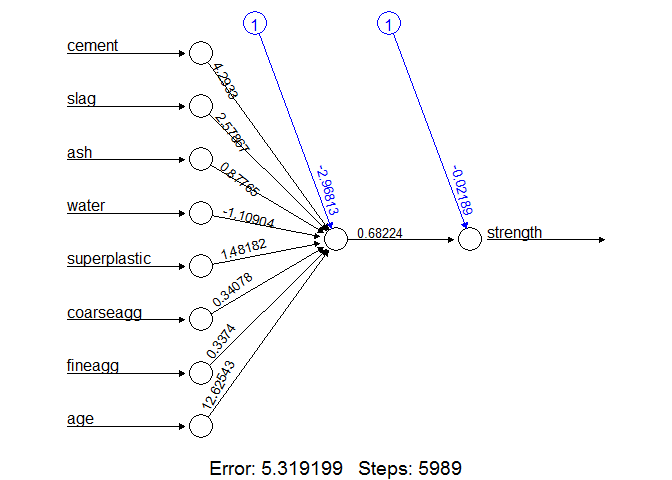
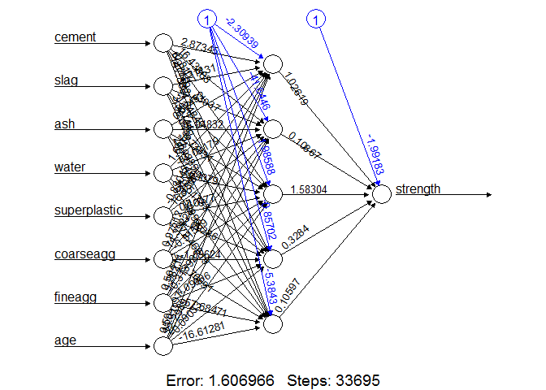

ANN from Lantz 2019
================
Guillermo Bustos-Pérez
30/9/2020

# Teoría

## Redes neuronales

Un modelo de red neuronal artificial (**ANN**) modela la relación entre
una serie de señales de input y una señal de output.

Aunque existen múltiples variantes de redes neuronales, cada una puede
ser definida en función de las siguientes características:

  - Una función de activación que transforma la combinación de los
    múltiples inputs en un simple output para ser transmitido más
    adelante en la red.  
  - Una topología (arquitectura) neuronal que describe el número de
    neuronas en el modelo, así como el número de niveles y la manera en
    la que están conectados.  
  - El algoritmo de entrenamiento que especifica como la conexión de los
    pesos está establecida en orden de inhibir o excitar neuronas en
    proporción a la señal recibida.

 

## Funciones de activación

La función de activación es el mecanismo por el cual la neurona
artificial procesa la información entrante y la pasa a través de la
red.  
una **función de activación de umbral** proporciona una señal de output
cuando el input recibido supera el umbral.  
Una de las alternativas más empleadas es la **función de activación
sigmoidea** (más específicamente: la logística sigmoidea). La función
tiene forma de *S*, y el output deja de ser binario, pudiendo tomar
cualquier valor entre 0 y 1.  
Otras funciones de activación son: la lineal, la lineal saturada, la
tangente hiperbólica y la gausiana. La principal diferencia reside en el
rango de la señal de output, pudiendo se (0, 1), (-1,0), (-Inf, Inf). La
elección de una función sesga la red neuronal de tal forma que encaje
con unos datos mejor que con otros.

En muchas de las funciones de activación el rango de valores de los
inputs afecta a la señal de output. Por ejemplo, en la función sigmoidal
los valores de -5 o menos darán una respuesta de 0, mientras que los de
+5 o más darán como resultado un output de 1. Por ello se recomienda
estandarizar/escalar los valores. Esto tiene un beneficio añadido: el
modelo es más rápido de entrenar ya que el algoritmo puede iterar más
rápido sobre un rango limitado de valores.

## Topología de la red

La habilidad de una red neuronal para aprender reside en su
**topología** que se corresponde con los patrones y estructuras de la
neuronas interconectadas. Se pueden diferenciar por tres
características:

  - Número de niveles  
  - Si a la información de la red se le permite viajar hacia atrás  
  - Número de nodos dentro de cada nivel de la red

La topología determina el número de tareas que pueden ser desarrolladas
por la red. Generalmente redes más grandes son capaces de identificar
patrones más sutiles umbrales de decisión más complejos.

## El número de niveles

Los **input nodes** son aquellos que reciben las señales no procesadas
directamente de los datos. Cada **input node** es responsable de
procesar una variable del dataset. Los valores de la variable serán
transformados por la función de activación del correspondiente nodo. Las
señales enviadas por los input nodes son recibidas por el **output
node**, que emplea su propia función de activación para generar la
predicción final (generalmente definida como *p*).

Tanto los nódulos de input como los de output están agrupados en
niveles. En el aso de no haber más niveles, se trata de una **red de un
solo nivel** (por consiguiente solo tiene una serie de pesos de
conexión). Las redes de un solo nivel pueden ser útiles para
clasificaciones de patrones lineales, pero generalmente se requieren
redes más complejas para patrones más complejos.

Una forma de crear redes más complejas es añadiendo niveles adicionales.
Una **red de múltiples niveles** tiene uno o varios niveles ocultos que
procesan la señal provenientes de los nódulos de input. La mayoría de la
**redes de múltiples niveles** están **completamente conectadas**, lo
cual significa que cada nodo está conectado con todos los del siguiente
nivel.

## La dirección de la información

Cuando la información se envía continuamente en una dirección son redes
de tipo **feedforward**. Las redes **feedforward** son bastante
flexibles, permitiendo variar el número de nodos en cada nivel, la
modelación de varios outcomes, o múltiples niveles ocultos. Una red con
múltiples niveles ocultos se denomina **Deep Neural Network (DNN)** y en
muchos casos el entrenar esa red se denomina **Deep Learning**.

Una **red recurrente** permite que las señales viajen en ambas
direcciones, usando bucles. Esto permite aprender patrones muy
complejos. Se le puede añadir una memoria a corto plazo (o retardo) que
incrementa el poder de las redes recurrentes enormemente. Esto ayuda en
mucho a comprender secuencias de eventos en un periodo de tiempo.

**Multilayer Perceptron (MLP)** es una red feedfoward.

## El número de nodos en cada nivel

El número de nodos del input layer está determinado por el número de
variables en los datos.  
El número de nodos del output layer está predeterminado por el número de
clases en el outcome.

El número de nodos ocultos debe ser determinado por el usuario
previamente a entrenar el modelo.  
No existe una norma para determinar el número de nodos en un nivel
oculto. El número apropiado depende del número de nodos de input, la
cantidad de datos de entrenamiento, la cantidad de datos-ruido, la
complejidad de la tarea a aprender, y otros factores.

A mayor número de neuronas, más cerca de los datos de entrenamiento,
pero aumentamos el riesgo de cometer sobre-ajuste (overfitting). Además,
redes neuronales grandes pueden ser computacionalmente caras.  
La mejor práctica es emplear el menor número de nodos que proporcionen
el mejor rendimiento en el validation dataset.

## Entrenar redes neuronales con propagación trasera

La topología de la red neuronal debe ser entrenada con experiencia. A
medida que la red neuronal procesa los datos, las conexiones entre
neuronas se refuerzan o debilitan. Los pesos delas conexiones son
ajustados para reflejar los patrones observados a lo largo del tiempo.
El algoritmo empleado para entrenar una ANN se denomina simplemente
**backpropagation** y emplea una estrategia de propagación trasera de
los errores.

La aplicación de este algritmo a dado lugar a una serie de ventajas:

  - Posibilidad de adaptarse a problemas de clasificación o numéricos  
  - Capacidad de modelizar patrones más complejos que casi cualquier
    otro algoritmo  
  - Hace pocas presunciones sobre las relaciones subyacentes de los
    datos.

También hay una serie de desventajas:

  - Son computacionalmente muy intensos y lentos de entrenar  
  - Tienden a hacer un overfit de los datos de entrenamiento  
  - Los resultados están en una *caja negra* difícil o imposible de
    interpretar.

De forma general el algoritmo de propagación trasera itera a lo largo de
muchos ciclos de dos procesos. A cada ciclo se le denomina **época**.
Cada época en el algoritmo de propagación trasra incluye:

  - **Fase adelante**: las neuronas son activadas en una secuencia del
    input layer al output layer, aplicando los pesos de cada neurona y
    las funciones activación a lo largo del camino. Al llegar al último
    nivel, se produce la señal de output.  
  - **Fase hacia atrás**: el output de la red procedente de la fase
    trasera se compara con el valor verdadero de los datos de
    entrenamiento. Las dierencias entre el output y valor real
    proporciona un error que se propaga hacia atrás en la red para
    modificar los pesos de las conexiones entre neuronas y reducir
    futuros errores.

A lo largo del tiempo, la red emplea la información enviada hacia atrás
para reducir el error total.  
Para determinar cuanto peso debe cambiarse se emplea la técnica de
**descenso de gradiante (gradient descent)**. Se emplea la derivativa de
cada función de activación de la neurona para identificar el gradiante
en la dirección de los pesos que llegan (por ello es importante una
función de activación diferenciable).  
El algoritmo intentará cambiar los pesos que resulten en la mayor
reducción de error por medio de una cantidad conocida como el **ratio de
aprendizaje 8learning rate)**. A mayor ratio de aprendizaje, el
algoritmo intentará descender los gradiantes de forma más rápida lo cual
reduce el tiempo de entrenamiento a riesgo de no encontrar el mínimo
verdadero (en su lugar encuentra el mínimo local).

# Práctica

## Ejemplo: modelar la fuerza del cemento con ANN

En el caso de la ingeniería es clave determinar la fuerza del material.
En el caso del cemento la fuerza es resultado de la interacción de una
gran catidad de variables, y ser capaces de predecirlo es clave para el
diseño de estructuras.

## Paso 1. Recolección de los datos

Los datos proceden de:  
<http://archive.ics.uci.edu/ml/datasets/Concrete+Compressive+Strength>

La referencia del artículo de los datos es:  
Yeh IC. Modeling of strength of high performance concrete using
artificial neural networks. Cement and Concrete Research. 1998;
28:1797-1808

## Paso 2. Exploración y preparación de los datos

Lo primero es cargar los datos e inspeccionarlos

``` r
library(tidyverse)
```

    ## -- Attaching packages ----------------------------------------- tidyverse 1.3.0 --

    ## v ggplot2 3.3.2     v purrr   0.3.4
    ## v tibble  3.0.3     v dplyr   1.0.2
    ## v tidyr   1.1.2     v stringr 1.4.0
    ## v readr   1.3.1     v forcats 0.5.0

    ## -- Conflicts -------------------------------------------- tidyverse_conflicts() --
    ## x dplyr::filter() masks stats::filter()
    ## x dplyr::lag()    masks stats::lag()

``` r
concrete <- readxl::read_excel("J:/Cursos Programación/R Programming/Datacamp Courses/ANN Lantz 2019/Data/Concrete_Data.xls")

str(concrete)
```

    ## tibble [1,030 x 9] (S3: tbl_df/tbl/data.frame)
    ##  $ Cement (component 1)(kg in a m^3 mixture)            : num [1:1030] 540 540 332 332 199 ...
    ##  $ Blast Furnace Slag (component 2)(kg in a m^3 mixture): num [1:1030] 0 0 142 142 132 ...
    ##  $ Fly Ash (component 3)(kg in a m^3 mixture)           : num [1:1030] 0 0 0 0 0 0 0 0 0 0 ...
    ##  $ Water  (component 4)(kg in a m^3 mixture)            : num [1:1030] 162 162 228 228 192 228 228 228 228 228 ...
    ##  $ Superplasticizer (component 5)(kg in a m^3 mixture)  : num [1:1030] 2.5 2.5 0 0 0 0 0 0 0 0 ...
    ##  $ Coarse Aggregate  (component 6)(kg in a m^3 mixture) : num [1:1030] 1040 1055 932 932 978 ...
    ##  $ Fine Aggregate (component 7)(kg in a m^3 mixture)    : num [1:1030] 676 676 594 594 826 ...
    ##  $ Age (day)                                            : num [1:1030] 28 28 270 365 360 90 365 28 28 28 ...
    ##  $ Concrete compressive strength(MPa, megapascals)      : num [1:1030] 80 61.9 40.3 41.1 44.3 ...

 

Vamos a cambiar el nombre de las columnas para hacerlas más manejables

``` r
colnames(concrete) <- c("cement", "slag", "ash", "water",
                        "superplastic", "coarseagg", 
                        "fineagg", "age", "strength")

colnames(concrete)
```

    ## [1] "cement"       "slag"         "ash"          "water"        "superplastic"
    ## [6] "coarseagg"    "fineagg"      "age"          "strength"

 

En el dataframe tenemos ocho variables para hacer una predicción.
Podemos observar que las variables tienen diferentes escalas, lo que
afecta al rendimiento de las redes neuronales (suele ser mejor que estén
en un rango corto cercano a cero). Por ello es necesario normalizar los
datos.

Recordamos que hay diferencias entre la función **scale()** que aplica
el siguiente porceso:  
\[\sqrt{\sum{(x^2)}/(n-1)}\] Siendo \(x\) el vecto de datos a escalar
sin NA’s, y \(n\) el número de valores.  
Esta función conviene aplicarla cuando los datos encajan con una
distribución paramétrica (normal).

Si los datos siguen una distribución **no paramétrica** o **uniforme**
es mejor normalizarlos en un rango que va de 0 a 1. En este ejemplo se
emplea este procedimiento con la siguiente función:

``` r
# normalize function
normalize <- function(x){
  return((x-min(x)) / (max(x) - min(x)))
}
```

 

Ahora podemos aplicar esta función a cada una de las columnas usando
**lapply()**.

``` r
concrete_norm <- as.data.frame(lapply(concrete, normalize))
```

 

Confirmamos que hemos normalizado el datset

``` r
summary(concrete_norm$strength)
```

    ##    Min. 1st Qu.  Median    Mean 3rd Qu.    Max. 
    ##  0.0000  0.2663  0.4000  0.4172  0.5457  1.0000

``` r
summary(concrete$strength)
```

    ##    Min. 1st Qu.  Median    Mean 3rd Qu.    Max. 
    ##   2.332  23.707  34.443  35.818  46.136  82.599

 

Aunque el dataset esté posiblemente ordenado aleatoriamente, siempre es
bueno volverlo a barajar. Una vez hecho esto dividimos en datos de
entrenamiento (75% de los datos) y datos de prueba (25% restante).

``` r
# Randomly reorder dataset
concrete_norm <- concrete_norm[sample(nrow(concrete_norm)),]

# Determine number of rows to include
n <- round(nrow(concrete_norm)*0.75)

# Create train and test sets
concrete_train <- concrete_norm[1:n, ]
concrete_test <- concrete_norm[n:nrow(concrete_norm), ]
```

 

## Paso 3. Entrenar el modelo sobre los datos de entrenamiento

Vamos a mplear una red de multiples niveles feedforward. Para ello vamos
a emplear el paquete **neuralnet**

``` r
library(neuralnet)
```

    ## 
    ## Attaching package: 'neuralnet'

    ## The following object is masked from 'package:dplyr':
    ## 
    ##     compute

La sintaxis de la función **neuralnet()** para entrenar un modelo de red
neuronal es la siguiente:

``` r
m <- neuralnet(target ~ predictors,
               data = mmydata,
               hidden = 1)
```

 

La sintaxis para hacer predicciones sobre el test set es la siguiente:

``` r
p <- compute(m, test)
```

 

Empezamos por entrenar el modelo MFN con un único nivel oculto:

``` r
# Train model with one hidden node
concrete_model <- neuralnet(
  strength ~ cement + slag + ash + water + superplastic + 
    coarseagg + fineagg + age,
  data = concrete_train)
```

 

Ahora podemos visualizar la topología de la red neuronal usando la
función **plot()**. En este ejemplo hay un nodo de input para las ocho
variables, seguido de un único nodo oculto, y un único nodo de output
que predice la dureza/fuerza del cemento. También podemos ver los pesos
de cada conexión y los términos de sesgo.

**Términos de sesgo (bias terms)**: constantes numéricas que permiten el
valor indicado en los nodos ser volteado hacia arriva o hacia abajo
(similares al intercept de una ecuación lineal). Son los nódulos
indicados con el número 1.

Una red neuronal con un único nodo oculto es como un primo lejando de la
regresión lineal. El peso entre cada nodo de input y el nodo del nivel
oculto es similar a los coeficientes de la regresión. El peso del
término de sesgo es similar al intercept.

En la parte inferior de la figura podemos ver los pasos de
entrenamiento, el error siendo la SSE (a valor más bajo, mejor)

 

``` r
plot(concrete_model,
     rep = "best")
```

<!-- -->

 

## Paso 4. Probar el modelo

Como siempre es necesario probar los datos sobre el test set. Para ello
dividimos el proceso en tres pasos:

1)  Computar las predicciones sobre los datos de prueba  
2)  Extraer las predicciones de los resultados  
3)  Ver qué tal se correlacionan las predicciones sobre los datos reales

<!-- end list -->

``` r
# Make predictions over the test set
model_results <- compute(concrete_model, concrete_test[1:8])

# Extract the predicted results
predicted_strength <- model_results$net.result

# Check correlation of predicted vs actual strength
cor(predicted_strength, concrete_test$strength)
```

    ##           [,1]
    ## [1,] 0.8397143

## Paso 5. Mejorar el modelo

Las redes con topologías más complejas son capaces de aprender conceptos
más difícles. Así que vamos a incrementar el número de nodos ocultos a
5.

``` r
concrete_model2 <- neuralnet(
  strength ~ cement + slag + ash + water + superplastic + 
    coarseagg + fineagg + age,
  data = concrete_train,
  hidden = 5)
```

 

Nuevamente representamos el modelo.

``` r
plot(concrete_model2,
     rep = "best")
```

<!-- -->

 

Podemos ver como el error informado en el plot es mucho más bajo. Ahora
computamos la medida de correlación nuevamente.

``` r
# Make predictions over the test set
model_results2 <- compute(concrete_model2, concrete_test[1:8])

# Extract the predicted results
predicted_strength2 <- model_results2$net.result

# Check correlation of predicted vs actual strength
cor(predicted_strength2, concrete_test$strength)
```

    ##           [,1]
    ## [1,] 0.9390418
