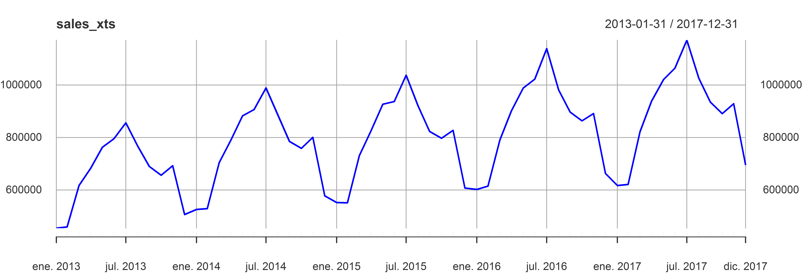
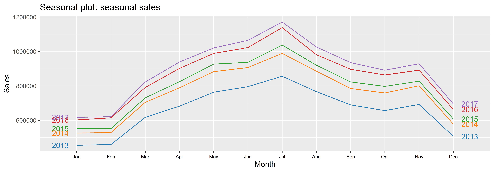
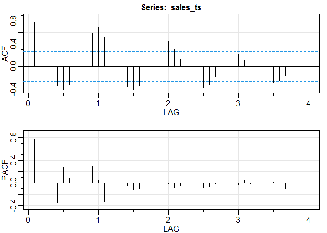
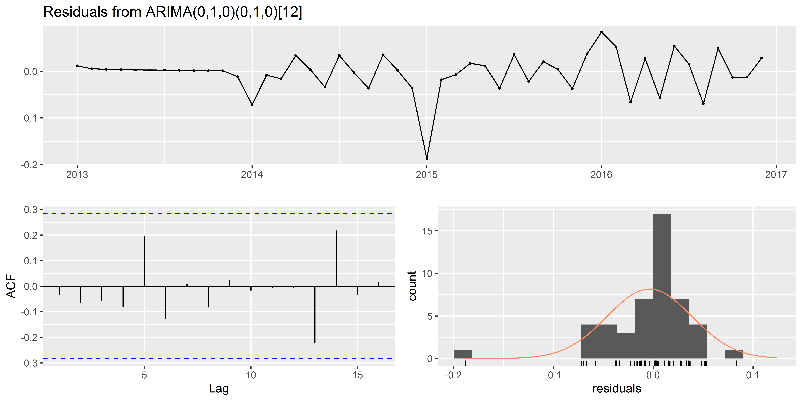
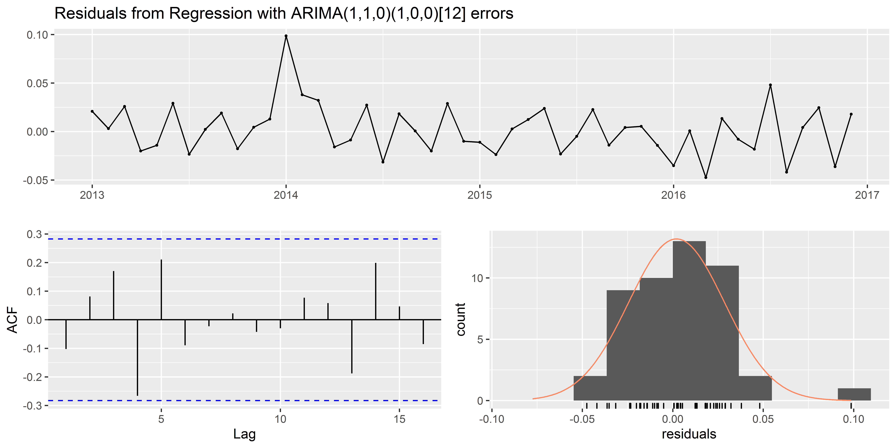
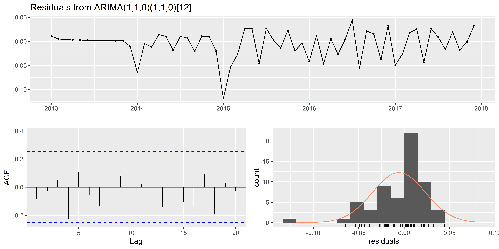
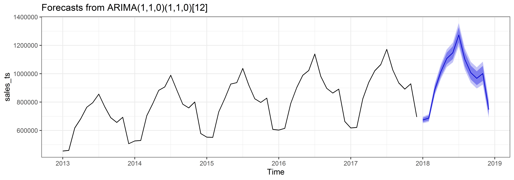

Predicting monthly sales
================

## Índice

1)  Introducción  
2)  Transformación en datos mensuales  
3)  Prólogo a las predicción sobre series temporales  
4)  Predicción de ventas mensuales

<!-- end list -->

  - Modelo ETS  
  - Modelo ARIMA  
  - Regresión armónica dinámica

<!-- end list -->

5)  Visualización y comparación de los modelos candidatos  
6)  Entrenamiento del modelo final y predicciones

## 1\) Introducción

En este caso se trata de una competición proporcionada para explorar las
diferentes técnicas de análisis de series temporales. Se proporcionan 5
años de ventas de 50 productos diferentes en 10 tiendas diferentes.

En este caso **el objetivo es generar predicciones de ventas mensuales
para el año siguiente de la suma de todos los productos y tiendas**.

Los datos están disponibles en:  
<https://www.kaggle.com/c/demand-forecasting-kernels-only/data>

Vamos a empezar por cargar las bibliotecas de referencia de
**tidyverse** (Wickham, 2017; Wickham et al., 2019), **xts** (Ryan y
Ulrich, 2020) y **zoo** (Zeileis and Grothendieck, 2005), junto con los
datos.

``` r
library(tidyverse); library(xts); library(zoo)
```

``` r
sales <- read.csv("Data/rain.csv")
```

El siguiente paso es evaluar los datos que se nos han proporcionado.
Para ello vamos a desplegar la estructura junto con sus dimensiones,
comprobar que son 50 items diferentes en 10 tiendas diferentes, y
obtener un resumen estadístico de las ventas.

``` r
# check structure of data
str(sales)
```

    ## 'data.frame':    913000 obs. of  4 variables:
    ##  $ date : chr  "2013-01-01" "2013-01-02" "2013-01-03" "2013-01-04" ...
    ##  $ store: int  1 1 1 1 1 1 1 1 1 1 ...
    ##  $ item : int  1 1 1 1 1 1 1 1 1 1 ...
    ##  $ sales: int  13 11 14 13 10 12 10 9 12 9 ...

``` r
# How many stores?
unique(sales$store)
```

    ##  [1]  1  2  3  4  5  6  7  8  9 10

``` r
# How many items?
unique(sales$item)
```

    ##  [1]  1  2  3  4  5  6  7  8  9 10 11 12 13 14 15 16 17 18 19 20 21 22 23 24 25
    ## [26] 26 27 28 29 30 31 32 33 34 35 36 37 38 39 40 41 42 43 44 45 46 47 48 49 50

``` r
# Summary statistics os sales
summary(sales$sales)
```

    ##    Min. 1st Qu.  Median    Mean 3rd Qu.    Max. 
    ##    0.00   30.00   47.00   52.25   70.00  231.00

<table>

<thead>

<tr>

<th style="text-align:left;">

date

</th>

<th style="text-align:right;">

store

</th>

<th style="text-align:right;">

item

</th>

<th style="text-align:right;">

sales

</th>

</tr>

</thead>

<tbody>

<tr>

<td style="text-align:left;">

2013-01-01

</td>

<td style="text-align:right;">

1

</td>

<td style="text-align:right;">

1

</td>

<td style="text-align:right;">

13

</td>

</tr>

<tr>

<td style="text-align:left;">

2013-01-02

</td>

<td style="text-align:right;">

1

</td>

<td style="text-align:right;">

1

</td>

<td style="text-align:right;">

11

</td>

</tr>

<tr>

<td style="text-align:left;">

2013-01-03

</td>

<td style="text-align:right;">

1

</td>

<td style="text-align:right;">

1

</td>

<td style="text-align:right;">

14

</td>

</tr>

<tr>

<td style="text-align:left;">

2013-01-04

</td>

<td style="text-align:right;">

1

</td>

<td style="text-align:right;">

1

</td>

<td style="text-align:right;">

13

</td>

</tr>

<tr>

<td style="text-align:left;">

2013-01-05

</td>

<td style="text-align:right;">

1

</td>

<td style="text-align:right;">

1

</td>

<td style="text-align:right;">

10

</td>

</tr>

</tbody>

</table>

 

## 2\) Transformación en datos mensuales

En este caso el objetivo propuesto es obtener proyecciones de ventas
mensuales de todos los productos y tiendas, por lo que podemos
prescindir de los identificadores de tienda y producto.

``` r
# future xts object
sales_xts <- sales %>% 
  select(-c(store, item))
```

 

Ahora es necesario transformar la columna *date* en una variable de
clase tiempo, y transformar el dataframe en un objeto **xts**, lo cual
facilitará mucho los siguientes cálculos.

``` r
# Make date into time-based class
sales_xts$date <- as.Date(sales_xts$date)

# make data frame into xts  
sales_xts <- as.xts(sales_xts[ , -1], order.by = sales_xts$date)

# Check sales xts object
str(sales_xts)
```

    ## An 'xts' object on 2013-01-01/2017-12-31 containing:
    ##   Data: int [1:913000, 1] 13 12 19 10 11 20 7 16 11 14 ...
    ##   Indexed by objects of class: [Date] TZ: UTC
    ##   Original class: 'integer'  
    ##   xts Attributes:  
    ##  NULL

 

Ahora obtenemos las ventas mensuales para la serie xts. Siempre es
adecuado representar gráficamente la serie una vez transformada en la
frecuencia temporal que queramos.

``` r
# Get monthly sales
sales_xts <- apply.monthly(sales_xts, colSums)
```

``` r
# Plot monthly sales
plot(sales_xts, col = "blue")
```

<!-- -->
 

Vamos a hacer una siguiente transformación del objeto xts en una *time
series*. Los objetos *time series* permiten la generación de
visualizaciones y modelos predictivos junto con la librería **forecast**
(Hyndman and Khandakar, 2008).

``` r
library(forecast)
```

``` r
# Make into ts
sales_ts <- ts(sales_xts[,1],
              start = c(2013, 1),
              frequency = 12)
```

``` r
 # Seasonal plot of 
ggseasonplot(sales_ts, year.labels=TRUE, year.labels.left=TRUE) +
  ggtitle("Seasonal plot: seasonal sales") +
  ylab("Sales") +
  theme_grey() +
  ggsci::scale_color_d3() + 
  theme(axis.text.x = element_text(size = 7, color = "black")) 
```

<!-- -->
 

Con la visualización de la serie temporal y la serie temporal estacional
observamos tres aspectos importantes:

  - Hay una marcada estacionalidad en la serie con un primer máximo de
    ventas en el meses de julio y mínimos en los meses de enero y
    febrero. El descenso de ventas a partir de septiembre se interrumpe
    con un repunte de incremento de ventas en noviembre.  
  - La tendencia general de la serie es ascendente.  
  - El nivel de las fluctuaciones se incrementa a medida que avanza la
    serie en el tiempo (heterocedasticos).

## 3\) Prólogo a las predicción sobre series temporales

Por el carácter de la serie temporal queda claro que los modelos ETS,
ARIMA estacional y regresión armónica dinámica son los que van a
proporcionar mejores ajustes y resultados de predicción. Aún así es
conveniente realizar la prueba Ljung-Box para asegurarnos de que no se
trata de White Noise e inspeccionar los plots ACF y PACF.

En el caso de la prueba Ljung-Box nos indica que no se trata de ruido
blanco (también podemos observarlo en el ACF). En el caso del ACF y el
PACF nos están indicando la correlación estacional que disminuye con el
tiempo.

``` r
# Ljung-Box test
Box.test(sales_ts,
lag = 36,
fitdf = 0,
type = "Lj")
```

    ## 
    ##  Box-Ljung test
    ## 
    ## data:  sales_ts
    ## X-squared = 342.79, df = 36, p-value < 2.2e-16

``` r
# Check ACF and PACF plots
acf_ts <- astsa::acf2(sales_ts)
```

<!-- -->
 

Antes de realizar las predicciones recordamos la norma básica para
Machine Learning o series temporales: es necesario probar los modelos
sobre datos no empleados para entrenarlo (dividir entre training y test
set). En este caso vamos a emplear el último año registrado (2017) como
test set, mientras que el resto se emplearán como training set.

``` r
# Divide into train and test sets
train <- window(sales_ts,
                end = c(2016, 12))

test <- window(sales_ts,
               start = c(2017, 1))
```

 

Dado que los datos son heterocedasticos y hay una tendencia ascendente,
es necesario aplicar una transformación previa a la realización de
predicciones. La función BoxCox.lambda() devuelve el parámetro que se
debe aplicar para estabilizar la serie temporal. En este caso el valor
de la tarnsformación devuelta es cercano a 1/3, que es similar a una
raíz cúbica.

``` r
# Transformation necessary to stabilize the time series
(BC_l <- BoxCox.lambda(train))
```

    ## [1] 0.06213694

## 4\) Predicción de ventas mensuales

Data la naturaleza de la serie temporal que hemos observado y su
caracter estacional hay tres modelos candidatos para generar
predicciones:

  - **Modelo ETS**  
  - **Modelo ARIMA**  
  - **Regresión armónica dinámica**

El proceso para comparar los modelos es sencillo. Basta con comprobar la
distribución de los residuals y las medidas de precisión de las
estimaciones sobre el test set.

**Recordamos:** en el caso de los residuals queremos que su distribución
se asemeje al White-Noise (p \> 0.05), para lo que se emplea la prueba
Ljung-Box (Ljung and Box, 1978). En el caso de las medidas de precisión
generalmente se proporcionan la RMSE (que tiende a penalizar
desviaciones más elevadas) y la MAE, aunque es adecuado proporcionar
MAPE y la MASE (que proporcionan errores porcentuales y escalados).

### Modelo ETS

Empezamos entrenando un modelo ets en el que se proporciona el valor
obtenido por la transformación BoxCox. En el caso del modelo de
regresión armónica dinámica lo vamos a dejar para el final, ya que
requiere de varias iteraciones para determinar el mejor valor de K.

``` r
# Train ETS model
(ETS_model <- ets(train, lambda = BC_l))
```

    ## ETS(A,Ad,A) 
    ## 
    ## Call:
    ##  ets(y = train, lambda = BC_l) 
    ## 
    ##   Box-Cox transformation: lambda= 0.0621 
    ## 
    ##   Smoothing parameters:
    ##     alpha = 0.6228 
    ##     beta  = 1e-04 
    ##     gamma = 1e-04 
    ##     phi   = 0.98 
    ## 
    ##   Initial states:
    ##     l = 20.7497 
    ##     b = 0.0274 
    ##     s = -0.6707 0.0672 -0.0207 0.0844 0.3552 0.6536
    ##            0.4534 0.4032 0.1742 -0.0872 -0.7048 -0.7079
    ## 
    ##   sigma:  0.0382
    ## 
    ##        AIC       AICc        BIC 
    ## -112.68092  -89.09471  -78.99930

 

Al comprobar los residuals vemos que **el modelo ETS no pasa la prueba
Ljung-Box para determinar si los rresiduals son White-Noise**. Sin
embargo, las distribuciones observadas en el ACF plot y el histograma de
distribución indican que el modelo puede ser útil a pesar de no superar
la prueba Ljung-Box.

``` r
# Check residuals from ETS model
checkresiduals(ETS_model)
```

<!-- -->

    ## 
    ##  Ljung-Box test
    ## 
    ## data:  Residuals from ETS(A,Ad,A)
    ## Q* = 20.33, df = 3, p-value = 0.000145
    ## 
    ## Model df: 17.   Total lags used: 20

 

### Modelo ARIMA

Los modelos ARIMA son unos de los modelos de predicciones sobre series
temporales clasicos en los que principalmente se quieren encontrar tres
parámetros (Shumway and Stoffer, 2011):

1)  El término de Auto-regresión (**AR**): el número de retardos del
    valor previo.  
2)  Integrado (*Integrated*) (**I**): la diferenciació de las
    observaciones en bruto para permitir que la serie temporal se vuelva
    estacionaria.  
3)  *Moving Average* (**MA**): incorpora la dependencia entre una
    observación y el error residual procedente de la media móvil
    aplicada a las observaciones retardadas.

En el caso del modelo ARIMA es fácil su entrenamiento con la función
**auto.arima()**. En este caso podemos ver que la función ha
seleccionado un ARIMA (0,1,0)(0,1,0) con una estacionalidad de 12.

También observamos que se han minimizado aún más los residuals y que en
este caso **sí superan la prueba Ljung-Box (p \> 0.05)**. Esto también
es observable en el gráfico ACF, estando el Lag 13 dentro de los límites
de significación.

``` r
# Traiin ARIMA model
(ARIMA_model <- auto.arima(train, lambda = BC_l))
```

    ## Series: train 
    ## ARIMA(0,1,0)(0,1,0)[12] 
    ## Box Cox transformation: lambda= 0.06213694 
    ## 
    ## sigma^2 estimated as 0.002436:  log likelihood=56.8
    ## AIC=-111.6   AICc=-111.48   BIC=-110.05

``` r
# Check residuals from ARIMA model
checkresiduals(ARIMA_model)
```

<!-- -->

    ## 
    ##  Ljung-Box test
    ## 
    ## data:  Residuals from ARIMA(0,1,0)(0,1,0)[12]
    ## Q* = 4.4321, df = 10, p-value = 0.9258
    ## 
    ## Model df: 0.   Total lags used: 10

 

### Regresión armónica dinámica

Ahora podemos entrenar un modelo de regresión armónica dinámica. En este
caso, al ser una serie temporal con estacionalidad 12 limita a un máximo
de 6 (mitad del ciclo estacional) los valores de K (número de senos y
cosenos de Fourier).

El siguiente código (Hyndman & Athanasopoulos, 2018) nos permite evaluar
el AICc de regresiones armónicas dinámicas con diferentes valores de K.
**AICc se minimiza para K = 6**.

``` r
plots <- list()

# Loop over six different values of K
for (i in seq(from = 1, to = 6, by = 1 )) {
  
  fit <- auto.arima(train, xreg = fourier(train, K = i),
                    seasonal = TRUE, lambda = BC_l)
  
  plots[[i]] <- autoplot(forecast(fit,
                                  xreg = fourier(train, K = i, h = 12))) +
    xlab(paste("K=",i," AICC=",round(fit[["aicc"]],2))) +
    ylab("") +
    theme(axis.text = element_text(size = 6),
          axis.title.x = element_text(size = 7),
          title = element_text(size = 6))
  }

# Plot the graphs
gridExtra::grid.arrange(
  plots[[1]], plots[[2]], plots[[3]],
  plots[[4]], plots[[5]], plots[[6]], 
  nrow = 3)
```

<!-- -->
 

Una vez determinado el valor de K, podemos entrenar el modelo y
comprobar los residuals. Al igual que en modelo ETS, los residuals de la
regresión armónica dinámica no superan la prueba Ljung-Box del W-N,
aunque nuevamente hay que señalar que únicamente el Lag 13 es el que
muestra una significación. Por consiguiente, podemos considerar el
modelo como aprovechable a pesar de estos inconvenientes.

``` r
# Train fourier model
Four_model <- auto.arima(train, xreg = fourier(train, K = 6),
                         seasonal = TRUE, lambda = BC_l)
```

``` r
# Check residuals
checkresiduals(Four_model)
```

<!-- -->

    ## 
    ##  Ljung-Box test
    ## 
    ## data:  Residuals from Regression with ARIMA(1,1,0)(1,0,0)[12] errors
    ## Q* = 16.344, df = 3, p-value = 0.000964
    ## 
    ## Model df: 14.   Total lags used: 17

## 5\) Visualización y comparación de los modelos candidatos

Ahora basta con realizar las predicciones para el año siguiente y
compararlas con los valores reales del test set.

``` r
# ETS forecasting  
ETS_forecast <- ETS_model %>% forecast(h = 12)
a1 <- accuracy(ETS_forecast, test)

# ARIMA forecasting  
ARIMA_forecast <- ARIMA_model %>% forecast(h = 12)
a2 <- accuracy(ARIMA_forecast, test)

# Fourier forecastng
Four_forecast <- Four_model %>%
  forecast(xreg = fourier(train, K = 6, h = 12))  
a3 <- accuracy(Four_forecast, test)
```

``` r
Accuracy <- data.frame(rbind(a1[2, 1:8],
                             a2[2, 1:8], 
                             a3[2, 1:8]))

Model <- c("ETS", "ARIMA", "Din. Arm.")
Accuracy <- cbind(Model, Accuracy)
```

<table>

<thead>

<tr>

<th style="text-align:left;">

Model

</th>

<th style="text-align:right;">

ME

</th>

<th style="text-align:right;">

RMSE

</th>

<th style="text-align:right;">

MAE

</th>

<th style="text-align:right;">

MPE

</th>

<th style="text-align:right;">

MAPE

</th>

<th style="text-align:right;">

MASE

</th>

<th style="text-align:right;">

ACF1

</th>

<th style="text-align:right;">

Theil.s.U

</th>

</tr>

</thead>

<tbody>

<tr>

<td style="text-align:left;">

ETS

</td>

<td style="text-align:right;">

\-25445.39

</td>

<td style="text-align:right;">

28457.52

</td>

<td style="text-align:right;">

26003.63

</td>

<td style="text-align:right;">

\-2.942533

</td>

<td style="text-align:right;">

3.022836

</td>

<td style="text-align:right;">

0.3874847

</td>

<td style="text-align:right;">

0.2995373

</td>

<td style="text-align:right;">

0.2346880

</td>

</tr>

<tr>

<td style="text-align:left;">

ARIMA

</td>

<td style="text-align:right;">

\-46076.44

</td>

<td style="text-align:right;">

46996.51

</td>

<td style="text-align:right;">

46076.44

</td>

<td style="text-align:right;">

\-5.248082

</td>

<td style="text-align:right;">

5.248082

</td>

<td style="text-align:right;">

0.6865931

</td>

<td style="text-align:right;">

0.0026553

</td>

<td style="text-align:right;">

0.3720381

</td>

</tr>

<tr>

<td style="text-align:left;">

Din. Arm.

</td>

<td style="text-align:right;">

\-39306.98

</td>

<td style="text-align:right;">

41717.26

</td>

<td style="text-align:right;">

39306.98

</td>

<td style="text-align:right;">

\-4.385663

</td>

<td style="text-align:right;">

4.385663

</td>

<td style="text-align:right;">

0.5857201

</td>

<td style="text-align:right;">

\-0.3576412

</td>

<td style="text-align:right;">

0.3259765

</td>

</tr>

</tbody>

</table>

 

Visualizamos las predicciones de cada uno de los modelos comparadas con
el test set.

``` r
# Forecast of each model 
ggpubr::ggarrange(
  
  (autoplot(train) +
     autolayer(ETS_forecast,
                     series = "ETS model", PI = TRUE, 
          color = "navyblue") +
    autolayer(test, color = "red") +
     ggtitle("ETS model")),
  
  (autoplot(train) +
      autolayer(ARIMA_forecast,
            series = "ARIMA", PI = TRUE,
            color = "purple") +
    autolayer(test, color = "red") +
     ggtitle("ARIMA model")),
  
   (autoplot(train) +
      
      autolayer(Four_forecast,
            series = "Fourier", PI = TRUE, 
            color = "gold") +
      autolayer(test, color = "red")+
     ggtitle("Dynamic Armonic")),
  
  ncol = 1
)
```

<!-- -->
 

Disponemos de tres criterios para seleccionar el modelo final: la
**prueba White-Noise de los residuals**, las **metricas de precisión de
los modelos**, y la **visualización de las predicciones sobre el test
set**.

Basándonos en estos tres criterios **el modelo ARIMA aparenta ser el más
adeucado** ya que es el único cuyos residuals superan la prueba del
White-Noise y en la visualización los datos del test set caen en el
intervalo del 80% de confianza (salvo en los meses iniciales de 2017,
aunque este error es común a todos los modelos). Estos dos criterios
subsanan el hecho de que sea el modelo con las peores métricas de
precisión. Es de señalar que entre las predicciones del modelo ARIMA y
ETS no hay mucha diferencia, por lo que la selección de uno u otroo
modelo no proporciona grandes diferencias.

## 6\) Entrenamiento del modelo final y predicciones

Entrenamos nuevamente el modelo, pero aprovechando todos los datos
disponibles. Es necesario relaizar una nueva transformación Box-Cox
sobre todos los datos disponibles. Nuevamente comprobamos los residuals.
Están en el límite de la prueba del WN, pero podemos considerarlo un
modelo válido para el desarrollo de predicciones.

``` r
# New Box-Cox transformation
(BC_l <- BoxCox.lambda(sales_ts))
```

    ## [1] 0.0489577

``` r
# Final model
(ARIMA_model <- auto.arima(sales_ts, lambda = BC_l))
```

    ## Series: sales_ts 
    ## ARIMA(1,1,0)(1,1,0)[12] 
    ## Box Cox transformation: lambda= 0.0489577 
    ## 
    ## Coefficients:
    ##           ar1     sar1
    ##       -0.4480  -0.7367
    ## s.e.   0.1501   0.1182
    ## 
    ## sigma^2 estimated as 0.001148:  log likelihood=90.76
    ## AIC=-175.51   AICc=-174.95   BIC=-169.96

``` r
# Check residuals
checkresiduals(ARIMA_model)
```

<!-- -->

    ## 
    ##  Ljung-Box test
    ## 
    ## data:  Residuals from ARIMA(1,1,0)(1,1,0)[12]
    ## Q* = 20.641, df = 10, p-value = 0.02374
    ## 
    ## Model df: 2.   Total lags used: 12

 

Obtenemos la representación de predicciones de ingresos mensuales que
parece coherente con el carácter estacional y la tendencia de la serie.

``` r
#Final predictions  
ARIMA_model %>% forecast(h = 12) %>%
autoplot() + theme_bw()
```

<!-- -->
 

Por último obtenemos las previsiones de ingresos mensuales para los
próximos 12 meses. Estos proporcionan el punto de predicción junto con
los intervalos superiores e inferiores a 80 y 95.

<table>

<thead>

<tr>

<th style="text-align:left;">

</th>

<th style="text-align:right;">

Point Forecast

</th>

<th style="text-align:right;">

Lo 80

</th>

<th style="text-align:right;">

Hi 80

</th>

<th style="text-align:right;">

Lo 95

</th>

<th style="text-align:right;">

Hi 95

</th>

</tr>

</thead>

<tbody>

<tr>

<td style="text-align:left;">

Jan 2018

</td>

<td style="text-align:right;">

673599.7

</td>

<td style="text-align:right;">

658600.6

</td>

<td style="text-align:right;">

688923.3

</td>

<td style="text-align:right;">

650789.7

</td>

<td style="text-align:right;">

697168.7

</td>

</tr>

<tr>

<td style="text-align:left;">

Feb 2018

</td>

<td style="text-align:right;">

686972.6

</td>

<td style="text-align:right;">

669543.1

</td>

<td style="text-align:right;">

704833.0

</td>

<td style="text-align:right;">

660487.6

</td>

<td style="text-align:right;">

714465.6

</td>

</tr>

<tr>

<td style="text-align:left;">

Mar 2018

</td>

<td style="text-align:right;">

887947.2

</td>

<td style="text-align:right;">

861363.1

</td>

<td style="text-align:right;">

915310.5

</td>

<td style="text-align:right;">

847598.5

</td>

<td style="text-align:right;">

930118.4

</td>

</tr>

<tr>

<td style="text-align:left;">

Apr 2018

</td>

<td style="text-align:right;">

1012724.8

</td>

<td style="text-align:right;">

979299.9

</td>

<td style="text-align:right;">

1047232.9

</td>

<td style="text-align:right;">

962033.3

</td>

<td style="text-align:right;">

1065950.2

</td>

</tr>

<tr>

<td style="text-align:left;">

May 2018

</td>

<td style="text-align:right;">

1106947.8

</td>

<td style="text-align:right;">

1066930.9

</td>

<td style="text-align:right;">

1148389.4

</td>

<td style="text-align:right;">

1046308.0

</td>

<td style="text-align:right;">

1170920.4

</td>

</tr>

<tr>

<td style="text-align:left;">

Jun 2018

</td>

<td style="text-align:right;">

1147396.8

</td>

<td style="text-align:right;">

1102721.8

</td>

<td style="text-align:right;">

1193789.7

</td>

<td style="text-align:right;">

1079747.0

</td>

<td style="text-align:right;">

1219065.2

</td>

</tr>

<tr>

<td style="text-align:left;">

Jul 2018

</td>

<td style="text-align:right;">

1272857.1

</td>

<td style="text-align:right;">

1220119.5

</td>

<td style="text-align:right;">

1327758.1

</td>

<td style="text-align:right;">

1193049.9

</td>

<td style="text-align:right;">

1357725.1

</td>

</tr>

<tr>

<td style="text-align:left;">

Aug 2018

</td>

<td style="text-align:right;">

1102715.2

</td>

<td style="text-align:right;">

1053946.1

</td>

<td style="text-align:right;">

1153625.7

</td>

<td style="text-align:right;">

1028966.7

</td>

<td style="text-align:right;">

1181473.2

</td>

</tr>

<tr>

<td style="text-align:left;">

Sep 2018

</td>

<td style="text-align:right;">

1007316.3

</td>

<td style="text-align:right;">

960169.8

</td>

<td style="text-align:right;">

1056659.3

</td>

<td style="text-align:right;">

936069.2

</td>

<td style="text-align:right;">

1083701.8

</td>

</tr>

<tr>

<td style="text-align:left;">

Oct 2018

</td>

<td style="text-align:right;">

967534.5

</td>

<td style="text-align:right;">

919974.3

</td>

<td style="text-align:right;">

1017427.2

</td>

<td style="text-align:right;">

895706.1

</td>

<td style="text-align:right;">

1044819.8

</td>

</tr>

<tr>

<td style="text-align:left;">

Nov 2018

</td>

<td style="text-align:right;">

1001074.1

</td>

<td style="text-align:right;">

949789.3

</td>

<td style="text-align:right;">

1054985.5

</td>

<td style="text-align:right;">

923662.3

</td>

<td style="text-align:right;">

1084631.0

</td>

</tr>

<tr>

<td style="text-align:left;">

Dec 2018

</td>

<td style="text-align:right;">

747245.9

</td>

<td style="text-align:right;">

706866.6

</td>

<td style="text-align:right;">

789812.8

</td>

<td style="text-align:right;">

686339.9

</td>

<td style="text-align:right;">

813270.0

</td>

</tr>

</tbody>

</table>

## Bibliografía

Hyndman, R.J., Athanasopoulos, 2019. Forecasting: Principles & Practice,
3rd edition. ed. OTexts, Melbourne, Australia.

Hyndman, R.J., Khandakar, Y., 2008. Automatic Time Series Forecasting:
The forecast Package for R. Journal of Statistical Software 27.
<https://doi.org/10.18637/jss.v027.i03>

Ljung, G.M., Box, G.E.P., 1978. On a Measure of Lack of Fit in Time
Series Models. Biometrika 65, 297–303.

Shumway, R.H., Stoffer, D.S., 2011. Time Series Analysis and Its
Applications. With R Examples, 4th ed, Springer Texts in Statistics.
Springer.

Ryan, J.A., Ulrich, J.M., 2020. xts: eXtensible Time Series. R package
version 0.12.1. <https://CRAN.R-project.org/package=xts>

Wickham, H., 2017. Easily Install and Load the “Tidyverse”. R package
version.

Wickham, H., Averick, M., Bryan, J., Chang, W., McGowan, L., François,
R., Grolemund, G., Hayes, A., Henry, L., Hester, J., Kuhn, M., Pedersen,
T., Miller, E., Bache, S., Müller, K., Ooms, J., Robinson, D., Seidel,
D., Spinu, V., Takahashi, K., Vaughan, D., Wilke, C., Woo, K., Yutani,
H., 2019. Welcome to the Tidyverse. Journal of Open Source Software 4,
1686. <https://doi.org/10.21105/joss.01686>

Zeileis, A., Grothendieck, G., 2005. zoo: S3 Infrastructure for Regular
and Irregular Time Series. Journal of Statistical Software 14.
<https://doi.org/10.18637/jss.v014.i06>
