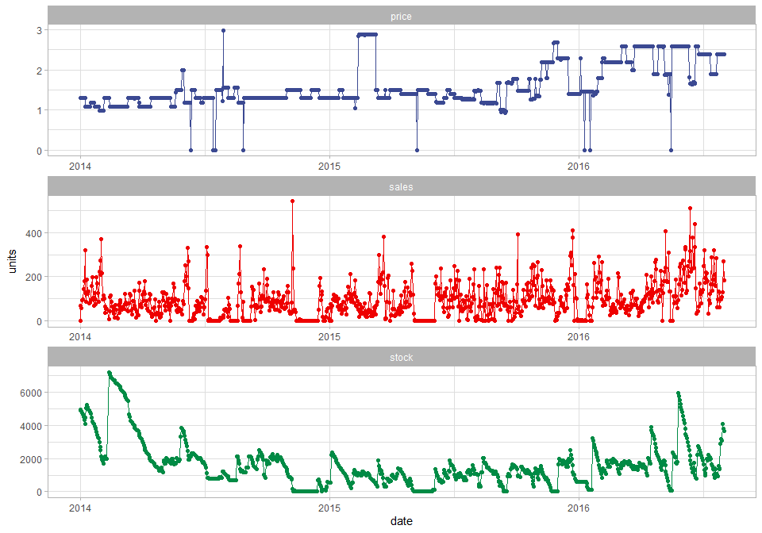
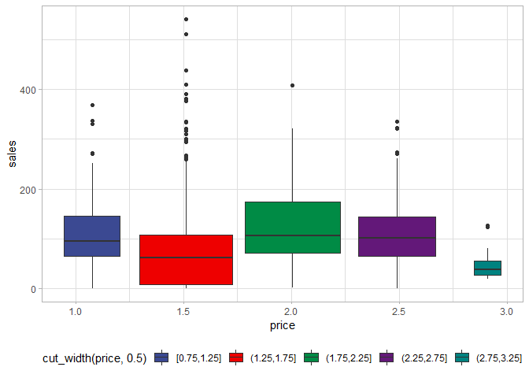

Predicción ventas retail
================

# Índice

1)  Introducción  
    1.1) Carga de los datos y primer vistazo\]  
2)  Exploración de los datos

## 1\) Introducción

El presente dataset contiene el conjunto de ventas histórico de uno de
los principales vendedores al por menor de Brasil. Los datos están
disponibles en:  
<https://www.kaggle.com/tevecsystems/retail-sales-forecasting>

Según indica la introducción: una de las principales cuestiones a
afrontar por parte de los vendedores al por menor es la cantidad de
inventario a manejar. Un inventario numeroso implica costes de capital,
costes operacionales, y su consiguiente gestión. Por otra parte, la
ausencia de inventario da lugar a pérdidas de ventas, clientes
insatisfechos y daños en la imagen de la marca.

Esto da lugar a que las **predicciones de series temporales a corto
plazo** sean fundamentales en la venta al por menor y en la industria de
bienes. En este dataset el objetivo es producir un modelo de predicción
de demanda para intervalos de 2/3 semanas.

### 1.1) Carga de los datos y primer vistazo

Vamos a empezar por cargar las librerías de referencia **tidyverse**
(Wickham, 2017; Wickham et al., 2019), **zoo** (Zeileis and
Grothendieck, 2005) y **xts** (Ryan, and Ulrich, 2020)

``` r
library(tidyverse);library(zoo); library(xts) 
```

``` r
retail <- read.csv("Data/mock_kaggle.csv")
```

<table>

<thead>

<tr>

<th style="text-align:left;">

data

</th>

<th style="text-align:right;">

venda

</th>

<th style="text-align:right;">

estoque

</th>

<th style="text-align:right;">

preco

</th>

</tr>

</thead>

<tbody>

<tr>

<td style="text-align:left;">

2014-01-01

</td>

<td style="text-align:right;">

0

</td>

<td style="text-align:right;">

4972

</td>

<td style="text-align:right;">

1.29

</td>

</tr>

<tr>

<td style="text-align:left;">

2014-01-02

</td>

<td style="text-align:right;">

70

</td>

<td style="text-align:right;">

4902

</td>

<td style="text-align:right;">

1.29

</td>

</tr>

<tr>

<td style="text-align:left;">

2014-01-03

</td>

<td style="text-align:right;">

59

</td>

<td style="text-align:right;">

4843

</td>

<td style="text-align:right;">

1.29

</td>

</tr>

<tr>

<td style="text-align:left;">

2014-01-04

</td>

<td style="text-align:right;">

93

</td>

<td style="text-align:right;">

4750

</td>

<td style="text-align:right;">

1.29

</td>

</tr>

<tr>

<td style="text-align:left;">

2014-01-05

</td>

<td style="text-align:right;">

96

</td>

<td style="text-align:right;">

4654

</td>

<td style="text-align:right;">

1.29

</td>

</tr>

</tbody>

</table>

 

Vamos a cambiar el nombre de las columnas para evitar confusiones.

``` r
colnames(retail)[1] <- "date"
colnames(retail)[2] <- "sales"
colnames(retail)[3] <- "stock"
colnames(retail)[4] <- "price"
```

 

## 2\) Exploración de los datos

Lo primero es evaluar la estructura y composición de los datos. Dado que
estamos trabajando con una serie temporal hay que transformar la columna
de *date* a formato de fecha.

``` r
# Check data
str(retail)
```

    ## 'data.frame':    937 obs. of  4 variables:
    ##  $ date : chr  "2014-01-01" "2014-01-02" "2014-01-03" "2014-01-04" ...
    ##  $ sales: int  0 70 59 93 96 145 179 321 125 88 ...
    ##  $ stock: int  4972 4902 4843 4750 4654 4509 4329 4104 4459 5043 ...
    ##  $ price: num  1.29 1.29 1.29 1.29 1.29 1.29 1.29 1.29 1.09 1.09 ...

``` r
dim(retail)
```

    ## [1] 937   4

``` r
# Make into date format
retail$date <- as.Date(retail$date)
```

Vamos a representar gráficamente la evolución de ventas, stock y precio
a lo largo de la serie temporal.

``` r
retail %>% pivot_longer(
  c(sales, stock, price),
  names_to = "Variable",
  values_to = "units"
) %>% 
  
  ggplot(aes(date, units, color = Variable)) +
  geom_line() +
  geom_point() +
  facet_wrap(~Variable, nrow = 3,
                     scales = "free") +
  ggsci::scale_color_aaas() +
  theme_light() +
  theme(legend.position = "none")
```

<!-- -->

A primera vista no parece que el precio esté condicionando las ventas.
Vamos a omitir los registros con precio 0 y comprobar visualmente si
diferentes precios afectan a las ventas. No parece ser el caso, ya que
el promedio de ventas es similar para tres intervalos con diferentes
precios, mientras que el intervalo de mayor precio muestra
aproximadamente el mismo número de ventas que el segundo intervalo de
menor precio.

``` r
# Check if price affects sales  
retail %>% filter(price > 0) %>% 
  ggplot(aes(price, sales, fill = cut_width(price, 0.5))) +
  geom_boxplot(aes(group = cut_width(price, 0.5))) +
  ggsci::scale_fill_aaas() +
  theme_light() +
  theme(legend.position = "bottom")
```

<!-- -->

## Bibliografía

Ryan, J.A. and Ulrich,J.M., 2020. xts: eXtensible Time Series. R package
version 0.12.1. <https://CRAN.R-project.org/package=xts>

Wickham, H., 2017. Easily Install and Load the “Tidyverse”. R package
version.

Wickham, H., Averick, M., Bryan, J., Chang, W., McGowan, L., François,
R., Grolemund, G., Hayes, A., Henry, L., Hester, J., Kuhn, M., Pedersen,
T., Miller, E., Bache, S., Müller, K., Ooms, J., Robinson, D., Seidel,
D., Spinu, V., Takahashi, K., Vaughan, D., Wilke, C., Woo, K., Yutani,
H., 2019. Welcome to the Tidyverse. Journal of Open Source Software 4,
1686. <https://doi.org/10.21105/joss.01686>

Zeileis, A., Grothendieck, G., 2005. zoo: S3 Infrastructure for Regular
and Irregular Time Series. Journal of Statistical Software 14.
<https://doi.org/10.18637/jss.v014.i06>
