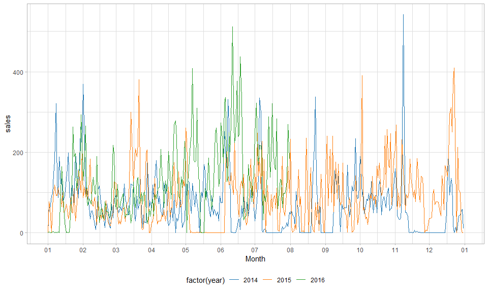
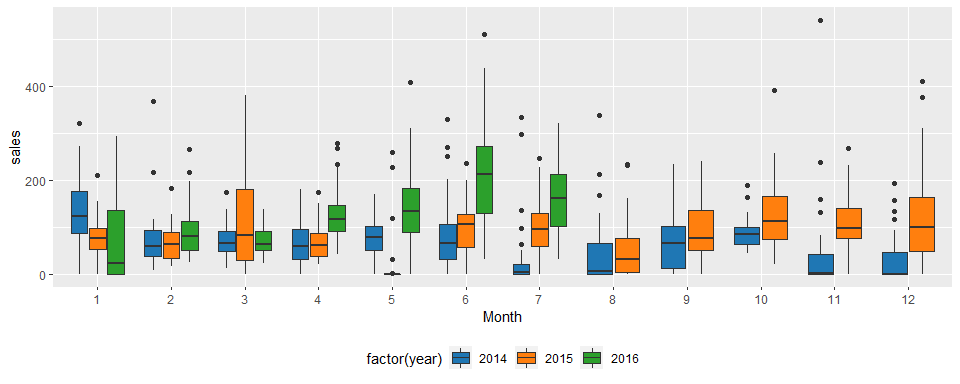
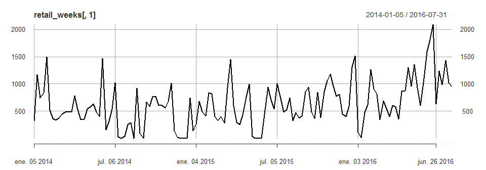
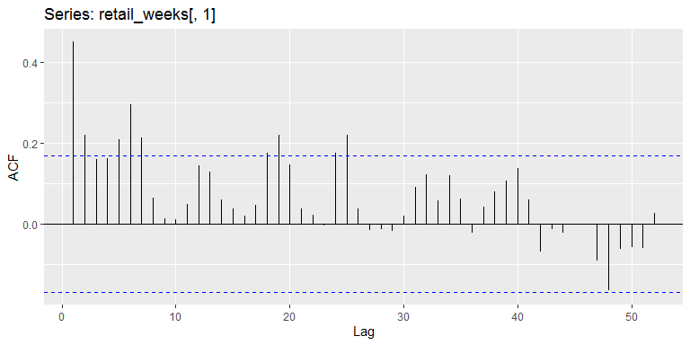
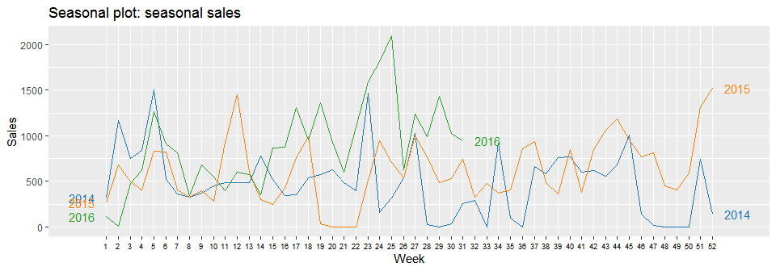
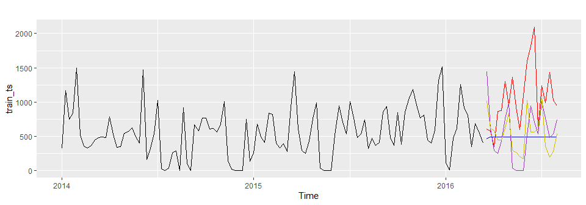
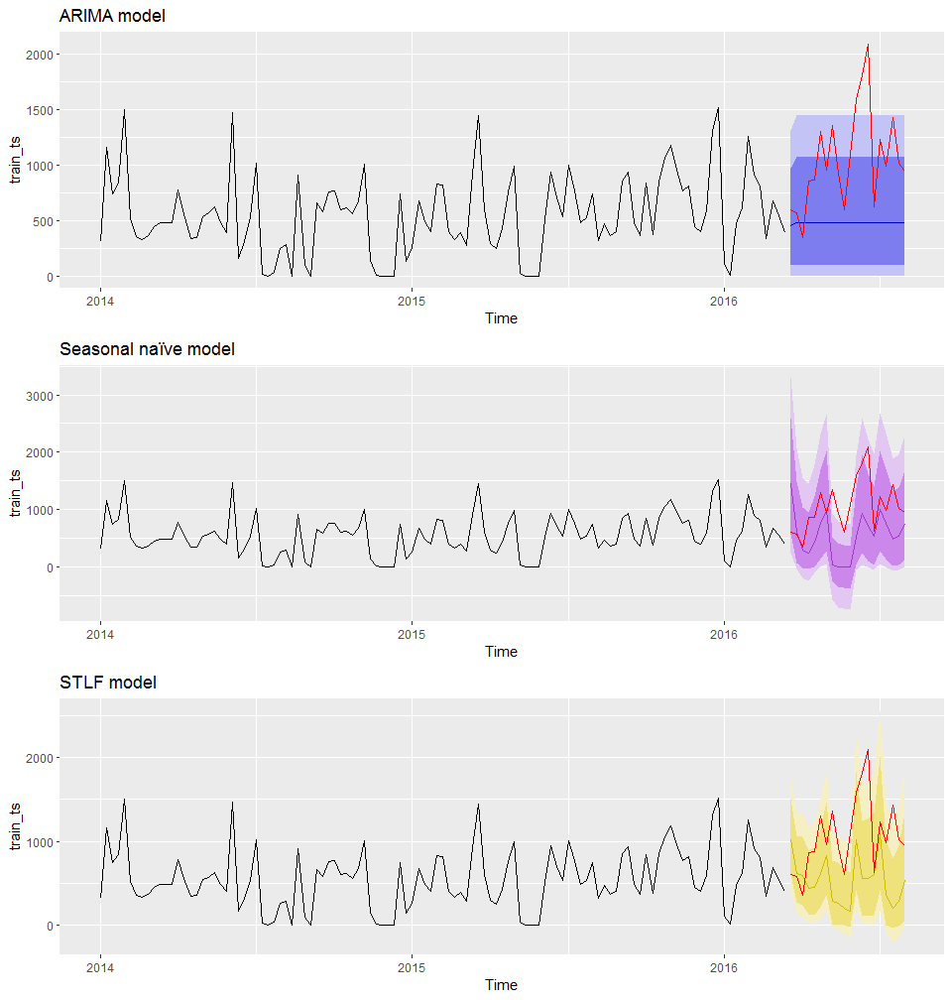
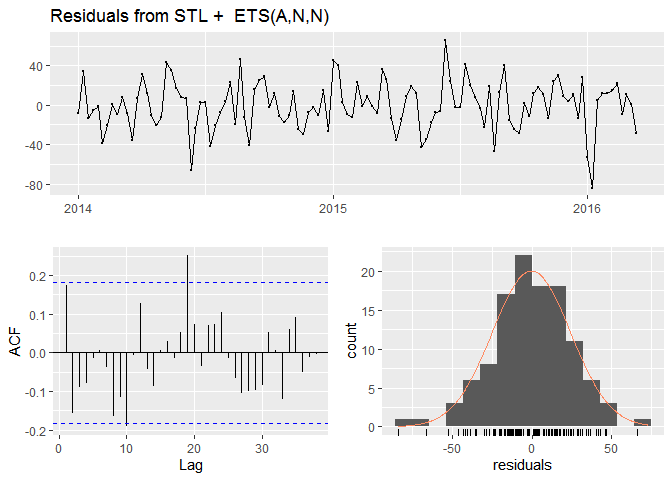
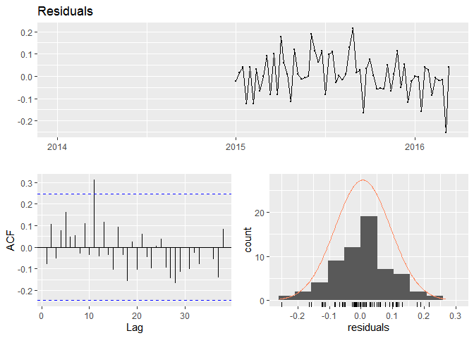
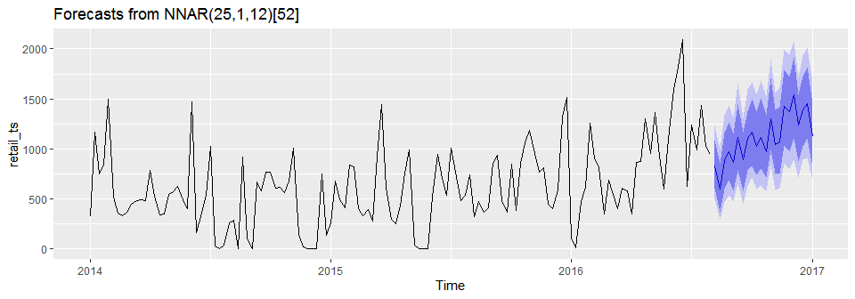

Predicción ventas retail
================

# Índice

1)  Introducción  
    1.1) Carga de los datos y primer vistazo  
2)  Exploración de los datos  
    2.1) Análisis exploratorio visual  
    2.2) Serie temporal semanal  
3)  Modelo de predicción  
    3.1) Comprobar el *White Noise*  
    3.2) Preprocesado: train y test sets  
    3.3) Visualización y precisión de modelos candidatos  
4)  White noise y residuals de los modelos  
5)  Predicciones finales

## 1\) Introducción

El presente dataset contiene el conjunto de ventas histórico de uno de
los principales vendedores al por menor de Brasil. Los datos están
disponibles en:  
<https://www.kaggle.com/tevecsystems/retail-sales-forecasting>

Según indica la introducción: una de las principales cuestiones a
afrontar por parte de los vendedores al por menor es la cantidad de
inventario a manejar. Un inventario numeroso implica costes de capital,
costes operacionales, y su consiguiente gestión. Por otra parte, la
ausencia de inventario da lugar a pérdidas de ventas, clientes
insatisfechos y daños en la imagen de la marca.

Esto da lugar a que las **predicciones de series temporales a corto
plazo** sean fundamentales en la venta al por menor y en la industria de
bienes. En este dataset el objetivo es producir un modelo de predicción
de demanda para intervalos de 2/3 semanas.

### 1.1) Carga de los datos y primer vistazo

Vamos a empezar por cargar las librerías de referencia **tidyverse**
(Wickham, 2017; Wickham et al., 2019), **zoo** (Zeileis and
Grothendieck, 2005) y **xts** (Ryan, and Ulrich, 2020)

``` r
library(tidyverse);library(zoo); library(xts) 
```

``` r
retail <- read.csv("Data/mock_kaggle.csv")
```

<table>

<thead>

<tr>

<th style="text-align:left;">

data

</th>

<th style="text-align:right;">

venda

</th>

<th style="text-align:right;">

estoque

</th>

<th style="text-align:right;">

preco

</th>

</tr>

</thead>

<tbody>

<tr>

<td style="text-align:left;">

2014-01-01

</td>

<td style="text-align:right;">

0

</td>

<td style="text-align:right;">

4972

</td>

<td style="text-align:right;">

1.29

</td>

</tr>

<tr>

<td style="text-align:left;">

2014-01-02

</td>

<td style="text-align:right;">

70

</td>

<td style="text-align:right;">

4902

</td>

<td style="text-align:right;">

1.29

</td>

</tr>

<tr>

<td style="text-align:left;">

2014-01-03

</td>

<td style="text-align:right;">

59

</td>

<td style="text-align:right;">

4843

</td>

<td style="text-align:right;">

1.29

</td>

</tr>

<tr>

<td style="text-align:left;">

2014-01-04

</td>

<td style="text-align:right;">

93

</td>

<td style="text-align:right;">

4750

</td>

<td style="text-align:right;">

1.29

</td>

</tr>

<tr>

<td style="text-align:left;">

2014-01-05

</td>

<td style="text-align:right;">

96

</td>

<td style="text-align:right;">

4654

</td>

<td style="text-align:right;">

1.29

</td>

</tr>

</tbody>

</table>

 

Vamos a cambiar el nombre de las columnas para evitar confusiones.

``` r
# Change column names
colnames(retail)[1] <- "date"
colnames(retail)[2] <- "sales"
colnames(retail)[3] <- "stock"
colnames(retail)[4] <- "price"
```

 

## 2\) Exploración de los datos

Lo primero es evaluar la estructura y composición de los datos. Dado que
estamos trabajando con una serie temporal hay que transformar la columna
de *date* a formato de fecha.

``` r
# Check data
str(retail)
```

    ## 'data.frame':    937 obs. of  4 variables:
    ##  $ date : chr  "2014-01-01" "2014-01-02" "2014-01-03" "2014-01-04" ...
    ##  $ sales: int  0 70 59 93 96 145 179 321 125 88 ...
    ##  $ stock: int  4972 4902 4843 4750 4654 4509 4329 4104 4459 5043 ...
    ##  $ price: num  1.29 1.29 1.29 1.29 1.29 1.29 1.29 1.29 1.09 1.09 ...

``` r
dim(retail)
```

    ## [1] 937   4

``` r
# Make into date format
retail$date <- as.Date(retail$date)
```

### 2.1) Análisis exploratorio visual

Vamos a representar gráficamente la evolución de ventas, stock y precio
a lo largo de la serie temporal.

``` r
retail %>% pivot_longer(
  c(sales, stock, price),
  names_to = "Variable",
  values_to = "units"
) %>% 
  
  ggplot(aes(date, units, color = Variable)) +
  geom_line() +
  geom_point() +
  facet_wrap(~Variable, nrow = 3,
                     scales = "free") +
  ggsci::scale_color_aaas() +
  theme_light() +
  theme(legend.position = "none")
```

<!-- -->

A primera vista no parece que el precio esté condicionando las ventas.
Vamos a omitir los registros con precio 0 y comprobar visualmente si
diferentes precios afectan a las ventas. No parece ser el caso, ya que
el promedio de ventas es similar para tres intervalos con diferentes
precios, mientras que el intervalo de mayor precio muestra
aproximadamente el mismo número de ventas que el segundo intervalo de
menor precio.

``` r
# Check if price affects sales  
retail %>% filter(price > 0) %>% 
  ggplot(aes(price, sales, fill = cut_width(price, 0.5))) +
  geom_boxplot(aes(group = cut_width(price, 0.5))) +
  ggsci::scale_fill_aaas() +
  theme_light() +
  theme(legend.position = "bottom")
```

<!-- -->  

El modelo de regresión lineal muestra una relación ligeramente
significativa entre ventas y el precio (esta relación desaparece a
escala logarítmica y al excluir los casos en los que las ventas y el
precio son igual cero).

``` r
# Lineal model of sales as a function of price
summary(lm(sales ~ price, retail))
```

    ## 
    ## Call:
    ## lm(formula = sales ~ price, data = retail)
    ## 
    ## Residuals:
    ##     Min      1Q  Median      3Q     Max 
    ## -106.38  -62.05  -17.19   36.06  452.95 
    ## 
    ## Coefficients:
    ##             Estimate Std. Error t value Pr(>|t|)    
    ## (Intercept)   67.534      8.325   8.112 1.56e-15 ***
    ## price         14.442      4.961   2.911  0.00369 ** 
    ## ---
    ## Signif. codes:  0 '***' 0.001 '**' 0.01 '*' 0.05 '.' 0.1 ' ' 1
    ## 
    ## Residual standard error: 80.36 on 935 degrees of freedom
    ## Multiple R-squared:  0.008983,   Adjusted R-squared:  0.007923 
    ## F-statistic: 8.475 on 1 and 935 DF,  p-value: 0.003685

``` r
# Lineal model of sales as a function of price (logaritmic)
log_data <- retail %>% 
  filter(sales > 0 & price >0) %>% 
  transmute(log_sales = log(sales),
            log_price = log(price))
summary(lm(log_sales ~ log_price, log_data))
```

    ## 
    ## Call:
    ## lm(formula = log_sales ~ log_price, data = log_data)
    ## 
    ## Residuals:
    ##     Min      1Q  Median      3Q     Max 
    ## -4.2794 -0.2966  0.2394  0.6636  2.0725 
    ## 
    ## Coefficients:
    ##             Estimate Std. Error t value Pr(>|t|)    
    ## (Intercept)  4.12782    0.07164  57.620   <2e-16 ***
    ## log_price    0.23813    0.13493   1.765    0.078 .  
    ## ---
    ## Signif. codes:  0 '***' 0.001 '**' 0.01 '*' 0.05 '.' 0.1 ' ' 1
    ## 
    ## Residual standard error: 1.138 on 823 degrees of freedom
    ## Multiple R-squared:  0.00377,    Adjusted R-squared:  0.00256 
    ## F-statistic: 3.115 on 1 and 823 DF,  p-value: 0.07796

 

Vamos a visualizar las ventas diarias por año. Para ello es necesario
hacer dos transformaciones: extraer el año como una variable propia, y
extraer el mes y día como otra variable propia de tipo *date*.

``` r
# Get year amd month-day 
retail<- retail %>% 
  mutate(date_character = as.character(date)) %>% 
  separate(date_character, 
           into =c("year", "Month_Day"),  
           sep = 5,
           remove = TRUE) %>% 
  select(-c(year)) %>% 
  mutate(
    Month_Day = as.Date(Month_Day, "%m-%d"),
    year = lubridate::year(date)) 
```

``` r
# Plot sales per year and month
retail %>% 
  ggplot(aes(Month_Day, sales, color = factor(year))) +
  geom_line() +
  ggsci::scale_color_d3() +
  scale_x_date(date_breaks = "1 month",
               date_labels = "%m") +
  xlab("Month") +
  theme_light() +
  theme(legend.position = "bottom")
```

<!-- -->  

El gráfico de ventas diarias no es muy adecuado, así que aprovechamos
para crear un boxplot de ventas por mes y año.

``` r
# Boxplots of monthly sales per year
retail %>% 
  mutate(month = lubridate::month(date)) %>% 
  ggplot(aes(factor(month), sales, fill = factor(year))) +
  geom_boxplot() +
  xlab("Month") +
  ggsci::scale_fill_d3() +
  theme(legend.position = "bottom") 
```

<!-- -->  

### 2.2) Serie temporal semanal

En el enunciado se señala la importancia de que las predicciones sean
semanales, con la capacidad de crear predicciones para intervalos de 2/3
semanas. Para ello es necesario transformar la serie temporal generando
la suma de ventas para cada semana.

``` r
# Make into xts objetc
retail_xts <- as.xts(retail[ , -c(1,5,6)], order.by = retail$date)
```

``` r
# Weekly sum of sales
retail_weeks <- apply.weekly(retail_xts, colSums)

plot(retail_weeks[,1])
```

<!-- -->

 

## 3\) Modelo de predicción

### 3.1) Comprobar el *White Noise*

Lo fundamental al inicio del análisis de cualquier serie temporal es
comprobar si se trata de *white noise*. En este caso resulta fundamental
emplear la librería **forecast** (Hyndman and Khandakar, 2008) y seguir
los principios de análisis de series temporales expuestos en Hyndman y
Athanasopoulos (2019). Para ello resulta esencial ver el
**autocorrelation plot** y hacer la prueba Ljung-Box (Ljung and Box,
1978)

``` r
library(forecast)
```

``` r
# Autocorrelation plot
ggAcf(retail_weeks[,1],
      lag = 52)
```

<!-- -->

``` r
# Ljung-Box test of white noise
Box.test(retail_weeks[,1],
         lag = 52,
         fitdf = 0,
         type = "Lj")
```

    ## 
    ##  Box-Ljung test
    ## 
    ## data:  retail_weeks[, 1]
    ## X-squared = 132.93, df = 52, p-value = 5.102e-09

 

El autocorrelation plot y la prueba Ljung-Box muestran que **la serie
temporal no es white-noise**, y que hay información utilizable en los
periodos anteriores para realizar predicciones futuras. Viendo la serie
temporal de las ventas semanales y el autocorrelation plot resulta
aparente que **un modelo ARIMA no va a ser adecuado para generar
predicciones sobre esta serie temporal**.

### 3.2) Preprocesado: train y test sets

Vamos a transformar ahora los datos en el **train y test sets**. Lo
ideal es que ambos sean **ts**, que permite aplicar los modelos de
predicción de series temporales de la librería **forecast**. Sin embargo
el indexado y selección de periodos de tiempo en objetos ts puede
resultar menos intuitivo que en xts, por lo que es adecuado usar este
formato como base para la transformación a ts.

``` r
# Get number of weeks per year
nweeks(retail_weeks["2014"][,1])
```

    ## [1] 52

``` r
nweeks(retail_weeks["2015"][,1])
```

    ## [1] 52

``` r
nweeks(retail_weeks["2016"][,1])
```

    ## [1] 31

``` r
nweeks(retail_weeks[,1])
```

    ## [1] 135

``` r
# make into time series
retail_ts <- ts(retail_weeks[,1],
                start = c(2014, 1),
                end = c(2016, 31),
                   frequency = 52)

# Train set
train_ts <- window(retail_ts, 
               end = c(2016, 11))

# Test set
test_ts <- window(retail_ts,
               start= c(2016, 12))

# Check legth of train and test sets
length(train_ts)
```

    ## [1] 115

``` r
length(test_ts)
```

    ## [1] 20

``` r
# Check the sum is correct
(length(train_ts) + length(test_ts)) == length(retail_ts)
```

    ## [1] TRUE

 

El paso inicial es aplicar una transformación Box-Cox para hace
estacionaria la serie temporal y que permita aplicar modelos ARIMA.

``` r
# Box-Cox  transformation
BC <- BoxCox.lambda(train_ts)
BC
```

    ## [1] 0.6160325

 

Sin embargo es importante señalar que la serie parece ser bastante
estacionaria, haciendo que sea poco adecuada para modelos ARIMA.

  - Durante la mayor parte de la serie temporal no se observa una
    tendencia, salvo en el segundo cuarto de 2016, donde parece haber
    una tendencia ascendente.  
  - Hay picos de ventas, pero sin una estacionalidad clara  
  - Se trata de datos semanales, lo cual implica periodos estacionales
    sean muy largos que no son manejados de forma eficiente por la
    mayoría de los modelos.

<!-- end list -->

``` r
ggseasonplot(retail_ts, year.labels=TRUE, year.labels.left=TRUE) +
  ggtitle("Seasonal plot: seasonal sales") +
  ylab("Sales") +
  theme_grey() +
  ggsci::scale_color_d3() + 
  theme(axis.text.x = element_text(size = 7, color = "black")) 
```

<!-- -->

### 3.2) Visualización y precisión de modelos candidatos

La fase inicial del análisis se centra en visualizar las predicciones de
los diferentes modelos sobre el test set. Esta primera visualización nos
permite optar por modelos para posteriormente evaluar los residuals y
comparar las métricas. Dada la naturaleza de los datos y el análisis
previo vamos a visualizar un modelo ARIMA, naive estacional y STLF.

``` r
#Make ARIMA predictions
arima_forecast <- auto.arima(train_ts, lambda = BC) %>% 
  forecast(h = 20)

## Plot the three models
autoplot(train_ts) +
    autolayer(test_ts, color = "red") + 
  
# Plot auto ARIMA
  autolayer(arima_forecast,
                     series = "Auto ARIMA", PI = FALSE, 
          color = "navyblue") + 
  
# Plot seasonal naive
  autolayer(snaive(train_ts, h = 20, lambda = BC),
            series = "Seasonal naïve", PI = FALSE,
            color = "purple") +
  
# Plot STLF
    autolayer(stlf(train_ts, h = 20, lambda = BC),
            series = "stlf", PI = FALSE, 
            color = "gold") 
```

<!-- -->  

Con esta visualización queda claro que el modelo ARIMA no es el más
adecuado para realizar las estimaciones. Aún así conviene visualizar las
proyecciones junto con los intervalos de confianza.

``` r
# Forecast of each model along confidance
ggpubr::ggarrange(
  
  (autoplot(train_ts) +
     autolayer(arima_forecast,
                     series = "Auto ARIMA", PI = TRUE, 
          color = "navyblue") +
    autolayer(test_ts, color = "red") +
     ggtitle("ARIMA model")),
  
  (autoplot(train_ts) +
      autolayer(snaive(train_ts, h = 20, lambda = BC),
            series = "Seasonal naïve", PI = TRUE,
            color = "purple") +
    autolayer(test_ts, color = "red") +
     ggtitle("Seasonal naïve model")),
  
   (autoplot(train_ts) +
      
      autolayer(stlf(train_ts, h = 20, lambda = BC),
            series = "stlf", PI = TRUE, 
            color = "gold") +
      autolayer(test_ts, color = "red")+
     ggtitle("STLF model")),
  
  ncol = 1
)
```

<!-- -->  

El cálculo de las métricas de precisión de los modelos muestra que el
modelo STLF y el estacional naïve tienen valores similares. El modelo
ARIMA tiene una MAPE, MAE y RMSE más bajas.

``` r
# Compute forecasts
stlf_forecast <- stlf(train_ts, h = 20, lambda = BC)
snaive_forecast <- snaive(train_ts, h = 20, lambda = BC)

Accuracy <- data.frame(rbind(accuracy(stlf_forecast, test_ts)[2, 1:8],
                                accuracy(snaive_forecast, test_ts)[2, 1:8],
                                accuracy(arima_forecast, test_ts)[2, 1:8]))

colnames(Accuracy) <-  colnames(accuracy(stlf_forecast, test_ts))

Models  <- c("STLF", "S-naive", "ARIMA")
Accuracy <- cbind(Models,Accuracy)
```

<table>

<thead>

<tr>

<th style="text-align:left;">

Models

</th>

<th style="text-align:right;">

ME

</th>

<th style="text-align:right;">

RMSE

</th>

<th style="text-align:right;">

MAE

</th>

<th style="text-align:right;">

MPE

</th>

<th style="text-align:right;">

MAPE

</th>

<th style="text-align:right;">

MASE

</th>

<th style="text-align:right;">

ACF1

</th>

<th style="text-align:right;">

Theil’s U

</th>

</tr>

</thead>

<tbody>

<tr>

<td style="text-align:left;">

STLF

</td>

<td style="text-align:right;">

528.4004

</td>

<td style="text-align:right;">

727.4158

</td>

<td style="text-align:right;">

597.2324

</td>

<td style="text-align:right;">

39.03600

</td>

<td style="text-align:right;">

53.26733

</td>

<td style="text-align:right;">

1.534676

</td>

<td style="text-align:right;">

0.2776812

</td>

<td style="text-align:right;">

1.357749

</td>

</tr>

<tr>

<td style="text-align:left;">

S-naive

</td>

<td style="text-align:right;">

511.1500

</td>

<td style="text-align:right;">

738.1334

</td>

<td style="text-align:right;">

601.4500

</td>

<td style="text-align:right;">

40.06477

</td>

<td style="text-align:right;">

54.79969

</td>

<td style="text-align:right;">

1.545513

</td>

<td style="text-align:right;">

0.2530285

</td>

<td style="text-align:right;">

1.509951

</td>

</tr>

<tr>

<td style="text-align:left;">

ARIMA

</td>

<td style="text-align:right;">

576.2987

</td>

<td style="text-align:right;">

718.3141

</td>

<td style="text-align:right;">

589.9789

</td>

<td style="text-align:right;">

45.15836

</td>

<td style="text-align:right;">

49.04477

</td>

<td style="text-align:right;">

1.516037

</td>

<td style="text-align:right;">

0.3415656

</td>

<td style="text-align:right;">

1.309740

</td>

</tr>

</tbody>

</table>

### 3.3) ANN

Empleando una ANN con 8 nodos en el *hidden layer*, los 25 últimos
periodos de tiempo como imputs y los datos observados en la misma semana
del año anterior. En este caso auentamos el hiperparámetro de *decay*
para obtener un incremento en los intervalos de confianza de las
predicciones. El número de nodos en el *hidden layer* (*size*) puede ser
determinado por medio de un loop que extraiga los datos de precisión
sobre el test set para cada uno de los modelos con diferentes números de
nodos en el hidden layer.

``` r
# Store accuracy of each model
ANNacc <- data.frame(matrix(ncol = 8, nrow = 0))

# Loop over each size of the hiden layer
for (x in seq(1, 30, 1)){
  ANN_forecasts <- nnetar(train_ts, p = 25, P = 1, size = x, 
                        lambda = BC, decay = 0.9) %>% 
  forecast(PI = TRUE, h = 20)

  ANNacc <- rbind(ANNacc, accuracy(ANN_forecasts, test_ts)[2, 1:8])
  colnames(ANNacc) <- colnames(accuracy(ANN_forecasts, test_ts))
}
```

``` r
# Get number of nodes with lowest RMSE
N_nodes <- which.min(ANNacc$RMSE)
N_nodes
```

    ## [1] 19

 

Como resultado obtenemos que la ANN más adecuada es empleando los 25
retardos anteriores, el valor de la misma semana del año anterior, y 19
nodos en el hidden layer. Ahora podemos representar las predicciones y
agregar las métricas de precisión a las de los modelos previos.

``` r
# Forecast with ANN
ANN_forecasts <- nnetar(train_ts, p = 25, P = 1, size = N_nodes, 
                        lambda = BC, decay = 0.9) %>% 
  forecast(PI = TRUE, h = 20)

# Plot forecasts and test set
autoplot(ANN_forecasts) +
  autolayer(test_ts) +
  theme(legend.position = "none")
```

<!-- -->

``` r
# Add precision metrics of ANN to rsto of models
Models  <- c("ANN")
Accuracy <- rbind(Accuracy, as.vector(c(Models, as.vector((accuracy(ANN_forecasts, test_ts)[2, 1:8])))))
```

<table>

<thead>

<tr>

<th style="text-align:left;">

Models

</th>

<th style="text-align:right;">

ME

</th>

<th style="text-align:right;">

RMSE

</th>

<th style="text-align:right;">

MAE

</th>

<th style="text-align:right;">

MPE

</th>

<th style="text-align:right;">

MAPE

</th>

<th style="text-align:right;">

MASE

</th>

<th style="text-align:right;">

Theil’s U

</th>

</tr>

</thead>

<tbody>

<tr>

<td style="text-align:left;">

STLF

</td>

<td style="text-align:right;">

528.40

</td>

<td style="text-align:right;">

727.42

</td>

<td style="text-align:right;">

597.23

</td>

<td style="text-align:right;">

39.04

</td>

<td style="text-align:right;">

53.27

</td>

<td style="text-align:right;">

1.53

</td>

<td style="text-align:right;">

1.36

</td>

</tr>

<tr>

<td style="text-align:left;">

S-naive

</td>

<td style="text-align:right;">

511.15

</td>

<td style="text-align:right;">

738.13

</td>

<td style="text-align:right;">

601.45

</td>

<td style="text-align:right;">

40.06

</td>

<td style="text-align:right;">

54.80

</td>

<td style="text-align:right;">

1.55

</td>

<td style="text-align:right;">

1.51

</td>

</tr>

<tr>

<td style="text-align:left;">

ARIMA

</td>

<td style="text-align:right;">

576.30

</td>

<td style="text-align:right;">

718.31

</td>

<td style="text-align:right;">

589.98

</td>

<td style="text-align:right;">

45.16

</td>

<td style="text-align:right;">

49.04

</td>

<td style="text-align:right;">

1.52

</td>

<td style="text-align:right;">

1.31

</td>

</tr>

<tr>

<td style="text-align:left;">

ANN

</td>

<td style="text-align:right;">

230.98

</td>

<td style="text-align:right;">

536.55

</td>

<td style="text-align:right;">

442.49

</td>

<td style="text-align:right;">

7.96

</td>

<td style="text-align:right;">

46.41

</td>

<td style="text-align:right;">

1.14

</td>

<td style="text-align:right;">

1.24

</td>

</tr>

</tbody>

</table>

 

**El modelo ANN es el que presenta los mejores valores correspondientes
a las métricas de precisión**, siendo la MAPE la única que se aproxima a
la del resto de modelos. La visualización de las predicciones también
resulta bastante correctas, aunque algunos de los valores del test set
caen fuera de los intervalos de confianza del modelo.

## 4 White noise y residuals de los modelos

Vamos a comprobar los residuals de ambos modelos candidatos (la ANN y el
STLF). Comprobar los residuals es importante para determinar si el
modelo ha capturado adecuadamente la información en los datos.

``` r
# Check residuals of STLF model
checkresiduals(stlf(train_ts, 
                    lambda = BC))
```

    ## Warning in checkresiduals(stlf(train_ts, lambda = BC)): The fitted degrees of
    ## freedom is based on the model used for the seasonally adjusted data.

<!-- -->

    ## 
    ##  Ljung-Box test
    ## 
    ## data:  Residuals from STL +  ETS(A,N,N)
    ## Q* = 33.491, df = 21, p-value = 0.04105
    ## 
    ## Model df: 2.   Total lags used: 23

``` r
# Check residuals of ANN model
nnt_model <- nnetar(train_ts, p = 25, P = 1, size = N_nodes, 
                        lambda = BC, residuals = TRUE)


checkresiduals(nnt_model$residuals, na.omit = TRUE)
```

    ## Warning in modeldf.default(object): Could not find appropriate degrees of
    ## freedom for this model.

<!-- -->

``` r
Box.test(nnt_model$residuals, 
         lag = 20, type = "Lj")
```

    ## 
    ##  Box-Ljung test
    ## 
    ## data:  nnt_model$residuals
    ## X-squared = 19.238, df = 20, p-value = 0.5064

 

En este caso los modelos del modelo STLF están en el límite del
White-noise, mientras que los residuals de la ANN supera este límite
sobradamente (la red neuronal es bastante tendente a hacer overfit de
los datos, pero en este caso el test set nos permite tener confianza en
las predicciones).

## 5\) Predicciones finales

Por último, vamos a **generar y visualizar las predicciones finales de
ventas al pormenor hasta la primera semana de 2017 (h = 22)**. Podemos
**optar por dos modelos finales**. Por un lado el modelo STLF ya que
presenta valores equilibrados en las métricas de precisión, y las
predicciones procedentes de la ANN, que muestra los mejores valores en
las métricas de precisión.

### 5.1) Predicciones del modelo STLF

Primero las predicciones del modelo STLF.

``` r
# New Box Cox transformation of complete time series
new_BC <- BoxCox.lambda(retail_ts)

# Final forecast using STLF
final_forecast <- stlf(retail_ts, h = 22, lambda = new_BC) 

autoplot(final_forecast)
```

<!-- -->

<table>

<thead>

<tr>

<th style="text-align:left;">

</th>

<th style="text-align:right;">

Point Forecast

</th>

<th style="text-align:right;">

Lo 80

</th>

<th style="text-align:right;">

Hi 80

</th>

<th style="text-align:right;">

Lo 95

</th>

<th style="text-align:right;">

Hi 95

</th>

</tr>

</thead>

<tbody>

<tr>

<td style="text-align:left;">

2016.596

</td>

<td style="text-align:right;">

896.0506

</td>

<td style="text-align:right;">

489.34737

</td>

<td style="text-align:right;">

1398.965

</td>

<td style="text-align:right;">

316.506887

</td>

<td style="text-align:right;">

1701.561

</td>

</tr>

<tr>

<td style="text-align:left;">

2016.615

</td>

<td style="text-align:right;">

630.3086

</td>

<td style="text-align:right;">

269.87597

</td>

<td style="text-align:right;">

1107.530

</td>

<td style="text-align:right;">

132.413009

</td>

<td style="text-align:right;">

1403.445

</td>

</tr>

<tr>

<td style="text-align:left;">

2016.635

</td>

<td style="text-align:right;">

1343.7330

</td>

<td style="text-align:right;">

792.68506

</td>

<td style="text-align:right;">

2009.339

</td>

<td style="text-align:right;">

550.983199

</td>

<td style="text-align:right;">

2405.298

</td>

</tr>

<tr>

<td style="text-align:left;">

2016.654

</td>

<td style="text-align:right;">

773.8728

</td>

<td style="text-align:right;">

335.37872

</td>

<td style="text-align:right;">

1352.590

</td>

<td style="text-align:right;">

167.185016

</td>

<td style="text-align:right;">

1710.966

</td>

</tr>

<tr>

<td style="text-align:left;">

2016.673

</td>

<td style="text-align:right;">

827.7269

</td>

<td style="text-align:right;">

355.86504

</td>

<td style="text-align:right;">

1451.804

</td>

<td style="text-align:right;">

175.553575

</td>

<td style="text-align:right;">

1838.607

</td>

</tr>

<tr>

<td style="text-align:left;">

2016.692

</td>

<td style="text-align:right;">

1584.1242

</td>

<td style="text-align:right;">

908.18708

</td>

<td style="text-align:right;">

2407.792

</td>

<td style="text-align:right;">

615.112633

</td>

<td style="text-align:right;">

2899.904

</td>

</tr>

<tr>

<td style="text-align:left;">

2016.712

</td>

<td style="text-align:right;">

1218.9940

</td>

<td style="text-align:right;">

603.68794

</td>

<td style="text-align:right;">

2001.827

</td>

<td style="text-align:right;">

352.914675

</td>

<td style="text-align:right;">

2479.037

</td>

</tr>

<tr>

<td style="text-align:left;">

2016.731

</td>

<td style="text-align:right;">

1239.9999

</td>

<td style="text-align:right;">

599.79729

</td>

<td style="text-align:right;">

2059.942

</td>

<td style="text-align:right;">

341.576076

</td>

<td style="text-align:right;">

2561.246

</td>

</tr>

<tr>

<td style="text-align:left;">

2016.750

</td>

<td style="text-align:right;">

1586.8192

</td>

<td style="text-align:right;">

841.82882

</td>

<td style="text-align:right;">

2515.987

</td>

<td style="text-align:right;">

529.059068

</td>

<td style="text-align:right;">

3077.305

</td>

</tr>

<tr>

<td style="text-align:left;">

2016.769

</td>

<td style="text-align:right;">

1145.4840

</td>

<td style="text-align:right;">

495.65971

</td>

<td style="text-align:right;">

2003.464

</td>

<td style="text-align:right;">

246.587375

</td>

<td style="text-align:right;">

2534.866

</td>

</tr>

<tr>

<td style="text-align:left;">

2016.788

</td>

<td style="text-align:right;">

1478.1996

</td>

<td style="text-align:right;">

719.66991

</td>

<td style="text-align:right;">

2447.919

</td>

<td style="text-align:right;">

412.840886

</td>

<td style="text-align:right;">

3040.319

</td>

</tr>

<tr>

<td style="text-align:left;">

2016.808

</td>

<td style="text-align:right;">

1559.4992

</td>

<td style="text-align:right;">

761.38736

</td>

<td style="text-align:right;">

2579.013

</td>

<td style="text-align:right;">

438.145651

</td>

<td style="text-align:right;">

3201.616

</td>

</tr>

<tr>

<td style="text-align:left;">

2016.827

</td>

<td style="text-align:right;">

1715.4250

</td>

<td style="text-align:right;">

859.09389

</td>

<td style="text-align:right;">

2801.440

</td>

<td style="text-align:right;">

508.376572

</td>

<td style="text-align:right;">

3462.528

</td>

</tr>

<tr>

<td style="text-align:left;">

2016.846

</td>

<td style="text-align:right;">

1791.6090

</td>

<td style="text-align:right;">

897.32272

</td>

<td style="text-align:right;">

2925.733

</td>

<td style="text-align:right;">

531.047138

</td>

<td style="text-align:right;">

3616.097

</td>

</tr>

<tr>

<td style="text-align:left;">

2016.865

</td>

<td style="text-align:right;">

1013.4592

</td>

<td style="text-align:right;">

335.34448

</td>

<td style="text-align:right;">

1970.683

</td>

<td style="text-align:right;">

108.677451

</td>

<td style="text-align:right;">

2579.051

</td>

</tr>

<tr>

<td style="text-align:left;">

2016.885

</td>

<td style="text-align:right;">

839.5570

</td>

<td style="text-align:right;">

218.85990

</td>

<td style="text-align:right;">

1763.057

</td>

<td style="text-align:right;">

39.099507

</td>

<td style="text-align:right;">

2360.668

</td>

</tr>

<tr>

<td style="text-align:left;">

2016.904

</td>

<td style="text-align:right;">

576.3501

</td>

<td style="text-align:right;">

75.87813

</td>

<td style="text-align:right;">

1417.221

</td>

<td style="text-align:right;">

\-5.369715

</td>

<td style="text-align:right;">

1980.864

</td>

</tr>

<tr>

<td style="text-align:left;">

2016.923

</td>

<td style="text-align:right;">

546.2406

</td>

<td style="text-align:right;">

57.43812

</td>

<td style="text-align:right;">

1394.299

</td>

<td style="text-align:right;">

\-15.118509

</td>

<td style="text-align:right;">

1967.324

</td>

</tr>

<tr>

<td style="text-align:left;">

2016.942

</td>

<td style="text-align:right;">

641.2969

</td>

<td style="text-align:right;">

91.48252

</td>

<td style="text-align:right;">

1553.758

</td>

<td style="text-align:right;">

\-2.874389

</td>

<td style="text-align:right;">

2163.432

</td>

</tr>

<tr>

<td style="text-align:left;">

2016.962

</td>

<td style="text-align:right;">

1787.7802

</td>

<td style="text-align:right;">

790.83598

</td>

<td style="text-align:right;">

3096.340

</td>

<td style="text-align:right;">

404.744713

</td>

<td style="text-align:right;">

3904.834

</td>

</tr>

<tr>

<td style="text-align:left;">

2016.981

</td>

<td style="text-align:right;">

1348.9050

</td>

<td style="text-align:right;">

476.08698

</td>

<td style="text-align:right;">

2562.272

</td>

<td style="text-align:right;">

173.956727

</td>

<td style="text-align:right;">

3329.123

</td>

</tr>

<tr>

<td style="text-align:left;">

2017.000

</td>

<td style="text-align:right;">

688.6181

</td>

<td style="text-align:right;">

93.07380

</td>

<td style="text-align:right;">

1685.245

</td>

<td style="text-align:right;">

\-5.234278

</td>

<td style="text-align:right;">

2352.607

</td>

</tr>

</tbody>

</table>

### 5.2) Predicciones de la ANN

Por último las predicciones de la red neuronal.

``` r
# Final forecast using ANN
final_forecast <-  nnetar(retail_ts, p = 25, P = 1, size = 12, 
                        lambda = new_BC, decay = 0.9) %>% 
  forecast(h = 22, PI = TRUE) 

autoplot(final_forecast)
```

<!-- -->

<table>

<thead>

<tr>

<th style="text-align:left;">

</th>

<th style="text-align:right;">

Point Forecast

</th>

<th style="text-align:right;">

Lo 80

</th>

<th style="text-align:right;">

Hi 80

</th>

<th style="text-align:right;">

Lo 95

</th>

<th style="text-align:right;">

Hi 95

</th>

</tr>

</thead>

<tbody>

<tr>

<td style="text-align:left;">

2016.596

</td>

<td style="text-align:right;">

832.8680

</td>

<td style="text-align:right;">

608.9268

</td>

<td style="text-align:right;">

1085.3430

</td>

<td style="text-align:right;">

501.2245

</td>

<td style="text-align:right;">

1226.8299

</td>

</tr>

<tr>

<td style="text-align:left;">

2016.615

</td>

<td style="text-align:right;">

595.2029

</td>

<td style="text-align:right;">

369.6344

</td>

<td style="text-align:right;">

852.6723

</td>

<td style="text-align:right;">

298.0499

</td>

<td style="text-align:right;">

997.0222

</td>

</tr>

<tr>

<td style="text-align:left;">

2016.635

</td>

<td style="text-align:right;">

880.2048

</td>

<td style="text-align:right;">

599.8477

</td>

<td style="text-align:right;">

1162.7330

</td>

<td style="text-align:right;">

466.0738

</td>

<td style="text-align:right;">

1336.9606

</td>

</tr>

<tr>

<td style="text-align:left;">

2016.654

</td>

<td style="text-align:right;">

968.4050

</td>

<td style="text-align:right;">

686.8561

</td>

<td style="text-align:right;">

1265.5322

</td>

<td style="text-align:right;">

536.8046

</td>

<td style="text-align:right;">

1438.2926

</td>

</tr>

<tr>

<td style="text-align:left;">

2016.673

</td>

<td style="text-align:right;">

863.6870

</td>

<td style="text-align:right;">

580.1052

</td>

<td style="text-align:right;">

1152.5493

</td>

<td style="text-align:right;">

473.7050

</td>

<td style="text-align:right;">

1309.6635

</td>

</tr>

<tr>

<td style="text-align:left;">

2016.692

</td>

<td style="text-align:right;">

1113.7260

</td>

<td style="text-align:right;">

787.3353

</td>

<td style="text-align:right;">

1443.7542

</td>

<td style="text-align:right;">

653.9286

</td>

<td style="text-align:right;">

1658.3223

</td>

</tr>

<tr>

<td style="text-align:left;">

2016.712

</td>

<td style="text-align:right;">

891.5689

</td>

<td style="text-align:right;">

578.4154

</td>

<td style="text-align:right;">

1165.5409

</td>

<td style="text-align:right;">

446.1104

</td>

<td style="text-align:right;">

1311.9799

</td>

</tr>

<tr>

<td style="text-align:left;">

2016.731

</td>

<td style="text-align:right;">

1101.2556

</td>

<td style="text-align:right;">

787.5656

</td>

<td style="text-align:right;">

1376.1892

</td>

<td style="text-align:right;">

623.8312

</td>

<td style="text-align:right;">

1591.8873

</td>

</tr>

<tr>

<td style="text-align:left;">

2016.750

</td>

<td style="text-align:right;">

1166.0925

</td>

<td style="text-align:right;">

831.1736

</td>

<td style="text-align:right;">

1492.6284

</td>

<td style="text-align:right;">

713.0581

</td>

<td style="text-align:right;">

1664.4321

</td>

</tr>

<tr>

<td style="text-align:left;">

2016.769

</td>

<td style="text-align:right;">

1023.2128

</td>

<td style="text-align:right;">

736.7726

</td>

<td style="text-align:right;">

1373.5344

</td>

<td style="text-align:right;">

597.9822

</td>

<td style="text-align:right;">

1542.8561

</td>

</tr>

<tr>

<td style="text-align:left;">

2016.788

</td>

<td style="text-align:right;">

1111.0944

</td>

<td style="text-align:right;">

805.4279

</td>

<td style="text-align:right;">

1501.2268

</td>

<td style="text-align:right;">

629.1323

</td>

<td style="text-align:right;">

1679.2981

</td>

</tr>

<tr>

<td style="text-align:left;">

2016.808

</td>

<td style="text-align:right;">

973.3165

</td>

<td style="text-align:right;">

715.6787

</td>

<td style="text-align:right;">

1337.3360

</td>

<td style="text-align:right;">

580.7884

</td>

<td style="text-align:right;">

1519.5978

</td>

</tr>

<tr>

<td style="text-align:left;">

2016.827

</td>

<td style="text-align:right;">

1299.5783

</td>

<td style="text-align:right;">

992.0349

</td>

<td style="text-align:right;">

1707.2092

</td>

<td style="text-align:right;">

841.2187

</td>

<td style="text-align:right;">

1900.5430

</td>

</tr>

<tr>

<td style="text-align:left;">

2016.846

</td>

<td style="text-align:right;">

1040.2711

</td>

<td style="text-align:right;">

755.3548

</td>

<td style="text-align:right;">

1391.2544

</td>

<td style="text-align:right;">

587.9192

</td>

<td style="text-align:right;">

1557.3718

</td>

</tr>

<tr>

<td style="text-align:left;">

2016.865

</td>

<td style="text-align:right;">

1070.9084

</td>

<td style="text-align:right;">

751.4971

</td>

<td style="text-align:right;">

1418.3972

</td>

<td style="text-align:right;">

607.3167

</td>

<td style="text-align:right;">

1608.2919

</td>

</tr>

<tr>

<td style="text-align:left;">

2016.885

</td>

<td style="text-align:right;">

1426.4938

</td>

<td style="text-align:right;">

1031.6293

</td>

<td style="text-align:right;">

1790.0439

</td>

<td style="text-align:right;">

856.6164

</td>

<td style="text-align:right;">

1991.3915

</td>

</tr>

<tr>

<td style="text-align:left;">

2016.904

</td>

<td style="text-align:right;">

1369.0497

</td>

<td style="text-align:right;">

969.3545

</td>

<td style="text-align:right;">

1719.5731

</td>

<td style="text-align:right;">

799.9593

</td>

<td style="text-align:right;">

1944.3780

</td>

</tr>

<tr>

<td style="text-align:left;">

2016.923

</td>

<td style="text-align:right;">

1539.7602

</td>

<td style="text-align:right;">

1104.8220

</td>

<td style="text-align:right;">

1911.8284

</td>

<td style="text-align:right;">

895.3195

</td>

<td style="text-align:right;">

2079.1794

</td>

</tr>

<tr>

<td style="text-align:left;">

2016.942

</td>

<td style="text-align:right;">

1240.2161

</td>

<td style="text-align:right;">

875.9283

</td>

<td style="text-align:right;">

1543.9624

</td>

<td style="text-align:right;">

710.4704

</td>

<td style="text-align:right;">

1722.8388

</td>

</tr>

<tr>

<td style="text-align:left;">

2016.962

</td>

<td style="text-align:right;">

1388.4401

</td>

<td style="text-align:right;">

1025.4870

</td>

<td style="text-align:right;">

1717.9478

</td>

<td style="text-align:right;">

888.5335

</td>

<td style="text-align:right;">

1932.2097

</td>

</tr>

<tr>

<td style="text-align:left;">

2016.981

</td>

<td style="text-align:right;">

1448.3184

</td>

<td style="text-align:right;">

1104.5526

</td>

<td style="text-align:right;">

1820.8086

</td>

<td style="text-align:right;">

910.0544

</td>

<td style="text-align:right;">

2010.1801

</td>

</tr>

<tr>

<td style="text-align:left;">

2017.000

</td>

<td style="text-align:right;">

1120.4473

</td>

<td style="text-align:right;">

807.0911

</td>

<td style="text-align:right;">

1451.0655

</td>

<td style="text-align:right;">

677.1420

</td>

<td style="text-align:right;">

1661.7340

</td>

</tr>

</tbody>

</table>

## Bibliografía

Hyndman, R.J., Athanasopoulos, 2019. Forecasting: Principles & Practice,
3rd edition. ed. OTexts, Melbourne, Australia.

Hyndman, R.J., Khandakar, Y., 2008. Automatic Time Series Forecasting:
The forecast Package for R. J. Stat. Soft. 27.
<https://doi.org/10.18637/jss.v027.i03>

Ljung, G.M., Box, G.E.P., 1978. On a Measure of Lack of Fit in Time
Series Models. Biometrika 65, 297–303.

Ryan, J.A. and Ulrich,J.M., 2020. xts: eXtensible Time Series. R package
version 0.12.1. <https://CRAN.R-project.org/package=xts>

Wickham, H., 2017. Easily Install and Load the “Tidyverse”. R package
version.

Wickham, H., Averick, M., Bryan, J., Chang, W., McGowan, L., François,
R., Grolemund, G., Hayes, A., Henry, L., Hester, J., Kuhn, M., Pedersen,
T., Miller, E., Bache, S., Müller, K., Ooms, J., Robinson, D., Seidel,
D., Spinu, V., Takahashi, K., Vaughan, D., Wilke, C., Woo, K., Yutani,
H., 2019. Welcome to the Tidyverse. Journal of Open Source Software 4,
1686. <https://doi.org/10.21105/joss.01686>

Zeileis, A., Grothendieck, G., 2005. zoo: S3 Infrastructure for Regular
and Irregular Time Series. Journal of Statistical Software 14.
<https://doi.org/10.18637/jss.v014.i06>
