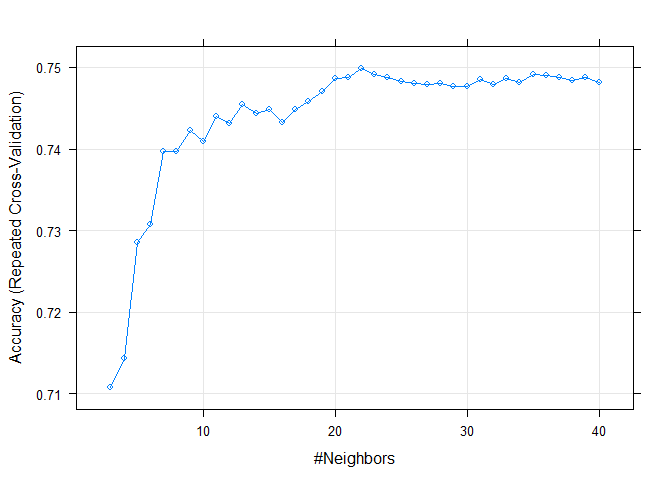
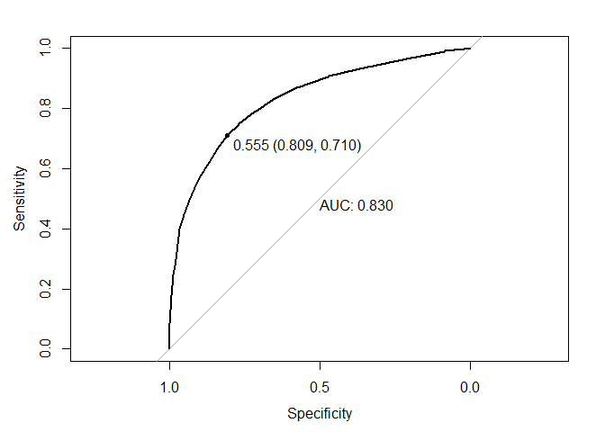

Customer Churn
================
Guillermo Bustos-Pérez
5/10/2020

## Introducción

El dataset corresponde a una compañía de telecomunicaciones ficticia que
registra si un cliente se ha cambiado o no de esa compañía telefónica en
el último mes. Dentro de cada cliente tenemos datos geográficos (ciudad,
estado, país, etc.), demográficos (edad, sexo, estado civil, etc.), y de
servicio (tipo de contrato, facturas, etc.).

El dataset ha sido generado por IBM (Cognos Analytics 11.1.3) y está
disponible en:  
<https://www.kaggle.com/ylchang/telco-customer-churn-1113>

El objetivo es generar un algoritmo de Machine Learning que permita
predecir el cambio de cliente de la compañía telefónica. Uno de los
primeros algoritmos a probar para procesos de clasificación es el KNN
(Cover y Hart, 1967; Zhang y Zhou, 2007). En muchos casos resulta en la
mejor opción 1/3 de las veces y en el dataset MNIST es de los únicos que
logra competir con las redes neuronales. **Vamos a ver que para este
conjunto se trata de un algoritmo altamente efectivo**.

## Exploración de los datos

Vamos a empezar por cargar la librería de referencia tidyverse (Wickham
et al., 2019), y los datos (que en este caso están disponibles en forma
excel).

``` r
# Load tidyverse library
library(tidyverse)
```

``` r
# Load data
Churn_Raw <- readxl::read_xlsx("J:/Data/Telco_customer_churn.xlsx")
```

 

Una vez hecho esto podemos pasar a hacer un poco de exploración de los
datos. Empecemos por conocer que clase de objeto y qué dimensiones
tiene:

``` r
# CHeck object class
class(Churn_Raw)
```

    ## [1] "tbl_df"     "tbl"        "data.frame"

``` r
# Check dimensions of the data frame
dim(Churn_Raw)
```

    ## [1] 7043   33

Podemos ver que se trata de un tibble (similar, pero más estable que un
data frame) de 7043 filas y 33 columnas.

Ahora vamos a ver qué columnas tenemos en el tibble. Segurmaente muchas
de las columnas no las necesitaremos para predecir el cambbio de
compañía telefónica.

``` r
# Colnames of Churn_Raw
colnames(Churn_Raw)
```

    ##  [1] "CustomerID"        "Count"             "Country"          
    ##  [4] "State"             "City"              "Zip Code"         
    ##  [7] "Lat Long"          "Latitude"          "Longitude"        
    ## [10] "Gender"            "Senior Citizen"    "Partner"          
    ## [13] "Dependents"        "Tenure Months"     "Phone Service"    
    ## [16] "Multiple Lines"    "Internet Service"  "Online Security"  
    ## [19] "Online Backup"     "Device Protection" "Tech Support"     
    ## [22] "Streaming TV"      "Streaming Movies"  "Contract"         
    ## [25] "Paperless Billing" "Payment Method"    "Monthly Charges"  
    ## [28] "Total Charges"     "Churn Label"       "Churn Value"      
    ## [31] "Churn Score"       "CLTV"              "Churn Reason"

Efectivamente, podemos ver que muchas de las columnas no van a ser
necesarias o van a falsear la predicción. Por ejemplo resulta bastante
evidente que el código postal (**“Zip Code”**) no va a ser muy útil a la
hora de determinar si un cliente se va a cambiar o no de compañía
telefónica. Lo mismo puede decirse de datos geográficos, como la
latitud, longitud, o condado.

Sin embargo, lo primero es comprobar que sólo haya un cliente por fila
(que no haya registros/clientes duplicados). Esto puede realizarse de
una forma muy fácil, retornando un valor lógico de **TRUE** cuando el
número de valores distintos de una columna se corresponde con el número
de filas.

``` r
# Check that there are no duplicated customers
n_distinct(Churn_Raw$CustomerID) == nrow(Churn_Raw)
```

    ## [1] TRUE

 

Vamos a empezar a descartar columnas que no vamos a emplear en el
análisis. Junto con las columnas de localización geográfica y código
postal también vamos a descartar las de Conteo (“Count”) ya que
sencillamente es para contar el número de clientes; país (“Country”) ya
que sólo hay un páis representado; Esatdo (“State”) ya que sólo hay un
estado, y ciudad (“City”) ya que el 95% de las ciudades tienen 15
clientes o menos.

``` r
# All rows belong to the same country
table(Churn_Raw$Country)
```

    ## 
    ## United States 
    ##          7043

``` r
# All rows belong to the same state
table(Churn_Raw$State)
```

    ## 
    ## California 
    ##       7043

``` r
# 95% of the cities have 15 or less clients
nrow(table(Churn_Raw$City))
```

    ## [1] 1129

``` r
quantile(table(Churn_Raw$City), 0.95)
```

    ## 95% 
    ##  15

``` r
(nrow(table(Churn_Raw$City))*0.95)
```

    ## [1] 1072.55

 

Valor del tiempo de vida del cliente (CLTV) es una columna interesante a
tener en cuenta para la realización de los análisis.

Podemos prescindir de las primeras nueve columnas que contienen los
datos geográficos. Tras esto también podemos prescindir de las columnas
“Churn Label”, “Churn Score” y “Churn Reason”, que no son válidas para
el modelo.

``` r
# Remove first nine columns
Churn <- Churn_Raw[,10:ncol(Churn_Raw)]
  
# Remove remaining unnecesary columns
Churn <- Churn %>% 
  select(-c(`Churn Label`, `Churn Score`, `Churn Reason`))

colnames(Churn)
```

    ##  [1] "Gender"            "Senior Citizen"    "Partner"          
    ##  [4] "Dependents"        "Tenure Months"     "Phone Service"    
    ##  [7] "Multiple Lines"    "Internet Service"  "Online Security"  
    ## [10] "Online Backup"     "Device Protection" "Tech Support"     
    ## [13] "Streaming TV"      "Streaming Movies"  "Contract"         
    ## [16] "Paperless Billing" "Payment Method"    "Monthly Charges"  
    ## [19] "Total Charges"     "Churn Value"       "CLTV"

 

Por último podemos averiguar cuantas filas tienen ausencia de datos en
alguna de sus columnas.

``` r
# Check rows with na's
length(which(is.na(Churn)))
```

    ## [1] 11

``` r
nrow(Churn) 
```

    ## [1] 7043

 

Tan solo hay 11 casos que presentan ausencia de datos en alguna de las
columnas sobre un total de 7043 casos. Por consiguiente podemos
prescindir de ellos tranquilamente.

``` r
# Remove rows with na's
Churn <- na.omit(Churn)
```

 

## Transformación usando Dummy variables

Uno de los principales problemas que tenemos es que la gran mayoría de
las columnas son de tipo caracter. El algoritmo de KNN requiere que
todos los imputs sean numéricos.

Hay algunas variables que tienen categorías exclusivas, como por ejemplo
género, pero otras no son factoriales ordenadas. Por ejemplo, la
variable “Multiple Lines” tiene tres categorías.

``` r
table(Churn$`Multiple Lines`)
```

    ## 
    ##               No No phone service              Yes 
    ##             3385              680             2967

 

La solución es muy sencilla. Basta con transformar en dummy variables.
Para ello obtenemos las variables que son de tipo caracter, y
transformamos estas en dummy variables dejando fuera la primera dummy y
dejando fuera las columnas originales. El nuevo data frame tiene 32
columnas, mientras que el antiguo tenía 21.

``` r
# Get character columns
Chr_Col <- colnames(Churn[, sapply(Churn, class) == 'character'])
Chr_Col
```

    ##  [1] "Gender"            "Senior Citizen"    "Partner"          
    ##  [4] "Dependents"        "Phone Service"     "Multiple Lines"   
    ##  [7] "Internet Service"  "Online Security"   "Online Backup"    
    ## [10] "Device Protection" "Tech Support"      "Streaming TV"     
    ## [13] "Streaming Movies"  "Contract"          "Paperless Billing"
    ## [16] "Payment Method"

``` r
# Make character columns into dummy columns
Churn_Dummy <- fastDummies::dummy_cols(
  Churn, 
  select_columns = Chr_Col,
  remove_first_dummy = TRUE,
  remove_selected_columns = TRUE)
rm(Chr_Col)

ncol(Churn)
```

    ## [1] 21

``` r
ncol(Churn_Dummy)
```

    ## [1] 32

 

## Equilibrar la base de datos

Al trabajar en problemas de clasificación tener una base de datos
desequilibrada (en la que una clase esta presente de manera muy superior
que la otra) supone un problema ya que puede afectar a la precisión del
modelo, e impedir conocer su potencial sobre datos que no ha visto.

En el caso de este datatset la clase correspondiente a los clientes que
se han cambiado de compañía es muy inferior en número (1869) a la de los
clientes que no se han cambiado (5163).

``` r
# Check if response is unbalanced
table(Churn_Dummy$`Churn Value`)
```

    ## 
    ##    0    1 
    ## 5163 1869

 

Vamos a solucionar esto de una manera simple, pero efectiva:

  - Ponemos todas las filas correspondientes a la clase minoritaria en
    un data frame, y todas las filas corresponientes a la clase
    mayoritaria en otro data frame.  
  - Barajamos/muestreamos aleatoriamente el dataframe de la clase
    mayoritaria para evitar sesgo en la selección y extraemos una
    muestra del mismo tamaño que la de la clase minoritaria.  
  - Unimos ambos data frames y comprobamos que tenemos el mismo número
    de casos por clase.

<!-- end list -->

``` r
# Extract positive and negative instances of chrun
set.seed(1234)

# Positive cases
Churn_Dummy_P <- Churn_Dummy %>% 
  filter(`Churn Value` == 1) %>% 
  sample()

# Negative cases
Churn_Dummy_N <- Churn_Dummy %>% 
  filter(`Churn Value` == 0)

x <- nrow(Churn_Dummy_P)

# Balanced dataframe
Churn_Dummy_Bal <- rbind(Churn_Dummy_N[1:x,],
                         Churn_Dummy_P)
table(Churn_Dummy_Bal$`Churn Value`)
```

    ## 
    ##    0    1 
    ## 1869 1869

``` r
nrow(Churn_Dummy_Bal)
```

    ## [1] 3738

 

## Trainig y hold out sets

Nuestro nuevo dataset está equilibrado en clases y las variables
categóricas han sido codificadas usando dummy variables. Sin embargo es
necesario normalizar las variables para que las diferentes escalas de
las variables no afecten al algoritmo de KNN. Basta con escribir y
aplicar la función correspondiente, y aplicarlo a las variables.

También aprovechamos para establecer los niveles de factores de la
variable objetivo (es requerido por el algoritmo de KNN), con unas
etiquetas que faciliten su identificación, y comprobamos que a ninguna
fila le faltan datos.

``` r
#### Normalize the dataset
normalize <- function(x){
  return((x-min(x)) / (max(x) - min(x)))
}

Churned <- Churn_Dummy_Bal$`Churn Value`

Churn_Dummy_Bal <- as.data.frame(lapply(Churn_Dummy_Bal[,-4], normalize)) 

Churn_Dummy_Bal$`Churn Value` <- Churned

#### Set factors for prediction 
Churn_Dummy_Bal$`Churn Value` <- factor(Churn_Dummy_Bal$`Churn Value`, 
                                        levels = c("1", "0"),
                                        labels = c("Churn", "No_Churn"))

which(is.na(Churn_Dummy_Bal))
```

    ## integer(0)

 

Ahora podemos separa los datos en el **training set** (que al entrenar
el modelo se dividirá también en test set) y el **hold out** set que se
empleará para probar la precisión final del modelo. Antes de esto es
necesario barajar el data frame para evitar sesgo en la composición de
los sets (recordamos que el dataframe equilibrado viene de la unión de
filas de dos dataframes correspondientes a cada clase).

El **training set** va a estar compuesto por el 80% de los casos (2990),
mientras que el **hold out set** va a estar compuesto por los restantes
(748).

``` r
#### Hold out set

# Randomly reorder rows
set.seed(1234)
Churn_Dummy_Bal <- Churn_Dummy_Bal[sample(nrow(Churn_Dummy_Bal)),]

# Split into train and test
n <- round(nrow(Churn_Dummy_Bal)*0.8, 0)
Train_Set <- Churn_Dummy_Bal[1:n,]

n <- n + 1
Hold_out <- Churn_Dummy_Bal[n:nrow(Churn_Dummy_Bal),]

nrow(Train_Set)
```

    ## [1] 2990

``` r
table(Train_Set$`Churn Value`)
```

    ## 
    ##    Churn No_Churn 
    ##     1489     1501

``` r
nrow(Hold_out)
```

    ## [1] 748

``` r
table(Hold_out$`Churn Value`)
```

    ## 
    ##    Churn No_Churn 
    ##      380      368

 

## Modelo KNN

El procedimiento para entrenar el modelo KNN es sencillo:

  - Definir el número más apropiado de k empleando:
      - Se prueban diferentes valores de k (**grid search**) para cada
        ciclo de la K-fold cross validation.  
  - Una vez obtenido el valor más adecuado de K se vuelve a entrenar el
    modelo.
      - Esto proporciona unas primeras estimaciones de la precisión del
        modelo.  
  - El modelo final se prueba sobre el hold out set.

En este caso vamos a emplear el paquete **caret** (Kuhn, 2008) que
permite automatizar la evaluación por medio del K-fold cross validation.
Queremos estar seguros de que el valor de k es el mejor, con lo que es
adecuado añadir varias repeticiones a cada ciclo de validación cruzada.
Una división en 10 folds/grupos para cada ciclo permite que cada grupo
esté compuesto por 299 muestras.

Por último, podemos cronometrar el tiempo que tarda usando el paquete
**tictoc()**. Es de notar que el proceso de **grid search** usando la
validación cruzada es computacionalmente caro, pero garantiza encontrar
el mejor valor de k.

``` r
# Load package
library(caret)
```

``` r
# Establish control set
trControl <- trainControl(method  = "repeatedcv",
                          number  = 10,
                          repeats = 20)

# fit the model
tictoc::tic()
fit <- train(`Churn Value` ~ .,
             data       = Train_Set,
             method     = "knn",
             tuneGrid   = expand.grid(k = 3:40),
             trControl  = trControl)
tictoc::toc()
```

    ## 457.55 sec elapsed

 

Determinar el valor más apropiado de K tarda aproximadamente algo menos
de 10 minutos. Una vez finalizado el **grid search** podemos representar
gráficamente la precisión de cada valor de K una vez terminados sus
respectivos ciclos de la validación cruzada K-fold, extraer el mejor
valor y almacenarlo para entrenar el modelo definitivo.

``` r
# Plot knn best value
plot(fit)
```

<!-- -->

``` r
k <- fit$bestTune
k
```

    ##     k
    ## 20 22

 

La mejor precisión del modelo se obtiene con una K de 22. A partir de
ese valor la precisión del modelo sobre la validación cruzada empieza a
decaer.

Ya podemos entrenar el modelo con el valor óptimo de K y obtener los
datos de la matriz de confusión.

``` r
# Save the predictions and the probabilities
trControl <- trainControl(method  = "repeatedcv",
                          number  = 10,
                          repeats = 20,
                          savePredictions = TRUE,
                          classProbs = TRUE)

# Train the model
fit_model <- train(`Churn Value` ~ .,
             data       = Train_Set,
             method     = "knn",
             tuneGrid   = expand.grid(k = k),
             trControl  = trControl)

ConfM <- confusionMatrix(fit_model$pred[,1], fit_model$pred[,2])
ConfM
```

    ## Confusion Matrix and Statistics
    ## 
    ##           Reference
    ## Prediction Churn No_Churn
    ##   Churn    25434    10691
    ##   No_Churn  4346    19329
    ##                                         
    ##                Accuracy : 0.7485        
    ##                  95% CI : (0.745, 0.752)
    ##     No Information Rate : 0.502         
    ##     P-Value [Acc > NIR] : < 2.2e-16     
    ##                                         
    ##                   Kappa : 0.4975        
    ##                                         
    ##  Mcnemar's Test P-Value : < 2.2e-16     
    ##                                         
    ##             Sensitivity : 0.8541        
    ##             Specificity : 0.6439        
    ##          Pos Pred Value : 0.7041        
    ##          Neg Pred Value : 0.8164        
    ##              Prevalence : 0.4980        
    ##          Detection Rate : 0.4253        
    ##    Detection Prevalence : 0.6041        
    ##       Balanced Accuracy : 0.7490        
    ##                                         
    ##        'Positive' Class : Churn         
    ## 

``` r
# Plot ROC curve and AUC
res.roc <- pROC::roc(fit_model$pred[,2], fit_model$pred[,3])
```

    ## Setting levels: control = Churn, case = No_Churn

    ## Setting direction: controls > cases

``` r
pROC::plot.roc(res.roc, print.auc = TRUE, print.thres = "best") 
```

<!-- -->

 

En este caso vemos que el modelo tiene una precisión de 0.75, habiendo
un *No Information Rate* cercano a 0.5 (gracias a que hemos equilibrado
el dataset previamente). La ROC es bastante buena, y podemos ver que
**la AUC es superior a 0.8**, indicando un funcioamiento bastante bueno
del modelo.

Finalmente probamos el modelo sobre el **hold out set** para ver el
funcionamiento de nuestro modelo sobre datos no vistos.

``` r
# Make prediction on hold out set
Hold_out_pred <- predict(fit_model, Hold_out[,-32])

# Display confusion matrix
confusionMatrix(Hold_out_pred, Hold_out[,32])
```

    ## Confusion Matrix and Statistics
    ## 
    ##           Reference
    ## Prediction Churn No_Churn
    ##   Churn      329      134
    ##   No_Churn    51      234
    ##                                           
    ##                Accuracy : 0.7527          
    ##                  95% CI : (0.7201, 0.7832)
    ##     No Information Rate : 0.508           
    ##     P-Value [Acc > NIR] : < 2.2e-16       
    ##                                           
    ##                   Kappa : 0.5035          
    ##                                           
    ##  Mcnemar's Test P-Value : 1.652e-09       
    ##                                           
    ##             Sensitivity : 0.8658          
    ##             Specificity : 0.6359          
    ##          Pos Pred Value : 0.7106          
    ##          Neg Pred Value : 0.8211          
    ##              Prevalence : 0.5080          
    ##          Detection Rate : 0.4398          
    ##    Detection Prevalence : 0.6190          
    ##       Balanced Accuracy : 0.7508          
    ##                                           
    ##        'Positive' Class : Churn           
    ## 

 

En el caso de los resultados finales del hold-out validation set podemos
observar una tendencia bastante clara del modelo. Por un lado, **la
predicción de clientes que van a cambiar de compañía telefónica es
bastante elevada (cercano al 85%)**, aunque a costa de identificar un
número importante de clientes fieles (que se mantienen en la compañía)
como que van a abandonar la empresa. En términos de matriz de confusión:

  - El ratio de falsos negativos bajo  
  - El ratio de falsos positivos es más elevado

El **resultado del modelo es satisfactorio, ya que la prioridad es
identificar clientes que vayana a abandonar la empresa**.

## Bibliografía

Cover, T.M., Hart, P.E., 1967. Nearest Neighbor Pattern Classification.
IEEE Transactions on Information Theory 13, 21–27.

James, G., Witten, D., Hastie, T., Tibshirani, R., 2013. An Introduction
to Statistical Learning, Springer Texts in Statistics. Springer New
York, New York, NY. <https://doi.org/10.1007/978-1-4614-7138-7>

Kuhn, M., 2008. Building Predictive Models in R using the caret Package.
Journal of Statistical Software 28.
<https://doi.org/10.18637/jss.v028.i05>

Lantz, B., 2015. Machine Learning with R, Second Edition. ed. Packt
Publishing Ltd., Birmingham.

Wickham, H., Averick, M., Bryan, J., Chang, W., McGowan, L., François,
R., Grolemund, G., Hayes, A., Henry, L., Hester, J., Kuhn, M., Pedersen,
T., Miller, E., Bache, S., Müller, K., Ooms, J., Robinson, D., Seidel,
D., Spinu, V., Takahashi, K., Vaughan, D., Wilke, C., Woo, K., Yutani,
H., 2019. Welcome to the Tidyverse. JOSS 4, 1686.
<https://doi.org/10.21105/joss.01686>

Zhang, M.-L., Zhou, Z.-H., 2007. ML-KNN: A lazy learning approach to
multi-label learning. Pattern Recognition 40, 2038–2048.
<https://doi.org/10.1016/j.patcog.2006.12.019>
