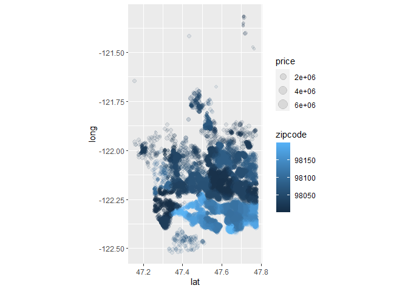
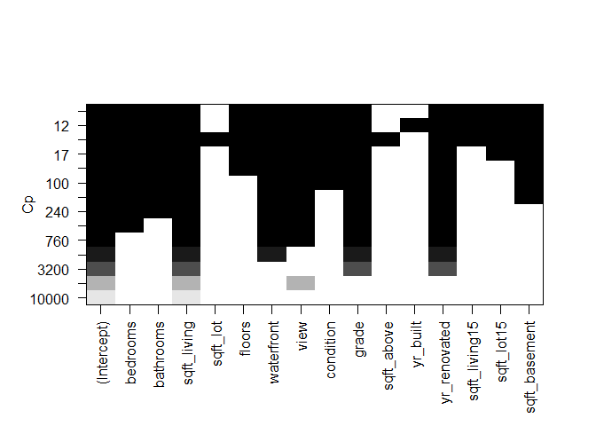
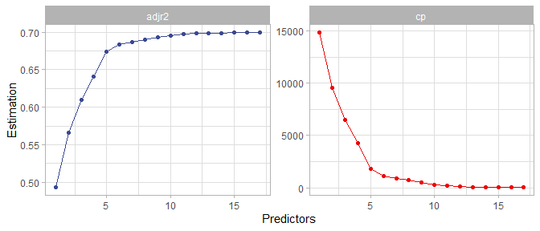
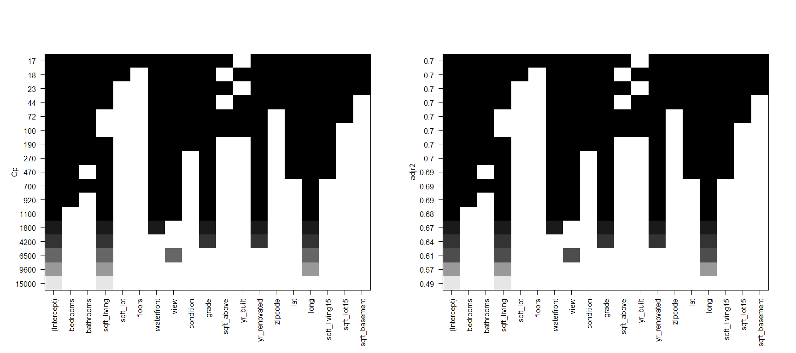
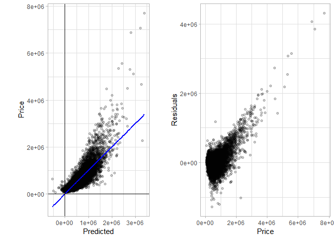
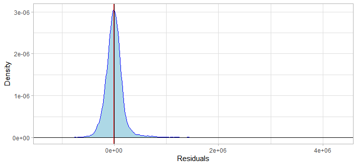
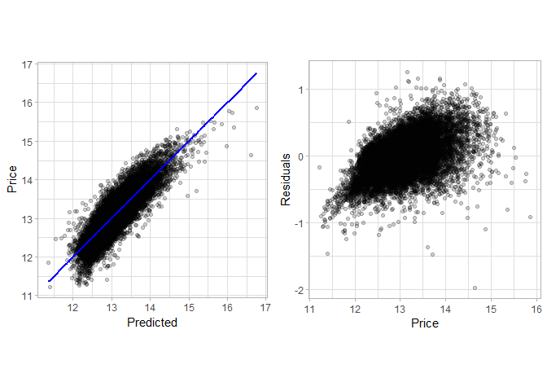
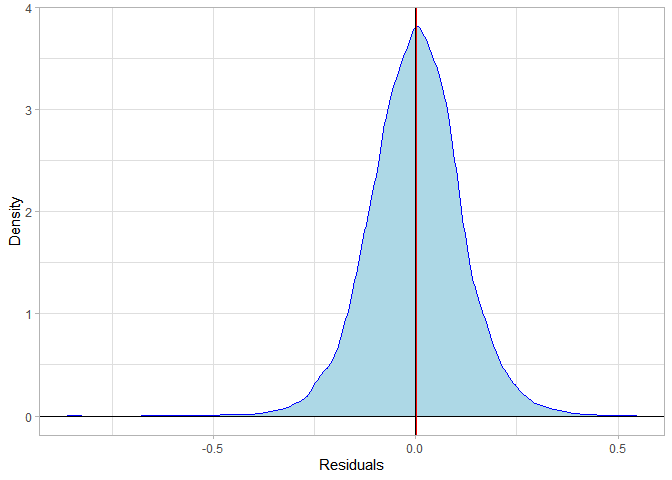

Predicción precio viviendas
================

## Índice

1)  Introducción  

2)  Regresión lineal múltiple  
    2.1) Correlaciones entre predictores  
    2.2) Selección de variables (*Best sub-set selection*)  
    2.3) Entrenamiento del modelo de regresión lineal múltiple  
    2.4) Evaluación del modelo de regresión lineal múltiple  
    2.5) Conclusión: Ventajas y desventajas del modelo de regresión
    lineal múltiple  
    2.6) Regresión lineal múltiple sobre valores logarítmicos

3)  Gradient Boosting Machine (GBM)  
    3.1) GBM con hiperparámtros por defecto

## 1\) Introducción

Mencionabamos en el inicio que se trata de un **ejercicio clásico de
regresión** (predecir un outcome numérico).

Vamos a **empezar por una regresión lineal múltiple**. Es bueno empezar
por aquí ya que:

  - Sirve como **referencia de un mínimo exigible al resto de los
    modelos**  
  - Ofrece una **fácil interpretabilidad**  
  - Aunque no es siempre correcta, nunca está completamnete equivocada

En este caso vamos a emplear la base de datos de dominio público de
viviendas de King County (Washington State, USA). Se trata de un datset
de 21613 viviendas con 21 variables asociadas al precio. Las ventas se
produjeron entre mayo de 2014 y mayo de 2015.

Empezamos por cargar el conjunto de librerías de **tidyverse** (Wickham,
2017; Wickham et al., 2019). El dataset está disponible en:  
<https://www.kaggle.com/shivachandel/kc-house-data>

``` r
# Read in the data
housing <- read.csv("Data/kc_house_data.csv")
```

``` r
# Get dimensions of dataset
dim(housing)
```

    ## [1] 21613    21

``` r
# Variable structure  
str(housing)
```

    ## 'data.frame':    21613 obs. of  21 variables:
    ##  $ id           : num  7.13e+09 6.41e+09 5.63e+09 2.49e+09 1.95e+09 ...
    ##  $ date         : chr  "20141013T000000" "20141209T000000" "20150225T000000" "20141209T000000" ...
    ##  $ price        : num  221900 538000 180000 604000 510000 ...
    ##  $ bedrooms     : int  3 3 2 4 3 4 3 3 3 3 ...
    ##  $ bathrooms    : num  1 2.25 1 3 2 4.5 2.25 1.5 1 2.5 ...
    ##  $ sqft_living  : int  1180 2570 770 1960 1680 5420 1715 1060 1780 1890 ...
    ##  $ sqft_lot     : int  5650 7242 10000 5000 8080 101930 6819 9711 7470 6560 ...
    ##  $ floors       : num  1 2 1 1 1 1 2 1 1 2 ...
    ##  $ waterfront   : int  0 0 0 0 0 0 0 0 0 0 ...
    ##  $ view         : int  0 0 0 0 0 0 0 0 0 0 ...
    ##  $ condition    : int  3 3 3 5 3 3 3 3 3 3 ...
    ##  $ grade        : int  7 7 6 7 8 11 7 7 7 7 ...
    ##  $ sqft_above   : int  1180 2170 770 1050 1680 3890 1715 1060 1050 1890 ...
    ##  $ sqft_basement: int  0 400 0 910 0 1530 0 0 730 0 ...
    ##  $ yr_built     : int  1955 1951 1933 1965 1987 2001 1995 1963 1960 2003 ...
    ##  $ yr_renovated : int  0 1991 0 0 0 0 0 0 0 0 ...
    ##  $ zipcode      : int  98178 98125 98028 98136 98074 98053 98003 98198 98146 98038 ...
    ##  $ lat          : num  47.5 47.7 47.7 47.5 47.6 ...
    ##  $ long         : num  -122 -122 -122 -122 -122 ...
    ##  $ sqft_living15: int  1340 1690 2720 1360 1800 4760 2238 1650 1780 2390 ...
    ##  $ sqft_lot15   : int  5650 7639 8062 5000 7503 101930 6819 9711 8113 7570 ...

<table>

<thead>

<tr>

<th style="text-align:right;">

id

</th>

<th style="text-align:left;">

date

</th>

<th style="text-align:right;">

price

</th>

<th style="text-align:right;">

bedrooms

</th>

<th style="text-align:right;">

bathrooms

</th>

<th style="text-align:right;">

sqft\_living

</th>

<th style="text-align:right;">

sqft\_lot

</th>

<th style="text-align:right;">

floors

</th>

<th style="text-align:right;">

waterfront

</th>

<th style="text-align:right;">

view

</th>

<th style="text-align:right;">

condition

</th>

<th style="text-align:right;">

grade

</th>

<th style="text-align:right;">

sqft\_above

</th>

<th style="text-align:right;">

sqft\_basement

</th>

<th style="text-align:right;">

yr\_built

</th>

<th style="text-align:right;">

yr\_renovated

</th>

<th style="text-align:right;">

zipcode

</th>

<th style="text-align:right;">

lat

</th>

<th style="text-align:right;">

long

</th>

<th style="text-align:right;">

sqft\_living15

</th>

<th style="text-align:right;">

sqft\_lot15

</th>

</tr>

</thead>

<tbody>

<tr>

<td style="text-align:right;">

7129300520

</td>

<td style="text-align:left;">

20141013T000000

</td>

<td style="text-align:right;">

221900

</td>

<td style="text-align:right;">

3

</td>

<td style="text-align:right;">

1.00

</td>

<td style="text-align:right;">

1180

</td>

<td style="text-align:right;">

5650

</td>

<td style="text-align:right;">

1

</td>

<td style="text-align:right;">

0

</td>

<td style="text-align:right;">

0

</td>

<td style="text-align:right;">

3

</td>

<td style="text-align:right;">

7

</td>

<td style="text-align:right;">

1180

</td>

<td style="text-align:right;">

0

</td>

<td style="text-align:right;">

1955

</td>

<td style="text-align:right;">

0

</td>

<td style="text-align:right;">

98178

</td>

<td style="text-align:right;">

47.5112

</td>

<td style="text-align:right;">

\-122.257

</td>

<td style="text-align:right;">

1340

</td>

<td style="text-align:right;">

5650

</td>

</tr>

<tr>

<td style="text-align:right;">

6414100192

</td>

<td style="text-align:left;">

20141209T000000

</td>

<td style="text-align:right;">

538000

</td>

<td style="text-align:right;">

3

</td>

<td style="text-align:right;">

2.25

</td>

<td style="text-align:right;">

2570

</td>

<td style="text-align:right;">

7242

</td>

<td style="text-align:right;">

2

</td>

<td style="text-align:right;">

0

</td>

<td style="text-align:right;">

0

</td>

<td style="text-align:right;">

3

</td>

<td style="text-align:right;">

7

</td>

<td style="text-align:right;">

2170

</td>

<td style="text-align:right;">

400

</td>

<td style="text-align:right;">

1951

</td>

<td style="text-align:right;">

1991

</td>

<td style="text-align:right;">

98125

</td>

<td style="text-align:right;">

47.7210

</td>

<td style="text-align:right;">

\-122.319

</td>

<td style="text-align:right;">

1690

</td>

<td style="text-align:right;">

7639

</td>

</tr>

<tr>

<td style="text-align:right;">

5631500400

</td>

<td style="text-align:left;">

20150225T000000

</td>

<td style="text-align:right;">

180000

</td>

<td style="text-align:right;">

2

</td>

<td style="text-align:right;">

1.00

</td>

<td style="text-align:right;">

770

</td>

<td style="text-align:right;">

10000

</td>

<td style="text-align:right;">

1

</td>

<td style="text-align:right;">

0

</td>

<td style="text-align:right;">

0

</td>

<td style="text-align:right;">

3

</td>

<td style="text-align:right;">

6

</td>

<td style="text-align:right;">

770

</td>

<td style="text-align:right;">

0

</td>

<td style="text-align:right;">

1933

</td>

<td style="text-align:right;">

0

</td>

<td style="text-align:right;">

98028

</td>

<td style="text-align:right;">

47.7379

</td>

<td style="text-align:right;">

\-122.233

</td>

<td style="text-align:right;">

2720

</td>

<td style="text-align:right;">

8062

</td>

</tr>

<tr>

<td style="text-align:right;">

2487200875

</td>

<td style="text-align:left;">

20141209T000000

</td>

<td style="text-align:right;">

604000

</td>

<td style="text-align:right;">

4

</td>

<td style="text-align:right;">

3.00

</td>

<td style="text-align:right;">

1960

</td>

<td style="text-align:right;">

5000

</td>

<td style="text-align:right;">

1

</td>

<td style="text-align:right;">

0

</td>

<td style="text-align:right;">

0

</td>

<td style="text-align:right;">

5

</td>

<td style="text-align:right;">

7

</td>

<td style="text-align:right;">

1050

</td>

<td style="text-align:right;">

910

</td>

<td style="text-align:right;">

1965

</td>

<td style="text-align:right;">

0

</td>

<td style="text-align:right;">

98136

</td>

<td style="text-align:right;">

47.5208

</td>

<td style="text-align:right;">

\-122.393

</td>

<td style="text-align:right;">

1360

</td>

<td style="text-align:right;">

5000

</td>

</tr>

<tr>

<td style="text-align:right;">

1954400510

</td>

<td style="text-align:left;">

20150218T000000

</td>

<td style="text-align:right;">

510000

</td>

<td style="text-align:right;">

3

</td>

<td style="text-align:right;">

2.00

</td>

<td style="text-align:right;">

1680

</td>

<td style="text-align:right;">

8080

</td>

<td style="text-align:right;">

1

</td>

<td style="text-align:right;">

0

</td>

<td style="text-align:right;">

0

</td>

<td style="text-align:right;">

3

</td>

<td style="text-align:right;">

8

</td>

<td style="text-align:right;">

1680

</td>

<td style="text-align:right;">

0

</td>

<td style="text-align:right;">

1987

</td>

<td style="text-align:right;">

0

</td>

<td style="text-align:right;">

98074

</td>

<td style="text-align:right;">

47.6168

</td>

<td style="text-align:right;">

\-122.045

</td>

<td style="text-align:right;">

1800

</td>

<td style="text-align:right;">

7503

</td>

</tr>

</tbody>

</table>

 

Hay algunas variables que a primera vista que carecen de utilidad para
realizar la regresión lineal, como son el identificador y la fecha,
mientras que el código postal, la latitud y longitud son indicadores de
localización que pueden asociarse al precio.

``` r
# Price according to location
housing %>% ggplot(aes(lat, long, size = price , color =zipcode)) +
  geom_point(alpha = 0.1) +
  coord_fixed()
```

<!-- -->

## 2\) Regresión lineal múltiple

En este caso vamos a realizar una regresión lineal múltiple con la mejor
sub-selección de variables. Recordamos algunos de los principios básicos
de la regresión lineal (James et al., 2013):

  - La regresión lineal Asume que la relación entre la variable
    dependiente (*Y*) y las variables predictoras
    ()
    es lineal.
      - Por consiguiente, si la regresión lineal simple asume que:


  - Entonces la **regresión lineal mútiple asume**:


Siendo:

  - *Y* la variable de respuesta a predecir

  - *X* las variables predictoras

  - :
    el intercept (constante que representa el punto de contacto de la
    recta en valor 0)

  - :
    el coeficiente/parámetro de la variable.

  - :
    corresponde al término de error

En la práctica puede decirse que la regresión linel nunca es
completamente correcta, pero tampoco está completamente acertada.
Prescindimos de las variables no necesarias y ahora tiene mucho mejor
aspecto.

``` r
# Check column names 
colnames(housing)
```

    ##  [1] "id"            "date"          "price"         "bedrooms"     
    ##  [5] "bathrooms"     "sqft_living"   "sqft_lot"      "floors"       
    ##  [9] "waterfront"    "view"          "condition"     "grade"        
    ## [13] "sqft_above"    "sqft_basement" "yr_built"      "yr_renovated" 
    ## [17] "zipcode"       "lat"           "long"          "sqft_living15"
    ## [21] "sqft_lot15"

``` r
# Remove non-usefull columns
housing_reg <- housing %>% 
  select(-c(id, date))
```

<table>

<thead>

<tr>

<th style="text-align:right;">

price

</th>

<th style="text-align:right;">

bedrooms

</th>

<th style="text-align:right;">

bathrooms

</th>

<th style="text-align:right;">

sqft\_living

</th>

<th style="text-align:right;">

sqft\_lot

</th>

<th style="text-align:right;">

floors

</th>

<th style="text-align:right;">

waterfront

</th>

<th style="text-align:right;">

view

</th>

<th style="text-align:right;">

condition

</th>

<th style="text-align:right;">

grade

</th>

<th style="text-align:right;">

sqft\_above

</th>

<th style="text-align:right;">

sqft\_basement

</th>

<th style="text-align:right;">

yr\_built

</th>

<th style="text-align:right;">

yr\_renovated

</th>

<th style="text-align:right;">

zipcode

</th>

<th style="text-align:right;">

lat

</th>

<th style="text-align:right;">

long

</th>

<th style="text-align:right;">

sqft\_living15

</th>

<th style="text-align:right;">

sqft\_lot15

</th>

</tr>

</thead>

<tbody>

<tr>

<td style="text-align:right;">

221900

</td>

<td style="text-align:right;">

3

</td>

<td style="text-align:right;">

1.00

</td>

<td style="text-align:right;">

1180

</td>

<td style="text-align:right;">

5650

</td>

<td style="text-align:right;">

1

</td>

<td style="text-align:right;">

0

</td>

<td style="text-align:right;">

0

</td>

<td style="text-align:right;">

3

</td>

<td style="text-align:right;">

7

</td>

<td style="text-align:right;">

1180

</td>

<td style="text-align:right;">

0

</td>

<td style="text-align:right;">

1955

</td>

<td style="text-align:right;">

0

</td>

<td style="text-align:right;">

98178

</td>

<td style="text-align:right;">

47.5112

</td>

<td style="text-align:right;">

\-122.257

</td>

<td style="text-align:right;">

1340

</td>

<td style="text-align:right;">

5650

</td>

</tr>

<tr>

<td style="text-align:right;">

538000

</td>

<td style="text-align:right;">

3

</td>

<td style="text-align:right;">

2.25

</td>

<td style="text-align:right;">

2570

</td>

<td style="text-align:right;">

7242

</td>

<td style="text-align:right;">

2

</td>

<td style="text-align:right;">

0

</td>

<td style="text-align:right;">

0

</td>

<td style="text-align:right;">

3

</td>

<td style="text-align:right;">

7

</td>

<td style="text-align:right;">

2170

</td>

<td style="text-align:right;">

400

</td>

<td style="text-align:right;">

1951

</td>

<td style="text-align:right;">

1991

</td>

<td style="text-align:right;">

98125

</td>

<td style="text-align:right;">

47.7210

</td>

<td style="text-align:right;">

\-122.319

</td>

<td style="text-align:right;">

1690

</td>

<td style="text-align:right;">

7639

</td>

</tr>

<tr>

<td style="text-align:right;">

180000

</td>

<td style="text-align:right;">

2

</td>

<td style="text-align:right;">

1.00

</td>

<td style="text-align:right;">

770

</td>

<td style="text-align:right;">

10000

</td>

<td style="text-align:right;">

1

</td>

<td style="text-align:right;">

0

</td>

<td style="text-align:right;">

0

</td>

<td style="text-align:right;">

3

</td>

<td style="text-align:right;">

6

</td>

<td style="text-align:right;">

770

</td>

<td style="text-align:right;">

0

</td>

<td style="text-align:right;">

1933

</td>

<td style="text-align:right;">

0

</td>

<td style="text-align:right;">

98028

</td>

<td style="text-align:right;">

47.7379

</td>

<td style="text-align:right;">

\-122.233

</td>

<td style="text-align:right;">

2720

</td>

<td style="text-align:right;">

8062

</td>

</tr>

<tr>

<td style="text-align:right;">

604000

</td>

<td style="text-align:right;">

4

</td>

<td style="text-align:right;">

3.00

</td>

<td style="text-align:right;">

1960

</td>

<td style="text-align:right;">

5000

</td>

<td style="text-align:right;">

1

</td>

<td style="text-align:right;">

0

</td>

<td style="text-align:right;">

0

</td>

<td style="text-align:right;">

5

</td>

<td style="text-align:right;">

7

</td>

<td style="text-align:right;">

1050

</td>

<td style="text-align:right;">

910

</td>

<td style="text-align:right;">

1965

</td>

<td style="text-align:right;">

0

</td>

<td style="text-align:right;">

98136

</td>

<td style="text-align:right;">

47.5208

</td>

<td style="text-align:right;">

\-122.393

</td>

<td style="text-align:right;">

1360

</td>

<td style="text-align:right;">

5000

</td>

</tr>

<tr>

<td style="text-align:right;">

510000

</td>

<td style="text-align:right;">

3

</td>

<td style="text-align:right;">

2.00

</td>

<td style="text-align:right;">

1680

</td>

<td style="text-align:right;">

8080

</td>

<td style="text-align:right;">

1

</td>

<td style="text-align:right;">

0

</td>

<td style="text-align:right;">

0

</td>

<td style="text-align:right;">

3

</td>

<td style="text-align:right;">

8

</td>

<td style="text-align:right;">

1680

</td>

<td style="text-align:right;">

0

</td>

<td style="text-align:right;">

1987

</td>

<td style="text-align:right;">

0

</td>

<td style="text-align:right;">

98074

</td>

<td style="text-align:right;">

47.6168

</td>

<td style="text-align:right;">

\-122.045

</td>

<td style="text-align:right;">

1800

</td>

<td style="text-align:right;">

7503

</td>

</tr>

</tbody>

</table>

 

### 2.1) Correlaciones entre predictores

Ahora tenemos que tener cuidad con las variables que muestran un alto
grado de colinearidad: variables predictivas que tienen un altto grado
de correlación. Esto se debe a que la colinearidad entre variables
predictivas genera alteraciones en los signos de los coeficientes,
dificultando su intepretabilidad. Aunque el modelo general no se ve
demasiado afectado, es importante tener esto en cuenta.

``` r
# Correlation matrix
cor <-cor(housing_reg[,-c(6,7,8,9, 10, 15, 16, 17)])

# Plot
corrplot::corrplot(cor, method = "color",
                   addCoef.col = TRUE,
                   number.font = 2,
                   number.cex = 0.75,
                   type = "lower",
                   sig.level = 0.001,
                   insig = "blank")
```

<!-- -->

Combinene recordar que en esta tabla los números representan la
correlación entre variables, y no la correlación lineal.

 

### 2.2) Selección de variables (*Best sub-set selection*)

Dado que tenemos menos de 20 variables. podemos hacer la mejor
subselección de variables empleando el paquete **leaps** (Lumley T.
based on Fortran code by Alan Miller, 2020).

Lo primero es **determinar el número y qué variables vamos a incluir**
en el modelo de regresión lineal múltiple.

``` r
#### Load leaps library
library(leaps)

#### Select subset of best variables changing limit of variables
regfit_full <- regsubsets(price ~ bedrooms + bathrooms + sqft_living + sqft_lot + floors + waterfront +view + condition + 
grade + sqft_above + sqft_basement + yr_built + yr_renovated + zipcode + lat + long + sqft_living15 + sqft_lot15,
                          data = housing_reg,
                          nvmax = 18)
```

    ## Warning in leaps.setup(x, y, wt = wt, nbest = nbest, nvmax = nvmax, force.in =
    ## force.in, : 1 linear dependencies found

    ## Reordering variables and trying again:

``` r
#### Plots Showing the best number of variables
reg_summary <- summary(regfit_full)
which.min(reg_summary$cp)
```

    ## [1] 17

``` r
which.max(reg_summary$adjr2)
```

    ## [1] 17

``` r
# Plot cp and adjusted rsquared according to n predictors
data.frame(reg_summary[4], 
           reg_summary[5],
           Predictors  = seq(1, 17, 1)) %>% 
  pivot_longer(c(adjr2, cp),
               names_to = "Parameters",
               values_to = "Estimation") %>% 
  ggplot(aes(Predictors, Estimation, color = Parameters)) +
  geom_line() +
  geom_point() +
  ggsci::scale_color_aaas() +
  theme_light() +
  facet_wrap(~Parameters, scales = "free") +
  theme(legend.position = "none")
```


 

Con los resultados de subselección vemos:

  - El *cp* alcanza un mínimo con 17 predictores  
  - La adjusted r-squared alcanza un máximo con 17 predictores  
  - Los gráficos de evolución del *cp* y la *adjusted r-squared* muestra
    que la mejor combinación de variables **se estabiliza** a partir de
    los **diez u once predictores**. Es mejor elegir el modelo más
    simple que no suponga un empeoramiento sustancial con respecto al
    modelo óptimo (Hastie et al., 2009). Por consiguiente elegimos diez
    predictores.

Ahora vamos a visualizar **qué variables** son más estables y mejores
para el modelo.

``` r
par(mfrow  = c(1,2))
plot(regfit_full, scale = "Cp")
plot(regfit_full, scale = "adjr2")
```

<!-- -->
 

En este caso vemos claramente que *sqft\_living*, *grade* y *waterfront*
son algunas de las variables más importantes. Por algún mottivo la
variable *yr\_renovated* aparece como una de las más importantes, pero
veremos en la siguiente parte del análisis que en relidad la variable
más apropiada es *yr\_built*. Otras variables de localización también
son importantes para el modelo, como la longitud y la latitud.

Con esto podemos emplear una **función que nos determine qué predictores
son mejores para un modelo con ocho variables**.

``` r
# Function to get best subset of predictors  
get_model_formula <- function(id, object, outcome){
  # get models data
  models <- summary(object)$which[id,-1]
  # Get outcome variable
  #form <- as.formula(object$call[[2]])
  #outcome <- all.vars(form)[1]
  # Get model predictors
  predictors <- names(which(models == TRUE))
  predictors <- paste(predictors, collapse = "+")
  # Build model formula
  as.formula(paste0(outcome, "~", predictors))
}

get_model_formula(10, regfit_full, "price")
```

    ## price ~ bedrooms + bathrooms + sqft_living + waterfront + view + 
    ##     grade + yr_built + zipcode + lat + long
    ## <environment: 0x0000000014d0aca8>

 

### 2.3) Entrenamiento del modelo de regresión lineal múltiple

Ya tenemos la fórmula, así que basta con entrenar el modelo y obtener
los datos de parámtros y coeficientes correspondientes. Recordamos que
hemos detectado varias relaciones de colinearidad entre varias
predictoras, con lo que la estimación de coeficientes de los predictores
debe ser observada con prudencia.  
Aunque **los modelos de regresión lineal suelen tender poco al
sobreajuste** de los datos (**overfiting**), sigue considerándose buena
práctica dividir entre train/test sets para evaluar el modelo con datos
que no ha visto. En este caso usamos la librería **caret** (Kuhn, 2008)

``` r
library(caret)
#### Model k-fol cross validation ####
set.seed(123)

# Set control parameters
train.control <- trainControl(method = "repeatedcv", 
                              number = 10, 
                              repeats = 20,
                              savePredictions = TRUE)

# train model
MLR_Model <- train(price ~ bedrooms + bathrooms + sqft_living + waterfront + view + 
                     grade + yr_built + zipcode + lat + long, 
               method = "lm",
               data = housing_reg,
               trControl = train.control)

# Model data
summary(MLR_Model)
```

    ## 
    ## Call:
    ## lm(formula = .outcome ~ ., data = dat)
    ## 
    ## Residuals:
    ##      Min       1Q   Median       3Q      Max 
    ## -1274860  -100052    -9762    78706  4306677 
    ## 
    ## Coefficients:
    ##               Estimate Std. Error t value Pr(>|t|)    
    ## (Intercept)  1.520e+07  2.773e+06   5.481 4.28e-08 ***
    ## bedrooms    -3.533e+04  1.891e+03 -18.685  < 2e-16 ***
    ## bathrooms    4.428e+04  3.106e+03  14.257  < 2e-16 ***
    ## sqft_living  1.769e+02  3.071e+00  57.612  < 2e-16 ***
    ## waterfront   5.906e+05  1.741e+04  33.920  < 2e-16 ***
    ## view         5.232e+04  2.096e+03  24.956  < 2e-16 ***
    ## grade        1.048e+05  2.007e+03  52.195  < 2e-16 ***
    ## yr_built    -2.861e+03  6.366e+01 -44.940  < 2e-16 ***
    ## zipcode     -6.319e+02  3.262e+01 -19.370  < 2e-16 ***
    ## lat          5.946e+05  1.066e+04  55.781  < 2e-16 ***
    ## long        -1.924e+05  1.251e+04 -15.380  < 2e-16 ***
    ## ---
    ## Signif. codes:  0 '***' 0.001 '**' 0.01 '*' 0.05 '.' 0.1 ' ' 1
    ## 
    ## Residual standard error: 202500 on 21602 degrees of freedom
    ## Multiple R-squared:  0.696,  Adjusted R-squared:  0.6959 
    ## F-statistic:  4947 on 10 and 21602 DF,  p-value: < 2.2e-16

``` r
MLR_Model$results
```

    ##   intercept     RMSE  Rsquared      MAE   RMSESD RsquaredSD    MAESD
    ## 1      TRUE 202333.6 0.6966007 127098.5 14075.78 0.01492823 2855.854

 

Si entrenamos nuevamente el modelo dejando fuera la K-fold cross
validation vemos que obtenemos el mismo resultado (como ya hemos
señalado antes, esto se debe a que los modelos de regresión lineal no
tienden a sobreajustar los datos, especialmente en datasets tan
grandes).

``` r
# Final model
MLR_Model <- lm(price ~ bedrooms + bathrooms + sqft_living + waterfront + view + 
                     grade + yr_built + zipcode + lat + long, 
               data = housing_reg)
summary(MLR_Model)
```

    ## 
    ## Call:
    ## lm(formula = price ~ bedrooms + bathrooms + sqft_living + waterfront + 
    ##     view + grade + yr_built + zipcode + lat + long, data = housing_reg)
    ## 
    ## Residuals:
    ##      Min       1Q   Median       3Q      Max 
    ## -1274860  -100052    -9762    78706  4306677 
    ## 
    ## Coefficients:
    ##               Estimate Std. Error t value Pr(>|t|)    
    ## (Intercept)  1.520e+07  2.773e+06   5.481 4.28e-08 ***
    ## bedrooms    -3.533e+04  1.891e+03 -18.685  < 2e-16 ***
    ## bathrooms    4.428e+04  3.106e+03  14.257  < 2e-16 ***
    ## sqft_living  1.769e+02  3.071e+00  57.612  < 2e-16 ***
    ## waterfront   5.906e+05  1.741e+04  33.920  < 2e-16 ***
    ## view         5.232e+04  2.096e+03  24.956  < 2e-16 ***
    ## grade        1.048e+05  2.007e+03  52.195  < 2e-16 ***
    ## yr_built    -2.861e+03  6.366e+01 -44.940  < 2e-16 ***
    ## zipcode     -6.319e+02  3.262e+01 -19.370  < 2e-16 ***
    ## lat          5.946e+05  1.066e+04  55.781  < 2e-16 ***
    ## long        -1.924e+05  1.251e+04 -15.380  < 2e-16 ***
    ## ---
    ## Signif. codes:  0 '***' 0.001 '**' 0.01 '*' 0.05 '.' 0.1 ' ' 1
    ## 
    ## Residual standard error: 202500 on 21602 degrees of freedom
    ## Multiple R-squared:  0.696,  Adjusted R-squared:  0.6959 
    ## F-statistic:  4947 on 10 and 21602 DF,  p-value: < 2.2e-16

Con la tabla de las estimaciones de los coeficientes de los predictores
podemos hacer una **rápida interpretación del modelo**. Por ejemplo,
observamos que **el precio se incrementa significativamente a medida que
nos desplazamos hacia el este**, que también es la zona costera (el
precio también se incrementa al disponer de una línea de costa). Por ota
parte la longitud tiene un efecto inverso sobre el precio: cuanto más al
norte, más disminuye el precio.

### 2.4) Evaluación del modelo de regresión lineal múltiple

Para procesar modelos es particularmente útil la librería **broom**
(Robinson et al., 2020) que nos permite generar dataframes que contengan
los valores actuales, predecidos, residuals, etc. sto facilita bastante
el trato posterior del modelo. En combinación con la biblioteca
**Metrics** (Hamner and Frasco, 2018) permiteo btener diferentes
métricas de evaluación de modelos.

En este caso las métricas más adecuadas para la evaluación del modelo
son la MAE, RMSE, MAPE junto con el adjuseted r-square. Vamos a
guardarlas en un dataframe que luego iremos aumentando con otros
modelos.

``` r
# Make predictions into dataframe
MLR_DF <- broom::augment(MLR_Model)

# Model evaluation Metrics 
Models <- data.frame(
  "Model" = "Multiple Linear Regression",
  "MAE" = Metrics::mae(MLR_DF$price, MLR_DF$.resid),
  "RMSE" = Metrics::rmse(MLR_DF$price, MLR_DF$.resid),
  "MAPE"= Metrics::mape(MLR_DF$price, MLR_DF$.resid),
  "Correlation" = summary(MLR_Model)[[9]])
```

<table>

<thead>

<tr>

<th style="text-align:left;">

Model

</th>

<th style="text-align:right;">

MAE

</th>

<th style="text-align:right;">

RMSE

</th>

<th style="text-align:right;">

MAPE

</th>

<th style="text-align:right;">

Correlation

</th>

</tr>

</thead>

<tbody>

<tr>

<td style="text-align:left;">

Multiple Linear Regression

</td>

<td style="text-align:right;">

540801.3

</td>

<td style="text-align:right;">

620890.5

</td>

<td style="text-align:right;">

1.045962

</td>

<td style="text-align:right;">

0.6959011

</td>

</tr>

</tbody>

</table>

 

Ahora que tenemos las métricas, podemos generar varias visualizaciones
comunes para la evaluación de modelos. En este aso vamos a centrarnos
**en tres visualizaciones**:  
1\) Diagrama de dispersión (*scatter plot*) de distribución de valores
predecidos y valores reales junto con la recta de regresión.  
2\) Diagrama de dispersión del valor a predecir y los residuals  
3\) Gráfico de densidad de distribución de los residuals

Empecemos por los gráficos de dispersión de la correlación entre la
predicción y el precio y de los residuals con el precio. Vamos a
mantener constante la relación entre los ejes para

``` r
# Scatter plot of correlation and residuals
ggpubr::ggarrange(
  (
    MLR_DF %>% ggplot(aes(.fitted, price)) +
      geom_point(alpha = .2) +
      geom_line(aes(y = .fitted), size = 1, col = "blue") +
      coord_fixed() + 
      theme_light() +
      geom_vline(xintercept = 0) + geom_hline(yintercept = 0) + 
      xlab("Predicted") +
      ylab("Price")),
  
  (
    MLR_DF %>% ggplot(aes(price, .resid)) +
     geom_point(alpha = .2) +
      ylab("Residuals") +
      xlab("Price") +
      theme_light()
    ),
  ncol = 2, align = "h")
```


 

Un vistazo rápido permite dejar claro que aunque tenemos una correlación
aceptable, **el modelo deja mucho que desear**. Vemos que en la parte de
mayor valor de precio el modelo sistemáticamente infraestima las
predicciones. Esto se transmite claramente en el gráfico de dispersión
de residuals con respecto al precio, donde podemos ver que **los
residuals se incrementan positivamente a medida que incrementa el
precio**. Un modelo de correlaicón lineal entre los residuals y el
precio nos confirma esto proporcionando una correlación lineal de 0.3.

``` r
# Check if residuals are correlated with price
summary(lm(price ~ .resid, MLR_DF))
```

    ## 
    ## Call:
    ## lm(formula = price ~ .resid, data = MLR_DF)
    ## 
    ## Residuals:
    ##      Min       1Q   Median       3Q      Max 
    ## -1078438  -202896   -50472   140644  2853234 
    ## 
    ## Coefficients:
    ##              Estimate Std. Error t value Pr(>|t|)    
    ## (Intercept) 5.401e+05  2.083e+03  259.23   <2e-16 ***
    ## .resid      1.000e+00  1.029e-02   97.15   <2e-16 ***
    ## ---
    ## Signif. codes:  0 '***' 0.001 '**' 0.01 '*' 0.05 '.' 0.1 ' ' 1
    ## 
    ## Residual standard error: 306300 on 21611 degrees of freedom
    ## Multiple R-squared:  0.304,  Adjusted R-squared:  0.3039 
    ## F-statistic:  9437 on 1 and 21611 DF,  p-value: < 2.2e-16

 

Por último el gráfico de densidad de distribución de los residuals nos
permite ver que, aunque la gran mayoría de los residuals están centrados
alrededor del valor 0 con una distribución aparentemente normal, lastran
una importante cola hacia el margen de mayor valor. Esto está en línea
con lo que hemos visto previamente.

``` r
# Residuals density plot
MLR_DF %>% ggplot(aes(.resid)) +
  geom_density(color = "blue", fill = "lightblue")  +
  theme_light() +
  geom_vline(xintercept = 0) + geom_hline(yintercept = 0) + 
  geom_vline(xintercept = median(MLR_DF$.resid), color = "red") + 
  xlab("Residuals") + ylab("Density")
```



### 2.5) Conclusión: Ventajas y desventajas del modelo de regresión lineal múltiple

**Ventajas** del modelo de regresión múltiple:

  - Proporciona una fácil intepretabilidad de qué variables influyen más
    en el precio de la vivenda  
  - Los siguientes modelos deben tener una adjusted r-squared de al
    menos 0.6959011

**Desventajas** del modelo de regresión lineal múltiple:

  - La correlación entre el los residuals y el precio indica que cuanto
    más elevado sea el precio más será infravalorardo por el modelo
    (atribuirá a esa casa un valor menor)  
  - En algunos casos el modelo predice valores negativos para las
    viviendas. Esto es común a los modelos de regresión lineal para
    predecir precios, pero es fácilmente corregible adaptando el precio
    a la escala logarítmica.

### 2.6) Regresión lineal múltiple sobre valores logarítmicos

Para subsanar rápidamente uno de los defectos del anterior modelo vamos
a transformar la variable dependiente (el precio) a la escala
logarítmica. El resto de variables las vamos a escalar. Este
procedimiento se realiza para obtener distribuciones paramétricas de las
variables, y aunque suele resultar en modelos más precisos, perdemos
parte de la interpretabilidad del modelo.

``` r
# Log of price
price <- housing_reg %>% mutate(price = log(price))

# Scale variables
housing_reg <- scale(housing_reg[-1])

# Data frame
housing_reg <- cbind(price, housing_reg)
```

Volvemos a entrenar el modelo con las nuevas variables. En este caso
resulta en un incremento significativo de la adjusted r-squared.

``` r
# Model with log price and scaled variables
MLR_Log <- lm(price ~ bedrooms + bathrooms + sqft_living + view + 
                  grade + yr_built + zipcode + long +lat + waterfront, 
                data = housing_reg)

summary(MLR_Log)
```

    ## 
    ## Call:
    ## lm(formula = price ~ bedrooms + bathrooms + sqft_living + view + 
    ##     grade + yr_built + zipcode + long + lat + waterfront, data = housing_reg)
    ## 
    ## Residuals:
    ##      Min       1Q   Median       3Q      Max 
    ## -1.97836 -0.16437  0.00307  0.16388  1.25485 
    ## 
    ## Coefficients:
    ##               Estimate Std. Error t value Pr(>|t|)    
    ## (Intercept)  1.495e+01  3.552e+00   4.208 2.59e-05 ***
    ## bedrooms    -1.375e-02  2.422e-03  -5.678 1.38e-08 ***
    ## bathrooms    8.701e-02  3.978e-03  21.871  < 2e-16 ***
    ## sqft_living  1.758e-04  3.933e-06  44.704  < 2e-16 ***
    ## view         6.946e-02  2.685e-03  25.871  < 2e-16 ***
    ## grade        1.828e-01  2.571e-03  71.121  < 2e-16 ***
    ## yr_built    -3.850e-03  8.153e-05 -47.224  < 2e-16 ***
    ## zipcode     -7.575e-04  4.178e-05 -18.131  < 2e-16 ***
    ## long        -9.325e-02  1.602e-02  -5.820 5.96e-09 ***
    ## lat          1.402e+00  1.365e-02 102.680  < 2e-16 ***
    ## waterfront   3.715e-01  2.230e-02  16.661  < 2e-16 ***
    ## ---
    ## Signif. codes:  0 '***' 0.001 '**' 0.01 '*' 0.05 '.' 0.1 ' ' 1
    ## 
    ## Residual standard error: 0.2593 on 21602 degrees of freedom
    ## Multiple R-squared:  0.7577, Adjusted R-squared:  0.7576 
    ## F-statistic:  6756 on 10 and 21602 DF,  p-value: < 2.2e-16

 

Rápidamente volvemos a observar los gráficos de dispersión de
predicciones y variables actuales, residuals y valores actuales, y
densidad de los residuals.

``` r
# New model as data frame
MLR_Log_DF <- broom::augment(MLR_Log)   

# Scatter plot of correlation and residuals
ggpubr::ggarrange(
  (
    MLR_Log_DF %>% ggplot(aes(.fitted, price)) +
      geom_point(alpha = .2) +
      geom_line(aes(y = .fitted), size = 1, col = "blue") +
      coord_fixed() + 
      theme_light() +
      xlab("Predicted") +
      ylab("Price")),
  
  (
    MLR_Log_DF %>% ggplot(aes(price, .resid)) +
     geom_point(alpha = .2) +
      ylab("Residuals") +
      xlab("Price") +
      coord_fixed() +
      theme_light()
    ),
  ncol = 2, align = "h")
```

<!-- -->

``` r
# Residuals density plot
MLR_Log_DF %>% ggplot(aes(.resid)) +
  geom_density(color = "blue", fill = "lightblue")  +
  theme_light() +
  geom_vline(xintercept = 0) + geom_hline(yintercept = 0) + 
  geom_vline(xintercept = median(MLR_Log_DF$.resid), color = "red") + 
  xlab("Residuals") + ylab("Density")
```

<!-- -->
 

Rápidamente podemos ver que el modelo ha mejorado. La distribución de
los residuals es mejor, aunque en este caso se ha invertido, habiendo un
claro sesgo hacia abajo en los valores más bajos del precio (la
predicción del precio de las viviendas más baratas suele ser más baja).
Un modelo de regresión lineal de los residuals en base al precio nos
muestra que tiene una r-squared de 0.24, significativamente más baja que
la del anterior modelo.

``` r
# Linear model of residuals
summary(lm(.resid ~ price, MLR_Log_DF))
```

    ## 
    ## Call:
    ## lm(formula = .resid ~ price, data = MLR_Log_DF)
    ## 
    ## Residuals:
    ##      Min       1Q   Median       3Q      Max 
    ## -2.36402 -0.13435  0.01464  0.14739  1.22844 
    ## 
    ## Coefficients:
    ##              Estimate Std. Error t value Pr(>|t|)    
    ## (Intercept) -3.161039   0.038059  -83.06   <2e-16 ***
    ## price        0.242266   0.002915   83.12   <2e-16 ***
    ## ---
    ## Signif. codes:  0 '***' 0.001 '**' 0.01 '*' 0.05 '.' 0.1 ' ' 1
    ## 
    ## Residual standard error: 0.2257 on 21611 degrees of freedom
    ## Multiple R-squared:  0.2423, Adjusted R-squared:  0.2422 
    ## F-statistic:  6910 on 1 and 21611 DF,  p-value: < 2.2e-16

 

Vamos a finalizar este apartado añadiendo los resultados de las métricas
de evaluación junto con el anterior modelo. Conviene recordar que **los
dos modelos están en escalas diferentes (lineal y logarítmica)**, con lo
cual las métricas MAE y RMSE no son útiles para comparar ambos modelos y
hay que tener como referencia la adjusted r-squared.

``` r
# Model evaluation Metrics 
temp <- data.frame(
  "Model" = "Mult. Linear Reg. Log scale",
  "MAE" = Metrics::mae(MLR_Log_DF$price, MLR_Log_DF$.resid),
  "RMSE" = Metrics::rmse(MLR_Log_DF$price, MLR_Log_DF$.resid),
  "MAPE"= Metrics::mape(MLR_Log_DF$price, MLR_Log_DF$.resid),
  "Correlation" = summary(MLR_Log)[[9]])

Models <- rbind(Models, temp)
```

<table>

<thead>

<tr>

<th style="text-align:left;">

Model

</th>

<th style="text-align:right;">

MAE

</th>

<th style="text-align:right;">

RMSE

</th>

<th style="text-align:right;">

MAPE

</th>

<th style="text-align:right;">

Correlation

</th>

</tr>

</thead>

<tbody>

<tr>

<td style="text-align:left;">

Multiple Linear Regression

</td>

<td style="text-align:right;">

540801.31087

</td>

<td style="text-align:right;">

620890.51404

</td>

<td style="text-align:right;">

1.045962

</td>

<td style="text-align:right;">

0.6959011

</td>

</tr>

<tr>

<td style="text-align:left;">

Mult. Linear Reg. Log scale

</td>

<td style="text-align:right;">

13.04782

</td>

<td style="text-align:right;">

13.05587

</td>

<td style="text-align:right;">

1.000398

</td>

<td style="text-align:right;">

0.7576221

</td>

</tr>

</tbody>

</table>

## 3\) Modelo de Gradient Boosting Machine

Los Gradient Boosting Machine son derivados del Descenso gradiante y el
Boosting (Friedman, 2020). Conviene recordar los hiperparámtros de GBM.

``` r
# Check model hyperparameters
modelLookup("gbm")
```

    ##   model         parameter                   label forReg forClass probModel
    ## 1   gbm           n.trees   # Boosting Iterations   TRUE     TRUE      TRUE
    ## 2   gbm interaction.depth          Max Tree Depth   TRUE     TRUE      TRUE
    ## 3   gbm         shrinkage               Shrinkage   TRUE     TRUE      TRUE
    ## 4   gbm    n.minobsinnode Min. Terminal Node Size   TRUE     TRUE      TRUE

### 3.1) GBM con hiperparámtros por defecto

En este caso vamos a empezar a entrenar el modelo con los
hiperparámetros por defecto. En este caso **los gbm sí son muy
tendentes a sobreajustar los datos**, con lo que es necesario introducir
una K-fold cross validation y emplearla para estimar la precisión del
modelo. En este caso **empleamos una K-fold cross valdiation de 10x5**.

``` r
# Prepare control method
fitControl <- trainControl(method = "repeatedcv",
                           number = 3,
                           repeats = 5)
tictoc::tic()
# Train model
set.seed(42)
GBM_Housing <- train(
  price ~ .,
  data = housing_reg,
  method = "gbm",
  trControl = fitControl,
  verbose = FALSE)
tictoc::toc()
summary(GBM_Housing )
GBM_Housing 
```

## Bibliografía

Friedman, J.H., 2020. Greedy Function Approximation: A Gradient Boosting
Machine. The Annals of Statistics 29, 1189–1232.

Hamner, B., and Frasco, M., 2018. Metrics: Evaluation Metrics for
Machine Learning. R package version 0.1.4.

Hastie, T., Tibshirani, R., Friedman, J., 2009. The Elements of
Statistical Learning. Data Mining, Inference, and Prediction, Second
Edition. ed, Springer Series in Statistics. Springer.

James, G., Witten, D., Hastie, T., Tibshirani, R., 2013. An Introduction
to Statistical Learning, Springer Texts in Statistics. Springer New
York, New York, NY. <https://doi.org/10.1007/978-1-4614-7138-7>

Kuhn, M., 2008. Building Predictive Models in R using the caret Package.
Journal of Statistical Software 28.
<https://doi.org/10.18637/jss.v028.i05>

Robinson, D., Hayes A., Couch, S., 2020. broom: Convert Statistical
Objects into Tidy Tibbles. R package version 0.7.0.
<https://CRAN.R-project.org/package=broom>

Lumley T. based on Fortran code by Alan Miller 2020. leaps:Regression
Subset Selection. R package version 3.1.
<https://CRAN.R-project.org/package=leaps>

Wickham, H., 2017. Easily Install and Load the “Tidyverse”. R package
version.

Wickham, H., Averick, M., Bryan, J., Chang, W., McGowan, L., François,
R., Grolemund, G., Hayes, A., Henry, L., Hester, J., Kuhn, M., Pedersen,
T., Miller, E., Bache, S., Müller, K., Ooms, J., Robinson, D., Seidel,
D., Spinu, V., Takahashi, K., Vaughan, D., Wilke, C., Woo, K., Yutani,
H., 2019. Welcome to the Tidyverse. Journal of Open Source Software 4,
1686. <https://doi.org/10.21105/joss.01686>
