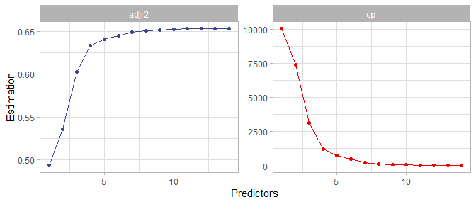
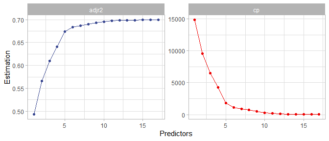

Predicción precio viviendas
================

## Índice

1)  Introducción  
2)  Regresión lineal múltiple  
    2.1) Correlaciones entre predictores  
    2.2) Selección de variables (*Best sub-set selection*)  
    2.3) Entrenamiento del modelo de regresión lineal múltiple  
    2.4) Evaluación del modelo de regresión lineal múltiple

## 1\) Introducción

Mencionabamos en el inicio que se trata de un **ejercicio clásico de
regresión** (predecir un outcome numérico).

Vamos a **empezar por una regresión lineal múltiple**. Es bueno empezar
por aquí ya que:

  - Sirve como **referencia de mínimo exigible al resto de los
    modelos**  
  - Ofrece una **fácil interpretabilidad**  
  - Aunque no es siempre correcta, nunca está completamnete equivocada

En este caso vamos a emplear la base de datos de dominio público de
viviendas de King County (Washington State, USA). Se trata de un datset
de 21613 viviendas con 21 variables asociadas al precio. Las ventas se
produjeron entre mayo de 2014 y mayo de 2015.

Empezamos por cargar el conjunto de librerías de **tidyverse** (Wickham,
2017; Wickham et al., 2019). El dataset está disponible en:  
<https://www.kaggle.com/shivachandel/kc-house-data>

``` r
# Read in the data
housing <- read.csv("Data/kc_house_data.csv")
```

``` r
# Get dimensions of dataset
dim(housing)
```

    ## [1] 21613    21

``` r
# Variable structure  
str(housing)
```

    ## 'data.frame':    21613 obs. of  21 variables:
    ##  $ id           : num  7.13e+09 6.41e+09 5.63e+09 2.49e+09 1.95e+09 ...
    ##  $ date         : chr  "20141013T000000" "20141209T000000" "20150225T000000" "20141209T000000" ...
    ##  $ price        : num  221900 538000 180000 604000 510000 ...
    ##  $ bedrooms     : int  3 3 2 4 3 4 3 3 3 3 ...
    ##  $ bathrooms    : num  1 2.25 1 3 2 4.5 2.25 1.5 1 2.5 ...
    ##  $ sqft_living  : int  1180 2570 770 1960 1680 5420 1715 1060 1780 1890 ...
    ##  $ sqft_lot     : int  5650 7242 10000 5000 8080 101930 6819 9711 7470 6560 ...
    ##  $ floors       : num  1 2 1 1 1 1 2 1 1 2 ...
    ##  $ waterfront   : int  0 0 0 0 0 0 0 0 0 0 ...
    ##  $ view         : int  0 0 0 0 0 0 0 0 0 0 ...
    ##  $ condition    : int  3 3 3 5 3 3 3 3 3 3 ...
    ##  $ grade        : int  7 7 6 7 8 11 7 7 7 7 ...
    ##  $ sqft_above   : int  1180 2170 770 1050 1680 3890 1715 1060 1050 1890 ...
    ##  $ sqft_basement: int  0 400 0 910 0 1530 0 0 730 0 ...
    ##  $ yr_built     : int  1955 1951 1933 1965 1987 2001 1995 1963 1960 2003 ...
    ##  $ yr_renovated : int  0 1991 0 0 0 0 0 0 0 0 ...
    ##  $ zipcode      : int  98178 98125 98028 98136 98074 98053 98003 98198 98146 98038 ...
    ##  $ lat          : num  47.5 47.7 47.7 47.5 47.6 ...
    ##  $ long         : num  -122 -122 -122 -122 -122 ...
    ##  $ sqft_living15: int  1340 1690 2720 1360 1800 4760 2238 1650 1780 2390 ...
    ##  $ sqft_lot15   : int  5650 7639 8062 5000 7503 101930 6819 9711 8113 7570 ...

<table>

<thead>

<tr>

<th style="text-align:right;">

id

</th>

<th style="text-align:left;">

date

</th>

<th style="text-align:right;">

price

</th>

<th style="text-align:right;">

bedrooms

</th>

<th style="text-align:right;">

bathrooms

</th>

<th style="text-align:right;">

sqft\_living

</th>

<th style="text-align:right;">

sqft\_lot

</th>

<th style="text-align:right;">

floors

</th>

<th style="text-align:right;">

waterfront

</th>

<th style="text-align:right;">

view

</th>

<th style="text-align:right;">

condition

</th>

<th style="text-align:right;">

grade

</th>

<th style="text-align:right;">

sqft\_above

</th>

<th style="text-align:right;">

sqft\_basement

</th>

<th style="text-align:right;">

yr\_built

</th>

<th style="text-align:right;">

yr\_renovated

</th>

<th style="text-align:right;">

zipcode

</th>

<th style="text-align:right;">

lat

</th>

<th style="text-align:right;">

long

</th>

<th style="text-align:right;">

sqft\_living15

</th>

<th style="text-align:right;">

sqft\_lot15

</th>

</tr>

</thead>

<tbody>

<tr>

<td style="text-align:right;">

7129300520

</td>

<td style="text-align:left;">

20141013T000000

</td>

<td style="text-align:right;">

221900

</td>

<td style="text-align:right;">

3

</td>

<td style="text-align:right;">

1.00

</td>

<td style="text-align:right;">

1180

</td>

<td style="text-align:right;">

5650

</td>

<td style="text-align:right;">

1

</td>

<td style="text-align:right;">

0

</td>

<td style="text-align:right;">

0

</td>

<td style="text-align:right;">

3

</td>

<td style="text-align:right;">

7

</td>

<td style="text-align:right;">

1180

</td>

<td style="text-align:right;">

0

</td>

<td style="text-align:right;">

1955

</td>

<td style="text-align:right;">

0

</td>

<td style="text-align:right;">

98178

</td>

<td style="text-align:right;">

47.5112

</td>

<td style="text-align:right;">

\-122.257

</td>

<td style="text-align:right;">

1340

</td>

<td style="text-align:right;">

5650

</td>

</tr>

<tr>

<td style="text-align:right;">

6414100192

</td>

<td style="text-align:left;">

20141209T000000

</td>

<td style="text-align:right;">

538000

</td>

<td style="text-align:right;">

3

</td>

<td style="text-align:right;">

2.25

</td>

<td style="text-align:right;">

2570

</td>

<td style="text-align:right;">

7242

</td>

<td style="text-align:right;">

2

</td>

<td style="text-align:right;">

0

</td>

<td style="text-align:right;">

0

</td>

<td style="text-align:right;">

3

</td>

<td style="text-align:right;">

7

</td>

<td style="text-align:right;">

2170

</td>

<td style="text-align:right;">

400

</td>

<td style="text-align:right;">

1951

</td>

<td style="text-align:right;">

1991

</td>

<td style="text-align:right;">

98125

</td>

<td style="text-align:right;">

47.7210

</td>

<td style="text-align:right;">

\-122.319

</td>

<td style="text-align:right;">

1690

</td>

<td style="text-align:right;">

7639

</td>

</tr>

<tr>

<td style="text-align:right;">

5631500400

</td>

<td style="text-align:left;">

20150225T000000

</td>

<td style="text-align:right;">

180000

</td>

<td style="text-align:right;">

2

</td>

<td style="text-align:right;">

1.00

</td>

<td style="text-align:right;">

770

</td>

<td style="text-align:right;">

10000

</td>

<td style="text-align:right;">

1

</td>

<td style="text-align:right;">

0

</td>

<td style="text-align:right;">

0

</td>

<td style="text-align:right;">

3

</td>

<td style="text-align:right;">

6

</td>

<td style="text-align:right;">

770

</td>

<td style="text-align:right;">

0

</td>

<td style="text-align:right;">

1933

</td>

<td style="text-align:right;">

0

</td>

<td style="text-align:right;">

98028

</td>

<td style="text-align:right;">

47.7379

</td>

<td style="text-align:right;">

\-122.233

</td>

<td style="text-align:right;">

2720

</td>

<td style="text-align:right;">

8062

</td>

</tr>

<tr>

<td style="text-align:right;">

2487200875

</td>

<td style="text-align:left;">

20141209T000000

</td>

<td style="text-align:right;">

604000

</td>

<td style="text-align:right;">

4

</td>

<td style="text-align:right;">

3.00

</td>

<td style="text-align:right;">

1960

</td>

<td style="text-align:right;">

5000

</td>

<td style="text-align:right;">

1

</td>

<td style="text-align:right;">

0

</td>

<td style="text-align:right;">

0

</td>

<td style="text-align:right;">

5

</td>

<td style="text-align:right;">

7

</td>

<td style="text-align:right;">

1050

</td>

<td style="text-align:right;">

910

</td>

<td style="text-align:right;">

1965

</td>

<td style="text-align:right;">

0

</td>

<td style="text-align:right;">

98136

</td>

<td style="text-align:right;">

47.5208

</td>

<td style="text-align:right;">

\-122.393

</td>

<td style="text-align:right;">

1360

</td>

<td style="text-align:right;">

5000

</td>

</tr>

<tr>

<td style="text-align:right;">

1954400510

</td>

<td style="text-align:left;">

20150218T000000

</td>

<td style="text-align:right;">

510000

</td>

<td style="text-align:right;">

3

</td>

<td style="text-align:right;">

2.00

</td>

<td style="text-align:right;">

1680

</td>

<td style="text-align:right;">

8080

</td>

<td style="text-align:right;">

1

</td>

<td style="text-align:right;">

0

</td>

<td style="text-align:right;">

0

</td>

<td style="text-align:right;">

3

</td>

<td style="text-align:right;">

8

</td>

<td style="text-align:right;">

1680

</td>

<td style="text-align:right;">

0

</td>

<td style="text-align:right;">

1987

</td>

<td style="text-align:right;">

0

</td>

<td style="text-align:right;">

98074

</td>

<td style="text-align:right;">

47.6168

</td>

<td style="text-align:right;">

\-122.045

</td>

<td style="text-align:right;">

1800

</td>

<td style="text-align:right;">

7503

</td>

</tr>

</tbody>

</table>

 

Hay algunas variables que a primera vista que carecen de utilidad para
realizar la regresión lineal, como son el identificador, la fecha, el
código postal, o la latitud y longitud.

## 2\) Regresión lineal múltiple

En este caso vamos a realizar una regresión lineal múltiple con la mejor
sub-selección de variables. Recordamos algunos de los principios básicos
de la regresión lineal (James et al., 2013):

  - La regresión lineal Asume que la relación entre la variable
    dependiente (*Y*) y las variables predictoras
    ()
    es lineal.
      - Por consiguiente, si la regresión lineal simple asume que:


  - Entonces la **regresión lineal mútiple asume**:


Siendo:

  - *Y* la variable de respuesta a predecir

  - *X* las variables predictoras

  - :
    el intercept (constante que representa el punto de contacto de la
    recta en valor 0)

  - :
    el coeficiente/parámetro de la variable.

  - :
    corresponde al término de error

En la práctica puede decirse que la regresión linel nunca es
completamente correcta, pero tampoco está completamente acertada.
Prescindimos de las variables no necesarias y ahora tiene mucho mejor
aspecto.

``` r
# Check column names 
colnames(housing)
```

    ##  [1] "id"            "date"          "price"         "bedrooms"     
    ##  [5] "bathrooms"     "sqft_living"   "sqft_lot"      "floors"       
    ##  [9] "waterfront"    "view"          "condition"     "grade"        
    ## [13] "sqft_above"    "sqft_basement" "yr_built"      "yr_renovated" 
    ## [17] "zipcode"       "lat"           "long"          "sqft_living15"
    ## [21] "sqft_lot15"

``` r
# Remove non-usefull columns
housing_reg <- housing %>% 
  select(-c(id, date, zipcode, lat, long))
```

<table>

<thead>

<tr>

<th style="text-align:right;">

price

</th>

<th style="text-align:right;">

bedrooms

</th>

<th style="text-align:right;">

bathrooms

</th>

<th style="text-align:right;">

sqft\_living

</th>

<th style="text-align:right;">

sqft\_lot

</th>

<th style="text-align:right;">

floors

</th>

<th style="text-align:right;">

waterfront

</th>

<th style="text-align:right;">

view

</th>

<th style="text-align:right;">

condition

</th>

<th style="text-align:right;">

grade

</th>

<th style="text-align:right;">

sqft\_above

</th>

<th style="text-align:right;">

sqft\_basement

</th>

<th style="text-align:right;">

yr\_built

</th>

<th style="text-align:right;">

yr\_renovated

</th>

<th style="text-align:right;">

sqft\_living15

</th>

<th style="text-align:right;">

sqft\_lot15

</th>

</tr>

</thead>

<tbody>

<tr>

<td style="text-align:right;">

221900

</td>

<td style="text-align:right;">

3

</td>

<td style="text-align:right;">

1.00

</td>

<td style="text-align:right;">

1180

</td>

<td style="text-align:right;">

5650

</td>

<td style="text-align:right;">

1

</td>

<td style="text-align:right;">

0

</td>

<td style="text-align:right;">

0

</td>

<td style="text-align:right;">

3

</td>

<td style="text-align:right;">

7

</td>

<td style="text-align:right;">

1180

</td>

<td style="text-align:right;">

0

</td>

<td style="text-align:right;">

1955

</td>

<td style="text-align:right;">

0

</td>

<td style="text-align:right;">

1340

</td>

<td style="text-align:right;">

5650

</td>

</tr>

<tr>

<td style="text-align:right;">

538000

</td>

<td style="text-align:right;">

3

</td>

<td style="text-align:right;">

2.25

</td>

<td style="text-align:right;">

2570

</td>

<td style="text-align:right;">

7242

</td>

<td style="text-align:right;">

2

</td>

<td style="text-align:right;">

0

</td>

<td style="text-align:right;">

0

</td>

<td style="text-align:right;">

3

</td>

<td style="text-align:right;">

7

</td>

<td style="text-align:right;">

2170

</td>

<td style="text-align:right;">

400

</td>

<td style="text-align:right;">

1951

</td>

<td style="text-align:right;">

1991

</td>

<td style="text-align:right;">

1690

</td>

<td style="text-align:right;">

7639

</td>

</tr>

<tr>

<td style="text-align:right;">

180000

</td>

<td style="text-align:right;">

2

</td>

<td style="text-align:right;">

1.00

</td>

<td style="text-align:right;">

770

</td>

<td style="text-align:right;">

10000

</td>

<td style="text-align:right;">

1

</td>

<td style="text-align:right;">

0

</td>

<td style="text-align:right;">

0

</td>

<td style="text-align:right;">

3

</td>

<td style="text-align:right;">

6

</td>

<td style="text-align:right;">

770

</td>

<td style="text-align:right;">

0

</td>

<td style="text-align:right;">

1933

</td>

<td style="text-align:right;">

0

</td>

<td style="text-align:right;">

2720

</td>

<td style="text-align:right;">

8062

</td>

</tr>

<tr>

<td style="text-align:right;">

604000

</td>

<td style="text-align:right;">

4

</td>

<td style="text-align:right;">

3.00

</td>

<td style="text-align:right;">

1960

</td>

<td style="text-align:right;">

5000

</td>

<td style="text-align:right;">

1

</td>

<td style="text-align:right;">

0

</td>

<td style="text-align:right;">

0

</td>

<td style="text-align:right;">

5

</td>

<td style="text-align:right;">

7

</td>

<td style="text-align:right;">

1050

</td>

<td style="text-align:right;">

910

</td>

<td style="text-align:right;">

1965

</td>

<td style="text-align:right;">

0

</td>

<td style="text-align:right;">

1360

</td>

<td style="text-align:right;">

5000

</td>

</tr>

<tr>

<td style="text-align:right;">

510000

</td>

<td style="text-align:right;">

3

</td>

<td style="text-align:right;">

2.00

</td>

<td style="text-align:right;">

1680

</td>

<td style="text-align:right;">

8080

</td>

<td style="text-align:right;">

1

</td>

<td style="text-align:right;">

0

</td>

<td style="text-align:right;">

0

</td>

<td style="text-align:right;">

3

</td>

<td style="text-align:right;">

8

</td>

<td style="text-align:right;">

1680

</td>

<td style="text-align:right;">

0

</td>

<td style="text-align:right;">

1987

</td>

<td style="text-align:right;">

0

</td>

<td style="text-align:right;">

1800

</td>

<td style="text-align:right;">

7503

</td>

</tr>

</tbody>

</table>

 

### 2.1) Correlaciones entre predictores

Ahora tenemos que tener cuidad con las variables que muestran un alto
grado de colinearidad: variables predictivas que tienen un altto grado
de correlación. Esto se debe a que la colinearidad entre variables
predictivas genera alteraciones en los signos de los coeficientes,
dificultando su intepretabilidad. Aunque el modelo general no se ve
demasiado afectado, es importante tener esto en cuenta.

``` r
# Correlation matrix
cor <-cor(housing_reg[,-c(6,7,8,9, 10)])

# Plot
corrplot::corrplot(cor, method = "color",
                   addCoef.col = TRUE,
                   number.font = 2,
                   number.cex = 0.75,
                   type = "lower",
                   sig.level = 0.001,
                   insig = "blank")
```

<!-- -->

Combinene recordar que en esta tabla los números representan la
correlación entre variables, y no la correlación lineal.

 

### 2.2) Selección de variables (*Best sub-set selection*)

Dado que tenemos menos de 20 variables. podemos hacer la mejor
subselección de variables empleando el paquete **leaps** (Lumley T.
based on Fortran code by Alan Miller, 2020).

Lo primero es **determinar el número y qué variables vamos a incluir**
en el modelo de regresión lineal múltiple.

``` r
#### Load leaps library
library(leaps)

#### Select subset of best variables changing limit of variables
regfit_full <- regsubsets(price ~ bedrooms + bathrooms + sqft_living + sqft_lot + floors + waterfront +view + condition + 
grade + sqft_above + sqft_basement + yr_built + yr_renovated + sqft_living15 + sqft_lot15,
                          data = housing_reg,
                          nvmax = 15)
```

    ## Warning in leaps.setup(x, y, wt = wt, nbest = nbest, nvmax = nvmax, force.in =
    ## force.in, : 1 linear dependencies found

    ## Reordering variables and trying again:

``` r
#### Plots Showing the best number of variables
reg_summary <- summary(regfit_full)
which.min(reg_summary$cp)
```

    ## [1] 12

``` r
which.max(reg_summary$adjr2)
```

    ## [1] 13

``` r
# Plot cp and adjusted rsquared according to n predictors
data.frame(reg_summary[4], 
           reg_summary[5],
           Predictors  = seq(1, 14, 1)) %>% 
  pivot_longer(c(adjr2, cp),
               names_to = "Parameters",
               values_to = "Estimation") %>% 
  ggplot(aes(Predictors, Estimation, color = Parameters)) +
  geom_line() +
  geom_point() +
  ggsci::scale_color_aaas() +
  theme_light() +
  facet_wrap(~Parameters, scales = "free") +
  theme(legend.position = "none")
```

<!-- -->
 

Con los resultados de subselección vemos:

  - El *cp* alcanza un mínimo con 12 predictores  
  - La adjusted r-squared alcanza un máximo con 13 predictores  
  - Los gráficos de evolución del *cp* y la *adjusted r-squared* muestra
    que la mejor combinación de variables **se estabiliza** a partir de
    los **ocho predictores**. Es mejor elegir el modelo más simple que
    no suponga un empeoramiento sustancial con respecto al modelo óptimo
    (Hastie et al., 2009). Por consiguiente elegimos ocho predictores.

Ahora vamos a visualizar **qué variables** son más estables y mejores
para el modelo.

``` r
par(mfrow  = c(1,2))
plot(regfit_full, scale = "Cp")
plot(regfit_full, scale = "adjr2")
```

<!-- -->
 

En este caso vemos claramente que *sqft\_living*, *grade* y *waterfront*
son algunas de las variables más importantes. Por algún mottivo la
variable *yr\_renovated* aparece como una de las más importantes, pero
veremos en la siguiente parte del análisis que en relidad la variable
más apropiada es *yr\_built*.  
Con esto podemos emplear una **función que nos determine qué predictores
son mejores para un modelo con ocho variables**.

``` r
# Function to get best subset of predictors  
get_model_formula <- function(id, object, outcome){
  # get models data
  models <- summary(object)$which[id,-1]
  # Get outcome variable
  #form <- as.formula(object$call[[2]])
  #outcome <- all.vars(form)[1]
  # Get model predictors
  predictors <- names(which(models == TRUE))
  predictors <- paste(predictors, collapse = "+")
  # Build model formula
  as.formula(paste0(outcome, "~", predictors))
}

get_model_formula(8, regfit_full, "price")
```

    ## price ~ bedrooms + bathrooms + sqft_living + waterfront + view + 
    ##     grade + yr_built + sqft_lot15
    ## <environment: 0x000000000d188040>

 

### 2.3) Entrenamiento del modelo de regresión lineal múltiple

Ya tenemos la fórmula, así que basta con entrenar el modelo y obtener
los datos de parámtros y coeficientes correspondientes. Recordamos que
hemos detectado varias relaciones de colinearidad entre varias
predictoras, con lo que la estimación de coeficientes de los predictores
debe ser observada con prudencia.  
Aunque **los modelos de regresión lineal suelen tender poco al
sobreajuste** de los datos (**overfiting**), sigue considerándose buena
práctica dividir entre train/test sets para evaluar el modelo con datos
que no ha visto. En este caso usamos la librería **caret** (Kuhn, 2008)

``` r
library(caret)
#### Model k-fol cross validation ####
set.seed(123)

# Set control parameters
train.control <- trainControl(method = "repeatedcv", 
                              number = 10, 
                              repeats = 20,
                              savePredictions = TRUE)

# train model
MLR_Model <- train(price ~ bedrooms + bathrooms + sqft_living + waterfront + view + grade + yr_built + sqft_lot15, 
               data = housing_reg, 
               method = "lm",
               trControl = train.control)

# Model data
summary(MLR_Model)
```

    ## 
    ## Call:
    ## lm(formula = .outcome ~ ., data = dat)
    ## 
    ## Residuals:
    ##      Min       1Q   Median       3Q      Max 
    ## -1345099  -111106    -9472    90619  4231898 
    ## 
    ## Coefficients:
    ##               Estimate Std. Error t value Pr(>|t|)    
    ## (Intercept)  6.406e+06  1.181e+05  54.258   <2e-16 ***
    ## bedrooms    -3.933e+04  2.026e+03 -19.413   <2e-16 ***
    ## bathrooms    5.223e+04  3.317e+03  15.746   <2e-16 ***
    ## sqft_living  1.711e+02  3.283e+00  52.126   <2e-16 ***
    ## waterfront   5.806e+05  1.864e+04  31.151   <2e-16 ***
    ## view         4.492e+04  2.226e+03  20.176   <2e-16 ***
    ## grade        1.261e+05  2.108e+03  59.839   <2e-16 ***
    ## yr_built    -3.640e+03  6.226e+01 -58.454   <2e-16 ***
    ## sqft_lot15  -5.533e-01  5.543e-02  -9.981   <2e-16 ***
    ## ---
    ## Signif. codes:  0 '***' 0.001 '**' 0.01 '*' 0.05 '.' 0.1 ' ' 1
    ## 
    ## Residual standard error: 216800 on 21604 degrees of freedom
    ## Multiple R-squared:  0.6514, Adjusted R-squared:  0.6513 
    ## F-statistic:  5047 on 8 and 21604 DF,  p-value: < 2.2e-16

``` r
MLR_Model$results
```

    ##   intercept   RMSE  Rsquared      MAE   RMSESD RsquaredSD    MAESD
    ## 1      TRUE 216733 0.6514288 140918.7 13390.47 0.01641308 2879.253

 

Si entrenamos nuevamente el modelo dejando fuera la K-fold cross
validation vemos que obtenemos el mismo resultado (como ya hemos
señalado antes, esto se debe a que los modelos de regresión lineal no
tienden a sobreajustar los datos, especialmente en datasets tan
grandes).

``` r
MLR_Model <- lm(price ~ bedrooms + bathrooms + sqft_living + waterfront + view + grade + yr_built + sqft_lot15, 
               data = housing_reg)
summary(MLR_Model)
```

    ## 
    ## Call:
    ## lm(formula = price ~ bedrooms + bathrooms + sqft_living + waterfront + 
    ##     view + grade + yr_built + sqft_lot15, data = housing_reg)
    ## 
    ## Residuals:
    ##      Min       1Q   Median       3Q      Max 
    ## -1345099  -111106    -9472    90619  4231898 
    ## 
    ## Coefficients:
    ##               Estimate Std. Error t value Pr(>|t|)    
    ## (Intercept)  6.406e+06  1.181e+05  54.258   <2e-16 ***
    ## bedrooms    -3.933e+04  2.026e+03 -19.413   <2e-16 ***
    ## bathrooms    5.223e+04  3.317e+03  15.746   <2e-16 ***
    ## sqft_living  1.711e+02  3.283e+00  52.126   <2e-16 ***
    ## waterfront   5.806e+05  1.864e+04  31.151   <2e-16 ***
    ## view         4.492e+04  2.226e+03  20.176   <2e-16 ***
    ## grade        1.261e+05  2.108e+03  59.839   <2e-16 ***
    ## yr_built    -3.640e+03  6.226e+01 -58.454   <2e-16 ***
    ## sqft_lot15  -5.533e-01  5.543e-02  -9.981   <2e-16 ***
    ## ---
    ## Signif. codes:  0 '***' 0.001 '**' 0.01 '*' 0.05 '.' 0.1 ' ' 1
    ## 
    ## Residual standard error: 216800 on 21604 degrees of freedom
    ## Multiple R-squared:  0.6514, Adjusted R-squared:  0.6513 
    ## F-statistic:  5047 on 8 and 21604 DF,  p-value: < 2.2e-16

### 2.4) Evaluación del modelo de regresión lineal múltiple

Para procesar modelos es particularmente útil la librería **broom**
(Robinson et al., 2020) que nos permite generar dataframes que contengan
los valores actuales, predecidos, residuals, etc. sto facilita bastante
el trato posterior del modelo

Lo primero es determinar las métricas de evaluación del modelo. En este
caso las métricas más adecuadas son la MAE, RMSE, MAPE junto con el
adjuseted r-square.

``` r
# Make predictions into dataframe
MLR_DF <- broom::augment(MLR_Model)

# Model evaluation Metrics 
Models <- data.frame(
  "Model" = "Multiple Linear Regression",
  "MAE" = Metrics::mae(MLR_DF$price, MLR_DF$.resid),
  "RMSE" = Metrics::rmse(MLR_DF$price, MLR_DF$.resid),
  "MAPE"= Metrics::mape(MLR_DF$price, MLR_DF$.resid),
  "Ajust r2" = summary(MLR_Model)[9])
```

<table>

<thead>

<tr>

<th style="text-align:left;">

Model

</th>

<th style="text-align:right;">

MAE

</th>

<th style="text-align:right;">

RMSE

</th>

<th style="text-align:right;">

MAPE

</th>

<th style="text-align:right;">

adj.r.squared

</th>

</tr>

</thead>

<tbody>

<tr>

<td style="text-align:left;">

Multiple Linear Regression

</td>

<td style="text-align:right;">

540583.5

</td>

<td style="text-align:right;">

616030.7

</td>

<td style="text-align:right;">

1.082537

</td>

<td style="text-align:right;">

0.6513112

</td>

</tr>

</tbody>

</table>

 

Ahora que tenemos las métricas, podemos generar varias visualizaciones
comunes para la evaluación de modelos.

Ventajas del modelo de regresión múltiple:

  - Proporciona una fácil intepretabilidad de qué variables influyen más
    en el precio de la vivenda  
  - Los siguientes modelos deben tener una adjusted r-squared de al
    menos 0.6513112

Desventajas del modelo de regresión lineal múltiple:

  - La correlación entre el los residuals y el precio indica que cuanto
    más elevado sea el precio más será infravalorardo por el modelo
    (atribuirá a esa casa un valor menor)  
  - En algunos casos el modelo predice valores negativos para las
    viviendas. Esto es común a los modelos de regresión lineal para
    predecir precios, pero es fácilmente corregible adaptando el precio
    a la escala logarítmica.

## Bibliografía

Hastie, T., Tibshirani, R., Friedman, J., 2009. The Elements of
Statistical Learning. Data Mining, Inference, and Prediction, Second
Edition. ed, Springer Series in Statistics. Springer.

James, G., Witten, D., Hastie, T., Tibshirani, R., 2013. An Introduction
to Statistical Learning, Springer Texts in Statistics. Springer New
York, New York, NY. <https://doi.org/10.1007/978-1-4614-7138-7>

Kuhn, M., 2008. Building Predictive Models in R using the caret Package.
Journal of Statistical Software 28.
<https://doi.org/10.18637/jss.v028.i05>

Robinson, D., Hayes A., Couch, S., (2020). broom: Convert Statistical
Objects into Tidy Tibbles. R package version 0.7.0.
<https://CRAN.R-project.org/package=broom>

Lumley T. based on Fortran code by Alan Miller 2020. leaps:Regression
Subset Selection. R package version 3.1.
<https://CRAN.R-project.org/package=leaps>

Wickham, H., 2017. Easily Install and Load the “Tidyverse”. R package
version.

Wickham, H., Averick, M., Bryan, J., Chang, W., McGowan, L., François,
R., Grolemund, G., Hayes, A., Henry, L., Hester, J., Kuhn, M., Pedersen,
T., Miller, E., Bache, S., Müller, K., Ooms, J., Robinson, D., Seidel,
D., Spinu, V., Takahashi, K., Vaughan, D., Wilke, C., Woo, K., Yutani,
H., 2019. Welcome to the Tidyverse. Journal of Open Source Software 4,
1686. <https://doi.org/10.21105/joss.01686>
