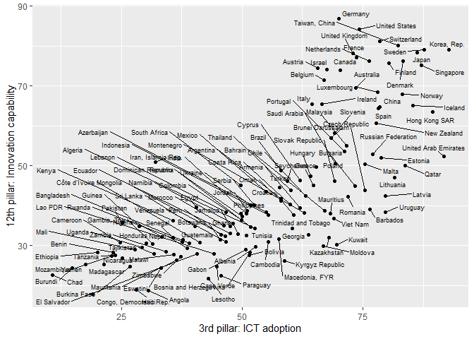

01 Limpieza y procesado de los datos del Índice de Commpetitividad
Global
================
Guillermo Bustos-Pérez
5/4/2020

# Índice de Competitividad Global. Introducción y tidy de los datos

 

## Introducción

El **Índice de Competitividad Global** es publicado anualmente por el
Foro Económico Mundial para evaluar la competitividad de los diferentes
países. Para cada país se evalúan 12 pilares. Para cada pilar se evalúan
una serie de sub-pilares y sus correspondientes indicadores. Los pilares
van desde el *Desempeño de las instituciones* (incluyendo como
indicadores la seguridad, independencia del poder judiacial, incidencia
del terrorismo, etc.) a la *Capacidad de innovación* (donde se evaluan
como indicadores la diversificación de los trabajadores, publicacines
científicas, patentes, etc.).  
Los Pilares, Sub-pilares e indicadores **están formualdos de forma
cuantitativa**.  
Los datos aquí empeados pueden accederse en formato .xlsx:  
<http://reports.weforum.org/global-competitiveness-report-2019/downloads/?doing_wp_cron=1586016888.5028719902038574218750>

## Limpieza y procesamiento de los datos para el análisis

Aunque el .xlsx proporcionado por el Foro Económico Mundial presenta un
buen aspecto, es necesario un procesado ya que **viola una buena
cantidad de los principios del data tidy** (Wickham, 2014). Por ejemplo,
la pertenencia de un “Sub-pillar” o un “Indicador” a determinado Pillar
no aparece como una columna aparte, sino insertado en la misma columna.

**En este apartado se muestra como corregir las violaciones del Data
Tidy usando R**. Fundamentalmente vamos a usar la biblioteca de
**tidyverse** que permite hacer filtrados y formateos rápidos de los
datos (Wickham et al., 2019) y el paquete **zoo** (Zeileis and
Grothendieck, 2005) que añade una serie de funciones que facilitan el
procesado de los datos.

Empezamos por cargar los datos. “Datos no disponibles”, “no aplicables”,
etc. aparecen bajo diferentes denominaciones. Con el siguiente código
son introducidos como Na’s:

``` r
# Leer los datos
Comp_2019 <- read_excel("Data/WEF_GCI_4.0_2019_Dataset.xlsx", 
                   sheet = "Data", skip = 3, 
                   na = c("n/a", "N/Appl.", "not assessed", "Not assessed"))
```

 

Ahora podemos ir a las columnas y variables que queremos: la edición
(2019), los atributos (“SCORE” y “VALUE”). La selección de estos dos
atributos es importante ya que varios pilares no se reportan bajo el
indicador SCORE, y en lugar de ello se emplea el indicador “VALUE”. Por
ejemplo, en el caso del *“Skillset of secondary-education graduates”* no
aparece reportado como SCORE, sino como VALUE. A su vez la mayoría de
las columnas de países en filas de VALUE aparecen vacías. **Lidiaremos
con este problema a continuación**.  
Pero antes también podemos aprovechar para librarnos de columnas que no
nos interesan o que son redundantes.

    ## Warning: package 'knitr' was built under R version 4.0.3

| Index                            | Edition | Series Global ID | Freeze date | Series name                      | Series units | Series order | Series code (if applicable) | Series type                        | Attribute        | Angola                                                                   | Albania                                                                  | United Arab Emirates                                                     | Argentina                                                                | Armenia                                                                  | Australia                                                                | Austria                                                                  | Azerbaijan                                                               | Burundi                                                                  | Belgium                                                                  | Benin                                                                    | Burkina Faso                                                             | Bangladesh                                                               | Bulgaria                                                                 | Bahrain                                                                  | Bosnia and Herzegovina                                                   | Bolivia                                                                  | Brazil                                                                   | Barbados                                                                 | Brunei Darussalam                                                        | Botswana                                                                 | Canada                                                                   | Switzerland                                                              | Chile                                                                    | China                                                                    | Côte d’Ivoire                                                            | Cameroon                                                                 | Congo, Democratic Rep.                                                   | Colombia                                                                 | Cape Verde                                                               | Costa Rica                                                               | Cyprus                                                                   | Czech Republic                                                           | Germany                                                                  | Denmark                                                                  | Dominican Republic                                                       | Algeria                                                                  | Ecuador                                                                  | Egypt                                                                    | Spain                                                                    | Estonia                                                                  | Ethiopia                                                                 | Finland                                                                  | France                                                                   | Gabon                                                                    | United Kingdom                                                           | Georgia                                                                  | Ghana                                                                    | Guinea                                                                   | Gambia, The                                                              | Greece                                                                   | Guatemala                                                                | Hong Kong SAR                                                            | Honduras                                                                 | Croatia                                                                  | Haiti                                                                    | Hungary                                                                  | Indonesia                                                                | India                                                                    | Ireland                                                                  | Iran, Islamic Rep.                                                       | Iceland                                                                  | Israel                                                                   | Italy                                                                    | Jamaica                                                                  | Jordan                                                                   | Japan                                                                    | Kazakhstan                                                               | Kenya                                                                    | Kyrgyz Republic                                                          | Cambodia                                                                 | Korea, Rep.                                                              | Kuwait                                                                   | Lao PDR                                                                  | Lebanon                                                                  | Sri Lanka                                                                | Lesotho                                                                  | Lithuania                                                                | Luxembourg                                                               | Latvia                                                                   | Morocco                                                                  | Moldova                                                                  | Madagascar                                                               | Mexico                                                                   | Macedonia, FYR                                                           | Mali                                                                     | Malta                                                                    | Montenegro                                                               | Mongolia                                                                 | Mozambique                                                               | Mauritania                                                               | Mauritius                                                                | Malawi                                                                   | Malaysia                                                                 | Namibia                                                                  | Nigeria                                                                  | Nicaragua                                                                | Netherlands                                                              | Norway                                                                   | Nepal                                                                    | New Zealand                                                              | Oman                                                                     | Pakistan                                                                 | Panama                                                                   | Peru                                                                     | Philippines                                                              | Poland                                                                   | Portugal                                                                 | Paraguay                                                                 | Qatar                                                                    | Romania                                                                  | Russian Federation                                                       | Rwanda                                                                   | Saudi Arabia                                                             | Senegal                                                                  | Singapore                                                                | El Salvador                                                              | Serbia                                                                   | Slovak Republic                                                          | Slovenia                                                                 | Sweden                                                                   | Eswatini                                                                 | Seychelles                                                               | Chad                                                                     | Thailand                                                                 | Tajikistan                                                               | Trinidad and Tobago                                                      | Tunisia                                                                  | Turkey                                                                   | Taiwan, China                                                            | Tanzania                                                                 | Uganda                                                                   | Ukraine                                                                  | Uruguay                                                                  | United States                                                            | Venezuela                                                                | Viet Nam                                                                 | Yemen                                                                    | South Africa                                                             | Zambia                                                                   | Zimbabwe                                                                 | Europe and North America                                                 | Middle East and North Africa                                             | Sub-Saharan Africa                                                       | Latin America and the Caribbean                                          | Eurasia                                                                  | East Asia and Pacific                                                    | South Asia                                                               | Low-income                                                               | Lower-middle-income                                                      | Upper-middle-income                                                      | High-income                                                              | Sample average                                                           |
| :------------------------------- | ------: | :--------------- | :---------- | :------------------------------- | :----------- | -----------: | :-------------------------- | :--------------------------------- | :--------------- | :----------------------------------------------------------------------- | :----------------------------------------------------------------------- | :----------------------------------------------------------------------- | :----------------------------------------------------------------------- | :----------------------------------------------------------------------- | :----------------------------------------------------------------------- | :----------------------------------------------------------------------- | :----------------------------------------------------------------------- | :----------------------------------------------------------------------- | :----------------------------------------------------------------------- | :----------------------------------------------------------------------- | :----------------------------------------------------------------------- | :----------------------------------------------------------------------- | :----------------------------------------------------------------------- | :----------------------------------------------------------------------- | :----------------------------------------------------------------------- | :----------------------------------------------------------------------- | :----------------------------------------------------------------------- | :----------------------------------------------------------------------- | :----------------------------------------------------------------------- | :----------------------------------------------------------------------- | :----------------------------------------------------------------------- | :----------------------------------------------------------------------- | :----------------------------------------------------------------------- | :----------------------------------------------------------------------- | :----------------------------------------------------------------------- | :----------------------------------------------------------------------- | :----------------------------------------------------------------------- | :----------------------------------------------------------------------- | :----------------------------------------------------------------------- | :----------------------------------------------------------------------- | :----------------------------------------------------------------------- | :----------------------------------------------------------------------- | :----------------------------------------------------------------------- | :----------------------------------------------------------------------- | :----------------------------------------------------------------------- | :----------------------------------------------------------------------- | :----------------------------------------------------------------------- | :----------------------------------------------------------------------- | :----------------------------------------------------------------------- | :----------------------------------------------------------------------- | :----------------------------------------------------------------------- | :----------------------------------------------------------------------- | :----------------------------------------------------------------------- | :----------------------------------------------------------------------- | :----------------------------------------------------------------------- | :----------------------------------------------------------------------- | :----------------------------------------------------------------------- | :----------------------------------------------------------------------- | :----------------------------------------------------------------------- | :----------------------------------------------------------------------- | :----------------------------------------------------------------------- | :----------------------------------------------------------------------- | :----------------------------------------------------------------------- | :----------------------------------------------------------------------- | :----------------------------------------------------------------------- | :----------------------------------------------------------------------- | :----------------------------------------------------------------------- | :----------------------------------------------------------------------- | :----------------------------------------------------------------------- | :----------------------------------------------------------------------- | :----------------------------------------------------------------------- | :----------------------------------------------------------------------- | :----------------------------------------------------------------------- | :----------------------------------------------------------------------- | :----------------------------------------------------------------------- | :----------------------------------------------------------------------- | :----------------------------------------------------------------------- | :----------------------------------------------------------------------- | :----------------------------------------------------------------------- | :----------------------------------------------------------------------- | :----------------------------------------------------------------------- | :----------------------------------------------------------------------- | :----------------------------------------------------------------------- | :----------------------------------------------------------------------- | :----------------------------------------------------------------------- | :----------------------------------------------------------------------- | :----------------------------------------------------------------------- | :----------------------------------------------------------------------- | :----------------------------------------------------------------------- | :----------------------------------------------------------------------- | :----------------------------------------------------------------------- | :----------------------------------------------------------------------- | :----------------------------------------------------------------------- | :----------------------------------------------------------------------- | :----------------------------------------------------------------------- | :----------------------------------------------------------------------- | :----------------------------------------------------------------------- | :----------------------------------------------------------------------- | :----------------------------------------------------------------------- | :----------------------------------------------------------------------- | :----------------------------------------------------------------------- | :----------------------------------------------------------------------- | :----------------------------------------------------------------------- | :----------------------------------------------------------------------- | :----------------------------------------------------------------------- | :----------------------------------------------------------------------- | :----------------------------------------------------------------------- | :----------------------------------------------------------------------- | :----------------------------------------------------------------------- | :----------------------------------------------------------------------- | :----------------------------------------------------------------------- | :----------------------------------------------------------------------- | :----------------------------------------------------------------------- | :----------------------------------------------------------------------- | :----------------------------------------------------------------------- | :----------------------------------------------------------------------- | :----------------------------------------------------------------------- | :----------------------------------------------------------------------- | :----------------------------------------------------------------------- | :----------------------------------------------------------------------- | :----------------------------------------------------------------------- | :----------------------------------------------------------------------- | :----------------------------------------------------------------------- | :----------------------------------------------------------------------- | :----------------------------------------------------------------------- | :----------------------------------------------------------------------- | :----------------------------------------------------------------------- | :----------------------------------------------------------------------- | :----------------------------------------------------------------------- | :----------------------------------------------------------------------- | :----------------------------------------------------------------------- | :----------------------------------------------------------------------- | :----------------------------------------------------------------------- | :----------------------------------------------------------------------- | :----------------------------------------------------------------------- | :----------------------------------------------------------------------- | :----------------------------------------------------------------------- | :----------------------------------------------------------------------- | :----------------------------------------------------------------------- | :----------------------------------------------------------------------- | :----------------------------------------------------------------------- | :----------------------------------------------------------------------- | :----------------------------------------------------------------------- | :----------------------------------------------------------------------- | :----------------------------------------------------------------------- | :----------------------------------------------------------------------- | :----------------------------------------------------------------------- | :----------------------------------------------------------------------- | :----------------------------------------------------------------------- | :----------------------------------------------------------------------- | :----------------------------------------------------------------------- | :----------------------------------------------------------------------- | :----------------------------------------------------------------------- | :----------------------------------------------------------------------- | :----------------------------------------------------------------------- | :----------------------------------------------------------------------- | :----------------------------------------------------------------------- | :----------------------------------------------------------------------- | :----------------------------------------------------------------------- | :----------------------------------------------------------------------- | :----------------------------------------------------------------------- | :----------------------------------------------------------------------- |
| Global Competitiveness Index 4.0 |    2019 | GCI4             | 2019-10-09  | Global Competitiveness Index 4.0 | 0–100        |            1 | NA                          | Index                              | VALUE            | NA                                                                       | NA                                                                       | NA                                                                       | NA                                                                       | NA                                                                       | NA                                                                       | NA                                                                       | NA                                                                       | NA                                                                       | NA                                                                       | NA                                                                       | NA                                                                       | NA                                                                       | NA                                                                       | NA                                                                       | NA                                                                       | NA                                                                       | NA                                                                       | NA                                                                       | NA                                                                       | NA                                                                       | NA                                                                       | NA                                                                       | NA                                                                       | NA                                                                       | NA                                                                       | NA                                                                       | NA                                                                       | NA                                                                       | NA                                                                       | NA                                                                       | NA                                                                       | NA                                                                       | NA                                                                       | NA                                                                       | NA                                                                       | NA                                                                       | NA                                                                       | NA                                                                       | NA                                                                       | NA                                                                       | NA                                                                       | NA                                                                       | NA                                                                       | NA                                                                       | NA                                                                       | NA                                                                       | NA                                                                       | NA                                                                       | NA                                                                       | NA                                                                       | NA                                                                       | NA                                                                       | NA                                                                       | NA                                                                       | NA                                                                       | NA                                                                       | NA                                                                       | NA                                                                       | NA                                                                       | NA                                                                       | NA                                                                       | NA                                                                       | NA                                                                       | NA                                                                       | NA                                                                       | NA                                                                       | NA                                                                       | NA                                                                       | NA                                                                       | NA                                                                       | NA                                                                       | NA                                                                       | NA                                                                       | NA                                                                       | NA                                                                       | NA                                                                       | NA                                                                       | NA                                                                       | NA                                                                       | NA                                                                       | NA                                                                       | NA                                                                       | NA                                                                       | NA                                                                       | NA                                                                       | NA                                                                       | NA                                                                       | NA                                                                       | NA                                                                       | NA                                                                       | NA                                                                       | NA                                                                       | NA                                                                       | NA                                                                       | NA                                                                       | NA                                                                       | NA                                                                       | NA                                                                       | NA                                                                       | NA                                                                       | NA                                                                       | NA                                                                       | NA                                                                       | NA                                                                       | NA                                                                       | NA                                                                       | NA                                                                       | NA                                                                       | NA                                                                       | NA                                                                       | NA                                                                       | NA                                                                       | NA                                                                       | NA                                                                       | NA                                                                       | NA                                                                       | NA                                                                       | NA                                                                       | NA                                                                       | NA                                                                       | NA                                                                       | NA                                                                       | NA                                                                       | NA                                                                       | NA                                                                       | NA                                                                       | NA                                                                       | NA                                                                       | NA                                                                       | NA                                                                       | NA                                                                       | NA                                                                       | NA                                                                       | NA                                                                       | NA                                                                       | NA                                                                       | NA                                                                       | NA                                                                       | NA                                                                       | NA                                                                       | NA                                                                       | NA                                                                       | NA                                                                       | NA                                                                       | NA                                                                       | NA                                                                       | NA                                                                       | NA                                                                       | NA                                                                       | NA                                                                       | NA                                                                       | NA                                                                       |
| Global Competitiveness Index 4.0 |    2019 | GCI4             | 2019-10-09  | Global Competitiveness Index 4.0 | 0–100        |            1 | NA                          | Index                              | RANK             | 136                                                                      | 81                                                                       | 25                                                                       | 83                                                                       | 69                                                                       | 16                                                                       | 21                                                                       | 58                                                                       | 135                                                                      | 22                                                                       | 125                                                                      | 130                                                                      | 105                                                                      | 49                                                                       | 45                                                                       | 92                                                                       | 107                                                                      | 71                                                                       | 77                                                                       | 56                                                                       | 91                                                                       | 14                                                                       | 5                                                                        | 33                                                                       | 28                                                                       | 118                                                                      | 123                                                                      | 139                                                                      | 57                                                                       | 112                                                                      | 62                                                                       | 44                                                                       | 32                                                                       | 7                                                                        | 10                                                                       | 78                                                                       | 89                                                                       | 90                                                                       | 93                                                                       | 23                                                                       | 31                                                                       | 126                                                                      | 11                                                                       | 15                                                                       | 119                                                                      | 9                                                                        | 74                                                                       | 111                                                                      | 122                                                                      | 124                                                                      | 59                                                                       | 98                                                                       | 3                                                                        | 101                                                                      | 63                                                                       | 138                                                                      | 47                                                                       | 50                                                                       | 68                                                                       | 24                                                                       | 99                                                                       | 26                                                                       | 20                                                                       | 30                                                                       | 80                                                                       | 70                                                                       | 6                                                                        | 55                                                                       | 95                                                                       | 96                                                                       | 106                                                                      | 13                                                                       | 46                                                                       | 113                                                                      | 88                                                                       | 84                                                                       | 131                                                                      | 39                                                                       | 18                                                                       | 41                                                                       | 75                                                                       | 86                                                                       | 132                                                                      | 48                                                                       | 82                                                                       | 129                                                                      | 38                                                                       | 73                                                                       | 102                                                                      | 137                                                                      | 134                                                                      | 52                                                                       | 128                                                                      | 27                                                                       | 94                                                                       | 116                                                                      | 109                                                                      | 4                                                                        | 17                                                                       | 108                                                                      | 19                                                                       | 53                                                                       | 110                                                                      | 66                                                                       | 65                                                                       | 64                                                                       | 37                                                                       | 34                                                                       | 97                                                                       | 29                                                                       | 51                                                                       | 43                                                                       | 100                                                                      | 36                                                                       | 114                                                                      | 1                                                                        | 103                                                                      | 72                                                                       | 42                                                                       | 35                                                                       | 8                                                                        | 121                                                                      | 76                                                                       | 141                                                                      | 40                                                                       | 104                                                                      | 79                                                                       | 87                                                                       | 61                                                                       | 12                                                                       | 117                                                                      | 115                                                                      | 85                                                                       | 54                                                                       | 2                                                                        | 133                                                                      | 67                                                                       | 140                                                                      | 60                                                                       | 120                                                                      | 127                                                                      | NA                                                                       | NA                                                                       | NA                                                                       | NA                                                                       | NA                                                                       | NA                                                                       | NA                                                                       | NA                                                                       | NA                                                                       | NA                                                                       | NA                                                                       | 0                                                                        |
| Global Competitiveness Index 4.0 |    2019 | GCI4             | 2019-10-09  | Global Competitiveness Index 4.0 | 0–100        |            1 | NA                          | Index                              | SCORE            | 38.112485933497517                                                       | 57.614168809961008                                                       | 75.007387935125891                                                       | 57.201328590338854                                                       | 61.276876426106803                                                       | 78.746626369053246                                                       | 76.609130871500028                                                       | 62.717893484981403                                                       | 40.252341306975829                                                       | 76.380122489671905                                                       | 45.823742150174262                                                       | 43.420196096979907                                                       | 52.122987825715995                                                       | 64.895010704053092                                                       | 65.378869482421251                                                       | 54.730277528940746                                                       | 51.800490834159739                                                       | 60.929467716455093                                                       | 58.904556886850877                                                       | 62.759318641055238                                                       | 55.494816335001154                                                       | 79.591344422924564                                                       | 82.325118230896251                                                       | 70.538349328429618                                                       | 73.901117221553235                                                       | 48.14533754398564                                                        | 46.01813781417065                                                        | 36.139543829699981                                                       | 62.731612614114049                                                       | 50.833719430942658                                                       | 62.005614515710846                                                       | 66.385446186917733                                                       | 70.852799344509165                                                       | 81.796537186430086                                                       | 81.1748978937743                                                         | 58.311232963951632                                                       | 56.253890341836353                                                       | 55.736410821283584                                                       | 54.542989635032228                                                       | 75.279405367917732                                                       | 70.907139971821067                                                       | 44.373834551305201                                                       | 80.245629723847017                                                       | 78.806239709774005                                                       | 47.461359750099682                                                       | 81.203564794450756                                                       | 60.612589873117962                                                       | 51.196110190622932                                                       | 46.133676356927339                                                       | 45.920722499180194                                                       | 62.580730116847199                                                       | 53.515649983401964                                                       | 83.14202499752372                                                        | 52.62607622183009                                                        | 61.938130618644571                                                       | 36.344445976979991                                                       | 65.075070770905398                                                       | 64.629133500694948                                                       | 61.363652102513356                                                       | 75.116213405694396                                                       | 52.965924687079784                                                       | 74.716625509555556                                                       | 76.743907428976812                                                       | 71.528281474875214                                                       | 58.254090992113021                                                       | 60.93876866687657                                                        | 82.271218450366362                                                       | 62.941706510177589                                                       | 54.144614113136889                                                       | 53.996366148705903                                                       | 52.081076307522757                                                       | 79.619016928186028                                                       | 65.104963064253553                                                       | 50.10300304135837                                                        | 56.289842444599437                                                       | 57.105743249927343                                                       | 42.904392364198394                                                       | 68.351612747166584                                                       | 77.028126053056312                                                       | 66.980443540495557                                                       | 60.008944187391315                                                       | 56.747741463830401                                                       | 42.859024783758336                                                       | 64.945210877154267                                                       | 57.325951145210155                                                       | 43.591662065575605                                                       | 68.546119141716872                                                       | 60.82155617544413                                                        | 52.61460104532852                                                        | 38.078534833998347                                                       | 40.919481377328111                                                       | 64.269953979269189                                                       | 43.701759024455193                                                       | 74.601613008841028                                                       | 54.462115383146703                                                       | 48.327934902715725                                                       | 51.521346816614134                                                       | 82.392170207062904                                                       | 78.054864053103813                                                       | 51.572447694339139                                                       | 76.747743980477722                                                       | 63.606281348723023                                                       | 51.358194523489594                                                       | 61.638754318062858                                                       | 61.663871996470135                                                       | 61.869420784685474                                                       | 68.893311510009156                                                       | 70.447520244448242                                                       | 53.633741611813925                                                       | 72.869271347464363                                                       | 64.35562052951677                                                        | 66.736701626936366                                                       | 52.820806434602126                                                       | 70.027012025511027                                                       | 49.68537205040095                                                        | 84.783816847655402                                                       | 52.572013068328801                                                       | 60.851447070141539                                                       | 66.772277033228463                                                       | 70.200786496525268                                                       | 81.247187757485108                                                       | 46.433166861023743                                                       | 59.599386880212812                                                       | 35.084570651938918                                                       | 68.112417148359455                                                       | 52.395207538681724                                                       | 58.304726522807094                                                       | 56.409734703965903                                                       | 62.136214487294552                                                       | 80.241038356745207                                                       | 48.19115218819119                                                        | 48.9396769822593                                                         | 56.992174852493235                                                       | 63.467666057013723                                                       | 83.673315719829688                                                       | 41.829061221784528                                                       | 61.543466769179027                                                       | 35.503114440047092                                                       | 62.435857986702338                                                       | 46.513941409992555                                                       | 44.243430926106548                                                       | 71.226420744760176                                                       | 61.443393449286965                                                       | 47.250966440840472                                                       | 56.748896360712223                                                       | 59.379695325003496                                                       | 69.868626670505051                                                       | 54.704605079197087                                                       | 43.744550495056295                                                       | 51.94942308596756                                                        | 59.791229696835956                                                       | 72.780809611384626                                                       | 60.639693804459569                                                       |
| Global Competitiveness Index 4.0 |    2019 | GCI4             | 2019-10-09  | Global Competitiveness Index 4.0 | 0–100        |            1 | NA                          | Index                              | DATE DESCRIPTION | 2019 edition                                                             | 2019 edition                                                             | 2019 edition                                                             | 2019 edition                                                             | 2019 edition                                                             | 2019 edition                                                             | 2019 edition                                                             | 2019 edition                                                             | 2019 edition                                                             | 2019 edition                                                             | 2019 edition                                                             | 2019 edition                                                             | 2019 edition                                                             | 2019 edition                                                             | 2019 edition                                                             | 2019 edition                                                             | 2019 edition                                                             | 2019 edition                                                             | 2019 edition                                                             | 2019 edition                                                             | 2019 edition                                                             | 2019 edition                                                             | 2019 edition                                                             | 2019 edition                                                             | 2019 edition                                                             | 2019 edition                                                             | 2019 edition                                                             | 2019 edition                                                             | 2019 edition                                                             | 2019 edition                                                             | 2019 edition                                                             | 2019 edition                                                             | 2019 edition                                                             | 2019 edition                                                             | 2019 edition                                                             | 2019 edition                                                             | 2019 edition                                                             | 2019 edition                                                             | 2019 edition                                                             | 2019 edition                                                             | 2019 edition                                                             | 2019 edition                                                             | 2019 edition                                                             | 2019 edition                                                             | 2019 edition                                                             | 2019 edition                                                             | 2019 edition                                                             | 2019 edition                                                             | 2019 edition                                                             | 2019 edition                                                             | 2019 edition                                                             | 2019 edition                                                             | 2019 edition                                                             | 2019 edition                                                             | 2019 edition                                                             | 2019 edition                                                             | 2019 edition                                                             | 2019 edition                                                             | 2019 edition                                                             | 2019 edition                                                             | 2019 edition                                                             | 2019 edition                                                             | 2019 edition                                                             | 2019 edition                                                             | 2019 edition                                                             | 2019 edition                                                             | 2019 edition                                                             | 2019 edition                                                             | 2019 edition                                                             | 2019 edition                                                             | 2019 edition                                                             | 2019 edition                                                             | 2019 edition                                                             | 2019 edition                                                             | 2019 edition                                                             | 2019 edition                                                             | 2019 edition                                                             | 2019 edition                                                             | 2019 edition                                                             | 2019 edition                                                             | 2019 edition                                                             | 2019 edition                                                             | 2019 edition                                                             | 2019 edition                                                             | 2019 edition                                                             | 2019 edition                                                             | 2019 edition                                                             | 2019 edition                                                             | 2019 edition                                                             | 2019 edition                                                             | 2019 edition                                                             | 2019 edition                                                             | 2019 edition                                                             | 2019 edition                                                             | 2019 edition                                                             | 2019 edition                                                             | 2019 edition                                                             | 2019 edition                                                             | 2019 edition                                                             | 2019 edition                                                             | 2019 edition                                                             | 2019 edition                                                             | 2019 edition                                                             | 2019 edition                                                             | 2019 edition                                                             | 2019 edition                                                             | 2019 edition                                                             | 2019 edition                                                             | 2019 edition                                                             | 2019 edition                                                             | 2019 edition                                                             | 2019 edition                                                             | 2019 edition                                                             | 2019 edition                                                             | 2019 edition                                                             | 2019 edition                                                             | 2019 edition                                                             | 2019 edition                                                             | 2019 edition                                                             | 2019 edition                                                             | 2019 edition                                                             | 2019 edition                                                             | 2019 edition                                                             | 2019 edition                                                             | 2019 edition                                                             | 2019 edition                                                             | 2019 edition                                                             | 2019 edition                                                             | 2019 edition                                                             | 2019 edition                                                             | 2019 edition                                                             | 2019 edition                                                             | 2019 edition                                                             | 2019 edition                                                             | 2019 edition                                                             | 2019 edition                                                             | 2019 edition                                                             | 2019 edition                                                             | 2019 edition                                                             | 2019 edition                                                             | 2019 edition                                                             | 2019 edition                                                             | 2019 edition                                                             | 2019 edition                                                             | 2019 edition                                                             | 2019 edition                                                             | 2019 edition                                                             | 2019 edition                                                             | 2019 edition                                                             | 2019 edition                                                             | 2019 edition                                                             | 2019 edition                                                             | 2019 edition                                                             |
| Global Competitiveness Index 4.0 |    2019 | GCI4             | 2019-10-09  | Global Competitiveness Index 4.0 | 0–100        |            1 | NA                          | Index                              | SOURCE           | World Economic Forum, \[i\]Global Competitiveness Report 2019\[i\]       | World Economic Forum, \[i\]Global Competitiveness Report 2019\[i\]       | World Economic Forum, \[i\]Global Competitiveness Report 2019\[i\]       | World Economic Forum, \[i\]Global Competitiveness Report 2019\[i\]       | World Economic Forum, \[i\]Global Competitiveness Report 2019\[i\]       | World Economic Forum, \[i\]Global Competitiveness Report 2019\[i\]       | World Economic Forum, \[i\]Global Competitiveness Report 2019\[i\]       | World Economic Forum, \[i\]Global Competitiveness Report 2019\[i\]       | World Economic Forum, \[i\]Global Competitiveness Report 2019\[i\]       | World Economic Forum, \[i\]Global Competitiveness Report 2019\[i\]       | World Economic Forum, \[i\]Global Competitiveness Report 2019\[i\]       | World Economic Forum, \[i\]Global Competitiveness Report 2019\[i\]       | World Economic Forum, \[i\]Global Competitiveness Report 2019\[i\]       | World Economic Forum, \[i\]Global Competitiveness Report 2019\[i\]       | World Economic Forum, \[i\]Global Competitiveness Report 2019\[i\]       | World Economic Forum, \[i\]Global Competitiveness Report 2019\[i\]       | World Economic Forum, \[i\]Global Competitiveness Report 2019\[i\]       | World Economic Forum, \[i\]Global Competitiveness Report 2019\[i\]       | World Economic Forum, \[i\]Global Competitiveness Report 2019\[i\]       | World Economic Forum, \[i\]Global Competitiveness Report 2019\[i\]       | World Economic Forum, \[i\]Global Competitiveness Report 2019\[i\]       | World Economic Forum, \[i\]Global Competitiveness Report 2019\[i\]       | World Economic Forum, \[i\]Global Competitiveness Report 2019\[i\]       | World Economic Forum, \[i\]Global Competitiveness Report 2019\[i\]       | World Economic Forum, \[i\]Global Competitiveness Report 2019\[i\]       | World Economic Forum, \[i\]Global Competitiveness Report 2019\[i\]       | World Economic Forum, \[i\]Global Competitiveness Report 2019\[i\]       | World Economic Forum, \[i\]Global Competitiveness Report 2019\[i\]       | World Economic Forum, \[i\]Global Competitiveness Report 2019\[i\]       | World Economic Forum, \[i\]Global Competitiveness Report 2019\[i\]       | World Economic Forum, \[i\]Global Competitiveness Report 2019\[i\]       | World Economic Forum, \[i\]Global Competitiveness Report 2019\[i\]       | World Economic Forum, \[i\]Global Competitiveness Report 2019\[i\]       | World Economic Forum, \[i\]Global Competitiveness Report 2019\[i\]       | World Economic Forum, \[i\]Global Competitiveness Report 2019\[i\]       | World Economic Forum, \[i\]Global Competitiveness Report 2019\[i\]       | World Economic Forum, \[i\]Global Competitiveness Report 2019\[i\]       | World Economic Forum, \[i\]Global Competitiveness Report 2019\[i\]       | World Economic Forum, \[i\]Global Competitiveness Report 2019\[i\]       | World Economic Forum, \[i\]Global Competitiveness Report 2019\[i\]       | World Economic Forum, \[i\]Global Competitiveness Report 2019\[i\]       | World Economic Forum, \[i\]Global Competitiveness Report 2019\[i\]       | World Economic Forum, \[i\]Global Competitiveness Report 2019\[i\]       | World Economic Forum, \[i\]Global Competitiveness Report 2019\[i\]       | World Economic Forum, \[i\]Global Competitiveness Report 2019\[i\]       | World Economic Forum, \[i\]Global Competitiveness Report 2019\[i\]       | World Economic Forum, \[i\]Global Competitiveness Report 2019\[i\]       | World Economic Forum, \[i\]Global Competitiveness Report 2019\[i\]       | World Economic Forum, \[i\]Global Competitiveness Report 2019\[i\]       | World Economic Forum, \[i\]Global Competitiveness Report 2019\[i\]       | World Economic Forum, \[i\]Global Competitiveness Report 2019\[i\]       | World Economic Forum, \[i\]Global Competitiveness Report 2019\[i\]       | World Economic Forum, \[i\]Global Competitiveness Report 2019\[i\]       | World Economic Forum, \[i\]Global Competitiveness Report 2019\[i\]       | World Economic Forum, \[i\]Global Competitiveness Report 2019\[i\]       | World Economic Forum, \[i\]Global Competitiveness Report 2019\[i\]       | World Economic Forum, \[i\]Global Competitiveness Report 2019\[i\]       | World Economic Forum, \[i\]Global Competitiveness Report 2019\[i\]       | World Economic Forum, \[i\]Global Competitiveness Report 2019\[i\]       | World Economic Forum, \[i\]Global Competitiveness Report 2019\[i\]       | World Economic Forum, \[i\]Global Competitiveness Report 2019\[i\]       | World Economic Forum, \[i\]Global Competitiveness Report 2019\[i\]       | World Economic Forum, \[i\]Global Competitiveness Report 2019\[i\]       | World Economic Forum, \[i\]Global Competitiveness Report 2019\[i\]       | World Economic Forum, \[i\]Global Competitiveness Report 2019\[i\]       | World Economic Forum, \[i\]Global Competitiveness Report 2019\[i\]       | World Economic Forum, \[i\]Global Competitiveness Report 2019\[i\]       | World Economic Forum, \[i\]Global Competitiveness Report 2019\[i\]       | World Economic Forum, \[i\]Global Competitiveness Report 2019\[i\]       | World Economic Forum, \[i\]Global Competitiveness Report 2019\[i\]       | World Economic Forum, \[i\]Global Competitiveness Report 2019\[i\]       | World Economic Forum, \[i\]Global Competitiveness Report 2019\[i\]       | World Economic Forum, \[i\]Global Competitiveness Report 2019\[i\]       | World Economic Forum, \[i\]Global Competitiveness Report 2019\[i\]       | World Economic Forum, \[i\]Global Competitiveness Report 2019\[i\]       | World Economic Forum, \[i\]Global Competitiveness Report 2019\[i\]       | World Economic Forum, \[i\]Global Competitiveness Report 2019\[i\]       | World Economic Forum, \[i\]Global Competitiveness Report 2019\[i\]       | World Economic Forum, \[i\]Global Competitiveness Report 2019\[i\]       | World Economic Forum, \[i\]Global Competitiveness Report 2019\[i\]       | World Economic Forum, \[i\]Global Competitiveness Report 2019\[i\]       | World Economic Forum, \[i\]Global Competitiveness Report 2019\[i\]       | World Economic Forum, \[i\]Global Competitiveness Report 2019\[i\]       | World Economic Forum, \[i\]Global Competitiveness Report 2019\[i\]       | World Economic Forum, \[i\]Global Competitiveness Report 2019\[i\]       | World Economic Forum, \[i\]Global Competitiveness Report 2019\[i\]       | World Economic Forum, \[i\]Global Competitiveness Report 2019\[i\]       | World Economic Forum, \[i\]Global Competitiveness Report 2019\[i\]       | World Economic Forum, \[i\]Global Competitiveness Report 2019\[i\]       | World Economic Forum, \[i\]Global Competitiveness Report 2019\[i\]       | World Economic Forum, \[i\]Global Competitiveness Report 2019\[i\]       | World Economic Forum, \[i\]Global Competitiveness Report 2019\[i\]       | World Economic Forum, \[i\]Global Competitiveness Report 2019\[i\]       | World Economic Forum, \[i\]Global Competitiveness Report 2019\[i\]       | World Economic Forum, \[i\]Global Competitiveness Report 2019\[i\]       | World Economic Forum, \[i\]Global Competitiveness Report 2019\[i\]       | World Economic Forum, \[i\]Global Competitiveness Report 2019\[i\]       | World Economic Forum, \[i\]Global Competitiveness Report 2019\[i\]       | World Economic Forum, \[i\]Global Competitiveness Report 2019\[i\]       | World Economic Forum, \[i\]Global Competitiveness Report 2019\[i\]       | World Economic Forum, \[i\]Global Competitiveness Report 2019\[i\]       | World Economic Forum, \[i\]Global Competitiveness Report 2019\[i\]       | World Economic Forum, \[i\]Global Competitiveness Report 2019\[i\]       | World Economic Forum, \[i\]Global Competitiveness Report 2019\[i\]       | World Economic Forum, \[i\]Global Competitiveness Report 2019\[i\]       | World Economic Forum, \[i\]Global Competitiveness Report 2019\[i\]       | World Economic Forum, \[i\]Global Competitiveness Report 2019\[i\]       | World Economic Forum, \[i\]Global Competitiveness Report 2019\[i\]       | World Economic Forum, \[i\]Global Competitiveness Report 2019\[i\]       | World Economic Forum, \[i\]Global Competitiveness Report 2019\[i\]       | World Economic Forum, \[i\]Global Competitiveness Report 2019\[i\]       | World Economic Forum, \[i\]Global Competitiveness Report 2019\[i\]       | World Economic Forum, \[i\]Global Competitiveness Report 2019\[i\]       | World Economic Forum, \[i\]Global Competitiveness Report 2019\[i\]       | World Economic Forum, \[i\]Global Competitiveness Report 2019\[i\]       | World Economic Forum, \[i\]Global Competitiveness Report 2019\[i\]       | World Economic Forum, \[i\]Global Competitiveness Report 2019\[i\]       | World Economic Forum, \[i\]Global Competitiveness Report 2019\[i\]       | World Economic Forum, \[i\]Global Competitiveness Report 2019\[i\]       | World Economic Forum, \[i\]Global Competitiveness Report 2019\[i\]       | World Economic Forum, \[i\]Global Competitiveness Report 2019\[i\]       | World Economic Forum, \[i\]Global Competitiveness Report 2019\[i\]       | World Economic Forum, \[i\]Global Competitiveness Report 2019\[i\]       | World Economic Forum, \[i\]Global Competitiveness Report 2019\[i\]       | World Economic Forum, \[i\]Global Competitiveness Report 2019\[i\]       | World Economic Forum, \[i\]Global Competitiveness Report 2019\[i\]       | World Economic Forum, \[i\]Global Competitiveness Report 2019\[i\]       | World Economic Forum, \[i\]Global Competitiveness Report 2019\[i\]       | World Economic Forum, \[i\]Global Competitiveness Report 2019\[i\]       | World Economic Forum, \[i\]Global Competitiveness Report 2019\[i\]       | World Economic Forum, \[i\]Global Competitiveness Report 2019\[i\]       | World Economic Forum, \[i\]Global Competitiveness Report 2019\[i\]       | World Economic Forum, \[i\]Global Competitiveness Report 2019\[i\]       | World Economic Forum, \[i\]Global Competitiveness Report 2019\[i\]       | World Economic Forum, \[i\]Global Competitiveness Report 2019\[i\]       | World Economic Forum, \[i\]Global Competitiveness Report 2019\[i\]       | World Economic Forum, \[i\]Global Competitiveness Report 2019\[i\]       | World Economic Forum, \[i\]Global Competitiveness Report 2019\[i\]       | World Economic Forum, \[i\]Global Competitiveness Report 2019\[i\]       | World Economic Forum, \[i\]Global Competitiveness Report 2019\[i\]       | World Economic Forum, \[i\]Global Competitiveness Report 2019\[i\]       | World Economic Forum, \[i\]Global Competitiveness Report 2019\[i\]       | World Economic Forum, \[i\]Global Competitiveness Report 2019\[i\]       | World Economic Forum, \[i\]Global Competitiveness Report 2019\[i\]       | World Economic Forum, \[i\]Global Competitiveness Report 2019\[i\]       | World Economic Forum, \[i\]Global Competitiveness Report 2019\[i\]       | World Economic Forum, \[i\]Global Competitiveness Report 2019\[i\]       | World Economic Forum, \[i\]Global Competitiveness Report 2019\[i\]       | World Economic Forum, \[i\]Global Competitiveness Report 2019\[i\]       | World Economic Forum, \[i\]Global Competitiveness Report 2019\[i\]       | World Economic Forum, \[i\]Global Competitiveness Report 2019\[i\]       | World Economic Forum, \[i\]Global Competitiveness Report 2019\[i\]       | World Economic Forum, \[i\]Global Competitiveness Report 2019\[i\]       |
| Global Competitiveness Index 4.0 |    2019 | GCI4             | 2019-10-09  | Global Competitiveness Index 4.0 | 0–100        |            1 | NA                          | Index                              | SOURCE DATE      | NA                                                                       | NA                                                                       | NA                                                                       | NA                                                                       | NA                                                                       | NA                                                                       | NA                                                                       | NA                                                                       | NA                                                                       | NA                                                                       | NA                                                                       | NA                                                                       | NA                                                                       | NA                                                                       | NA                                                                       | NA                                                                       | NA                                                                       | NA                                                                       | NA                                                                       | NA                                                                       | NA                                                                       | NA                                                                       | NA                                                                       | NA                                                                       | NA                                                                       | NA                                                                       | NA                                                                       | NA                                                                       | NA                                                                       | NA                                                                       | NA                                                                       | NA                                                                       | NA                                                                       | NA                                                                       | NA                                                                       | NA                                                                       | NA                                                                       | NA                                                                       | NA                                                                       | NA                                                                       | NA                                                                       | NA                                                                       | NA                                                                       | NA                                                                       | NA                                                                       | NA                                                                       | NA                                                                       | NA                                                                       | NA                                                                       | NA                                                                       | NA                                                                       | NA                                                                       | NA                                                                       | NA                                                                       | NA                                                                       | NA                                                                       | NA                                                                       | NA                                                                       | NA                                                                       | NA                                                                       | NA                                                                       | NA                                                                       | NA                                                                       | NA                                                                       | NA                                                                       | NA                                                                       | NA                                                                       | NA                                                                       | NA                                                                       | NA                                                                       | NA                                                                       | NA                                                                       | NA                                                                       | NA                                                                       | NA                                                                       | NA                                                                       | NA                                                                       | NA                                                                       | NA                                                                       | NA                                                                       | NA                                                                       | NA                                                                       | NA                                                                       | NA                                                                       | NA                                                                       | NA                                                                       | NA                                                                       | NA                                                                       | NA                                                                       | NA                                                                       | NA                                                                       | NA                                                                       | NA                                                                       | NA                                                                       | NA                                                                       | NA                                                                       | NA                                                                       | NA                                                                       | NA                                                                       | NA                                                                       | NA                                                                       | NA                                                                       | NA                                                                       | NA                                                                       | NA                                                                       | NA                                                                       | NA                                                                       | NA                                                                       | NA                                                                       | NA                                                                       | NA                                                                       | NA                                                                       | NA                                                                       | NA                                                                       | NA                                                                       | NA                                                                       | NA                                                                       | NA                                                                       | NA                                                                       | NA                                                                       | NA                                                                       | NA                                                                       | NA                                                                       | NA                                                                       | NA                                                                       | NA                                                                       | NA                                                                       | NA                                                                       | NA                                                                       | NA                                                                       | NA                                                                       | NA                                                                       | NA                                                                       | NA                                                                       | NA                                                                       | NA                                                                       | NA                                                                       | NA                                                                       | NA                                                                       | NA                                                                       | NA                                                                       | NA                                                                       | NA                                                                       | NA                                                                       | NA                                                                       | NA                                                                       | NA                                                                       | NA                                                                       | NA                                                                       | NA                                                                       | NA                                                                       | NA                                                                       | NA                                                                       |
| Global Competitiveness Index 4.0 |    2019 | GCI4             | 2019-10-09  | Global Competitiveness Index 4.0 | 0–100        |            1 | NA                          | Index                              | NOTE             | See Appendix A of the Global Competitiveness Report 2019 for methodology | See Appendix A of the Global Competitiveness Report 2019 for methodology | See Appendix A of the Global Competitiveness Report 2019 for methodology | See Appendix A of the Global Competitiveness Report 2019 for methodology | See Appendix A of the Global Competitiveness Report 2019 for methodology | See Appendix A of the Global Competitiveness Report 2019 for methodology | See Appendix A of the Global Competitiveness Report 2019 for methodology | See Appendix A of the Global Competitiveness Report 2019 for methodology | See Appendix A of the Global Competitiveness Report 2019 for methodology | See Appendix A of the Global Competitiveness Report 2019 for methodology | See Appendix A of the Global Competitiveness Report 2019 for methodology | See Appendix A of the Global Competitiveness Report 2019 for methodology | See Appendix A of the Global Competitiveness Report 2019 for methodology | See Appendix A of the Global Competitiveness Report 2019 for methodology | See Appendix A of the Global Competitiveness Report 2019 for methodology | See Appendix A of the Global Competitiveness Report 2019 for methodology | See Appendix A of the Global Competitiveness Report 2019 for methodology | See Appendix A of the Global Competitiveness Report 2019 for methodology | See Appendix A of the Global Competitiveness Report 2019 for methodology | See Appendix A of the Global Competitiveness Report 2019 for methodology | See Appendix A of the Global Competitiveness Report 2019 for methodology | See Appendix A of the Global Competitiveness Report 2019 for methodology | See Appendix A of the Global Competitiveness Report 2019 for methodology | See Appendix A of the Global Competitiveness Report 2019 for methodology | See Appendix A of the Global Competitiveness Report 2019 for methodology | See Appendix A of the Global Competitiveness Report 2019 for methodology | See Appendix A of the Global Competitiveness Report 2019 for methodology | See Appendix A of the Global Competitiveness Report 2019 for methodology | See Appendix A of the Global Competitiveness Report 2019 for methodology | See Appendix A of the Global Competitiveness Report 2019 for methodology | See Appendix A of the Global Competitiveness Report 2019 for methodology | See Appendix A of the Global Competitiveness Report 2019 for methodology | See Appendix A of the Global Competitiveness Report 2019 for methodology | See Appendix A of the Global Competitiveness Report 2019 for methodology | See Appendix A of the Global Competitiveness Report 2019 for methodology | See Appendix A of the Global Competitiveness Report 2019 for methodology | See Appendix A of the Global Competitiveness Report 2019 for methodology | See Appendix A of the Global Competitiveness Report 2019 for methodology | See Appendix A of the Global Competitiveness Report 2019 for methodology | See Appendix A of the Global Competitiveness Report 2019 for methodology | See Appendix A of the Global Competitiveness Report 2019 for methodology | See Appendix A of the Global Competitiveness Report 2019 for methodology | See Appendix A of the Global Competitiveness Report 2019 for methodology | See Appendix A of the Global Competitiveness Report 2019 for methodology | See Appendix A of the Global Competitiveness Report 2019 for methodology | See Appendix A of the Global Competitiveness Report 2019 for methodology | See Appendix A of the Global Competitiveness Report 2019 for methodology | See Appendix A of the Global Competitiveness Report 2019 for methodology | See Appendix A of the Global Competitiveness Report 2019 for methodology | See Appendix A of the Global Competitiveness Report 2019 for methodology | See Appendix A of the Global Competitiveness Report 2019 for methodology | See Appendix A of the Global Competitiveness Report 2019 for methodology | See Appendix A of the Global Competitiveness Report 2019 for methodology | See Appendix A of the Global Competitiveness Report 2019 for methodology | See Appendix A of the Global Competitiveness Report 2019 for methodology | See Appendix A of the Global Competitiveness Report 2019 for methodology | See Appendix A of the Global Competitiveness Report 2019 for methodology | See Appendix A of the Global Competitiveness Report 2019 for methodology | See Appendix A of the Global Competitiveness Report 2019 for methodology | See Appendix A of the Global Competitiveness Report 2019 for methodology | See Appendix A of the Global Competitiveness Report 2019 for methodology | See Appendix A of the Global Competitiveness Report 2019 for methodology | See Appendix A of the Global Competitiveness Report 2019 for methodology | See Appendix A of the Global Competitiveness Report 2019 for methodology | See Appendix A of the Global Competitiveness Report 2019 for methodology | See Appendix A of the Global Competitiveness Report 2019 for methodology | See Appendix A of the Global Competitiveness Report 2019 for methodology | See Appendix A of the Global Competitiveness Report 2019 for methodology | See Appendix A of the Global Competitiveness Report 2019 for methodology | See Appendix A of the Global Competitiveness Report 2019 for methodology | See Appendix A of the Global Competitiveness Report 2019 for methodology | See Appendix A of the Global Competitiveness Report 2019 for methodology | See Appendix A of the Global Competitiveness Report 2019 for methodology | See Appendix A of the Global Competitiveness Report 2019 for methodology | See Appendix A of the Global Competitiveness Report 2019 for methodology | See Appendix A of the Global Competitiveness Report 2019 for methodology | See Appendix A of the Global Competitiveness Report 2019 for methodology | See Appendix A of the Global Competitiveness Report 2019 for methodology | See Appendix A of the Global Competitiveness Report 2019 for methodology | See Appendix A of the Global Competitiveness Report 2019 for methodology | See Appendix A of the Global Competitiveness Report 2019 for methodology | See Appendix A of the Global Competitiveness Report 2019 for methodology | See Appendix A of the Global Competitiveness Report 2019 for methodology | See Appendix A of the Global Competitiveness Report 2019 for methodology | See Appendix A of the Global Competitiveness Report 2019 for methodology | See Appendix A of the Global Competitiveness Report 2019 for methodology | See Appendix A of the Global Competitiveness Report 2019 for methodology | See Appendix A of the Global Competitiveness Report 2019 for methodology | See Appendix A of the Global Competitiveness Report 2019 for methodology | See Appendix A of the Global Competitiveness Report 2019 for methodology | See Appendix A of the Global Competitiveness Report 2019 for methodology | See Appendix A of the Global Competitiveness Report 2019 for methodology | See Appendix A of the Global Competitiveness Report 2019 for methodology | See Appendix A of the Global Competitiveness Report 2019 for methodology | See Appendix A of the Global Competitiveness Report 2019 for methodology | See Appendix A of the Global Competitiveness Report 2019 for methodology | See Appendix A of the Global Competitiveness Report 2019 for methodology | See Appendix A of the Global Competitiveness Report 2019 for methodology | See Appendix A of the Global Competitiveness Report 2019 for methodology | See Appendix A of the Global Competitiveness Report 2019 for methodology | See Appendix A of the Global Competitiveness Report 2019 for methodology | See Appendix A of the Global Competitiveness Report 2019 for methodology | See Appendix A of the Global Competitiveness Report 2019 for methodology | See Appendix A of the Global Competitiveness Report 2019 for methodology | See Appendix A of the Global Competitiveness Report 2019 for methodology | See Appendix A of the Global Competitiveness Report 2019 for methodology | See Appendix A of the Global Competitiveness Report 2019 for methodology | See Appendix A of the Global Competitiveness Report 2019 for methodology | See Appendix A of the Global Competitiveness Report 2019 for methodology | See Appendix A of the Global Competitiveness Report 2019 for methodology | See Appendix A of the Global Competitiveness Report 2019 for methodology | See Appendix A of the Global Competitiveness Report 2019 for methodology | See Appendix A of the Global Competitiveness Report 2019 for methodology | See Appendix A of the Global Competitiveness Report 2019 for methodology | See Appendix A of the Global Competitiveness Report 2019 for methodology | See Appendix A of the Global Competitiveness Report 2019 for methodology | See Appendix A of the Global Competitiveness Report 2019 for methodology | See Appendix A of the Global Competitiveness Report 2019 for methodology | See Appendix A of the Global Competitiveness Report 2019 for methodology | See Appendix A of the Global Competitiveness Report 2019 for methodology | See Appendix A of the Global Competitiveness Report 2019 for methodology | See Appendix A of the Global Competitiveness Report 2019 for methodology | See Appendix A of the Global Competitiveness Report 2019 for methodology | See Appendix A of the Global Competitiveness Report 2019 for methodology | See Appendix A of the Global Competitiveness Report 2019 for methodology | See Appendix A of the Global Competitiveness Report 2019 for methodology | See Appendix A of the Global Competitiveness Report 2019 for methodology | See Appendix A of the Global Competitiveness Report 2019 for methodology | See Appendix A of the Global Competitiveness Report 2019 for methodology | See Appendix A of the Global Competitiveness Report 2019 for methodology | See Appendix A of the Global Competitiveness Report 2019 for methodology | See Appendix A of the Global Competitiveness Report 2019 for methodology | See Appendix A of the Global Competitiveness Report 2019 for methodology | See Appendix A of the Global Competitiveness Report 2019 for methodology | See Appendix A of the Global Competitiveness Report 2019 for methodology | See Appendix A of the Global Competitiveness Report 2019 for methodology | See Appendix A of the Global Competitiveness Report 2019 for methodology | See Appendix A of the Global Competitiveness Report 2019 for methodology | See Appendix A of the Global Competitiveness Report 2019 for methodology | See Appendix A of the Global Competitiveness Report 2019 for methodology | See Appendix A of the Global Competitiveness Report 2019 for methodology | See Appendix A of the Global Competitiveness Report 2019 for methodology | See Appendix A of the Global Competitiveness Report 2019 for methodology | See Appendix A of the Global Competitiveness Report 2019 for methodology | See Appendix A of the Global Competitiveness Report 2019 for methodology | See Appendix A of the Global Competitiveness Report 2019 for methodology | See Appendix A of the Global Competitiveness Report 2019 for methodology | See Appendix A of the Global Competitiveness Report 2019 for methodology | See Appendix A of the Global Competitiveness Report 2019 for methodology | See Appendix A of the Global Competitiveness Report 2019 for methodology | See Appendix A of the Global Competitiveness Report 2019 for methodology | See Appendix A of the Global Competitiveness Report 2019 for methodology | See Appendix A of the Global Competitiveness Report 2019 for methodology |
| Global Competitiveness Index 4.0 |    2019 | GCI4.SUBIDXA     | 2019-10-09  | Enabling environment             | 0–100        |            2 | NA                          | Label (does not enter calculation) | VALUE            | NA                                                                       | NA                                                                       | NA                                                                       | NA                                                                       | NA                                                                       | NA                                                                       | NA                                                                       | NA                                                                       | NA                                                                       | NA                                                                       | NA                                                                       | NA                                                                       | NA                                                                       | NA                                                                       | NA                                                                       | NA                                                                       | NA                                                                       | NA                                                                       | NA                                                                       | NA                                                                       | NA                                                                       | NA                                                                       | NA                                                                       | NA                                                                       | NA                                                                       | NA                                                                       | NA                                                                       | NA                                                                       | NA                                                                       | NA                                                                       | NA                                                                       | NA                                                                       | NA                                                                       | NA                                                                       | NA                                                                       | NA                                                                       | NA                                                                       | NA                                                                       | NA                                                                       | NA                                                                       | NA                                                                       | NA                                                                       | NA                                                                       | NA                                                                       | NA                                                                       | NA                                                                       | NA                                                                       | NA                                                                       | NA                                                                       | NA                                                                       | NA                                                                       | NA                                                                       | NA                                                                       | NA                                                                       | NA                                                                       | NA                                                                       | NA                                                                       | NA                                                                       | NA                                                                       | NA                                                                       | NA                                                                       | NA                                                                       | NA                                                                       | NA                                                                       | NA                                                                       | NA                                                                       | NA                                                                       | NA                                                                       | NA                                                                       | NA                                                                       | NA                                                                       | NA                                                                       | NA                                                                       | NA                                                                       | NA                                                                       | NA                                                                       | NA                                                                       | NA                                                                       | NA                                                                       | NA                                                                       | NA                                                                       | NA                                                                       | NA                                                                       | NA                                                                       | NA                                                                       | NA                                                                       | NA                                                                       | NA                                                                       | NA                                                                       | NA                                                                       | NA                                                                       | NA                                                                       | NA                                                                       | NA                                                                       | NA                                                                       | NA                                                                       | NA                                                                       | NA                                                                       | NA                                                                       | NA                                                                       | NA                                                                       | NA                                                                       | NA                                                                       | NA                                                                       | NA                                                                       | NA                                                                       | NA                                                                       | NA                                                                       | NA                                                                       | NA                                                                       | NA                                                                       | NA                                                                       | NA                                                                       | NA                                                                       | NA                                                                       | NA                                                                       | NA                                                                       | NA                                                                       | NA                                                                       | NA                                                                       | NA                                                                       | NA                                                                       | NA                                                                       | NA                                                                       | NA                                                                       | NA                                                                       | NA                                                                       | NA                                                                       | NA                                                                       | NA                                                                       | NA                                                                       | NA                                                                       | NA                                                                       | NA                                                                       | NA                                                                       | NA                                                                       | NA                                                                       | NA                                                                       | NA                                                                       | NA                                                                       | NA                                                                       | NA                                                                       | NA                                                                       | NA                                                                       | NA                                                                       | NA                                                                       | NA                                                                       | NA                                                                       | NA                                                                       | NA                                                                       | NA                                                                       | NA                                                                       | NA                                                                       |
| Global Competitiveness Index 4.0 |    2019 | GCI4.SUBIDXA     | 2019-10-09  | Enabling environment             | 0–100        |            2 | NA                          | Label (does not enter calculation) | RANK             | 136                                                                      | 88                                                                       | 3                                                                        | 109                                                                      | 62                                                                       | 22                                                                       | 20                                                                       | 64                                                                       | 134                                                                      | 25                                                                       | 125                                                                      | 126                                                                      | 112                                                                      | 45                                                                       | 53                                                                       | 86                                                                       | 96                                                                       | 82                                                                       | 67                                                                       | 52                                                                       | 75                                                                       | 23                                                                       | 5                                                                        | 39                                                                       | 33                                                                       | 114                                                                      | 127                                                                      | 141                                                                      | 74                                                                       | 97                                                                       | 65                                                                       | 48                                                                       | 32                                                                       | 18                                                                       | 7                                                                        | 81                                                                       | 87                                                                       | 84                                                                       | 110                                                                      | 26                                                                       | 24                                                                       | 132                                                                      | 10                                                                       | 16                                                                       | 103                                                                      | 13                                                                       | 60                                                                       | 111                                                                      | 128                                                                      | 120                                                                      | 59                                                                       | 106                                                                      | 2                                                                        | 116                                                                      | 50                                                                       | 137                                                                      | 49                                                                       | 56                                                                       | 80                                                                       | 29                                                                       | 107                                                                      | 15                                                                       | 30                                                                       | 44                                                                       | 90                                                                       | 77                                                                       | 9                                                                        | 51                                                                       | 102                                                                      | 83                                                                       | 93                                                                       | 4                                                                        | 42                                                                       | 101                                                                      | 99                                                                       | 91                                                                       | 119                                                                      | 27                                                                       | 11                                                                       | 31                                                                       | 57                                                                       | 68                                                                       | 133                                                                      | 54                                                                       | 76                                                                       | 123                                                                      | 34                                                                       | 73                                                                       | 98                                                                       | 138                                                                      | 129                                                                      | 47                                                                       | 131                                                                      | 28                                                                       | 85                                                                       | 130                                                                      | 113                                                                      | 6                                                                        | 14                                                                       | 104                                                                      | 19                                                                       | 58                                                                       | 118                                                                      | 63                                                                       | 70                                                                       | 78                                                                       | 40                                                                       | 37                                                                       | 95                                                                       | 21                                                                       | 46                                                                       | 43                                                                       | 94                                                                       | 36                                                                       | 108                                                                      | 1                                                                        | 105                                                                      | 72                                                                       | 38                                                                       | 35                                                                       | 8                                                                        | 115                                                                      | 69                                                                       | 135                                                                      | 55                                                                       | 100                                                                      | 71                                                                       | 89                                                                       | 79                                                                       | 12                                                                       | 122                                                                      | 117                                                                      | 92                                                                       | 41                                                                       | 17                                                                       | 139                                                                      | 66                                                                       | 140                                                                      | 61                                                                       | 124                                                                      | 121                                                                      | NA                                                                       | NA                                                                       | NA                                                                       | NA                                                                       | NA                                                                       | NA                                                                       | NA                                                                       | NA                                                                       | NA                                                                       | NA                                                                       | NA                                                                       | 0                                                                        |
| Global Competitiveness Index 4.0 |    2019 | GCI4.SUBIDXA     | 2019-10-09  | Enabling environment             | 0–100        |            2 | NA                          | Label (does not enter calculation) | SCORE            | 37.241835374669535                                                       | 58.111584456427877                                                       | 88.40272423061765                                                        | 52.51566579575978                                                        | 65.669500928779655                                                       | 81.429007741483758                                                       | 82.050964084928196                                                       | 65.235223463023857                                                       | 39.149468145336776                                                       | 80.934936862492563                                                       | 46.641201313224897                                                       | 46.285951359199501                                                       | 52.249455772118566                                                       | 72.880258796476852                                                       | 69.193753165647379                                                       | 58.499804366668499                                                       | 55.311990798952863                                                       | 60.237327396086229                                                       | 64.825562271087676                                                       | 69.495678458517233                                                       | 63.359812677906831                                                       | 81.28561319250025                                                        | 87.313946811542849                                                       | 75.828347020535077                                                       | 77.988515892267372                                                       | 51.628922619620596                                                       | 45.877391806590893                                                       | 28.128615146950875                                                       | 63.364187635941761                                                       | 54.915123618926131                                                       | 65.045190311400731                                                       | 72.735344286839137                                                       | 78.26835628356389                                                        | 83.14572345875068                                                        | 86.949365461751043                                                       | 60.423721592619394                                                       | 58.308965764507093                                                       | 59.550067032621044                                                       | 52.41866801081261                                                        | 80.894894157534196                                                       | 81.194253495876453                                                       | 42.201090694327931                                                       | 86.251330575204193                                                       | 83.319729044013229                                                       | 53.178802895822386                                                       | 84.07393705426388                                                        | 66.682697869006944                                                       | 52.410062300420236                                                       | 45.557174669448756                                                       | 48.186610367669161                                                       | 66.972397484736788                                                       | 52.708967128620621                                                       | 90.263503291153484                                                       | 51.507800627048418                                                       | 70.170673574894039                                                       | 36.510196707535542                                                       | 72.637328748966041                                                       | 67.796132484879223                                                       | 61.73815504905636                                                        | 79.134625811985671                                                       | 52.59051463438297                                                        | 83.94344257791073                                                        | 79.061528776769137                                                       | 72.949762736499778                                                       | 57.342924777063274                                                       | 62.039473923554937                                                       | 86.482093741364849                                                       | 69.538894053703586                                                       | 53.921708142615323                                                       | 59.662033033977025                                                       | 56.786143672955774                                                       | 87.671713752177581                                                       | 73.381843705677923                                                       | 53.967327214632789                                                       | 54.708169080646691                                                       | 57.284403340163024                                                       | 48.270760971404243                                                       | 80.452676367781891                                                       | 84.767963348108026                                                       | 78.749720819918863                                                       | 67.212142834757458                                                       | 64.445580115205587                                                       | 40.555825026686016                                                       | 68.396736029803435                                                       | 62.471480132361023                                                       | 47.039313278444155                                                       | 77.954867325362471                                                       | 63.449668912759776                                                       | 54.892921651948313                                                       | 34.969497796312837                                                       | 43.809000769253224                                                       | 72.772802586226163                                                       | 43.169585697625088                                                       | 79.545597754604046                                                       | 58.905014701624175                                                       | 43.704807011185125                                                       | 51.71680523015651                                                        | 87.299073893175134                                                       | 83.959125444486517                                                       | 53.04875573517036                                                        | 83.00671064526793                                                        | 67.093018641582063                                                       | 49.30036987784959                                                        | 65.236480025620722                                                       | 64.217275970430819                                                       | 61.862522399358284                                                       | 75.747198540308403                                                       | 76.087460237256295                                                       | 56.147451403421115                                                       | 81.821649226877184                                                       | 72.85301505170662                                                        | 73.362194312884441                                                       | 56.376187926760117                                                       | 77.638340157914925                                                       | 52.545689931699762                                                       | 90.665568355066227                                                       | 52.811855246961329                                                       | 63.469698684953087                                                       | 76.005529359122676                                                       | 77.651744496634379                                                       | 86.748159258216063                                                       | 51.536561327243831                                                       | 64.439756854955959                                                       | 37.929526315585179                                                       | 68.203685756192726                                                       | 54.11918692229478                                                        | 63.818034494817489                                                       | 58.070468631610574                                                       | 61.80874926436465                                                        | 84.402932304057259                                                       | 47.81727070237099                                                        | 49.855937456395409                                                       | 56.990538958132198                                                       | 74.087726860819288                                                       | 83.296211077683296                                                       | 29.660015288102464                                                       | 64.945368685997252                                                       | 28.72944857686015                                                        | 65.822128518447585                                                       | 46.685696580305361                                                       | 47.87723009197164                                                        | 76.83309270610323                                                        | 64.657541329717944                                                       | 48.904893078741964                                                       | 58.239287711154809                                                       | 63.967316628556461                                                       | 74.082671988348466                                                       | 54.72422795487158                                                        | 43.487939149378875                                                       | 53.878470963822394                                                       | 62.325004952140347                                                       | 78.853552695728254                                                       | 63.971095265646603                                                       |

``` r
# Check first 15 column names
colnames(Comp_2019)[1:15]
```

    ##  [1] "Index"                       "Edition"                    
    ##  [3] "Series Global ID"            "Freeze date"                
    ##  [5] "Series name"                 "Series units"               
    ##  [7] "Series order"                "Series code (if applicable)"
    ##  [9] "Series type"                 "Attribute"                  
    ## [11] "Angola"                      "Albania"                    
    ## [13] "United Arab Emirates"        "Argentina"                  
    ## [15] "Armenia"

``` r
# Check dimensions of data frame
dim(Comp_2019)
```

    ## [1] 3388  163

``` r
# Filtar los datos de interés y librarse de columnas redundantes/de no interés
Comp_2019 <- Comp_2019 %>% filter(
  Edition == 2019 & 
    Attribute == "SCORE" | Attribute == "VALUE") %>% 
  select(-c("Index", "Series Global ID", "Freeze date",
            "Series code (if applicable)", "Series order"
            )) 
```

 

El data frame presenta los siguients problemas:

  - Cuando el “Attribute” es igual a VALUE la mayoría de las columnas
    están vacías  
  - En algunos casos cuando Attribute es igual a SCORE la fila está
    vacía ya que los valores de ese mismo Pilar aparecen como VALUE  
  - Los Pilares están duplicados, ya que se duplican al aparecer como
    SCORE o VALUE

Dicho de otra forma, **debemos identificar filas que para las columnas
de los países solo figuran Na’s**. En este caso basta con crear un
vector booleano indicando si faltan todos los datos a partir de la
columna 6 (primer país) a la última columna, y filtrar usando este
booleano.  
En el caso de **los duplicados**, se eliminan conservando
prioritariamente aquellos en los que el atributo es SCORE. En caso de no
haber duplicado conservamos el “Series Name” cuyo attribute sea VALUE.

``` r
# Vector booleano indcando si faltan todos los datos de la fila desde 
# la columna 6 hasta el final
ind <- apply(Comp_2019[, 6:ncol(Comp_2019)], 1, function(x) all(is.na(x)))

# Filtrar los datos usando el vector booleano
Comp_2019 <- Comp_2019[ !ind, ]

# Retirar duplicados de "Series Name", 
# conservando prioritariamente aquellos en los que Attribute = SCORE
Comp_2019 <- 
  setDT(Comp_2019)[, .SD[which.min(factor(Attribute, levels = c("SCORE","VALUE")))], 
                              by=.(`Series name`)]
```

 

Ahora tenemos un formato de datos *aceptable*, pero sigue presentando
una serie de deficiencias. Las **puntuaciones de cada país son leidas
como factores** y las columnas están en un orden poco apropiado (a esto
se suma que los países aparecen como columna y que los indicadores
deberían figurar como columnas (de eso nos encargaremos más
adelante).  
Esto **se soluciona en tres pasos**:

1)  Guardamos los paíeses en un data frame aparte que vaya desde Angola
    (primer país) hasta la útlima columna y transformamos este data
    frame en numérico  
2)  Aprovechamos para cambiar el orden de las columnas según queramos  
3)  Volvmos a unir ambos data frames

 

``` r
# Indicadores de cada país en un data frame nuevo y hacerlo numérico
Countries <- Comp_2019 %>% select(c(Angola: last_col()))
Countries[] <- lapply(Countries , function(x) as.numeric(as.character(x)))

# Reordenar columnas
Comp_2019 <- Comp_2019 %>%  select(c("Edition", "Series type", 
               "Series name", "Series units", "Attribute"))

# Unir indicadores numéricos de cada país con el orden apropiado de columnas
Comp_2019 <- cbind(Comp_2019, Countries)
```

 

Ya que estamos, podemos guardar los promedios de regions y el promedio
general en un data frame diferente (puede resultar un indicador
interesante para más adelante). Lo eliminamos del data frame que
contiene los países.

``` r
# Nuevo data frame con los promedios de cada región
Averages <- Comp_2019 %>% select(`Series name`, `Series type`,
                            `Europe and North America`:`Sample average`) 

# Eliminar los promedios regionales del data frame con los países 
Comp_2019 <- Comp_2019 %>% 
  select(-c(`Europe and North America`:`Sample average`))
```

| Edition | Series type                        | Series name                      | Series units                               | Attribute |   Angola |  Albania | United Arab Emirates | Argentina |  Armenia | Australia |  Austria | Azerbaijan |  Burundi |  Belgium |     Benin | Burkina Faso | Bangladesh | Bulgaria |   Bahrain | Bosnia and Herzegovina |   Bolivia |   Brazil |  Barbados | Brunei Darussalam |  Botswana |   Canada | Switzerland |    Chile |    China | Côte d’Ivoire | Cameroon | Congo, Democratic Rep. | Colombia | Cape Verde | Costa Rica |   Cyprus | Czech Republic |  Germany |  Denmark | Dominican Republic |  Algeria |  Ecuador |    Egypt |    Spain |  Estonia | Ethiopia |  Finland |   France |    Gabon | United Kingdom |  Georgia |    Ghana |   Guinea | Gambia, The |   Greece | Guatemala | Hong Kong SAR | Honduras |  Croatia |    Haiti |  Hungary | Indonesia |    India |  Ireland | Iran, Islamic Rep. |  Iceland |   Israel |    Italy |  Jamaica |   Jordan |     Japan | Kazakhstan |    Kenya | Kyrgyz Republic | Cambodia | Korea, Rep. |   Kuwait |  Lao PDR |  Lebanon | Sri Lanka |  Lesotho | Lithuania | Luxembourg |   Latvia |  Morocco |  Moldova | Madagascar |   Mexico | Macedonia, FYR |      Mali |    Malta | Montenegro |  Mongolia | Mozambique | Mauritania | Mauritius |   Malawi | Malaysia |   Namibia |    Nigeria | Nicaragua | Netherlands |    Norway |    Nepal | New Zealand |      Oman | Pakistan |   Panama |     Peru | Philippines |   Poland |  Portugal | Paraguay |     Qatar |   Romania | Russian Federation |   Rwanda | Saudi Arabia |   Senegal | Singapore | El Salvador |   Serbia | Slovak Republic |  Slovenia |   Sweden |  Eswatini | Seychelles |     Chad | Thailand | Tajikistan | Trinidad and Tobago |  Tunisia |   Turkey | Taiwan, China | Tanzania |   Uganda |  Ukraine |  Uruguay | United States | Venezuela |  Viet Nam |    Yemen | South Africa |   Zambia | Zimbabwe |
| ------: | :--------------------------------- | :------------------------------- | :----------------------------------------- | :-------- | -------: | -------: | -------------------: | --------: | -------: | --------: | -------: | ---------: | -------: | -------: | --------: | -----------: | ---------: | -------: | --------: | ---------------------: | --------: | -------: | --------: | ----------------: | --------: | -------: | ----------: | -------: | -------: | ------------: | -------: | ---------------------: | -------: | ---------: | ---------: | -------: | -------------: | -------: | -------: | -----------------: | -------: | -------: | -------: | -------: | -------: | -------: | -------: | -------: | -------: | -------------: | -------: | -------: | -------: | ----------: | -------: | --------: | ------------: | -------: | -------: | -------: | -------: | --------: | -------: | -------: | -----------------: | -------: | -------: | -------: | -------: | -------: | --------: | ---------: | -------: | --------------: | -------: | ----------: | -------: | -------: | -------: | --------: | -------: | --------: | ---------: | -------: | -------: | -------: | ---------: | -------: | -------------: | --------: | -------: | ---------: | --------: | ---------: | ---------: | --------: | -------: | -------: | --------: | ---------: | --------: | ----------: | --------: | -------: | ----------: | --------: | -------: | -------: | -------: | ----------: | -------: | --------: | -------: | --------: | --------: | -----------------: | -------: | -----------: | --------: | --------: | ----------: | -------: | --------------: | --------: | -------: | --------: | ---------: | -------: | -------: | ---------: | ------------------: | -------: | -------: | ------------: | -------: | -------: | -------: | -------: | ------------: | --------: | --------: | -------: | -----------: | -------: | -------: |
|    2019 | Index                              | Global Competitiveness Index 4.0 | 0–100                                      | SCORE     | 38.11249 | 57.61417 |             75.00739 |  57.20133 | 61.27688 |  78.74663 | 76.60913 |   62.71789 | 40.25234 | 76.38012 |  45.82374 |     43.42020 |   52.12299 | 64.89501 |  65.37887 |               54.73028 |  51.80049 | 60.92947 |  58.90456 |          62.75932 |  55.49482 | 79.59134 |    82.32512 | 70.53835 | 73.90112 |      48.14534 | 46.01814 |               36.13954 | 62.73161 |   50.83372 |   62.00561 | 66.38545 |       70.85280 | 81.79654 | 81.17490 |           58.31123 | 56.25389 | 55.73641 | 54.54299 | 75.27941 | 70.90714 | 44.37383 | 80.24563 | 78.80624 | 47.46136 |       81.20356 | 60.61259 | 51.19611 | 46.13368 |    45.92072 | 62.58073 |  53.51565 |      83.14203 | 52.62608 | 61.93813 | 36.34445 | 65.07507 |  64.62913 | 61.36365 | 75.11621 |           52.96592 | 74.71663 | 76.74391 | 71.52828 | 58.25409 | 60.93877 |  82.27122 |   62.94171 | 54.14461 |        53.99637 | 52.08108 |    79.61902 | 65.10496 | 50.10300 | 56.28984 |  57.10574 | 42.90439 |  68.35161 |   77.02813 | 66.98044 | 60.00894 | 56.74774 |   42.85902 | 64.94521 |       57.32595 |  43.59166 | 68.54612 |   60.82156 |  52.61460 |   38.07853 |   40.91948 |  64.26995 | 43.70176 | 74.60161 |  54.46212 | 48.3279349 |  51.52135 |    82.39217 |  78.05486 | 51.57245 |    76.74774 |  63.60628 | 51.35819 | 61.63875 | 61.66387 |    61.86942 | 68.89331 |  70.44752 | 53.63374 |  72.86927 |  64.35562 |           66.73670 | 52.82081 |     70.02701 |  49.68537 |  84.78382 |   52.572013 | 60.85145 |        66.77228 |  70.20079 | 81.24719 |  46.43317 |   59.59939 | 35.08457 | 68.11242 |   52.39521 |            58.30473 | 56.40973 | 62.13621 |      80.24104 | 48.19115 | 48.93968 | 56.99217 | 63.46767 |      83.67332 |  41.82906 |  61.54347 | 35.50311 |     62.43586 | 46.51394 | 44.24343 |
|    2019 | Label (does not enter calculation) | Enabling environment             | 0–100                                      | SCORE     | 37.24184 | 58.11158 |             88.40272 |  52.51567 | 65.66950 |  81.42901 | 82.05096 |   65.23522 | 39.14947 | 80.93494 |  46.64120 |     46.28595 |   52.24946 | 72.88026 |  69.19375 |               58.49980 |  55.31199 | 60.23733 |  64.82556 |          69.49568 |  63.35981 | 81.28561 |    87.31395 | 75.82835 | 77.98852 |      51.62892 | 45.87739 |               28.12862 | 63.36419 |   54.91512 |   65.04519 | 72.73534 |       78.26836 | 83.14572 | 86.94937 |           60.42372 | 58.30897 | 59.55007 | 52.41867 | 80.89489 | 81.19425 | 42.20109 | 86.25133 | 83.31973 | 53.17880 |       84.07394 | 66.68270 | 52.41006 | 45.55717 |    48.18661 | 66.97240 |  52.70897 |      90.26350 | 51.50780 | 70.17067 | 36.51020 | 72.63733 |  67.79613 | 61.73815 | 79.13463 |           52.59051 | 83.94344 | 79.06153 | 72.94976 | 57.34292 | 62.03947 |  86.48209 |   69.53889 | 53.92171 |        59.66203 | 56.78614 |    87.67171 | 73.38184 | 53.96733 | 54.70817 |  57.28440 | 48.27076 |  80.45268 |   84.76796 | 78.74972 | 67.21214 | 64.44558 |   40.55582 | 68.39674 |       62.47148 |  47.03931 | 77.95487 |   63.44967 |  54.89292 |   34.96950 |   43.80900 |  72.77280 | 43.16959 | 79.54560 |  58.90501 | 43.7048070 |  51.71681 |    87.29907 |  83.95913 | 53.04876 |    83.00671 |  67.09302 | 49.30037 | 65.23648 | 64.21728 |    61.86252 | 75.74720 |  76.08746 | 56.14745 |  81.82165 |  72.85302 |           73.36219 | 56.37619 |     77.63834 |  52.54569 |  90.66557 |   52.811855 | 63.46970 |        76.00553 |  77.65174 | 86.74816 |  51.53656 |   64.43976 | 37.92953 | 68.20369 |   54.11919 |            63.81803 | 58.07047 | 61.80875 |      84.40293 | 47.81727 | 49.85594 | 56.99054 | 74.08773 |      83.29621 |  29.66002 |  64.94537 | 28.72945 |     65.82213 | 46.68570 | 47.87723 |
|    2019 | Pillar                             | 1st pillar: Institutions         | 0–100                                      | SCORE     | 37.61545 | 51.87481 |             73.25884 |  49.85289 | 56.24956 |  72.94070 | 73.53739 |   58.46990 | 40.72826 | 69.46204 |  48.04500 |     48.52999 |   45.93653 | 56.79991 |  62.90455 |               44.37695 |  38.45699 | 48.05443 |  55.18229 |          58.27814 |  54.23885 | 74.07642 |    77.51378 | 63.89307 | 56.78003 |      42.35642 | 43.72920 |               32.78490 | 49.25432 |   51.24305 |   57.12616 | 63.98762 |       60.88831 | 72.38548 | 77.39979 |           50.05801 | 45.52704 | 47.78091 | 51.32797 | 65.06585 | 70.22827 | 41.74812 | 81.21626 | 70.03656 | 40.84847 |       74.42025 | 60.98433 | 54.38782 | 46.07270 |    48.52897 | 50.51005 |  42.44595 |      77.58024 | 43.78889 | 51.77383 | 30.86685 | 55.67443 |  58.10475 | 56.75377 | 72.97660 |           42.53476 | 74.10415 | 65.64441 | 58.55356 | 49.33010 | 59.82099 |  71.67306 |   55.61506 | 54.65352 |        49.02053 | 41.91193 |    65.76120 | 55.58151 | 42.75866 | 44.39285 |  51.61199 | 42.99322 |  63.26349 |   75.89939 | 59.28066 | 60.01721 | 51.36537 |   39.94551 | 48.28652 |       50.67647 |  41.47942 | 61.34331 |   57.26865 |  49.76454 |   39.31305 |   36.41664 |  64.70030 | 45.74104 | 68.57035 |  56.81580 | 41.4312634 |  41.88889 |    78.56699 |  76.91871 | 47.88668 |    78.77889 |  62.34827 | 47.70256 | 51.41290 | 48.86325 |    49.98102 | 56.43016 |  64.51167 | 44.28054 |  63.22335 |  58.07242 |           52.57112 | 63.21394 |     63.19173 |  53.07268 |  80.36380 |   39.844418 | 52.45419 |        56.28049 |  63.35340 | 75.20291 |  47.80201 |   61.02068 | 35.41707 | 54.82845 |   51.67567 |            47.92530 | 52.96926 | 53.89338 |      68.62812 | 48.32964 | 48.03280 | 47.85135 | 62.32831 |      71.17103 |  25.72139 |  49.82291 | 29.01933 |     57.07268 | 45.17196 | 41.81961 |
|    2019 | Sub-pillar                         | Security                         | 0–100                                      | SCORE     | 67.44152 | 74.05987 |             92.79235 |  69.84016 | 84.17502 |  89.81358 | 91.18546 |   87.56675 | 72.50258 | 87.08349 |  80.20111 |     73.94011 |   67.89992 | 72.95371 |  95.09398 |               73.13859 |  66.31504 | 43.04121 |  73.06362 |          85.04423 |  68.03980 | 86.03250 |    93.81757 | 83.65188 | 79.15501 |      45.13081 | 68.96698 |               35.76793 | 45.14765 |   70.74143 |   69.85485 | 83.82060 |       86.19533 | 80.87212 | 87.41177 |           61.66748 | 80.39392 | 70.71209 | 67.77738 | 91.85010 | 91.77190 | 61.94216 | 97.26160 | 81.05252 | 58.92843 |       79.35413 | 86.33910 | 75.07280 | 73.81487 |    66.65578 | 77.45562 |  42.89036 |      92.28261 | 41.24954 | 78.71013 | 53.79000 | 77.75286 |  77.21530 | 56.37683 | 87.20443 |           72.82092 | 95.42092 | 82.42513 | 76.95677 | 43.28458 | 85.71222 |  92.25557 |   72.45806 | 65.67414 |        67.48003 | 71.68540 |    85.24912 | 82.26327 | 73.96523 | 69.49538 |  73.46225 | 59.38250 |  84.58965 |   90.61425 | 80.02405 | 88.85192 | 73.25588 |   58.96449 | 40.12208 |       69.16705 |  63.30373 | 81.17622 |   79.18615 |  74.12427 |   63.09079 |   74.67146 |  82.80398 | 74.76436 | 83.98265 |  63.87858 | 42.6662516 |  75.94336 |    90.07923 |  90.78249 | 71.29748 |    92.55551 |  92.88492 | 45.47029 | 71.98632 | 59.57828 |    44.75927 | 79.74038 |  90.88581 | 63.36614 |  89.36458 |  81.49685 |           68.59293 | 84.56979 |     88.69817 |  81.98577 |  96.11721 |   33.477420 | 75.22093 |        73.29906 |  87.24911 | 83.92224 |  74.88036 |   67.40720 | 67.14311 | 64.68619 |   79.51740 |            43.46263 | 77.92672 | 60.95242 |      85.83566 | 71.90490 | 63.54365 | 62.62315 | 71.21752 |      76.73910 |  33.24257 |  77.21684 | 43.03557 |     42.74123 | 69.56702 | 70.44599 |
|    2019 | Indicator                          | Organized crime                  | 1–7 (best)                                 | SCORE     | 50.94735 | 46.36201 |             85.09537 |  50.99166 | 76.54831 |  76.87657 | 79.56757 |   79.58067 | 63.65248 | 78.37943 |  56.09735 |     45.07699 |   49.60775 | 47.64489 |  92.78252 |               50.02195 |  57.72990 | 33.81375 |  62.15278 |          75.45743 |  58.34846 | 70.53082 |    84.79708 | 70.48131 | 60.73615 |      40.21282 | 48.35197 |               38.50312 | 34.45092 |   64.74083 |   59.12688 | 71.70006 |       78.87355 | 60.11684 | 71.23720 |           53.18918 | 62.94611 | 54.62624 | 72.37201 | 81.20830 | 89.75372 | 40.14337 | 96.38662 | 63.46836 | 41.14583 |       61.70642 | 76.68469 | 54.83720 | 50.00000 |    62.38121 | 61.93169 |  25.17589 |      79.85168 | 30.01794 | 62.44782 | 21.85496 | 58.77121 |  55.80084 | 54.98379 | 73.21914 |           49.14555 | 92.85484 | 70.35028 | 45.06850 | 30.74468 | 67.33578 |  82.13820 |   66.57516 | 42.39472 |        45.18868 | 53.88496 |    68.99167 | 68.22308 | 55.94006 | 50.93465 |  52.30661 | 73.70904 |  82.36043 |   76.50961 | 70.71050 | 80.04160 | 57.99367 |   33.49206 | 20.05261 |       41.09277 |  36.32989 | 73.31674 |   64.30888 |  65.26969 |   37.18059 |   69.33455 |  74.24874 | 59.91693 | 68.27377 |  57.44922 | 42.2215621 |  76.29882 |    78.33281 |  83.40575 | 50.29957 |    84.16401 |  86.03086 | 47.12300 | 64.51385 | 33.40721 |    45.74079 | 68.57312 |  84.50090 | 54.63003 |  78.26831 |  63.44322 |           60.41148 | 68.42596 |     80.99175 |  58.80479 |  92.58780 |    8.161058 | 51.78075 |        56.76387 |  76.08257 | 70.35292 |  64.73091 |   62.42273 | 39.79950 | 54.31112 |   62.19639 |            37.93372 | 64.73212 | 58.39744 |      69.20952 | 56.20886 | 48.18247 | 47.79093 | 60.52262 |      61.85520 |  20.97537 |  59.22149 | 42.04068 |     37.40794 | 58.77794 | 63.90365 |
|    2019 | Indicator                          | Homicide rate                    | per 100,000 pop.                           | SCORE     | 85.42373 | 93.89831 |            100.00000 |  84.40678 | 93.55932 |  98.98305 | 99.32203 |   94.91525 | 81.35593 | 95.93220 |  97.96610 |     97.28814 |   94.23729 | 96.61017 | 100.00000 |               97.62712 |  80.33898 |  0.00000 |  66.10169 |         100.00000 |  50.84746 | 95.59322 |   100.00000 | 87.11864 | 99.66102 |       0.00000 | 96.94915 |                0.00000 | 17.28814 |   62.71186 |   60.00000 | 99.66102 |       99.66102 | 98.30508 | 97.62712 |           63.38983 | 96.94915 | 82.03390 | 93.22034 | 99.32203 | 94.23729 | 73.33407 | 97.62712 | 97.28814 | 66.95146 |       97.62712 | 98.30508 | 94.57627 | 92.28357 |    38.96315 | 99.32203 |  13.22034 |     100.00000 |  0.00000 | 97.96610 | 69.49153 | 93.22034 | 100.00000 | 90.84746 | 98.64407 |           93.22034 | 98.64407 | 96.94915 | 99.32203 |  0.00000 | 96.94915 | 100.00000 |   71.07985 | 84.74576 |        87.45763 | 95.59322 |    99.66102 | 95.59322 | 86.49022 | 88.13559 |  93.89831 |  0.00000 |  86.44068 |  100.00000 | 87.45763 | 94.57627 | 90.84746 |   77.93226 | 17.62712 |       96.61017 | 100.00000 | 98.64407 |   93.55932 |  80.67797 |   90.16949 |   67.04333 |  95.59322 | 95.93220 | 94.57627 |  43.72881 | 97.9292623 |  76.61017 |    98.98305 | 100.00000 | 94.23729 |    99.32203 | 100.00000 | 87.45763 | 68.81356 | 75.59322 |    73.22034 | 98.98305 |  99.32203 | 71.52542 | 100.00000 |  96.61017 |           70.50848 | 93.22034 |     97.28814 | 100.00000 | 100.00000 |    0.000000 | 97.96610 |        96.61017 |  98.64407 | 97.96610 |  69.49153 |   58.64407 | 99.54751 | 90.84746 |   96.27119 |             0.00000 | 91.52542 | 87.11864 |      95.96453 | 80.67797 | 64.40678 | 80.67797 | 73.89831 |      83.72881 |   0.00000 |  96.61017 | 78.98305 |      0.00000 | 83.72881 | 78.98305 |
|    2019 | Indicator                          | Terrorism incidence              | 0 (very high incidence)–100 (no incidence) | SCORE     | 95.33269 | 99.90074 |             99.98745 |  99.84678 | 99.89383 |  99.23579 | 99.87634 |   99.73380 | 91.27850 | 98.00128 | 100.00000 |     96.15998 |   85.93446 | 99.94453 |  98.08413 |               99.88482 | 100.00000 | 99.80447 | 100.00000 |         100.00000 | 100.00000 | 98.80821 |    99.98271 | 99.13213 | 96.40930 |     100.00000 | 79.90964 |               73.07600 | 85.57246 |  100.00000 |  100.00000 | 99.92001 |       99.81452 | 96.75432 | 99.88902 |           99.86230 | 98.20628 | 99.76880 | 41.64426 | 98.29153 | 99.98595 | 94.86470 | 99.64746 | 92.46342 | 99.83864 |       88.29199 | 99.71353 | 99.97586 | 99.92934 |   100.00000 | 97.32841 |  99.97795 |     100.00000 | 99.86886 | 99.99454 | 99.93541 | 99.95120 |  96.82208 | 26.32190 | 98.88690 |           97.58717 | 99.99676 | 94.19374 | 99.30902 | 99.93611 | 98.80418 |  99.64922 |   99.79752 | 86.97050 |        99.76169 | 99.99676 |    99.96929 | 99.25464 | 99.71307 | 92.48116 |  98.29922 | 99.97813 | 100.00000 |  100.00000 | 99.97189 | 99.99297 | 99.98595 |   99.43364 | 98.09439 |       99.90555 |  77.28828 | 99.86690 |   99.98973 | 100.00000 |   96.07266 |  100.00000 | 100.00000 | 99.97189 | 99.25877 | 100.00000 |  0.0157807 |  99.94733 |    99.81432 |  99.97189 | 89.64088 |    99.98271 | 100.00000 |  0.00000 | 99.98595 | 99.06691 |    26.67138 | 99.92453 | 100.00000 | 98.88910 |  99.98334 | 100.00000 |           93.14558 | 99.68198 |     89.08540 |  99.93382 | 100.00000 |  100.000000 | 99.93336 |        99.96668 | 100.00000 | 98.47153 | 100.00000 |  100.00000 | 96.19791 | 69.92358 |   99.72905 |            99.98811 | 97.66255 | 42.49491 |      99.91283 | 99.11240 | 98.28562 | 75.85030 | 99.96147 |      83.28050 |  98.29416 | 100.00000 | 16.86592 |     97.02499 | 99.94379 | 99.86461 |
|    2019 | Indicator                          | Reliability of police services   | 1–7 (best)                                 | SCORE     | 38.06231 | 56.07842 |             86.08658 |  44.11544 | 66.69861 |  84.15890 | 85.97590 |   76.03726 | 53.72341 | 76.02104 |  66.74100 |     57.23534 |   41.82017 | 47.61524 |  89.50928 |               45.02049 |  27.19129 | 38.54661 |  64.00000 |          64.71949 |  62.96330 | 79.19775 |    90.49048 | 77.87544 | 59.81356 |      40.31042 | 50.65715 |               31.49259 | 43.27910 |   55.51304 |   60.29251 | 64.00132 |       66.43223 | 68.31223 | 80.89372 |           30.22858 | 63.47414 | 46.41941 | 63.87291 | 88.57854 | 83.11063 | 39.42652 | 95.38522 | 70.99017 | 27.77778 |       69.79100 | 70.65310 | 50.90187 | 53.04659 |    65.27877 | 51.24035 |  33.18726 |      89.27875 | 35.11134 | 54.43207 | 23.87810 | 59.06867 |  56.23829 | 53.35418 | 78.06760 |           51.33061 | 90.18801 | 68.20736 | 64.12752 | 42.45751 | 79.75975 |  87.23486 |   52.37974 | 48.58559 |        37.51211 | 37.26667 |    72.37449 | 65.98216 | 53.71758 | 46.43013 |  49.34484 | 63.84284 |  69.55748 |   85.94738 | 61.95617 | 80.79685 | 44.19645 |   25.00000 | 24.71419 |       39.05971 |  39.59674 | 52.87719 |   58.88666 |  50.54942 |   28.94041 |   62.30798 |  61.37395 | 43.23643 | 73.82178 |  54.33629 | 30.4984013 |  50.91712 |    83.18674 |  79.75230 | 51.01217 |    86.75330 |  85.50882 | 47.30052 | 54.63194 | 30.24580 |    33.40458 | 51.48084 |  79.72032 | 28.42001 |  79.20665 |  65.93403 |           50.30617 | 76.95090 |     87.42741 |  69.20446 |  91.88106 |   25.748622 | 51.20350 |        39.85552 |  74.26980 | 68.89842 |  65.29899 |   48.56199 | 33.02751 | 43.66262 |   59.87297 |            35.92867 | 57.78679 | 55.79870 |      78.25574 | 51.62037 | 43.29974 | 46.17341 | 50.48768 |      78.09190 |  13.70075 |  53.03571 | 34.25262 |     36.53197 | 35.81752 | 39.03265 |
|    2019 | Sub-pillar                         | Social capital                   | 0–100                                      | SCORE     | 41.18933 | 44.12644 |             58.61103 |  49.48346 | 42.97021 |  66.82848 | 61.55286 |   41.71691 | 35.23184 | 59.10609 |  38.49331 |     47.47648 |   47.22224 | 48.55111 |  60.28287 |               48.83752 |  47.96524 | 48.88921 |  57.78354 |          55.76321 |  48.62568 | 63.28902 |    62.37688 | 51.56625 | 43.25594 |      41.37011 | 46.43670 |               44.01115 | 50.82257 |   53.49315 |   54.47663 | 56.67901 |       49.96258 | 61.60186 | 65.83964 |           53.31358 | 44.97688 | 49.83137 | 40.68487 | 56.76868 | 51.08322 | 45.05408 | 62.18414 | 56.08422 | 43.50825 |       64.42387 | 44.30328 | 54.88724 | 46.12241 |    48.88509 | 43.34377 |  52.22227 |      53.46446 | 52.83082 | 45.89590 | 45.68771 | 49.43695 |  63.23262 | 46.76196 | 64.89507 |           52.84974 | 65.95292 | 55.25523 | 55.09527 | 51.36274 | 49.16676 |  46.87021 |   47.69769 | 59.28145 |        51.48432 | 43.86729 |    49.24545 | 56.57221 | 40.44969 | 46.86039 |  56.03740 | 48.46510 |  46.97552 |   60.53704 | 45.50413 | 42.03917 | 45.04763 |   46.17269 | 44.73248 |       44.75898 |  46.55970 | 63.90469 |   48.87242 |  55.85531 |   47.45830 |   41.91851 |  59.64731 | 45.14215 | 56.68374 |  52.60712 | 54.0648041 |  51.31680 |    64.13859 |  66.39650 | 51.46722 |    66.84790 |  51.20482 | 46.13689 | 52.86105 | 49.10707 |    56.10393 | 49.44555 |  55.48756 | 53.71786 |  56.37312 |  48.70084 |           45.32397 | 45.80648 |     53.88735 |  48.52000 |  61.75693 |   45.217758 | 49.87577 |        52.18708 |  60.06237 | 59.50980 |  49.58521 |   58.53141 | 41.07645 | 53.18382 |   49.72140 |            56.18431 | 41.93282 | 46.86226 |      57.42813 | 45.70849 | 52.14359 | 44.98302 | 54.36117 |      65.10298 |  45.55930 |  47.96988 | 38.95530 |     56.21139 | 54.47972 | 47.65525 |
|    2019 | Sub-pillar                         | Checks and balances              | 0–100                                      | SCORE     | 32.91947 | 40.19326 |             61.34873 |  45.45910 | 55.36430 |  72.70117 | 69.70687 |   49.12095 | 33.98192 | 70.81471 |  47.51814 |     44.19773 |   40.12599 | 51.77176 |  48.73356 |               34.88234 |  22.45099 | 51.88914 |  47.73113 |          37.08879 |  47.49268 | 72.18931 |    78.84719 | 60.96131 | 35.96106 |      39.84151 | 34.20961 |               31.28677 | 42.92603 |   52.93052 |   61.43942 | 59.83373 |       56.94337 | 71.20751 | 77.34338 |           49.52013 | 35.71924 | 40.96019 | 49.19187 | 56.01490 | 70.58688 | 42.98102 | 85.22326 | 68.15087 | 37.51154 |       70.09513 | 60.04908 | 56.43824 | 39.42158 |    49.93953 | 47.38001 |  46.05994 |      74.96001 | 42.02264 | 41.95724 | 33.66722 | 42.44356 |  57.19478 | 51.85627 | 71.49470 |           24.74519 | 70.48660 | 59.89673 | 55.61638 | 52.67400 | 60.08234 |  68.68976 |   47.78753 | 50.61562 |        47.38158 | 33.49358 |    56.12750 | 50.17652 | 34.87337 | 33.41385 |  48.50621 | 38.65662 |  57.75617 |   73.62389 | 53.22218 | 52.61036 | 43.87819 |   39.17062 | 49.34641 |       37.95294 |  43.01400 | 50.71768 |   50.45693 |  45.46457 |   38.53420 |   31.45817 |  61.46574 | 43.69405 | 60.22324 |  62.66328 | 35.5296406 |  34.08962 |    81.05795 |  79.38050 | 48.18558 |    83.39307 |  56.58755 | 48.37514 | 39.52663 | 49.53631 |    47.54606 | 45.79259 |  61.95113 | 38.49713 |  49.25192 |  57.21195 |           48.36360 | 46.61025 |     42.64093 |  51.82189 |  65.85795 |   45.382856 | 44.91136 |        46.81807 |  54.22008 | 78.02583 |  34.88936 |   52.30998 | 29.42979 | 50.03547 |   45.86552 |            47.16974 | 49.83605 | 41.66221 |      62.59360 | 40.04899 | 48.30552 | 47.03580 | 65.71444 |      71.96701 |  14.57808 |  30.97148 | 22.25489 |     70.68950 | 30.57478 | 35.32704 |

 

Ahora eliminamos dos filas que han quedado y que no son útiles. Estas
son el “Index”, que representa el promedio de todos los índices (se
emplean para computar la posición final del ranking), y la etiqueta (no
se empela en los cálculos):

``` r
# Filtrar casos no apropiados (ruido)
Comp_2019 <- Comp_2019 %>% filter(`Series type` != "Label (does not enter calculation)" &
                                    `Series type` != "Index")
```

 

Ahora necesitamos crear una **columna que represente el “Pillar”** al
que pertenece cada indicador.  
Nuevamente esto es sencillo. Basta con crear una columna duplicada de
“Series Name”, asignar Na a todos aquellos que no contengan “pillar”,
y hacer un autocompletado hacia adelante (**na.locf()**) del paquete
**zoo**.

``` r
# Crear columna Pillar como copia de Series Name
Comp_2019$Pillar <- Comp_2019$`Series name`

# Asignar Na si no contiene "pillar"
Comp_2019$Pillar <- ifelse(grepl("pillar" , Comp_2019$Pillar), Comp_2019$Pillar, NA)

# Autocompletado haciia adelante
library(zoo)
Comp_2019$Pillar <- na.locf(Comp_2019$Pillar)

# Reordenar columnas
Comp_2019 <- Comp_2019 %>% select("Edition", "Series type", 
            "Series name", "Pillar", "Series units", Angola: last_col()) %>% 
  filter(Edition == 2019)
```

 

Vemos el dataframe final y vemos que está transformado de una forma
mucho más adecuada. Una vez realizados todos estos pasos podemos
reordemnar definitivamente las columnas y proceder con el análisis de
datos.

``` r
# Check head and tail of data frame
colnames(Comp_2019)[1:15]
```

    ##  [1] "Edition"              "Series type"          "Series name"         
    ##  [4] "Pillar"               "Series units"         "Angola"              
    ##  [7] "Albania"              "United Arab Emirates" "Argentina"           
    ## [10] "Armenia"              "Australia"            "Austria"             
    ## [13] "Azerbaijan"           "Burundi"              "Belgium"

| Edition | Series type | Series name                    | Pillar                   | Series units                               |   Angola |  Albania | United Arab Emirates | Argentina |  Armenia | Australia |  Austria | Azerbaijan |  Burundi |  Belgium |     Benin | Burkina Faso | Bangladesh | Bulgaria |   Bahrain | Bosnia and Herzegovina |    Bolivia |   Brazil |  Barbados | Brunei Darussalam |  Botswana |   Canada | Switzerland |    Chile |    China | Côte d’Ivoire | Cameroon | Congo, Democratic Rep. | Colombia | Cape Verde | Costa Rica |   Cyprus | Czech Republic |  Germany |  Denmark | Dominican Republic |  Algeria |  Ecuador |    Egypt |    Spain |  Estonia | Ethiopia |  Finland |   France |    Gabon | United Kingdom |  Georgia |    Ghana |    Guinea | Gambia, The |   Greece | Guatemala | Hong Kong SAR | Honduras |  Croatia |    Haiti |  Hungary | Indonesia |    India |  Ireland | Iran, Islamic Rep. |  Iceland |   Israel |    Italy |  Jamaica |   Jordan |     Japan | Kazakhstan |    Kenya | Kyrgyz Republic | Cambodia | Korea, Rep. |   Kuwait |  Lao PDR |  Lebanon | Sri Lanka |  Lesotho | Lithuania | Luxembourg |   Latvia |  Morocco |  Moldova | Madagascar |   Mexico | Macedonia, FYR |      Mali |    Malta | Montenegro |  Mongolia | Mozambique | Mauritania | Mauritius |   Malawi | Malaysia |   Namibia |    Nigeria | Nicaragua | Netherlands |    Norway |    Nepal | New Zealand |      Oman | Pakistan |   Panama |     Peru | Philippines |   Poland |  Portugal | Paraguay |     Qatar |   Romania | Russian Federation |   Rwanda | Saudi Arabia |   Senegal | Singapore | El Salvador |   Serbia | Slovak Republic |  Slovenia |   Sweden |  Eswatini | Seychelles |     Chad | Thailand | Tajikistan | Trinidad and Tobago |  Tunisia |   Turkey | Taiwan, China | Tanzania |   Uganda |  Ukraine |  Uruguay | United States | Venezuela |  Viet Nam |    Yemen | South Africa |   Zambia | Zimbabwe |
| ------: | :---------- | :----------------------------- | :----------------------- | :----------------------------------------- | -------: | -------: | -------------------: | --------: | -------: | --------: | -------: | ---------: | -------: | -------: | --------: | -----------: | ---------: | -------: | --------: | ---------------------: | ---------: | -------: | --------: | ----------------: | --------: | -------: | ----------: | -------: | -------: | ------------: | -------: | ---------------------: | -------: | ---------: | ---------: | -------: | -------------: | -------: | -------: | -----------------: | -------: | -------: | -------: | -------: | -------: | -------: | -------: | -------: | -------: | -------------: | -------: | -------: | --------: | ----------: | -------: | --------: | ------------: | -------: | -------: | -------: | -------: | --------: | -------: | -------: | -----------------: | -------: | -------: | -------: | -------: | -------: | --------: | ---------: | -------: | --------------: | -------: | ----------: | -------: | -------: | -------: | --------: | -------: | --------: | ---------: | -------: | -------: | -------: | ---------: | -------: | -------------: | --------: | -------: | ---------: | --------: | ---------: | ---------: | --------: | -------: | -------: | --------: | ---------: | --------: | ----------: | --------: | -------: | ----------: | --------: | -------: | -------: | -------: | ----------: | -------: | --------: | -------: | --------: | --------: | -----------------: | -------: | -----------: | --------: | --------: | ----------: | -------: | --------------: | --------: | -------: | --------: | ---------: | -------: | -------: | ---------: | ------------------: | -------: | -------: | ------------: | -------: | -------: | -------: | -------: | ------------: | --------: | --------: | -------: | -----------: | -------: | -------: |
|    2019 | Pillar      | 1st pillar: Institutions       | 1st pillar: Institutions | 0–100                                      | 37.61545 | 51.87481 |             73.25884 |  49.85289 | 56.24956 |  72.94070 | 73.53739 |   58.46990 | 40.72826 | 69.46204 |  48.04500 |     48.52999 |   45.93653 | 56.79991 |  62.90455 |               44.37695 |  38.456991 | 48.05443 |  55.18229 |          58.27814 |  54.23885 | 74.07642 |    77.51378 | 63.89307 | 56.78003 |      42.35642 | 43.72920 |               32.78490 | 49.25432 |   51.24305 |   57.12616 | 63.98762 |       60.88831 | 72.38548 | 77.39979 |           50.05801 | 45.52704 | 47.78091 | 51.32797 | 65.06585 | 70.22827 | 41.74812 | 81.21626 | 70.03656 | 40.84847 |       74.42025 | 60.98433 | 54.38782 | 46.072700 |    48.52897 | 50.51005 |  42.44595 |      77.58024 | 43.78889 | 51.77383 | 30.86685 | 55.67443 |  58.10475 | 56.75377 | 72.97660 |          42.534757 | 74.10415 | 65.64441 | 58.55356 | 49.33010 | 59.82099 |  71.67306 |   55.61506 | 54.65352 |        49.02053 | 41.91193 |    65.76120 | 55.58151 | 42.75866 | 44.39285 |  51.61199 | 42.99322 |  63.26349 |   75.89939 | 59.28066 | 60.01721 | 51.36537 |   39.94551 | 48.28652 |       50.67647 |  41.47942 | 61.34331 |   57.26865 |  49.76454 |   39.31305 |   36.41664 |  64.70030 | 45.74104 | 68.57035 |  56.81580 | 41.4312634 |  41.88889 |    78.56699 |  76.91871 | 47.88668 |    78.77889 |  62.34827 | 47.70256 | 51.41290 | 48.86325 |    49.98102 | 56.43016 |  64.51167 | 44.28054 |  63.22335 |  58.07242 |           52.57112 | 63.21394 |     63.19173 |  53.07268 |  80.36380 |   39.844418 | 52.45419 |        56.28049 |  63.35340 | 75.20291 |  47.80201 |   61.02068 | 35.41707 | 54.82845 |   51.67567 |            47.92530 | 52.96926 | 53.89338 |      68.62812 | 48.32964 | 48.03280 | 47.85135 | 62.32831 |      71.17103 | 25.721394 |  49.82291 | 29.01933 |     57.07268 | 45.17196 | 41.81961 |
|    2019 | Sub-pillar  | Security                       | 1st pillar: Institutions | 0–100                                      | 67.44152 | 74.05987 |             92.79235 |  69.84016 | 84.17502 |  89.81358 | 91.18546 |   87.56675 | 72.50258 | 87.08349 |  80.20111 |     73.94011 |   67.89992 | 72.95371 |  95.09398 |               73.13859 |  66.315044 | 43.04121 |  73.06362 |          85.04423 |  68.03980 | 86.03250 |    93.81757 | 83.65188 | 79.15501 |      45.13081 | 68.96698 |               35.76793 | 45.14765 |   70.74143 |   69.85485 | 83.82060 |       86.19533 | 80.87212 | 87.41177 |           61.66748 | 80.39392 | 70.71209 | 67.77738 | 91.85010 | 91.77190 | 61.94216 | 97.26160 | 81.05252 | 58.92843 |       79.35413 | 86.33910 | 75.07280 | 73.814874 |    66.65578 | 77.45562 |  42.89036 |      92.28261 | 41.24954 | 78.71013 | 53.79000 | 77.75286 |  77.21530 | 56.37683 | 87.20443 |          72.820916 | 95.42092 | 82.42513 | 76.95677 | 43.28458 | 85.71222 |  92.25557 |   72.45806 | 65.67414 |        67.48003 | 71.68540 |    85.24912 | 82.26327 | 73.96523 | 69.49538 |  73.46225 | 59.38250 |  84.58965 |   90.61425 | 80.02405 | 88.85192 | 73.25588 |   58.96449 | 40.12208 |       69.16705 |  63.30373 | 81.17622 |   79.18615 |  74.12427 |   63.09079 |   74.67146 |  82.80398 | 74.76436 | 83.98265 |  63.87858 | 42.6662516 |  75.94336 |    90.07923 |  90.78249 | 71.29748 |    92.55551 |  92.88492 | 45.47029 | 71.98632 | 59.57828 |    44.75927 | 79.74038 |  90.88581 | 63.36614 |  89.36458 |  81.49685 |           68.59293 | 84.56979 |     88.69817 |  81.98577 |  96.11721 |   33.477420 | 75.22093 |        73.29906 |  87.24911 | 83.92224 |  74.88036 |   67.40720 | 67.14311 | 64.68619 |   79.51740 |            43.46263 | 77.92672 | 60.95242 |      85.83566 | 71.90490 | 63.54365 | 62.62315 | 71.21752 |      76.73910 | 33.242571 |  77.21684 | 43.03557 |     42.74123 | 69.56702 | 70.44599 |
|    2019 | Indicator   | Organized crime                | 1st pillar: Institutions | 1–7 (best)                                 | 50.94735 | 46.36201 |             85.09537 |  50.99166 | 76.54831 |  76.87657 | 79.56757 |   79.58067 | 63.65248 | 78.37943 |  56.09735 |     45.07699 |   49.60775 | 47.64489 |  92.78252 |               50.02195 |  57.729904 | 33.81375 |  62.15278 |          75.45743 |  58.34846 | 70.53082 |    84.79708 | 70.48131 | 60.73615 |      40.21282 | 48.35197 |               38.50312 | 34.45092 |   64.74083 |   59.12688 | 71.70006 |       78.87355 | 60.11684 | 71.23720 |           53.18918 | 62.94611 | 54.62624 | 72.37201 | 81.20830 | 89.75372 | 40.14337 | 96.38662 | 63.46836 | 41.14583 |       61.70642 | 76.68469 | 54.83720 | 50.000000 |    62.38121 | 61.93169 |  25.17589 |      79.85168 | 30.01794 | 62.44782 | 21.85496 | 58.77121 |  55.80084 | 54.98379 | 73.21914 |          49.145548 | 92.85484 | 70.35028 | 45.06850 | 30.74468 | 67.33578 |  82.13820 |   66.57516 | 42.39472 |        45.18868 | 53.88496 |    68.99167 | 68.22308 | 55.94006 | 50.93465 |  52.30661 | 73.70904 |  82.36043 |   76.50961 | 70.71050 | 80.04160 | 57.99367 |   33.49206 | 20.05261 |       41.09277 |  36.32989 | 73.31674 |   64.30888 |  65.26969 |   37.18059 |   69.33455 |  74.24874 | 59.91693 | 68.27377 |  57.44922 | 42.2215621 |  76.29882 |    78.33281 |  83.40575 | 50.29957 |    84.16401 |  86.03086 | 47.12300 | 64.51385 | 33.40721 |    45.74079 | 68.57312 |  84.50090 | 54.63003 |  78.26831 |  63.44322 |           60.41148 | 68.42596 |     80.99175 |  58.80479 |  92.58780 |    8.161058 | 51.78075 |        56.76387 |  76.08257 | 70.35292 |  64.73091 |   62.42273 | 39.79950 | 54.31112 |   62.19639 |            37.93372 | 64.73212 | 58.39744 |      69.20952 | 56.20886 | 48.18247 | 47.79093 | 60.52262 |      61.85520 | 20.975371 |  59.22149 | 42.04068 |     37.40794 | 58.77794 | 63.90365 |
|    2019 | Indicator   | Homicide rate                  | 1st pillar: Institutions | per 100,000 pop.                           | 85.42373 | 93.89831 |            100.00000 |  84.40678 | 93.55932 |  98.98305 | 99.32203 |   94.91525 | 81.35593 | 95.93220 |  97.96610 |     97.28814 |   94.23729 | 96.61017 | 100.00000 |               97.62712 |  80.338982 |  0.00000 |  66.10169 |         100.00000 |  50.84746 | 95.59322 |   100.00000 | 87.11864 | 99.66102 |       0.00000 | 96.94915 |                0.00000 | 17.28814 |   62.71186 |   60.00000 | 99.66102 |       99.66102 | 98.30508 | 97.62712 |           63.38983 | 96.94915 | 82.03390 | 93.22034 | 99.32203 | 94.23729 | 73.33407 | 97.62712 | 97.28814 | 66.95146 |       97.62712 | 98.30508 | 94.57627 | 92.283567 |    38.96315 | 99.32203 |  13.22034 |     100.00000 |  0.00000 | 97.96610 | 69.49153 | 93.22034 | 100.00000 | 90.84746 | 98.64407 |          93.220339 | 98.64407 | 96.94915 | 99.32203 |  0.00000 | 96.94915 | 100.00000 |   71.07985 | 84.74576 |        87.45763 | 95.59322 |    99.66102 | 95.59322 | 86.49022 | 88.13559 |  93.89831 |  0.00000 |  86.44068 |  100.00000 | 87.45763 | 94.57627 | 90.84746 |   77.93226 | 17.62712 |       96.61017 | 100.00000 | 98.64407 |   93.55932 |  80.67797 |   90.16949 |   67.04333 |  95.59322 | 95.93220 | 94.57627 |  43.72881 | 97.9292623 |  76.61017 |    98.98305 | 100.00000 | 94.23729 |    99.32203 | 100.00000 | 87.45763 | 68.81356 | 75.59322 |    73.22034 | 98.98305 |  99.32203 | 71.52542 | 100.00000 |  96.61017 |           70.50848 | 93.22034 |     97.28814 | 100.00000 | 100.00000 |    0.000000 | 97.96610 |        96.61017 |  98.64407 | 97.96610 |  69.49153 |   58.64407 | 99.54751 | 90.84746 |   96.27119 |             0.00000 | 91.52542 | 87.11864 |      95.96453 | 80.67797 | 64.40678 | 80.67797 | 73.89831 |      83.72881 |  0.000000 |  96.61017 | 78.98305 |      0.00000 | 83.72881 | 78.98305 |
|    2019 | Indicator   | Terrorism incidence            | 1st pillar: Institutions | 0 (very high incidence)–100 (no incidence) | 95.33269 | 99.90074 |             99.98745 |  99.84678 | 99.89383 |  99.23579 | 99.87634 |   99.73380 | 91.27850 | 98.00128 | 100.00000 |     96.15998 |   85.93446 | 99.94453 |  98.08413 |               99.88482 | 100.000000 | 99.80447 | 100.00000 |         100.00000 | 100.00000 | 98.80821 |    99.98271 | 99.13213 | 96.40930 |     100.00000 | 79.90964 |               73.07600 | 85.57246 |  100.00000 |  100.00000 | 99.92001 |       99.81452 | 96.75432 | 99.88902 |           99.86230 | 98.20628 | 99.76880 | 41.64426 | 98.29153 | 99.98595 | 94.86470 | 99.64746 | 92.46342 | 99.83864 |       88.29199 | 99.71353 | 99.97586 | 99.929337 |   100.00000 | 97.32841 |  99.97795 |     100.00000 | 99.86886 | 99.99454 | 99.93541 | 99.95120 |  96.82208 | 26.32190 | 98.88690 |          97.587174 | 99.99676 | 94.19374 | 99.30902 | 99.93611 | 98.80418 |  99.64922 |   99.79752 | 86.97050 |        99.76169 | 99.99676 |    99.96929 | 99.25464 | 99.71307 | 92.48116 |  98.29922 | 99.97813 | 100.00000 |  100.00000 | 99.97189 | 99.99297 | 99.98595 |   99.43364 | 98.09439 |       99.90555 |  77.28828 | 99.86690 |   99.98973 | 100.00000 |   96.07266 |  100.00000 | 100.00000 | 99.97189 | 99.25877 | 100.00000 |  0.0157807 |  99.94733 |    99.81432 |  99.97189 | 89.64088 |    99.98271 | 100.00000 |  0.00000 | 99.98595 | 99.06691 |    26.67138 | 99.92453 | 100.00000 | 98.88910 |  99.98334 | 100.00000 |           93.14558 | 99.68198 |     89.08540 |  99.93382 | 100.00000 |  100.000000 | 99.93336 |        99.96668 | 100.00000 | 98.47153 | 100.00000 |  100.00000 | 96.19791 | 69.92358 |   99.72905 |            99.98811 | 97.66255 | 42.49491 |      99.91283 | 99.11240 | 98.28562 | 75.85030 | 99.96147 |      83.28050 | 98.294159 | 100.00000 | 16.86592 |     97.02499 | 99.94379 | 99.86461 |
|    2019 | Indicator   | Reliability of police services | 1st pillar: Institutions | 1–7 (best)                                 | 38.06231 | 56.07842 |             86.08658 |  44.11544 | 66.69861 |  84.15890 | 85.97590 |   76.03726 | 53.72341 | 76.02104 |  66.74100 |     57.23534 |   41.82017 | 47.61524 |  89.50928 |               45.02049 |  27.191289 | 38.54661 |  64.00000 |          64.71949 |  62.96330 | 79.19775 |    90.49048 | 77.87544 | 59.81356 |      40.31042 | 50.65715 |               31.49259 | 43.27910 |   55.51304 |   60.29251 | 64.00132 |       66.43223 | 68.31223 | 80.89372 |           30.22858 | 63.47414 | 46.41941 | 63.87291 | 88.57854 | 83.11063 | 39.42652 | 95.38522 | 70.99017 | 27.77778 |       69.79100 | 70.65310 | 50.90187 | 53.046592 |    65.27877 | 51.24035 |  33.18726 |      89.27875 | 35.11134 | 54.43207 | 23.87810 | 59.06867 |  56.23829 | 53.35418 | 78.06760 |          51.330606 | 90.18801 | 68.20736 | 64.12752 | 42.45751 | 79.75975 |  87.23486 |   52.37974 | 48.58559 |        37.51211 | 37.26667 |    72.37449 | 65.98216 | 53.71758 | 46.43013 |  49.34484 | 63.84284 |  69.55748 |   85.94738 | 61.95617 | 80.79685 | 44.19645 |   25.00000 | 24.71419 |       39.05971 |  39.59674 | 52.87719 |   58.88666 |  50.54942 |   28.94041 |   62.30798 |  61.37395 | 43.23643 | 73.82178 |  54.33629 | 30.4984013 |  50.91712 |    83.18674 |  79.75230 | 51.01217 |    86.75330 |  85.50882 | 47.30052 | 54.63194 | 30.24580 |    33.40458 | 51.48084 |  79.72032 | 28.42001 |  79.20665 |  65.93403 |           50.30617 | 76.95090 |     87.42741 |  69.20446 |  91.88106 |   25.748622 | 51.20350 |        39.85552 |  74.26980 | 68.89842 |  65.29899 |   48.56199 | 33.02751 | 43.66262 |   59.87297 |            35.92867 | 57.78679 | 55.79870 |      78.25574 | 51.62037 | 43.29974 | 46.17341 | 50.48768 |      78.09190 | 13.700753 |  53.03571 | 34.25262 |     36.53197 | 35.81752 | 39.03265 |
|    2019 | Sub-pillar  | Social capital                 | 1st pillar: Institutions | 0–100                                      | 41.18933 | 44.12644 |             58.61103 |  49.48346 | 42.97021 |  66.82848 | 61.55286 |   41.71691 | 35.23184 | 59.10609 |  38.49331 |     47.47648 |   47.22224 | 48.55111 |  60.28287 |               48.83752 |  47.965244 | 48.88921 |  57.78354 |          55.76321 |  48.62568 | 63.28902 |    62.37688 | 51.56625 | 43.25594 |      41.37011 | 46.43670 |               44.01115 | 50.82257 |   53.49315 |   54.47663 | 56.67901 |       49.96258 | 61.60186 | 65.83964 |           53.31358 | 44.97688 | 49.83137 | 40.68487 | 56.76868 | 51.08322 | 45.05408 | 62.18414 | 56.08422 | 43.50825 |       64.42387 | 44.30328 | 54.88724 | 46.122406 |    48.88509 | 43.34377 |  52.22227 |      53.46446 | 52.83082 | 45.89590 | 45.68771 | 49.43695 |  63.23262 | 46.76196 | 64.89507 |          52.849743 | 65.95292 | 55.25523 | 55.09527 | 51.36274 | 49.16676 |  46.87021 |   47.69769 | 59.28145 |        51.48432 | 43.86729 |    49.24545 | 56.57221 | 40.44969 | 46.86039 |  56.03740 | 48.46510 |  46.97552 |   60.53704 | 45.50413 | 42.03917 | 45.04763 |   46.17269 | 44.73248 |       44.75898 |  46.55970 | 63.90469 |   48.87242 |  55.85531 |   47.45830 |   41.91851 |  59.64731 | 45.14215 | 56.68374 |  52.60712 | 54.0648041 |  51.31680 |    64.13859 |  66.39650 | 51.46722 |    66.84790 |  51.20482 | 46.13689 | 52.86105 | 49.10707 |    56.10393 | 49.44555 |  55.48756 | 53.71786 |  56.37312 |  48.70084 |           45.32397 | 45.80648 |     53.88735 |  48.52000 |  61.75693 |   45.217758 | 49.87577 |        52.18708 |  60.06237 | 59.50980 |  49.58521 |   58.53141 | 41.07645 | 53.18382 |   49.72140 |            56.18431 | 41.93282 | 46.86226 |      57.42813 | 45.70849 | 52.14359 | 44.98302 | 54.36117 |      65.10298 | 45.559303 |  47.96988 | 38.95530 |     56.21139 | 54.47972 | 47.65525 |
|    2019 | Sub-pillar  | Checks and balances            | 1st pillar: Institutions | 0–100                                      | 32.91947 | 40.19326 |             61.34873 |  45.45910 | 55.36430 |  72.70117 | 69.70687 |   49.12095 | 33.98192 | 70.81471 |  47.51814 |     44.19773 |   40.12599 | 51.77176 |  48.73356 |               34.88234 |  22.450995 | 51.88914 |  47.73113 |          37.08879 |  47.49268 | 72.18931 |    78.84719 | 60.96131 | 35.96106 |      39.84151 | 34.20961 |               31.28677 | 42.92603 |   52.93052 |   61.43942 | 59.83373 |       56.94337 | 71.20751 | 77.34338 |           49.52013 | 35.71924 | 40.96019 | 49.19187 | 56.01490 | 70.58688 | 42.98102 | 85.22326 | 68.15087 | 37.51154 |       70.09513 | 60.04908 | 56.43824 | 39.421580 |    49.93953 | 47.38001 |  46.05994 |      74.96001 | 42.02264 | 41.95724 | 33.66722 | 42.44356 |  57.19478 | 51.85627 | 71.49470 |          24.745194 | 70.48660 | 59.89673 | 55.61638 | 52.67400 | 60.08234 |  68.68976 |   47.78753 | 50.61562 |        47.38158 | 33.49358 |    56.12750 | 50.17652 | 34.87337 | 33.41385 |  48.50621 | 38.65662 |  57.75617 |   73.62389 | 53.22218 | 52.61036 | 43.87819 |   39.17062 | 49.34641 |       37.95294 |  43.01400 | 50.71768 |   50.45693 |  45.46457 |   38.53420 |   31.45817 |  61.46574 | 43.69405 | 60.22324 |  62.66328 | 35.5296406 |  34.08962 |    81.05795 |  79.38050 | 48.18558 |    83.39307 |  56.58755 | 48.37514 | 39.52663 | 49.53631 |    47.54606 | 45.79259 |  61.95113 | 38.49713 |  49.25192 |  57.21195 |           48.36360 | 46.61025 |     42.64093 |  51.82189 |  65.85795 |   45.382856 | 44.91136 |        46.81807 |  54.22008 | 78.02583 |  34.88936 |   52.30998 | 29.42979 | 50.03547 |   45.86552 |            47.16974 | 49.83605 | 41.66221 |      62.59360 | 40.04899 | 48.30552 | 47.03580 | 65.71444 |      71.96701 | 14.578079 |  30.97148 | 22.25489 |     70.68950 | 30.57478 | 35.32704 |
|    2019 | Indicator   | Budget transparency            | 1st pillar: Institutions | 0–100 (best)                               | 25.00000 | 50.00000 |             43.22587 |  50.00000 | 53.13738 |  74.00000 | 63.14777 |   34.00000 |  7.00000 | 63.12926 |  39.00000 |     24.00000 |   41.00000 | 66.00000 |  33.70793 |               35.00000 |  10.000000 | 77.00000 |  34.36980 |          28.07744 |   8.00000 | 71.00000 |    67.89743 | 57.00000 | 13.00000 |      24.00000 |  7.00000 |               29.00000 | 50.00000 |   41.76470 |   56.00000 | 52.79109 |       61.00000 | 69.00000 | 74.05341 |           66.00000 |  3.00000 | 49.00000 | 41.00000 | 54.00000 | 69.49374 | 27.73683 | 76.73988 | 74.00000 | 28.48891 |       74.00000 | 82.00000 | 50.00000 |  8.679107 |    29.30439 | 50.00840 |  61.00000 |      70.75000 | 54.00000 | 57.00000 | 26.26409 | 46.00000 |  64.00000 | 48.00000 | 73.54832 |           5.839006 | 56.45885 | 38.12053 | 73.00000 | 24.09440 | 63.00000 |  60.00000 |   53.00000 | 46.00000 |        55.00000 | 20.00000 |    60.00000 | 20.33246 | 17.48576 |  3.00000 |  44.00000 |  0.00000 |  64.84716 |   56.44598 | 51.26661 | 45.00000 | 58.00000 |   34.00000 | 79.00000 |       37.00000 |  39.00000 | 38.25262 |   36.34092 |  46.00000 |   41.00000 |   20.48388 |  53.03640 | 26.00000 | 46.00000 |  50.00000 | 17.0000000 |  43.00000 |    77.40017 |  85.00000 | 52.00000 |    89.00000 |  33.74849 | 44.00000 | 31.11326 | 73.00000 |    67.00000 | 59.00000 |  66.00000 | 43.00000 |   0.00000 |  75.00000 |           72.00000 | 22.00000 |      1.00000 |  51.00000 |  77.97678 |   45.000000 | 43.00000 |        59.00000 |  69.00000 | 87.00000 |   3.00000 |   26.16939 |  2.00000 | 56.00000 |   30.00000 |            33.00000 | 39.00000 | 58.00000 |      70.75000 | 10.00000 | 60.00000 | 54.00000 | 62.78439 |      77.00000 |  0.000000 |  15.00000 |  0.00000 |     89.00000 |  8.00000 | 23.00000 |
|    2019 | Indicator   | Judicial independence          | 1st pillar: Institutions | 1–7 (best)                                 | 21.47880 | 18.36243 |             75.36984 |  30.75724 | 49.28505 |  82.91790 | 77.60700 |   60.66057 | 40.95745 | 78.95668 |  38.88889 |     39.42956 |   35.20466 | 38.00857 |  67.26169 |               20.35343 |   4.736024 | 35.59682 |  54.08163 |          48.75520 |  58.70421 | 77.42246 |    87.00620 | 66.65260 | 58.23229 |      27.61103 | 32.48175 |               19.63017 | 31.47842 |   49.43279 |   58.41389 | 59.94988 |       58.09648 | 66.87764 | 86.20706 |           24.80781 | 45.48009 | 22.32389 | 65.04251 | 52.75734 | 73.53919 | 37.27599 | 93.98007 | 64.73060 | 29.03226 |       69.46368 | 42.53521 | 51.28950 | 42.753625 |    61.61038 | 41.36612 |  34.54369 |      84.10041 | 32.45216 | 23.00219 | 12.79174 | 33.35998 |  52.23733 | 54.76401 | 77.45846 |          34.718084 | 75.23332 | 76.83344 | 50.39061 | 57.56337 | 69.04918 |  86.47436 |   48.55633 | 46.73361 |        32.81920 | 28.55083 |    48.77500 | 59.48506 | 50.11695 | 34.62345 |  49.01890 | 42.05986 |  53.44419 |   84.83119 | 45.81702 | 52.40644 | 21.39544 |   23.15634 | 33.17910 |       22.95351 |  32.20551 | 49.43912 |   50.86207 |  27.47243 |   21.48304 |   18.68074 |  69.21754 | 43.16303 | 68.65079 |  64.90066 | 34.6062660 |  10.62654 |    87.34414 |  83.49104 | 38.75200 |    89.15745 |  75.92591 | 49.93452 | 22.15681 | 25.46775 |    32.17163 | 27.71597 |  58.79900 | 12.42367 |  73.30643 |  49.99467 |           37.17312 | 62.29194 |     77.06618 |  36.97476 |  77.43721 |   35.369905 | 34.09169 |        29.31945 |  41.57393 | 76.83725 |  47.07994 |   58.51673 | 24.43320 | 49.66499 |   55.63837 |            51.28533 | 45.43519 | 33.15668 |      59.42279 | 45.54684 | 37.06593 | 32.96738 | 71.91675 |      70.38168 |  1.883457 |  40.94286 | 26.64353 |     65.83970 | 27.96294 | 30.39407 |

 

## Finalizando: visión general de los Pilares y selección de indcadores por Pilar

### Visión general de los Pilares

Como hemos señalado previamente, el Índice de Competitividad Global
presenta una serie de pilares resumen de los indicadores. En este caso
vamos a dar los pasos finales para formatear los datos de tal forma que
permitan explorar las puntuaciones de los países según cada pilar. Es
decir, vamos a **preparar los datos para un análisis exploratorio de los
Pilares del índice de competitividad global**.

Primero, y dado que nos vamos a centrar en los Pilares, nos libramos del
resto de las columnas.

``` r
# Retirar columnas no deseables
Pillars <- Comp_2019 %>% filter(`Series type` == "Pillar") %>% 
  select(-c(`Series units`, `Series type`, Edition, `Series name`))
```

| Pillar                              |   Angola |  Albania | United Arab Emirates | Argentina |  Armenia | Australia |   Austria | Azerbaijan |  Burundi |   Belgium |    Benin | Burkina Faso | Bangladesh | Bulgaria |  Bahrain | Bosnia and Herzegovina |  Bolivia |   Brazil | Barbados | Brunei Darussalam |  Botswana |    Canada | Switzerland |     Chile |     China | Côte d’Ivoire | Cameroon | Congo, Democratic Rep. | Colombia | Cape Verde | Costa Rica |   Cyprus | Czech Republic |   Germany |   Denmark | Dominican Republic |  Algeria |  Ecuador |    Egypt |     Spain |   Estonia | Ethiopia |   Finland |   France |    Gabon | United Kingdom |  Georgia |    Ghana |   Guinea | Gambia, The |   Greece | Guatemala | Hong Kong SAR | Honduras |  Croatia |    Haiti |  Hungary | Indonesia |    India |  Ireland | Iran, Islamic Rep. |   Iceland |    Israel |    Italy |  Jamaica |   Jordan |     Japan | Kazakhstan |    Kenya | Kyrgyz Republic | Cambodia | Korea, Rep. |    Kuwait |  Lao PDR |  Lebanon | Sri Lanka |  Lesotho | Lithuania | Luxembourg |    Latvia |  Morocco |  Moldova | Madagascar |   Mexico | Macedonia, FYR |     Mali |     Malta | Montenegro | Mongolia | Mozambique | Mauritania | Mauritius |   Malawi | Malaysia |  Namibia |  Nigeria | Nicaragua | Netherlands |    Norway |    Nepal | New Zealand |     Oman | Pakistan |   Panama |      Peru | Philippines |    Poland | Portugal | Paraguay |    Qatar |  Romania | Russian Federation |   Rwanda | Saudi Arabia |  Senegal | Singapore | El Salvador |   Serbia | Slovak Republic |  Slovenia |    Sweden | Eswatini | Seychelles |     Chad | Thailand | Tajikistan | Trinidad and Tobago |  Tunisia |   Turkey | Taiwan, China | Tanzania |   Uganda |  Ukraine |  Uruguay | United States | Venezuela | Viet Nam |    Yemen | South Africa |   Zambia | Zimbabwe |
| :---------------------------------- | -------: | -------: | -------------------: | --------: | -------: | --------: | --------: | ---------: | -------: | --------: | -------: | -----------: | ---------: | -------: | -------: | ---------------------: | -------: | -------: | -------: | ----------------: | --------: | --------: | ----------: | --------: | --------: | ------------: | -------: | ---------------------: | -------: | ---------: | ---------: | -------: | -------------: | --------: | --------: | -----------------: | -------: | -------: | -------: | --------: | --------: | -------: | --------: | -------: | -------: | -------------: | -------: | -------: | -------: | ----------: | -------: | --------: | ------------: | -------: | -------: | -------: | -------: | --------: | -------: | -------: | -----------------: | --------: | --------: | -------: | -------: | -------: | --------: | ---------: | -------: | --------------: | -------: | ----------: | --------: | -------: | -------: | --------: | -------: | --------: | ---------: | --------: | -------: | -------: | ---------: | -------: | -------------: | -------: | --------: | ---------: | -------: | ---------: | ---------: | --------: | -------: | -------: | -------: | -------: | --------: | ----------: | --------: | -------: | ----------: | -------: | -------: | -------: | --------: | ----------: | --------: | -------: | -------: | -------: | -------: | -----------------: | -------: | -----------: | -------: | --------: | ----------: | -------: | --------------: | --------: | --------: | -------: | ---------: | -------: | -------: | ---------: | ------------------: | -------: | -------: | ------------: | -------: | -------: | -------: | -------: | ------------: | --------: | -------: | -------: | -----------: | -------: | -------: |
| 1st pillar: Institutions            | 37.61545 | 51.87481 |             73.25884 |  49.85289 | 56.24956 |  72.94070 |  73.53739 |   58.46990 | 40.72826 |  69.46204 | 48.04500 |     48.52999 |   45.93653 | 56.79991 | 62.90455 |               44.37695 | 38.45699 | 48.05443 | 55.18229 |          58.27814 |  54.23885 |  74.07642 |    77.51378 |  63.89307 |  56.78003 |      42.35642 | 43.72920 |               32.78490 | 49.25432 |   51.24305 |   57.12616 | 63.98762 |       60.88831 |  72.38548 |  77.39979 |           50.05801 | 45.52704 | 47.78091 | 51.32797 |  65.06585 |  70.22827 | 41.74812 |  81.21626 | 70.03656 | 40.84847 |       74.42025 | 60.98433 | 54.38782 | 46.07270 |    48.52897 | 50.51005 |  42.44595 |      77.58024 | 43.78889 | 51.77383 | 30.86685 | 55.67443 |  58.10475 | 56.75377 | 72.97660 |           42.53476 |  74.10415 |  65.64441 | 58.55356 | 49.33010 | 59.82099 |  71.67306 |   55.61506 | 54.65352 |        49.02053 | 41.91193 |    65.76120 |  55.58151 | 42.75866 | 44.39285 |  51.61199 | 42.99322 |  63.26349 |   75.89939 |  59.28066 | 60.01721 | 51.36537 |   39.94551 | 48.28652 |       50.67647 | 41.47942 |  61.34331 |   57.26865 | 49.76454 |   39.31305 |   36.41664 |  64.70030 | 45.74104 | 68.57035 | 56.81580 | 41.43126 |  41.88889 |    78.56699 |  76.91871 | 47.88668 |    78.77889 | 62.34827 | 47.70256 | 51.41290 |  48.86325 |    49.98102 |  56.43016 | 64.51167 | 44.28054 | 63.22335 | 58.07242 |           52.57112 | 63.21394 |     63.19173 | 53.07268 |  80.36380 |    39.84442 | 52.45419 |        56.28049 |  63.35340 |  75.20291 | 47.80201 |   61.02068 | 35.41707 | 54.82845 |   51.67567 |            47.92530 | 52.96926 | 53.89338 |      68.62812 | 48.32964 | 48.03280 | 47.85135 | 62.32831 |      71.17103 |  25.72139 | 49.82291 | 29.01933 |     57.07268 | 45.17196 | 41.81961 |
| 2nd pillar: Infrastructure          | 40.19701 | 57.69324 |             88.48554 |  68.29266 | 69.40846 |  79.15897 |  89.03389 |   77.36219 | 39.16647 |  87.26260 | 40.16686 |     34.81788 |   51.13818 | 71.32840 | 78.38938 |               63.01697 | 57.14274 | 65.45227 | 57.73305 |          70.06971 |  53.69572 |  80.77792 |    93.16217 |  76.28936 |  77.91189 |      47.87947 | 40.07563 |               29.23049 | 64.31012 |   53.69244 |   68.73863 | 74.90995 |       83.80735 |  90.21470 |  87.09412 |           64.91523 | 63.78965 | 69.13108 | 73.05013 |  90.30514 |  75.77386 | 43.39756 |  83.39876 | 89.73559 | 46.15890 |       88.88698 | 67.58926 | 46.63713 | 41.67683 |    47.36479 | 77.66121 |  55.85004 |      94.04804 | 57.39787 | 78.22330 | 26.87824 | 80.67834 |  67.73474 | 68.09296 | 76.97833 |           64.76143 |  76.36254 |  83.03940 | 84.09099 | 62.50905 | 67.44503 |  93.15792 |   68.33484 | 53.60115 |        55.82057 | 54.89171 |    92.08920 |  68.37464 | 59.23702 | 61.26940 |  69.23493 | 33.25526 |  77.02188 |   85.04148 |  76.00817 | 72.62900 | 66.19025 |   31.40808 | 72.44509 |       66.85169 | 43.87407 |  75.01763 |   63.58137 | 56.56300 |   35.15192 |   32.37692 |  68.69556 | 35.56097 | 78.03191 | 58.49765 | 39.70804 |  55.59538 |    94.33942 |  75.79744 | 51.78584 |    75.53421 | 80.50064 | 55.55445 | 69.47269 |  62.30995 |    57.82526 |  81.15163 | 83.59954 | 59.82641 | 81.64252 | 71.67621 |           73.84287 | 51.99773 |     78.05838 | 51.34852 |  95.44837 |    61.02007 | 73.83633 |        78.55278 |  78.08024 |  84.00892 | 53.74972 |   62.33047 | 30.53208 | 67.83864 |   60.61397 |            58.01239 | 62.74422 | 74.27064 |      86.68997 | 44.92313 | 47.88092 | 70.33613 | 68.67449 |      87.89921 |  46.17653 | 65.92467 | 33.85415 |     68.13420 | 43.27365 | 39.76657 |
| 3rd pillar: ICT adoption            | 30.54782 | 52.87828 |             91.86652 |  57.99488 | 62.01999 |  73.61636 |  65.63258 |   55.06991 | 14.84045 |  67.01510 | 23.35294 |     26.79593 |   39.14148 | 73.39272 | 67.18509 |               51.60529 | 51.44598 | 58.06336 | 76.41608 |          75.38009 |  45.50467 |  70.28811 |    78.57983 |  63.13096 |  78.48689 |      41.27980 | 24.79624 |               19.11018 | 49.89230 |   44.72500 |   59.96772 | 62.04380 |       68.37776 |  69.98271 |  83.30355 |           51.79215 | 52.72303 | 47.61545 | 40.57227 |  78.20858 |  78.77488 | 20.11980 |  80.39030 | 73.65727 | 50.77984 |       72.98852 | 63.73409 | 49.09041 | 28.66100 |    31.41726 | 64.71833 |  37.73405 |      89.42574 | 30.17103 | 60.68556 | 28.13833 | 64.19655 |  55.36804 | 32.10590 | 66.59538 |           50.84781 |  85.30708 |  67.56231 | 64.49000 | 47.61311 | 51.04237 |  86.20389 |   67.99388 | 35.67869 |        58.82303 | 55.39368 |    92.83646 |  69.57122 | 44.16138 | 46.65910 |  40.27056 | 43.02623 |  81.52533 |   78.13098 |  79.71005 | 46.20236 | 66.78962 |   21.46754 | 55.03489 |       57.59976 | 27.88126 |  75.45853 |   62.94866 | 46.54900 |   23.06858 |   36.44244 |  68.26935 | 25.23467 | 71.59989 | 48.13875 | 33.39120 |  35.87762 |    76.28988 |  83.12035 | 38.60070 |    77.71374 | 58.11416 | 25.21041 | 50.06033 |  45.69590 |    49.68895 |  65.40700 | 71.23864 | 45.67535 | 83.78300 | 72.01093 |           77.03479 | 37.62784 |     69.30325 | 35.76156 |  87.10810 |    40.63994 | 52.58827 |        69.18885 |  69.17334 |  87.78081 | 33.27330 |   59.40787 | 10.76895 | 60.14765 |   31.77492 |            60.44470 | 50.91740 | 57.81522 |      82.29364 | 23.73770 | 29.35093 | 51.85106 | 79.73175 |      74.34686 |  46.74213 | 69.03390 | 17.62557 |     49.67122 | 34.23495 | 37.36302 |
| 4th pillar: Macroeconomic stability | 40.60706 | 70.00000 |            100.00000 |  33.92222 | 75.00000 | 100.00000 | 100.00000 |   70.03889 | 61.86269 | 100.00000 | 75.00000 |     75.00000 |   72.78164 | 90.00000 | 68.29600 |               75.00000 | 74.20225 | 69.37925 | 69.97083 |          74.25478 | 100.00000 | 100.00000 |   100.00000 | 100.00000 |  98.77525 |      75.00000 | 74.90850 |               31.38889 | 90.00000 |   70.00000 |   74.34825 | 90.00000 |      100.00000 | 100.00000 | 100.00000 |           74.92950 | 71.19614 | 73.67283 | 44.72431 |  90.00000 | 100.00000 | 63.53889 | 100.00000 | 99.84950 | 74.92800 |      100.00000 | 74.42311 | 59.52489 | 65.81817 |    65.43542 | 75.00000 |  74.80583 |     100.00000 | 74.67342 | 90.00000 | 60.15736 | 90.00000 |  89.97700 | 90.00000 | 99.98819 |           52.21806 | 100.00000 | 100.00000 | 84.66450 | 69.91944 | 69.84950 |  94.89350 |   86.21181 | 71.75347 |        74.98400 | 74.94725 |   100.00000 | 100.00000 | 69.71225 | 66.51133 |  68.02014 | 73.80833 | 100.00000 |  100.00000 | 100.00000 | 90.00000 | 73.43708 |   69.40217 | 97.82044 |       74.75800 | 74.92250 | 100.00000 |   70.00000 | 66.69514 |   42.34444 |   70.00000 |  89.42600 | 66.14167 | 99.98025 | 72.16786 | 60.28872 |  73.50533 |   100.00000 | 100.00000 | 73.92181 |   100.00000 | 67.40900 | 68.73406 | 90.00000 | 100.00000 |    89.95486 | 100.00000 | 85.00000 | 74.80750 | 98.63772 | 89.65250 |           90.00000 | 72.66525 |    100.00000 | 70.00000 |  99.74200 |    69.74300 | 75.00000 |       100.00000 | 100.00000 | 100.00000 | 71.32122 |   75.00000 | 75.00000 | 90.00000 |   72.41219 |            88.88975 | 65.65100 | 61.25575 |     100.00000 | 74.27861 | 74.15911 | 57.92361 | 85.61636 |      99.76775 |   0.00000 | 75.00000 | 34.41875 |     88.41042 | 64.06222 | 72.55972 |
| 5th pillar: Health                  | 46.89510 | 85.89447 |             72.17866 |  83.80055 | 80.72112 |  94.90731 |  95.11888 |   68.90143 | 43.12025 |  92.57574 | 49.49651 |     41.97409 |   72.06719 | 77.72851 | 86.89513 |               80.33049 | 73.73165 | 79.37796 | 87.15363 |          81.78246 |  59.03583 |  95.34981 |    99.94376 |  89.65356 |  87.79151 |      44.23109 | 45.27980 |               41.60036 | 94.98825 |   80.79681 |   93.23285 | 95.87486 |       85.63769 |  92.33298 |  92.59191 |           75.70639 | 82.75752 | 85.04329 | 65.01722 | 100.00000 |  84.46028 | 61.04093 |  93.04965 | 99.21136 | 58.55259 |       91.57326 | 74.38098 | 53.25073 | 39.89631 |    52.25153 | 93.54236 |  73.96480 |     100.00000 | 77.83115 | 85.68733 | 50.82357 | 80.57711 |  70.79434 | 60.53303 | 94.85464 |           80.43337 |  97.68627 |  98.06640 | 99.57938 | 79.98483 | 86.65009 | 100.00000 |   70.98429 | 55.06870 |        73.26616 | 64.81962 |    99.00320 |  96.08321 | 60.86936 | 82.04956 |  87.09090 | 21.72755 |  76.04372 |   92.82002 |  76.82183 | 72.33392 | 71.87964 |   48.27826 | 81.95982 |       81.29294 | 41.00603 |  93.17229 |   81.19736 | 63.29662 |   33.13881 |   65.32015 |  77.43142 | 46.97770 | 81.16510 | 53.41320 | 47.20201 |  90.00587 |    94.24508 |  94.49184 | 65.93907 |    90.78383 | 80.67567 | 56.25061 | 92.01248 |  94.63151 |    65.58119 |  83.79653 | 94.16497 | 81.39546 | 88.59982 | 77.21405 |           69.24880 | 61.39085 |     82.24897 | 58.90471 | 100.00000 |    78.11797 | 78.98591 |        82.28140 |  89.81225 |  96.64497 | 35.39523 |   77.99432 | 35.86850 | 88.94153 |   66.61277 |            78.08409 | 85.33843 | 87.12218 |      93.53540 | 56.97255 | 53.01256 | 65.59485 | 85.01043 |      83.01585 |  81.91335 | 80.54535 | 52.27224 |     53.29239 | 47.27681 | 41.10146 |
| 6th pillar: Skills                  | 29.07538 | 68.97111 |             70.61322 |  72.25490 | 66.77603 |  80.55830 |  79.35158 |   69.76154 | 36.56553 |  79.28483 | 43.27161 |     31.52975 |   46.08826 | 67.93686 | 68.71125 |               59.96145 | 57.88065 | 56.42985 | 64.98737 |          67.02770 |  56.83053 |  81.06366 |    86.72081 |  69.81432 |  64.09758 |      40.59354 | 47.75038 |               42.30016 | 60.47699 |   53.18300 |   68.95406 | 72.17891 |       72.87784 |  84.18048 |  85.69248 |           58.68389 | 59.06711 | 61.39060 | 54.20045 |  71.56158 |  79.36263 | 32.46223 |  85.69672 | 71.93688 | 51.05893 |       81.91158 | 69.84582 | 52.17251 | 36.94666 |    45.02769 | 70.49166 |  51.38301 |      77.56963 | 49.51894 | 63.46975 | 41.48437 | 69.01600 |  64.00548 | 50.45498 | 77.21425 |           57.86531 |  83.43202 |  79.62806 | 70.40003 | 63.35558 | 67.15054 |  73.27902 |   67.48672 | 56.28732 |        58.58033 | 42.65840 |    74.00219 |  61.33411 | 51.31747 | 64.23003 |  63.75324 | 48.32309 |  75.68027 |   79.30119 |  76.25036 | 48.61923 | 61.46915 |   38.53239 | 58.25152 |       59.84261 | 32.77466 |  72.16158 |   68.67691 | 56.54871 |   30.25147 |   34.75860 |  60.63946 | 38.19717 | 72.54580 | 54.57453 | 40.09518 |  46.79817 |    84.62266 |  83.76685 | 49.32604 |    82.10877 | 71.53953 | 40.75839 | 58.46497 |  60.20397 |    63.73968 |  72.11422 | 69.99392 | 50.80276 | 70.54461 | 62.48806 |           68.29527 | 40.13162 |     75.34832 | 41.14455 |  78.77923 |    48.43934 | 68.18260 |        69.88054 |  74.92780 |  83.72636 | 52.63036 |   71.71090 | 29.03858 | 62.31796 |   63.16086 |            61.42518 | 59.59585 | 60.81255 |      76.21957 | 40.71779 | 42.25839 | 69.92029 | 66.82918 |      82.47466 |  63.70345 | 56.95692 | 35.61717 |     58.06150 | 47.63383 | 48.82849 |
| 7th pillar: Product market          | 37.71366 | 54.36372 |             71.74190 |  46.95643 | 59.09889 |  71.38546 |  66.07318 |   64.31438 | 47.88464 |  62.56110 | 54.56556 |     50.30767 |   47.02692 | 55.68538 | 65.11185 |               49.61367 | 44.47229 | 45.88277 | 43.75190 |          60.42233 |  52.16560 |  63.80148 |    63.80001 |  67.97497 |  57.55604 |      51.74761 | 48.51335 |               44.72736 | 52.69838 |   50.14695 |   59.37935 | 61.10080 |       57.34359 |  68.19678 |  66.90875 |           53.70435 | 45.78869 | 43.31619 | 50.73700 |  60.99864 |  61.97179 | 40.82012 |  66.31417 | 62.23161 | 41.47223 |       64.60896 | 58.41431 | 53.20541 | 54.63156 |    54.23746 | 53.81623 |  58.99029 |      81.61322 | 55.31692 | 53.16447 | 37.81070 | 52.44144 |  58.23275 | 50.38896 | 60.86981 |           41.62174 |  59.03082 |  61.79649 | 61.87775 | 52.31012 | 55.82529 |  70.36264 |   55.70339 | 52.86260 |        48.02657 | 48.46429 |    56.05632 |  57.86006 | 54.14777 | 51.20938 |  43.24848 | 50.33418 |  56.33250 |   67.71133 |  58.61108 | 55.99335 | 54.98921 |   47.90915 | 57.68920 |       48.59895 | 48.06150 |  59.56488 |   59.37050 | 50.03028 |   46.73208 |   36.57237 |  64.45774 | 47.87577 | 64.75899 | 53.55068 | 51.58154 |  51.39135 |    69.93482 |  60.86550 | 43.00612 |    71.95524 | 63.11652 | 45.48818 | 59.23154 |  57.08838 |    57.75443 |  58.12473 | 59.74967 | 54.60569 | 66.84846 | 55.39468 |           52.92610 | 55.31151 |     64.92313 | 52.29242 |  81.21076 |    53.93896 | 54.57617 |        52.70270 |  61.89699 |  66.29365 | 50.10123 |   60.00520 | 35.43338 | 53.45761 |   54.64126 |            46.37789 | 52.43905 | 54.10834 |      66.33867 | 49.70403 | 49.06390 | 56.51504 | 55.15935 |      68.55347 |  36.42065 | 53.99439 | 46.09155 |     54.81174 | 48.58038 | 38.27466 |
| 8th pillar: Labour market           | 46.82557 | 65.26328 |             66.16103 |  51.83999 | 66.43215 |  69.06673 |  67.15535 |   69.43654 | 50.71207 |  63.77553 | 53.72047 |     52.35812 |   51.22443 | 64.59076 | 66.43165 |               53.25026 | 46.08219 | 53.45700 | 61.95789 |          66.97171 |  60.24365 |  75.17751 |    79.48017 |  62.79671 |  59.24456 |      52.84250 | 52.07342 |               48.29968 | 59.16416 |   61.42335 |   59.09246 | 66.13686 |       63.30303 |  72.75655 |  78.24085 |           62.88250 | 47.10123 | 51.84155 | 49.49703 |  61.08938 |  70.23190 | 49.98625 |  71.51535 | 62.93265 | 49.17354 |       74.97766 | 65.33559 | 56.03466 | 56.96032 |    55.02587 | 52.73295 |  50.92829 |      75.81600 | 55.94511 | 55.95803 | 49.06510 | 58.64373 |  57.67588 | 53.90677 | 76.04642 |           41.32907 |  74.91847 |  71.10770 | 56.56696 | 67.47024 | 57.71384 |  71.54411 |   67.81780 | 58.85802 |        58.35383 | 60.27383 |    62.88522 |  54.34835 | 56.99291 | 54.40288 |  51.75410 | 61.27694 |  68.83864 |   74.20753 |  67.27074 | 51.48417 | 61.91964 |   53.92929 | 55.82730 |       58.34727 | 46.07785 |  66.63987 |   67.68959 | 64.01502 |   43.15292 |   43.73748 |  59.02754 | 60.07749 | 70.17400 | 63.71591 | 60.23029 |  53.23537 |    74.89999 |  73.31878 | 49.13912 |    76.74464 | 55.74503 | 51.26519 | 56.28131 |  59.01532 |    64.93545 |  59.89700 | 63.17407 | 55.20357 | 63.37926 | 61.57866 |           61.01241 | 63.58156 |     56.62389 | 52.72067 |  81.22901 |    53.41327 | 62.12894 |        60.65718 |  64.49763 |  69.37468 | 56.38570 |   65.75731 | 42.22453 | 63.38120 |   59.82211 |            59.04126 | 46.43101 | 52.87819 |      72.73771 | 57.03763 | 59.95927 | 61.37806 | 58.94838 |      77.97642 |  46.13538 | 58.24296 | 40.90471 |     60.93844 | 49.72509 | 52.01469 |
| 9th pillar: Financial system        | 38.42208 | 53.29207 |             73.83632 |  52.85038 | 60.15702 |  85.89473 |  74.95788 |   55.38974 | 47.54389 |  79.47688 | 44.46972 |     46.18633 |   52.10574 | 59.58664 | 71.32549 |               57.85579 | 58.01336 | 64.62340 | 71.33615 |          55.11750 |  59.71732 |  87.10715 |    89.72058 |  81.98368 |  74.95849 |      45.13788 | 45.37375 |               42.52619 | 64.62729 |   58.51054 |   60.06132 | 58.17191 |       67.57218 |  79.10733 |  86.80700 |           61.55382 | 50.04723 | 56.34244 | 56.11306 |  77.49671 |  65.21304 | 50.61270 |  89.65249 | 85.87245 | 43.46257 |       88.14070 | 56.17121 | 48.82071 | 53.50126 |    49.65747 | 48.98419 |  57.52154 |      91.41061 | 59.79144 | 61.91783 | 44.02122 | 61.48224 |  63.96517 | 69.47839 | 68.77473 |           47.52454 |  71.32660 |  80.55141 | 67.56670 | 67.10630 | 71.61665 |  85.94087 |   53.07491 | 58.04646 |        50.03203 | 56.39156 |    84.36865 |  71.60804 | 55.20136 | 64.71394 |  56.94852 | 43.37548 |  58.28390 |   87.02891 |  57.09843 | 67.45790 | 46.84487 |   46.72512 | 61.78328 |       57.32992 | 46.32594 |  72.14934 |   67.98477 | 50.51514 |   48.44225 |   37.35190 |  77.18786 | 48.77544 | 85.31858 | 69.08908 | 44.15646 |  53.13077 |    84.61126 |  82.04237 | 66.36529 |    76.74010 | 63.90444 | 55.02802 | 67.63239 |  61.44062 |    68.31386 |  64.05888 | 70.04391 | 56.04913 | 81.33966 | 56.98192 |           55.66067 | 56.33752 |     70.67825 | 50.43316 |  91.26933 |    62.25057 | 57.39514 |        64.41674 |  63.82432 |  88.03159 | 53.81067 |   57.20587 | 37.31434 | 85.06884 |   48.81823 |            67.89646 | 55.72491 | 61.18921 |      88.43793 | 49.33669 | 50.29679 | 42.28257 | 58.12109 |      90.98581 |  38.73307 | 63.86463 | 29.03488 |     83.24956 | 47.83533 | 47.98120 |
| 10th pillar: Market size            | 53.88143 | 39.57631 |             70.33540 |  68.59910 | 37.52167 |  72.61740 |  64.63158 |   54.02135 | 22.48206 |  69.28243 | 35.65026 |     38.86705 |   67.41001 | 54.88307 | 46.25989 |               42.29319 | 45.89958 | 81.31202 | 18.91387 |          38.16094 |  39.22743 |  76.90220 |    66.23425 |  63.18406 | 100.00000 |      48.37587 | 46.50096 |               43.27271 | 66.71995 |   17.51155 |   46.53814 | 39.68217 |       64.84399 |  86.04350 |  59.86764 |           53.79423 | 66.47039 | 53.97197 | 73.56944 |  76.99349 |  42.82747 | 55.14899 |  57.75526 | 81.64951 | 37.78520 |       81.78189 | 41.59993 | 54.23667 | 36.34583 |    20.58126 | 59.58267 |  51.20389 |      71.39777 | 42.48523 | 49.97138 | 33.91864 | 62.70885 |  82.39093 | 93.67042 | 64.63101 |           74.14577 |  32.27301 |  59.80482 | 79.27469 | 36.21133 | 48.81358 |  86.86069 |   63.44787 | 52.68292 |        36.26779 | 47.78628 |    78.90028 |  60.11194 | 42.06653 | 48.56096 |  58.40741 | 24.82125 |  50.51136 |   50.01004 |  44.39981 | 60.45512 | 36.05303 |   40.10682 | 80.84359 |       39.68872 | 39.92927 |  37.15541 |   28.82769 | 41.78229 |   41.14090 |   32.90716 |  37.21617 | 34.21665 | 73.42465 | 36.73236 | 71.13261 |  39.15233 |    74.30656 |  61.41246 | 47.73296 |    54.18111 | 55.86250 | 71.24404 | 49.03775 |  62.19142 |    70.96804 |  74.07284 | 60.48816 | 47.31577 | 60.44793 | 65.19492 |           84.18852 | 35.07733 |     76.27102 | 43.00052 |  71.54076 |    42.85159 | 51.77379 |        58.19586 |  48.45110 |  65.37484 | 27.51423 |   17.12494 | 37.09007 | 75.53571 |   36.44036 |            40.53769 | 53.49994 | 78.96953 |      74.72428 | 52.22444 | 47.36954 | 62.98778 | 44.73543 |      99.53118 |  56.92758 | 71.83866 | 44.52374 |     68.56041 | 45.36649 | 38.23028 |

 

Ahora tansponemos el data frame para que cada *pillar* sea una columna y
cada país una fila. Esto va a permitir que el data frame sea analizable.

``` r
# Transponer el data frame para que sea analizable
n <- Pillars$Pillar %>% as.vector()
Pillars <- Pillars[,-1]
Pillars <- t(Pillars)

Pillars <- as.data.frame(Pillars)
colnames(Pillars) <- n
```

|                      | 1st pillar: Institutions | 2nd pillar: Infrastructure | 3rd pillar: ICT adoption | 4th pillar: Macroeconomic stability | 5th pillar: Health | 6th pillar: Skills | 7th pillar: Product market | 8th pillar: Labour market | 9th pillar: Financial system | 10th pillar: Market size | 11th pillar: Business dynamism | 12th pillar: Innovation capability |
| :------------------- | -----------------------: | -------------------------: | -----------------------: | ----------------------------------: | -----------------: | -----------------: | -------------------------: | ------------------------: | ---------------------------: | -----------------------: | -----------------------------: | ---------------------------------: |
| Angola               |                 37.61545 |                   40.19701 |                 30.54782 |                            40.60706 |           46.89510 |           29.07538 |                   37.71366 |                  46.82557 |                     38.42208 |                 53.88143 |                       36.74951 |                           18.81977 |
| Albania              |                 51.87481 |                   57.69324 |                 52.87828 |                            70.00000 |           85.89447 |           68.97111 |                   54.36372 |                  65.26328 |                     53.29207 |                 39.57631 |                       61.80452 |                           29.75820 |
| United Arab Emirates |                 73.25884 |                   88.48554 |                 91.86652 |                           100.00000 |           72.17866 |           70.61322 |                   71.74190 |                  66.16103 |                     73.83632 |                 70.33540 |                       69.27076 |                           52.34047 |
| Argentina            |                 49.85289 |                   68.29266 |                 57.99488 |                            33.92222 |           83.80055 |           72.25490 |                   46.95643 |                  51.83999 |                     52.85038 |                 68.59910 |                       58.30485 |                           41.74707 |
| Armenia              |                 56.24956 |                   69.40846 |                 62.01999 |                            75.00000 |           80.72112 |           66.77603 |                   59.09889 |                  66.43215 |                     60.15702 |                 37.52167 |                       62.54521 |                           39.39242 |
| Australia            |                 72.94070 |                   79.15897 |                 73.61636 |                           100.00000 |           94.90731 |           80.55830 |                   71.38546 |                  69.06673 |                     85.89473 |                 72.61740 |                       75.28515 |                           69.52840 |
| Austria              |                 73.53739 |                   89.03389 |                 65.63258 |                           100.00000 |           95.11888 |           79.35158 |                   66.07318 |                  67.15535 |                     74.95788 |                 64.63158 |                       69.34919 |                           74.46808 |
| Azerbaijan           |                 58.46990 |                   77.36219 |                 55.06991 |                            70.03889 |           68.90143 |           69.76154 |                   64.31438 |                  69.43654 |                     55.38974 |                 54.02135 |                       71.51745 |                           38.33138 |
| Burundi              |                 40.72826 |                   39.16647 |                 14.84045 |                            61.86269 |           43.12025 |           36.56553 |                   47.88464 |                  50.71207 |                     47.54389 |                 22.48206 |                       53.69825 |                           24.42351 |
| Belgium              |                 69.46204 |                   87.26260 |                 67.01510 |                           100.00000 |           92.57574 |           79.28483 |                   62.56110 |                  63.77553 |                     79.47688 |                 69.28243 |                       74.44360 |                           71.42162 |

 

Podemos poner el nombre de los países en una columna adicional, lo que
facilitara posteriores análisis.

``` r
# New column with countries
Pillars$Country <- rownames(Pillars)
```

 

El nuevo formato de los datos facilita mucho el análisis del índice de
competitividad global. En este caso disponemos de cada Pilar como una
columna, y los países localiados en su propia columna. Por ejemplo un
diagrama de dispersión nos permite ver rápidamente la relación de
pilares seleccionados y la posición de cada país.

``` r
# Scatter plot de dos pilares y posición de cada país  
Pillars %>%
  ggplot(aes(`3rd pillar: ICT adoption`, `12th pillar: Innovation capability`)) +
  geom_point() +
    ggrepel::geom_text_repel(aes(label = Country), 
                  na.rm = TRUE, hjust = -0.3, size = 2.25)
```

<!-- -->

 

### Selección de indcadores por Pilar

Emplear únicamente los pilares descritos en el índice de Competitividad
Global puede constituir una resolución demasiado baja. En muchas
ocasiones podemos querer mirar las series que componen cada uno de los
pilares. En este caso repetimos el proceso anterior, salvo que filtramos
en función de los Pilares deseados (en este caso los pilares 3, 6 y 8
correspondientes a la adopción de nuevas tecnologías), y nos quedammos
con los indicadores de esos Pilares.

Tras esto repetimos el proceso de transponer el dataframe, asignar el
nombre de las columnas, y poner cada país en una nueva columna.

``` r
# Filtrar para obtener los pilars deseados
TICs <- Comp_2019 %>% 
  filter(Pillar == "3rd pillar: ICT adoption" |
         Pillar == "6th pillar: Skills" | 
         Pillar == "8th pillar: Labour market")%>% 
  filter(`Series type` == "Indicator") %>% 
  select(-c(Edition, `Series type`, Pillar, `Series units`))


# Transponer el data frame
n <- TICs$`Series name`
TICs <- as.data.frame(t(TICs[,-1]))

colnames(TICs) <- n
TICs$Countries <- rownames(TICs)
```

|                      | Mobile-cellular telephone subscriptions | Mobile-broadband subscriptions | Fixed-broadband Internet subscriptions | Fibre internet subscriptions | Internet users | Mean years of schooling | Extent of staff training | Quality of vocational training | Skillset of graduates | Skillset of secondary-education graduates | Skillset of university graduates | Digital skills among active population | Ease of finding skilled employees | School life expectancy | Critical thinking in teaching | Pupil-to-teacher ratio in primary education | Redundancy costs | Hiring and firing practices | Cooperation in labour-employer relations | Flexibility of wage determination | Active labour market policies | Workers’ rights | Ease of hiring foreign labour | Internal labour mobility | Reliance on professional management | Pay and productivity | Ratio of wage and salaried female workers to male workers | Labour tax rate | Countries            |
| :------------------- | --------------------------------------: | -----------------------------: | -------------------------------------: | ---------------------------: | -------------: | ----------------------: | -----------------------: | -----------------------------: | --------------------: | ----------------------------------------: | -------------------------------: | -------------------------------------: | --------------------------------: | ---------------------: | ----------------------------: | ------------------------------------------: | ---------------: | --------------------------: | ---------------------------------------: | --------------------------------: | ----------------------------: | --------------: | ----------------------------: | -----------------------: | ----------------------------------: | -------------------: | --------------------------------------------------------: | --------------: | :------------------- |
| Angola               |                                35.94210 |                       18.89060 |                              0.7112091 |                    0.1698843 |       14.33908 |                26.61333 |                 32.52841 |                       25.64131 |              25.28339 |                                  2.350997 |                         2.683009 |                               24.09350 |                          29.39701 |               53.02566 |                      18.54755 |                                     0.00000 |         71.04167 |                    44.26570 |                                 44.62101 |                          69.69783 |                      12.77322 |            71.0 |                      46.12041 |                 37.83787 |                            26.61058 |             25.73723 |                                                  24.96675 |        98.61111 | Angola               |
| Albania              |                                78.48083 |                       62.78735 |                             25.0290356 |                    1.6846447 |       71.84704 |                68.00000 |                 59.22583 |                       54.70449 |              54.91346 |                                  4.474562 |                         4.115054 |                               49.89638 |                          48.18825 |               84.61111 |                      59.63729 |                                    80.13805 |         65.00000 |                    48.65384 |                                 65.92835 |                          55.75783 |                      30.97903 |            79.0 |                      80.29141 |                 66.24724 |                            57.40201 |             59.04486 |                                                  74.73055 |        85.00000 | Albania              |
| United Arab Emirates |                               100.00000 |                      250.04056 |                             62.8092194 |                   27.7196026 |       98.45000 |                73.02746 |                 65.95049 |                       63.34317 |              68.05905 |                                  4.869895 |                         5.297192 |                               72.02061 |                          69.10429 |               75.79683 |                      68.17305 |                                    63.69305 |         99.37500 |                    69.26993 |                                 71.36347 |                          73.79495 |                      63.55247 |            10.0 |                      73.19124 |                 68.42573 |                            72.04654 |             71.55774 |                                                  29.66975 |        91.52778 | United Arab Emirates |
| Argentina            |                               100.00000 |                       80.65159 |                             38.2030449 |                    0.4811988 |       74.29491 |                76.15447 |                 46.93971 |                       62.93425 |              53.03375 |                                  3.619622 |                         4.744428 |                               50.15583 |                          53.10384 |               97.99088 |                      40.78155 |                                    82.50000 |         45.20833 |                    22.40387 |                                 46.44250 |                          31.92984 |                      30.94179 |            73.0 |                      66.72150 |                 44.17057 |                            55.12493 |             41.87885 |                                                  66.89025 |        70.41667 | Argentina            |
| Armenia              |                               100.00000 |                       75.86926 |                             23.5418701 |                    5.4625950 |       64.74488 |                83.48813 |                 44.81264 |                       48.28643 |              44.53949 |                                  3.489170 |                         3.855569 |                               58.97379 |                          50.47077 |               72.00683 |                      43.38507 |                                    81.00000 |         81.25000 |                    55.99639 |                                 65.37478 |                          72.48644 |                      36.85857 |            71.5 |                      70.48492 |                 48.49078 |                            54.62050 |             53.49678 |                                                  72.11897 |       100.00000 | Armenia              |

 

## ¿Qué viene después?

Hemos visto como formatear los datos en bruto de Índice de
Competitividad Global de tal forma que ahora se pueden usar los Pilares
o los Indicadores de cada Pilar para realizar futuros análisis.

En la segunda parte de este análisis procedemos a realizar una serie de
análisis multivariantes:

  - Un **análisis de componentes principales (PCA) y de clústeres
    jerárquicos** nos permite **agrupar y representar los países en
    función de su desempeño con respecto a los 12 pilares**.  
  - Tras esto, podemos hacer una selección de países y de indicadores de
    Pilares para ver su agrupación y desempeño. En este caso
    seleccionaremos los indicadores de los Pilares correspondientes a
    **Tecnologías de la Información y grupos de países desarrollados y
    países emergentes**.

 

# Bibliografía

Wickham, H., 2014. Tidy Data. Journal of Statistical Software 59.
<https://doi.org/10.18637/jss.v059.i10>

Wickham, H., Averick, M., Bryan, J., Chang, W., McGowan, L., François,
R., Grolemund, G., Hayes, A., Henry, L., Hester, J., Kuhn, M., Pedersen,
T., Miller, E., Bache, S., Müller, K., Ooms, J., Robinson, D., Seidel,
D., Spinu, V., Takahashi, K., Vaughan, D., Wilke, C., Woo, K., Yutani,
H., 2019. Welcome to the Tidyverse. Journal of Open Source Software 4,
1686. <https://doi.org/10.21105/joss.01686>

Zeileis, A., Grothendieck, G., 2005. zoo: S3 Infrastructure for Regular
and Irregular Time Series. Journal of Statistical Software 14.
<https://doi.org/10.18637/jss.v014.i06>
