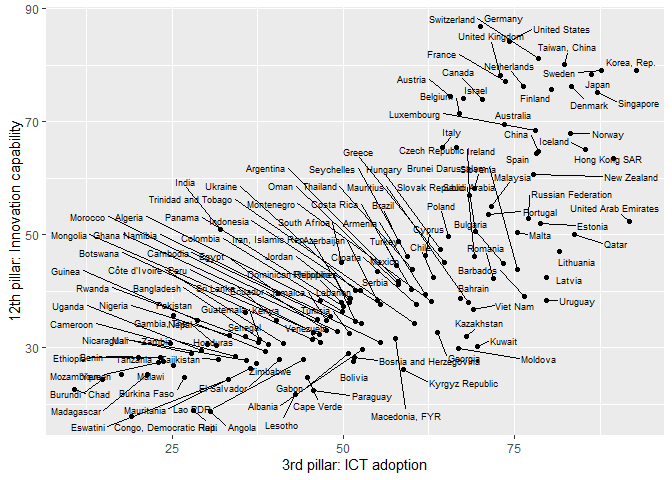

01 Limpieza y procesado de los datos del Índice de Commpetitividad
Global
================
Guillermo Bustos-Pérez
5/4/2020

# Índice de Competitividad Global. Introducción y tidy de los datos

 

## Introducción

El **Índice de Competitividad Global** es publicado anualmente por el
Foro Económico Mundial para evaluar la competitividad de los diferentes
países. Para cada país se evalúan 12 pilares. Para cada pilar se evalúan
una serie de sub-pilares y sus correspondientes indicadores. Los pilares
van desde el *Desempeño de las instituciones* (incluyendo como
indicadores la seguridad, independencia del poder judiacial, incidencia
del terrorismo, etc.) a la *Capacidad de innovación* (donde se evaluan
como indicadores la diversificación de los trabajadores, publicacines
científicas, patentes, etc.).  
Los Pilares, Sub-pilares e indicadores **están formualdos de forma
cuantitativa**.  
Los datos aquí empeados pueden accederse en formato .xlsx:  
<http://reports.weforum.org/global-competitiveness-report-2019/downloads/?doing_wp_cron=1586016888.5028719902038574218750>

## Limpieza y procesamiento de los datos para el análisis

Aunque el .xlsx proporcionado por el Foro Económico Mundial presenta un
buen aspecto, es necesario un procesado ya que **viola una buena
cantidad de los principios del data tidy** (Wickham, 2014). Por ejemplo,
la pertenencia de un “Sub-pillar” o un “Indicador” a determinado Pillar
no aparece como una columna aparte, sino insertado en la misma columna.

**En este apartado se muestra como corregir las violaciones del Data
Tidy usando R**. Fundamentalmente vamos a usar la biblioteca de
**tidyverse** que permite hacer filtrados y formateos rápidos de los
datos (Wickham et al., 2019) y el paquete **zoo** (Zeileis and
Grothendieck, 2005) que añade una serie de funciones que facilitan el
procesado de los datos.

Empezamos por cargar los datos. “Datos no disponibles”, “no aplicables”,
etc. aparecen bajo diferentes denominaciones. Con el siguiente código
son introducidos como Na’s:

``` r
# Leer los datos
Comp_2019 <- read_excel("Data/WEF_GCI_4.0_2019_Dataset.xlsx", 
                   sheet = "Data", skip = 3, 
                   na = c("n/a", "N/Appl.", "not assessed", "Not assessed"))
```

 

Ahora podemos ir a las columnas y variables que queremos: la edición
(2019), los atributos (“SCORE” y “VALUE”). La selección de estos dos
atributos es importante ya que varios pilares no se reportan bajo el
indicador SCORE, y en lugar de ello se emplea el indicador “VALUE”. Por
ejemplo, en el caso del *“Skillset of secondary-education graduates”* no
aparece reportado como SCORE, sino como VALUE. A su vez la mayoría de
las columnas de países en filas de VALUE aparecen vacías. **Lidiaremos
con este problema a continuación**.  
Pero antes también podemos aprovechar para librarnos de columnas que no
nos interesan o que son redundantes.

``` r
# Check head of data frame
head(Comp_2019)
```

    ## # A tibble: 6 x 163
    ##   Index Edition `Series Global ~ `Freeze date`       `Series name`
    ##   <chr>   <dbl> <chr>            <dttm>              <chr>        
    ## 1 Glob~    2019 GCI4             2019-10-09 00:00:00 Global Compe~
    ## 2 Glob~    2019 GCI4             2019-10-09 00:00:00 Global Compe~
    ## 3 Glob~    2019 GCI4             2019-10-09 00:00:00 Global Compe~
    ## 4 Glob~    2019 GCI4             2019-10-09 00:00:00 Global Compe~
    ## 5 Glob~    2019 GCI4             2019-10-09 00:00:00 Global Compe~
    ## 6 Glob~    2019 GCI4             2019-10-09 00:00:00 Global Compe~
    ## # ... with 158 more variables: `Series units` <chr>, `Series order` <dbl>,
    ## #   `Series code (if applicable)` <chr>, `Series type` <chr>, Attribute <chr>,
    ## #   Angola <chr>, Albania <chr>, `United Arab Emirates` <chr>, Argentina <chr>,
    ## #   Armenia <chr>, Australia <chr>, Austria <chr>, Azerbaijan <chr>,
    ## #   Burundi <chr>, Belgium <chr>, Benin <chr>, `Burkina Faso` <chr>,
    ## #   Bangladesh <chr>, Bulgaria <chr>, Bahrain <chr>, `Bosnia and
    ## #   Herzegovina` <chr>, Bolivia <chr>, Brazil <chr>, Barbados <chr>, `Brunei
    ## #   Darussalam` <chr>, Botswana <chr>, Canada <chr>, Switzerland <chr>,
    ## #   Chile <chr>, China <chr>, `Côte d'Ivoire` <chr>, Cameroon <chr>, `Congo,
    ## #   Democratic Rep.` <chr>, Colombia <chr>, `Cape Verde` <chr>, `Costa
    ## #   Rica` <chr>, Cyprus <chr>, `Czech Republic` <chr>, Germany <chr>,
    ## #   Denmark <chr>, `Dominican Republic` <chr>, Algeria <chr>, Ecuador <chr>,
    ## #   Egypt <chr>, Spain <chr>, Estonia <chr>, Ethiopia <chr>, Finland <chr>,
    ## #   France <chr>, Gabon <chr>, `United Kingdom` <chr>, Georgia <chr>,
    ## #   Ghana <chr>, Guinea <chr>, `Gambia, The` <chr>, Greece <chr>,
    ## #   Guatemala <chr>, `Hong Kong SAR` <chr>, Honduras <chr>, Croatia <chr>,
    ## #   Haiti <chr>, Hungary <chr>, Indonesia <chr>, India <chr>, Ireland <chr>,
    ## #   `Iran, Islamic Rep.` <chr>, Iceland <chr>, Israel <chr>, Italy <chr>,
    ## #   Jamaica <chr>, Jordan <chr>, Japan <chr>, Kazakhstan <chr>, Kenya <chr>,
    ## #   `Kyrgyz Republic` <chr>, Cambodia <chr>, `Korea, Rep.` <chr>, Kuwait <chr>,
    ## #   `Lao PDR` <chr>, Lebanon <chr>, `Sri Lanka` <chr>, Lesotho <chr>,
    ## #   Lithuania <chr>, Luxembourg <chr>, Latvia <chr>, Morocco <chr>,
    ## #   Moldova <chr>, Madagascar <chr>, Mexico <chr>, `Macedonia, FYR` <chr>,
    ## #   Mali <chr>, Malta <chr>, Montenegro <chr>, Mongolia <chr>,
    ## #   Mozambique <chr>, Mauritania <chr>, Mauritius <chr>, Malawi <chr>,
    ## #   Malaysia <chr>, Namibia <chr>, ...

``` r
# Check first 15 column names
colnames(Comp_2019)[1:15]
```

    ##  [1] "Index"                       "Edition"                    
    ##  [3] "Series Global ID"            "Freeze date"                
    ##  [5] "Series name"                 "Series units"               
    ##  [7] "Series order"                "Series code (if applicable)"
    ##  [9] "Series type"                 "Attribute"                  
    ## [11] "Angola"                      "Albania"                    
    ## [13] "United Arab Emirates"        "Argentina"                  
    ## [15] "Armenia"

``` r
# Check dimensions of data frame
dim(Comp_2019)
```

    ## [1] 3388  163

``` r
# Filtar los datos de interés y librarse de columnas redundantes/de no interés
Comp_2019 <- Comp_2019 %>% filter(
  Edition == 2019 & 
    Attribute == "SCORE" | Attribute == "VALUE") %>% 
  select(-c("Index", "Series Global ID", "Freeze date",
            "Series code (if applicable)", "Series order"
            )) 
```

 

El data frame presenta los siguients problemas:

  - Cuando el “Attribute” es igual a VALUE la mayoría de las columnas
    están vacías  
  - En algunos casos cuando Attribute es igual a SCORE la fila está
    vacía ya que los valores de ese mismo Pilar aparecen como VALUE  
  - Los Pilares están duplicados, ya que se duplican al aparecer como
    SCORE o VALUE

Dicho de otra forma, **debemos identificar filas que para las columnas
de los países solo figuran Na’s**. En este caso basta con crear un
vector booleano indicando si faltan todos los datos a partir de la
columna 6 (primer país) a la última columna, y filtrar usando este
booleano.  
En el caso de **los duplicados**, se eliminan conservando
prioritariamente aquellos en los que el atributo es SCORE. En caso de no
haber duplicado conservamos el “Series Name” cuyo attribute sea VALUE.

``` r
# Vector booleano indcando si faltan todos los datos de la fila desde 
# la columna 6 hasta el final
ind <- apply(Comp_2019[, 6:ncol(Comp_2019)], 1, function(x) all(is.na(x)))

# Filtrar los datos usando el vector booleano
Comp_2019 <- Comp_2019[ !ind, ]

# Retirar duplicados de "Series Name", 
# conservando prioritariamente aquellos en los que Attribute = SCORE
Comp_2019 <- 
  setDT(Comp_2019)[, .SD[which.min(factor(Attribute, levels = c("SCORE","VALUE")))], 
                              by=.(`Series name`)]
```

 

Ahora tenemos un formato de datos *aceptable*, pero sigue presentando
una serie de deficiencias. Las **puntuaciones de cada país son leidas
como factores** y las columnas están en un orden poco apropiado (a esto
se suma que los países aparecen como columna y que los indicadores
deberían figurar como columnas (de eso nos encargaremos más
adelante).  
Esto **se soluciona en tres pasos**:

1)  Guardamos los paíeses en un data frame aparte que vaya desde Angola
    (primer país) hasta la útlima columna y transformamos este data
    frame en numérico  
2)  Aprovechamos para cambiar el orden de las columnas según queramos  
3)  Volvmos a unir ambos data frames

 

``` r
# Indicadores de cada país en un data frame nuevo y hacerlo numérico
Countries <- Comp_2019 %>% select(c(Angola: last_col()))
Countries[] <- lapply(Countries , function(x) as.numeric(as.character(x)))

# Reordenar columnas
Comp_2019 <- Comp_2019 %>%  select(c("Edition", "Series type", 
               "Series name", "Series units", "Attribute"))

# Unir indicadores numéricos de cada país con el orden apropiado de columnas
Comp_2019 <- cbind(Comp_2019, Countries)
```

 

Ya que estamos, podemos guardar los promedios de regions y el promedio
general en un data frame diferente (puede resultar un indicador
interesante para más adelante). Lo eliminamos del data frame que
contiene los países.

``` r
# Nuevo data frame con los promedios de cada región
Averages <- Comp_2019 %>% select(`Series name`, `Series type`,
                            `Europe and North America`:`Sample average`) 

# Eliminar los promedios regionales del data frame con los países 
Comp_2019 <- Comp_2019 %>% 
  select(-c(`Europe and North America`:`Sample average`))
```

 

Ahora eliminamos dos filas que han quedado y que no son útiles. Estas
son el “Index”, que representa el promedio de todos los índices (se
emplean para computar la posición final del ranking), y la etiqueta (no
se empela en los cálculos):

``` r
# Filtrar casos no apropiados (ruido)
Comp_2019 <- Comp_2019 %>% filter(`Series type` != "Label (does not enter calculation)" &
                                    `Series type` != "Index")
```

 

Ahora necesitamos crear una **columna que represente el “Pillar”** al
que pertenece cada indicador.  
Nuevamente esto es sencillo. Basta con crear una columna duplicada de
“Series Name”, asignar Na a todos aquellos que no contengan “pillar”,
y hacer un autocompletado hacia adelante (**na.locf()**) del paquete
**zoo**.

``` r
# Crear columna Pillar como copia de Series Name
Comp_2019$Pillar <- Comp_2019$`Series name`

# Asignar Na si no contiene "pillar"
Comp_2019$Pillar <- ifelse(grepl("pillar" , Comp_2019$Pillar), Comp_2019$Pillar, NA)

# Autocompletado haciia adelante
library(zoo)
Comp_2019$Pillar <- na.locf(Comp_2019$Pillar)

# Reordenar columnas
Comp_2019 <- Comp_2019 %>% select("Edition", "Series type", 
            "Series name", "Pillar", "Series units", Angola: last_col()) %>% 
  filter(Edition == 2019)
```

 

Vemos el dataframe final y vemos que está transformado de una forma
mucho más adecuada. Una vez realizados todos estos pasos podemos
reordemnar definitivamente las columnas y proceder con el análisis de
datos.

``` r
# Check head and tail of data frame
head(Comp_2019)
```

    ##    Edition Series type                    Series name                   Pillar
    ## 1:    2019      Pillar       1st pillar: Institutions 1st pillar: Institutions
    ## 2:    2019  Sub-pillar                       Security 1st pillar: Institutions
    ## 3:    2019   Indicator                Organized crime 1st pillar: Institutions
    ## 4:    2019   Indicator                  Homicide rate 1st pillar: Institutions
    ## 5:    2019   Indicator            Terrorism incidence 1st pillar: Institutions
    ## 6:    2019   Indicator Reliability of police services 1st pillar: Institutions
    ##                                  Series units   Angola  Albania
    ## 1:                                      0–100 37.61545 51.87481
    ## 2:                                      0–100 67.44152 74.05987
    ## 3:                                 1–7 (best) 50.94735 46.36201
    ## 4:                           per 100,000 pop. 85.42373 93.89831
    ## 5: 0 (very high incidence)–100 (no incidence) 95.33269 99.90074
    ## 6:                                 1–7 (best) 38.06231 56.07842
    ##    United Arab Emirates Argentina  Armenia Australia  Austria Azerbaijan
    ## 1:             73.25884  49.85289 56.24956  72.94070 73.53739   58.46990
    ## 2:             92.79235  69.84016 84.17502  89.81358 91.18546   87.56675
    ## 3:             85.09537  50.99166 76.54831  76.87657 79.56757   79.58067
    ## 4:            100.00000  84.40678 93.55932  98.98305 99.32203   94.91525
    ## 5:             99.98745  99.84678 99.89383  99.23579 99.87634   99.73380
    ## 6:             86.08658  44.11544 66.69861  84.15890 85.97590   76.03726
    ##     Burundi  Belgium     Benin Burkina Faso Bangladesh Bulgaria   Bahrain
    ## 1: 40.72826 69.46204  48.04500     48.52999   45.93653 56.79991  62.90455
    ## 2: 72.50258 87.08349  80.20111     73.94011   67.89992 72.95371  95.09398
    ## 3: 63.65248 78.37943  56.09735     45.07699   49.60775 47.64489  92.78252
    ## 4: 81.35593 95.93220  97.96610     97.28814   94.23729 96.61017 100.00000
    ## 5: 91.27850 98.00128 100.00000     96.15998   85.93446 99.94453  98.08413
    ## 6: 53.72341 76.02104  66.74100     57.23534   41.82017 47.61524  89.50928
    ##    Bosnia and Herzegovina   Bolivia   Brazil  Barbados Brunei Darussalam
    ## 1:               44.37695  38.45699 48.05443  55.18229          58.27814
    ## 2:               73.13859  66.31504 43.04121  73.06362          85.04423
    ## 3:               50.02195  57.72990 33.81375  62.15278          75.45743
    ## 4:               97.62712  80.33898  0.00000  66.10169         100.00000
    ## 5:               99.88482 100.00000 99.80447 100.00000         100.00000
    ## 6:               45.02049  27.19129 38.54661  64.00000          64.71949
    ##     Botswana   Canada Switzerland    Chile    China Côte d'Ivoire Cameroon
    ## 1:  54.23885 74.07642    77.51378 63.89307 56.78003      42.35642 43.72920
    ## 2:  68.03980 86.03250    93.81757 83.65188 79.15501      45.13081 68.96698
    ## 3:  58.34846 70.53082    84.79708 70.48131 60.73615      40.21282 48.35197
    ## 4:  50.84746 95.59322   100.00000 87.11864 99.66102       0.00000 96.94915
    ## 5: 100.00000 98.80821    99.98271 99.13213 96.40930     100.00000 79.90964
    ## 6:  62.96329 79.19775    90.49048 77.87544 59.81356      40.31042 50.65715
    ##    Congo, Democratic Rep. Colombia Cape Verde Costa Rica   Cyprus
    ## 1:               32.78490 49.25432   51.24305   57.12616 63.98762
    ## 2:               35.76793 45.14765   70.74143   69.85485 83.82060
    ## 3:               38.50312 34.45092   64.74083   59.12688 71.70006
    ## 4:                0.00000 17.28814   62.71186   60.00000 99.66102
    ## 5:               73.07600 85.57246  100.00000  100.00000 99.92001
    ## 6:               31.49259 43.27910   55.51304   60.29251 64.00132
    ##    Czech Republic  Germany  Denmark Dominican Republic  Algeria  Ecuador
    ## 1:       60.88831 72.38548 77.39979           50.05801 45.52704 47.78091
    ## 2:       86.19533 80.87212 87.41177           61.66747 80.39392 70.71209
    ## 3:       78.87355 60.11684 71.23720           53.18918 62.94611 54.62624
    ## 4:       99.66102 98.30508 97.62712           63.38983 96.94915 82.03390
    ## 5:       99.81452 96.75432 99.88902           99.86230 98.20628 99.76880
    ## 6:       66.43223 68.31223 80.89372           30.22858 63.47414 46.41941
    ##       Egypt    Spain  Estonia Ethiopia  Finland   France    Gabon
    ## 1: 51.32797 65.06585 70.22827 41.74812 81.21626 70.03656 40.84847
    ## 2: 67.77738 91.85010 91.77190 61.94216 97.26160 81.05252 58.92843
    ## 3: 72.37201 81.20830 89.75372 40.14337 96.38662 63.46836 41.14583
    ## 4: 93.22034 99.32203 94.23729 73.33407 97.62712 97.28814 66.95146
    ## 5: 41.64426 98.29153 99.98595 94.86470 99.64746 92.46342 99.83864
    ## 6: 63.87291 88.57854 83.11063 39.42652 95.38522 70.99017 27.77778
    ##    United Kingdom  Georgia    Ghana   Guinea Gambia, The   Greece Guatemala
    ## 1:       74.42025 60.98433 54.38782 46.07270    48.52897 50.51005  42.44595
    ## 2:       79.35413 86.33910 75.07280 73.81487    66.65578 77.45562  42.89036
    ## 3:       61.70642 76.68469 54.83720 50.00000    62.38121 61.93169  25.17589
    ## 4:       97.62712 98.30508 94.57627 92.28357    38.96315 99.32203  13.22034
    ## 5:       88.29199 99.71353 99.97586 99.92934   100.00000 97.32841  99.97795
    ## 6:       69.79100 70.65310 50.90187 53.04659    65.27877 51.24035  33.18726
    ##    Hong Kong SAR Honduras  Croatia    Haiti  Hungary Indonesia    India
    ## 1:      77.58024 43.78889 51.77383 30.86685 55.67443  58.10475 56.75377
    ## 2:      92.28261 41.24954 78.71013 53.79000 77.75286  77.21530 56.37683
    ## 3:      79.85168 30.01794 62.44782 21.85496 58.77121  55.80084 54.98379
    ## 4:     100.00000  0.00000 97.96610 69.49153 93.22034 100.00000 90.84746
    ## 5:     100.00000 99.86886 99.99454 99.93541 99.95120  96.82208 26.32190
    ## 6:      89.27875 35.11134 54.43207 23.87810 59.06867  56.23829 53.35418
    ##     Ireland Iran, Islamic Rep.  Iceland   Israel    Italy  Jamaica   Jordan
    ## 1: 72.97660           42.53476 74.10415 65.64441 58.55356 49.33010 59.82099
    ## 2: 87.20443           72.82092 95.42092 82.42513 76.95677 43.28458 85.71222
    ## 3: 73.21914           49.14555 92.85484 70.35028 45.06850 30.74468 67.33578
    ## 4: 98.64407           93.22034 98.64407 96.94915 99.32203  0.00000 96.94915
    ## 5: 98.88690           97.58717 99.99676 94.19374 99.30902 99.93611 98.80418
    ## 6: 78.06760           51.33061 90.18801 68.20736 64.12752 42.45751 79.75975
    ##        Japan Kazakhstan    Kenya Kyrgyz Republic Cambodia Korea, Rep.   Kuwait
    ## 1:  71.67306   55.61506 54.65352        49.02053 41.91193    65.76120 55.58151
    ## 2:  92.25557   72.45806 65.67414        67.48003 71.68540    85.24912 82.26327
    ## 3:  82.13820   66.57516 42.39472        45.18868 53.88496    68.99167 68.22308
    ## 4: 100.00000   71.07985 84.74576        87.45763 95.59322    99.66102 95.59322
    ## 5:  99.64922   99.79752 86.97050        99.76169 99.99676    99.96929 99.25464
    ## 6:  87.23486   52.37974 48.58559        37.51211 37.26667    72.37449 65.98216
    ##     Lao PDR  Lebanon Sri Lanka  Lesotho Lithuania Luxembourg   Latvia  Morocco
    ## 1: 42.75866 44.39285  51.61199 42.99322  63.26349   75.89939 59.28066 60.01721
    ## 2: 73.96523 69.49538  73.46225 59.38250  84.58965   90.61425 80.02405 88.85192
    ## 3: 55.94006 50.93465  52.30661 73.70904  82.36043   76.50961 70.71050 80.04160
    ## 4: 86.49022 88.13559  93.89831  0.00000  86.44068  100.00000 87.45763 94.57627
    ## 5: 99.71307 92.48116  98.29922 99.97813 100.00000  100.00000 99.97189 99.99297
    ## 6: 53.71758 46.43013  49.34484 63.84284  69.55748   85.94738 61.95617 80.79685
    ##     Moldova Madagascar   Mexico Macedonia, FYR      Mali    Malta Montenegro
    ## 1: 51.36537   39.94551 48.28652       50.67647  41.47942 61.34331   57.26865
    ## 2: 73.25588   58.96449 40.12208       69.16705  63.30373 81.17622   79.18615
    ## 3: 57.99367   33.49206 20.05261       41.09277  36.32989 73.31674   64.30888
    ## 4: 90.84746   77.93226 17.62712       96.61017 100.00000 98.64407   93.55932
    ## 5: 99.98595   99.43364 98.09439       99.90555  77.28828 99.86690   99.98973
    ## 6: 44.19645   25.00000 24.71419       39.05971  39.59674 52.87719   58.88666
    ##     Mongolia Mozambique Mauritania Mauritius   Malawi Malaysia   Namibia
    ## 1:  49.76454   39.31305   36.41664  64.70030 45.74104 68.57035  56.81580
    ## 2:  74.12427   63.09079   74.67146  82.80398 74.76436 83.98265  63.87858
    ## 3:  65.26969   37.18059   69.33455  74.24874 59.91693 68.27377  57.44922
    ## 4:  80.67797   90.16949   67.04333  95.59322 95.93220 94.57627  43.72881
    ## 5: 100.00000   96.07266  100.00000 100.00000 99.97189 99.25877 100.00000
    ## 6:  50.54942   28.94041   62.30798  61.37395 43.23643 73.82178  54.33629
    ##       Nigeria Nicaragua Netherlands    Norway    Nepal New Zealand      Oman
    ## 1: 41.4312634  41.88889    78.56699  76.91871 47.88668    78.77889  62.34827
    ## 2: 42.6662516  75.94336    90.07923  90.78249 71.29748    92.55551  92.88492
    ## 3: 42.2215621  76.29882    78.33281  83.40575 50.29957    84.16401  86.03086
    ## 4: 97.9292623  76.61017    98.98305 100.00000 94.23729    99.32203 100.00000
    ## 5:  0.0157807  99.94733    99.81432  99.97189 89.64088    99.98271 100.00000
    ## 6: 30.4984013  50.91712    83.18674  79.75230 51.01217    86.75330  85.50882
    ##    Pakistan   Panama     Peru Philippines   Poland  Portugal Paraguay     Qatar
    ## 1: 47.70256 51.41290 48.86325    49.98102 56.43016  64.51167 44.28054  63.22335
    ## 2: 45.47029 71.98632 59.57828    44.75927 79.74038  90.88581 63.36614  89.36458
    ## 3: 47.12300 64.51385 33.40721    45.74079 68.57312  84.50090 54.63003  78.26831
    ## 4: 87.45763 68.81356 75.59322    73.22034 98.98305  99.32203 71.52543 100.00000
    ## 5:  0.00000 99.98595 99.06691    26.67138 99.92453 100.00000 98.88910  99.98335
    ## 6: 47.30052 54.63194 30.24580    33.40458 51.48084  79.72032 28.42001  79.20665
    ##      Romania Russian Federation   Rwanda Saudi Arabia   Senegal Singapore
    ## 1:  58.07242           52.57112 63.21394     63.19173  53.07268  80.36380
    ## 2:  81.49685           68.59293 84.56979     88.69817  81.98577  96.11721
    ## 3:  63.44322           60.41149 68.42596     80.99175  58.80479  92.58780
    ## 4:  96.61017           70.50848 93.22034     97.28814 100.00000 100.00000
    ## 5: 100.00000           93.14558 99.68198     89.08540  99.93382 100.00000
    ## 6:  65.93403           50.30617 76.95090     87.42741  69.20446  91.88106
    ##    El Salvador   Serbia Slovak Republic  Slovenia   Sweden  Eswatini Seychelles
    ## 1:   39.844418 52.45419        56.28049  63.35340 75.20291  47.80201   61.02068
    ## 2:   33.477420 75.22093        73.29906  87.24911 83.92224  74.88036   67.40720
    ## 3:    8.161058 51.78075        56.76387  76.08257 70.35292  64.73091   62.42273
    ## 4:    0.000000 97.96610        96.61017  98.64407 97.96610  69.49153   58.64407
    ## 5:  100.000000 99.93336        99.96668 100.00000 98.47153 100.00000  100.00000
    ## 6:   25.748622 51.20350        39.85552  74.26980 68.89842  65.29899   48.56199
    ##        Chad Thailand Tajikistan Trinidad and Tobago  Tunisia   Turkey
    ## 1: 35.41707 54.82845   51.67567            47.92530 52.96926 53.89338
    ## 2: 67.14311 64.68619   79.51740            43.46263 77.92672 60.95242
    ## 3: 39.79950 54.31112   62.19639            37.93372 64.73212 58.39744
    ## 4: 99.54751 90.84746   96.27119             0.00000 91.52542 87.11864
    ## 5: 96.19791 69.92358   99.72905            99.98811 97.66255 42.49491
    ## 6: 33.02751 43.66262   59.87297            35.92867 57.78679 55.79870
    ##    Taiwan, China Tanzania   Uganda  Ukraine  Uruguay United States Venezuela
    ## 1:      68.62812 48.32964 48.03280 47.85135 62.32831      71.17103  25.72139
    ## 2:      85.83566 71.90490 63.54365 62.62315 71.21752      76.73910  33.24257
    ## 3:      69.20952 56.20886 48.18247 47.79093 60.52262      61.85520  20.97537
    ## 4:      95.96453 80.67797 64.40678 80.67797 73.89831      83.72881   0.00000
    ## 5:      99.91283 99.11240 98.28562 75.85030 99.96147      83.28050  98.29416
    ## 6:      78.25574 51.62037 43.29974 46.17341 50.48768      78.09190  13.70075
    ##     Viet Nam    Yemen South Africa   Zambia Zimbabwe
    ## 1:  49.82291 29.01933     57.07268 45.17196 41.81961
    ## 2:  77.21684 43.03557     42.74123 69.56702 70.44599
    ## 3:  59.22149 42.04068     37.40794 58.77794 63.90365
    ## 4:  96.61017 78.98305      0.00000 83.72881 78.98305
    ## 5: 100.00000 16.86592     97.02499 99.94379 99.86461
    ## 6:  53.03571 34.25262     36.53197 35.81752 39.03265

``` r
tail(Comp_2019)
```

    ##    Edition Series type                      Series name
    ## 1:    2019   Indicator          Scientific publications
    ## 2:    2019   Indicator              Patent applications
    ## 3:    2019   Indicator                 R&D expenditures
    ## 4:    2019   Indicator Research institutions prominence
    ## 5:    2019   Indicator             Buyer sophistication
    ## 6:    2019   Indicator           Trademark applications
    ##                                Pillar     Series units    Angola   Albania
    ## 1: 12th pillar: Innovation capability            score 55.702747 60.219355
    ## 2: 12th pillar: Innovation capability per million pop.  0.000000  3.591861
    ## 3: 12th pillar: Innovation capability            % GDP  2.666667  5.137333
    ## 4: 12th pillar: Innovation capability     0–100 (best)  0.000000  0.000000
    ## 5: 12th pillar: Innovation capability       1–7 (best) 29.511837 34.547873
    ## 6: 12th pillar: Innovation capability per million pop.  0.000000 63.912548
    ##    United Arab Emirates Argentina   Armenia Australia   Austria Azerbaijan
    ## 1:            76.204807  87.40352 75.467847  99.95379  94.23539  66.586479
    ## 2:            29.033640  16.39752 23.961876  76.51122 100.00000   4.569604
    ## 3:            32.122000  17.75800  7.590000  64.09867 100.00000   6.173667
    ## 4:             4.215787  19.74956  1.202203  68.43768  16.09964   1.734465
    ## 5:            62.356647  41.38764 51.581335  51.05477  47.85045  59.063482
    ## 6:            82.559568  77.98506 71.667375  89.55453 100.00000  53.084252
    ##       Burundi  Belgium     Benin Burkina Faso Bangladesh  Bulgaria    Bahrain
    ## 1: 54.3827794 97.11881 65.322859   67.9026050  75.972946 79.990499 62.9898633
    ## 2:  0.5900827 87.23352  0.000000    0.1353164   0.756001 30.974735 20.2626285
    ## 3:  4.0420001 82.94500 10.321722    7.3943332  10.640667 26.002000  3.3719999
    ## 4:  0.0000000 22.61495  0.379121    0.0000000   5.970526  4.535269  0.3515139
    ## 5: 25.8865237 56.96720 22.586147   18.7629104  38.528840 46.534324 49.4665464
    ## 6: 19.3314655 77.79688 54.464789   46.4709570  43.752349 88.708481 69.0815204
    ##    Bosnia and Herzegovina    Bolivia   Brazil  Barbados Brunei Darussalam
    ## 1:              65.141882 69.8360397 91.86851 64.395009        61.6693001
    ## 2:               7.782176  0.7458913 19.76435 19.857111        18.9962386
    ## 3:               6.650333  5.2333335 42.19267  7.705834        79.3977658
    ## 4:               1.121977  0.0000000 63.40735  0.357803         0.7333557
    ## 5:              24.920062 27.8240204 43.08878 41.333334        34.4244639
    ## 6:              60.369752 61.8174435 71.22715 94.419208        65.1186129
    ##      Botswana    Canada Switzerland    Chile     China Côte d'Ivoire   Cameroon
    ## 1: 67.3901024 100.00000   100.00000 85.44329  97.46501    69.0181110 70.3145201
    ## 2:  0.0000000  85.83195   100.00000 30.02844  50.31263     0.1798936  0.3197313
    ## 3: 17.9093341  50.98333   100.00000 12.08133  70.27533    11.0964586 11.0964586
    ## 4:  0.3559832  73.13601    30.89922 15.68115 100.00000     0.0000000  1.9060079
    ## 5: 32.5635592  59.45256    66.86962 49.35048  58.15758    29.6280583 33.0917160
    ## 6: 58.8689764  81.85988   100.00000 80.07024  79.22509    62.4748562 57.5154821
    ##    Congo, Democratic Rep.  Colombia Cape Verde Costa Rica     Cyprus
    ## 1:           59.790054988 81.064145  47.066448  75.528173  76.147181
    ## 2:            0.008327304 10.727050  12.298936  11.517471  43.032770
    ## 3:            2.607333413  8.132334   2.421333  15.258333  16.722333
    ## 4:            0.413255834 12.768926   0.000000   1.147026   3.003547
    ## 5:           23.679538567 38.463318  37.407200  46.848265  49.954363
    ## 6:            0.000000000 65.791810   0.000000  79.530687 100.000000
    ##    Czech Republic   Germany   Denmark Dominican Republic    Algeria   Ecuador
    ## 1:       88.64595 100.00000  96.21616          61.359135 73.2552577 73.007536
    ## 2:       62.84580 100.00000  98.12849           3.777549  0.4925703  2.105277
    ## 3:       55.94333  97.98300  95.70833          11.946152 17.7823325 14.755333
    ## 4:       22.77266 100.00000  16.76423           0.000000  9.7826281  4.426377
    ## 5:       35.39810  62.23629  53.06745          37.704555 46.3881651 32.887816
    ## 6:       88.89867  97.64107 100.00000          71.227587 50.9721949 69.252773
    ##        Egypt     Spain   Estonia   Ethiopia   Finland    France     Gabon
    ## 1: 80.897507  98.56596 80.897507 71.6636578  94.02969 100.00000 67.494032
    ## 2:  3.177117  62.44644 61.043559  0.3050513 100.00000  91.68712  4.777199
    ## 3: 20.198333  39.51633 42.709668 20.1580008  91.54833  74.93500 19.308001
    ## 4: 14.829871 100.00000  2.854507  2.7354395  17.57915 100.00000  0.000000
    ## 5: 39.041297  43.95442 46.515206 63.6842092  61.09152  55.71685 31.770833
    ## 6: 54.013962  95.78862 98.835957  0.0000000  98.26148  93.03827 57.621958
    ##    United Kingdom   Georgia      Ghana     Guinea Gambia, The   Greece
    ## 1:      100.00000 74.692286 72.2008606 59.7900550  70.1423104 89.97486
    ## 2:       85.11579  8.525133  0.2974575  0.4894461   2.8611185 42.92640
    ## 3:       56.28233 10.034666 12.5516663 10.3217224   4.4360002 33.56667
    ## 4:      100.00000  1.887136  1.5281455  0.0000000   0.5839018 16.15227
    ## 5:       62.07693 37.193259 41.5143410 44.2528725  42.5742626 38.61657
    ## 6:       94.54826 68.953109 39.1188652 57.8066587  44.5860952 96.40653
    ##     Guatemala Hong Kong SAR   Honduras   Croatia    Haiti   Hungary Indonesia
    ## 1: 65.6196590      91.49432 60.3876506 81.146767 60.71861 88.420794 78.167999
    ## 2:  0.4344745      71.73814  0.9843779 30.063961  0.00000 56.148397  1.324471
    ## 3:  0.9960000      26.65733  0.4990000 28.193667  0.00000 40.202002  2.823333
    ## 4:  0.0000000      17.53549  0.0000000  3.334226  0.00000  9.795675 10.607666
    ## 5: 38.9556765      71.30331 36.3302906 31.174127 16.87018 32.318481 43.237225
    ## 6: 65.6846511      95.75174 60.1417195 79.962546 41.42278 83.780763 56.236643
    ##       India   Ireland Iran, Islamic Rep.   Iceland    Israel     Italy
    ## 1: 92.73165 90.542615          82.466255 82.966447  95.34993 100.00000
    ## 2: 16.80452 81.652207           1.938840 83.364795  97.66752  76.21054
    ## 3: 20.66400 39.227001           8.422333 69.180004 100.00000  42.85533
    ## 4: 98.36341  9.829598          50.852780  1.410607  13.63711  86.00643
    ## 5: 49.78242 57.601078          40.803901 54.355144  55.71842  48.62889
    ## 6: 57.53971 96.680587          73.757819 96.665161  83.19858  94.34054
    ##       Jamaica    Jordan     Japan Kazakhstan     Kenya Kyrgyz Republic
    ## 1: 66.7507297 73.567786 100.00000  65.736733 79.720813      60.3037423
    ## 2:  8.8183971 10.972675 100.00000   5.992107  2.210985       0.1127351
    ## 3:  3.0000001 11.067000 100.00000   4.726333 26.192333       3.6343334
    ## 4:  0.4014062  3.697161 100.00000   1.460902  3.638504       0.0000000
    ## 5: 40.9090916 47.517788  65.94789  43.868637 38.052603      38.2383625
    ## 6: 66.8597478 67.480335  81.55556  56.763634 48.049407      41.6262042
    ##      Cambodia Korea, Rep.    Kuwait   Lao PDR   Lebanon Sri Lanka   Lesotho
    ## 1: 67.2328284    94.22687 72.609691 63.809049 76.347898 74.074443 52.512391
    ## 2:  0.2067898   100.00000 14.657006  1.436569 17.908376  3.848867  0.000000
    ## 3:  3.9410000   100.00000  2.693000  6.107400 12.423889  3.623667  1.601333
    ## 4:  0.0000000    75.73687  1.848858  0.000000  3.075266  2.256559  0.000000
    ## 5: 43.6140180    73.78170 49.785046 47.322416 43.213987 47.707085 49.581103
    ## 6: 47.9888100    90.50550  0.000000  0.000000 69.571994 63.217269  0.000000
    ##    Lithuania  Luxembourg   Latvia   Morocco    Moldova  Madagascar   Mexico
    ## 1: 77.178574  74.6284502 73.36017 75.618202 68.0030106 66.08250358 88.02482
    ## 2: 44.522695  89.2192085 35.28894  2.209870  5.1863505  0.06305666 19.19917
    ## 3: 28.241332  41.4553324 14.76400 23.818000 10.0620002  0.48666668 16.21667
    ## 4:  3.853262   0.5527757  1.94695  5.937179  0.7063514  0.37305906 29.80187
    ## 5: 40.574491  69.7724263 41.19225 44.682697 30.9110483 21.84873820 43.90143
    ## 6: 89.990783 100.0000000 88.58472 61.871836 67.9670883 37.72943428 73.77513
    ##    Macedonia, FYR       Mali       Malta Montenegro  Mongolia Mozambique
    ## 1:     68.1523547 66.4759573  68.9243779 56.8084719 65.852890 66.6414320
    ## 2:      5.1270450  0.1149159  60.5313016 25.3461213  9.917367  0.4242037
    ## 3:     11.7810001  9.7579996  19.8990007 12.4666671  4.470667 11.2503330
    ## 4:      0.7623719  0.0000000   0.4019825  0.3902172  0.365749  0.3837983
    ## 5:     31.6607118 23.6744443  47.7612575 44.1792448 36.935671 28.3874512
    ## 6:     77.0703272 50.9502180 100.0000000 69.8644669 64.771308 41.9324729
    ##    Mauritania  Mauritius     Malawi Malaysia    Namibia    Nigeria  Nicaragua
    ## 1: 54.7545939 62.6346933 71.7026818 81.90950 65.9106274 75.8556401 63.9412801
    ## 2:  0.2345263 12.4686816  0.0000000 36.53313  2.1778532  0.1426761  0.3326458
    ## 3: 11.0964586  5.9243331 10.3217224 43.35634 11.3320003 11.0964586  3.6219999
    ## 4:  0.0000000  0.3647959  0.4226126 14.09655  0.7152857  7.2253088  0.0000000
    ## 5: 19.6308176 46.0793137 27.5462707 62.92867 44.4831491 36.8963162 28.9588372
    ## 6: 54.1144031 86.3690808 35.3781125 70.95598 73.3671413 49.5808404 65.6737125
    ##    Netherlands   Norway      Nepal New Zealand      Oman   Pakistan     Panama
    ## 1:   100.00000 92.99312 70.6530450   90.856005 70.357261 79.9682112 76.4896203
    ## 2:    96.49204 87.13431  0.4769947   74.218361  4.363112  0.7559181  8.3328529
    ## 3:    67.74900 67.74066 10.0733330   42.088000  7.392667  8.2016667  2.0686666
    ## 4:    45.28440 15.25922  1.1220360    8.112996  1.193032 15.2206197  0.4337426
    ## 5:    62.70124 54.34311 36.5453005   53.289119 52.688003 47.9488532 46.1094300
    ## 6:    81.43389 88.94484 51.0006321   90.019314 83.641740 53.6453156 81.9477682
    ##         Peru Philippines   Poland Portugal  Paraguay     Qatar  Romania
    ## 1: 78.167999   78.976677 91.49432 89.39628 64.266784 71.506523 80.45095
    ## 2:  4.457295    5.654900 48.06186 48.45133  0.000000 34.862223 27.94200
    ## 3:  4.020667    4.597667 32.17933 42.18833  5.122000 16.989666 16.06967
    ## 4:  2.414920    2.248979 36.87257 18.84210  0.367188  1.754372 14.86581
    ## 5: 38.262610   46.315746 43.31196 47.58560 35.083357 64.079102 34.52921
    ## 6: 69.383197   55.281123 86.79632 93.80312  0.000000 76.412571 78.77254
    ##    Russian Federation     Rwanda Saudi Arabia    Senegal Singapore El Salvador
    ## 1:           92.16511 63.1295792     83.16548 70.0554493  91.87849  59.7900550
    ## 2:           28.87665  0.3052261     36.93083  0.3041482  87.91344   0.9458695
    ## 3:           36.51900 29.6666662     27.17200 25.0609994  71.99867   4.8873335
    ## 4:           94.73744  0.3817053     12.99647  0.3755612  30.05691   0.0000000
    ## 5:           41.22579 35.9753569     57.75744 27.6403745  63.45097  32.4028571
    ## 6:           65.44447 33.5348466     67.44795 61.6321925  91.23734  71.4028776
    ##       Serbia Slovak Republic  Slovenia    Sweden  Eswatini Seychelles     Chad
    ## 1: 77.016124        81.35133 82.103859  98.62936 59.614788  59.702680 54.38278
    ## 2: 22.947242        43.76125 72.802500 100.00000  2.551108  41.224979  0.00000
    ## 3: 31.007334        26.32167 66.733996 100.00000  9.004334   7.387333 10.73900
    ## 4:  4.213918         6.85387  5.632021  27.14700  0.000000   0.000000  0.00000
    ## 5: 28.855753        36.09032 42.868050  57.90881 35.366162  53.535120 28.88408
    ## 6: 70.528215        85.34859 96.406533  99.83579  0.000000 100.000000 30.64287
    ##    Thailand Tajikistan Trinidad and Tobago   Tunisia   Turkey Taiwan, China
    ## 1: 84.00400 54.2567380          66.5313216 75.100642 87.60465      90.15534
    ## 2: 12.47690  0.7085858          12.2514456  4.559065 25.84996     100.00000
    ## 3: 26.04433  3.8520001           3.0583334 19.996333 29.38333     100.00000
    ## 4: 11.90426  0.0000000           0.3720675  4.375431 33.41092      47.74809
    ## 5: 55.43373 46.8034824          41.4969762 36.042615 44.72331      61.71828
    ## 6: 67.78876 28.0116892          62.7223608 62.961019 80.02625      89.02458
    ##       Tanzania      Uganda  Ukraine    Uruguay United States Venezuela
    ## 1: 74.04119919 74.94491261 80.55850 75.5582429     100.00000 78.016102
    ## 2:  0.06622106  0.03446346 17.28921 20.0399393      91.44233  3.566563
    ## 3: 17.64133374  5.68100015 14.95100 13.6150002      91.47267  3.955667
    ## 4:  1.62083379  1.68048996 11.76006  0.4350907     100.00000  2.264812
    ## 5: 35.71237723 28.47198645 44.03624 44.5442478      68.75326 20.564723
    ## 6:  0.00000000 38.34842064 71.15166 74.4875964      85.94231 67.793212
    ##     Viet Nam      Yemen South Africa     Zambia   Zimbabwe
    ## 1: 77.205477 61.6693001     88.45856 69.7028169 70.9430373
    ## 2:  3.432035  0.0000000     25.57147  0.3120691  0.7329871
    ## 3: 14.704334 21.3375549     26.60533  9.2729996 11.0964586
    ## 4:  4.225711  0.3885924     12.90080  0.4181939  0.3780970
    ## 5: 47.803028 25.7811189     47.20573 26.5680432 30.3928614
    ## 6: 64.080950 47.4107907     66.97635 42.8370590 31.3919140

``` r
colnames(Comp_2019)[1:15]
```

    ##  [1] "Edition"              "Series type"          "Series name"         
    ##  [4] "Pillar"               "Series units"         "Angola"              
    ##  [7] "Albania"              "United Arab Emirates" "Argentina"           
    ## [10] "Armenia"              "Australia"            "Austria"             
    ## [13] "Azerbaijan"           "Burundi"              "Belgium"

 

## Finalizando: visión general de los Pilares y selección de indcadores por Pilar

### Visión general de los Pilares

Como hemos señalado previamente, el Índice de Competitividad Global
presenta una serie de pilares resumen de los indicadores. En este caso
vamos a dar los pasos finales para formatear los datos de tal forma que
permitan explorar las puntuaciones de los países según cada pilar. Es
decir, vamos a **preparar los datos para un análisis exploratorio de los
Pilares del índice de competitividad global**.

Primero, y dado que nos vamos a centrar en los Pilares, nos libramos del
resto de las columnas.

``` r
# Retirar columnas no deseables
Pillars <- Comp_2019 %>% filter(`Series type` == "Pillar") %>% 
  select(-c(`Series units`, `Series type`, Edition, `Series name`))

head(Pillars)
```

    ##                                 Pillar   Angola  Albania United Arab Emirates
    ## 1:            1st pillar: Institutions 37.61545 51.87481             73.25884
    ## 2:          2nd pillar: Infrastructure 40.19701 57.69324             88.48554
    ## 3:            3rd pillar: ICT adoption 30.54782 52.87828             91.86652
    ## 4: 4th pillar: Macroeconomic stability 40.60706 70.00000            100.00000
    ## 5:                  5th pillar: Health 46.89510 85.89447             72.17866
    ## 6:                  6th pillar: Skills 29.07538 68.97111             70.61322
    ##    Argentina  Armenia Australia   Austria Azerbaijan  Burundi   Belgium
    ## 1:  49.85289 56.24956  72.94070  73.53739   58.46990 40.72826  69.46204
    ## 2:  68.29266 69.40846  79.15897  89.03389   77.36219 39.16647  87.26260
    ## 3:  57.99488 62.01999  73.61636  65.63258   55.06991 14.84045  67.01510
    ## 4:  33.92222 75.00000 100.00000 100.00000   70.03889 61.86269 100.00000
    ## 5:  83.80055 80.72112  94.90731  95.11888   68.90143 43.12025  92.57574
    ## 6:  72.25490 66.77603  80.55830  79.35158   69.76154 36.56553  79.28483
    ##       Benin Burkina Faso Bangladesh Bulgaria  Bahrain Bosnia and Herzegovina
    ## 1: 48.04500     48.52999   45.93653 56.79991 62.90455               44.37695
    ## 2: 40.16686     34.81788   51.13818 71.32840 78.38938               63.01697
    ## 3: 23.35294     26.79593   39.14148 73.39272 67.18509               51.60529
    ## 4: 75.00000     75.00000   72.78164 90.00000 68.29600               75.00000
    ## 5: 49.49651     41.97409   72.06719 77.72851 86.89513               80.33049
    ## 6: 43.27161     31.52975   46.08826 67.93686 68.71125               59.96145
    ##     Bolivia   Brazil Barbados Brunei Darussalam  Botswana    Canada Switzerland
    ## 1: 38.45699 48.05443 55.18229          58.27814  54.23885  74.07642    77.51378
    ## 2: 57.14274 65.45227 57.73305          70.06971  53.69572  80.77792    93.16217
    ## 3: 51.44598 58.06336 76.41608          75.38009  45.50467  70.28811    78.57983
    ## 4: 74.20225 69.37925 69.97083          74.25478 100.00000 100.00000   100.00000
    ## 5: 73.73165 79.37796 87.15363          81.78246  59.03583  95.34981    99.94376
    ## 6: 57.88065 56.42985 64.98737          67.02770  56.83053  81.06366    86.72081
    ##        Chile    China Côte d'Ivoire Cameroon Congo, Democratic Rep. Colombia
    ## 1:  63.89307 56.78003      42.35642 43.72920               32.78490 49.25432
    ## 2:  76.28936 77.91189      47.87947 40.07563               29.23049 64.31012
    ## 3:  63.13096 78.48689      41.27980 24.79624               19.11018 49.89230
    ## 4: 100.00000 98.77525      75.00000 74.90850               31.38889 90.00000
    ## 5:  89.65356 87.79151      44.23109 45.27980               41.60036 94.98825
    ## 6:  69.81432 64.09758      40.59354 47.75038               42.30016 60.47699
    ##    Cape Verde Costa Rica   Cyprus Czech Republic   Germany   Denmark
    ## 1:   51.24305   57.12616 63.98762       60.88831  72.38548  77.39979
    ## 2:   53.69244   68.73863 74.90995       83.80735  90.21470  87.09412
    ## 3:   44.72500   59.96772 62.04380       68.37776  69.98271  83.30355
    ## 4:   70.00000   74.34825 90.00000      100.00000 100.00000 100.00000
    ## 5:   80.79681   93.23285 95.87486       85.63769  92.33298  92.59191
    ## 6:   53.18300   68.95406 72.17891       72.87784  84.18048  85.69248
    ##    Dominican Republic  Algeria  Ecuador    Egypt     Spain   Estonia Ethiopia
    ## 1:           50.05801 45.52704 47.78091 51.32797  65.06585  70.22827 41.74812
    ## 2:           64.91523 63.78965 69.13108 73.05013  90.30514  75.77386 43.39756
    ## 3:           51.79215 52.72303 47.61545 40.57227  78.20858  78.77488 20.11980
    ## 4:           74.92950 71.19614 73.67283 44.72431  90.00000 100.00000 63.53889
    ## 5:           75.70639 82.75752 85.04329 65.01722 100.00000  84.46028 61.04093
    ## 6:           58.68389 59.06711 61.39060 54.20045  71.56158  79.36263 32.46223
    ##      Finland   France    Gabon United Kingdom  Georgia    Ghana   Guinea
    ## 1:  81.21626 70.03656 40.84847       74.42025 60.98433 54.38782 46.07270
    ## 2:  83.39876 89.73559 46.15890       88.88698 67.58926 46.63713 41.67683
    ## 3:  80.39030 73.65727 50.77984       72.98852 63.73409 49.09041 28.66100
    ## 4: 100.00000 99.84950 74.92800      100.00000 74.42311 59.52489 65.81817
    ## 5:  93.04965 99.21136 58.55259       91.57326 74.38098 53.25073 39.89631
    ## 6:  85.69672 71.93688 51.05893       81.91158 69.84582 52.17251 36.94666
    ##    Gambia, The   Greece Guatemala Hong Kong SAR Honduras  Croatia    Haiti
    ## 1:    48.52897 50.51005  42.44595      77.58024 43.78889 51.77383 30.86685
    ## 2:    47.36479 77.66121  55.85004      94.04804 57.39787 78.22330 26.87824
    ## 3:    31.41726 64.71833  37.73405      89.42574 30.17103 60.68556 28.13833
    ## 4:    65.43542 75.00000  74.80583     100.00000 74.67342 90.00000 60.15736
    ## 5:    52.25153 93.54236  73.96480     100.00000 77.83115 85.68733 50.82357
    ## 6:    45.02769 70.49166  51.38301      77.56962 49.51894 63.46975 41.48437
    ##     Hungary Indonesia    India  Ireland Iran, Islamic Rep.   Iceland    Israel
    ## 1: 55.67443  58.10475 56.75377 72.97660           42.53476  74.10415  65.64441
    ## 2: 80.67834  67.73474 68.09296 76.97833           64.76143  76.36254  83.03940
    ## 3: 64.19655  55.36804 32.10590 66.59538           50.84781  85.30708  67.56231
    ## 4: 90.00000  89.97700 90.00000 99.98819           52.21806 100.00000 100.00000
    ## 5: 80.57711  70.79434 60.53303 94.85464           80.43337  97.68627  98.06640
    ## 6: 69.01600  64.00548 50.45498 77.21425           57.86531  83.43202  79.62806
    ##       Italy  Jamaica   Jordan     Japan Kazakhstan    Kenya Kyrgyz Republic
    ## 1: 58.55356 49.33010 59.82099  71.67306   55.61506 54.65352        49.02053
    ## 2: 84.09099 62.50905 67.44503  93.15792   68.33484 53.60115        55.82057
    ## 3: 64.49000 47.61311 51.04237  86.20389   67.99388 35.67869        58.82303
    ## 4: 84.66450 69.91944 69.84950  94.89350   86.21181 71.75347        74.98400
    ## 5: 99.57938 79.98483 86.65009 100.00000   70.98429 55.06870        73.26616
    ## 6: 70.40003 63.35558 67.15054  73.27902   67.48672 56.28732        58.58033
    ##    Cambodia Korea, Rep.    Kuwait  Lao PDR  Lebanon Sri Lanka  Lesotho
    ## 1: 41.91193    65.76120  55.58151 42.75866 44.39285  51.61199 42.99322
    ## 2: 54.89171    92.08920  68.37464 59.23702 61.26940  69.23493 33.25526
    ## 3: 55.39368    92.83646  69.57122 44.16138 46.65910  40.27056 43.02623
    ## 4: 74.94725   100.00000 100.00000 69.71225 66.51133  68.02014 73.80833
    ## 5: 64.81962    99.00320  96.08321 60.86936 82.04956  87.09090 21.72755
    ## 6: 42.65840    74.00219  61.33411 51.31747 64.23003  63.75324 48.32309
    ##    Lithuania Luxembourg    Latvia  Morocco  Moldova Madagascar   Mexico
    ## 1:  63.26349   75.89939  59.28066 60.01721 51.36537   39.94551 48.28652
    ## 2:  77.02188   85.04148  76.00817 72.62900 66.19025   31.40808 72.44509
    ## 3:  81.52533   78.13098  79.71005 46.20236 66.78962   21.46754 55.03489
    ## 4: 100.00000  100.00000 100.00000 90.00000 73.43708   69.40217 97.82044
    ## 5:  76.04372   92.82002  76.82183 72.33392 71.87964   48.27826 81.95982
    ## 6:  75.68027   79.30119  76.25036 48.61923 61.46915   38.53239 58.25152
    ##    Macedonia, FYR     Mali     Malta Montenegro Mongolia Mozambique Mauritania
    ## 1:       50.67647 41.47942  61.34331   57.26865 49.76454   39.31305   36.41664
    ## 2:       66.85169 43.87407  75.01763   63.58137 56.56300   35.15192   32.37692
    ## 3:       57.59976 27.88126  75.45853   62.94866 46.54900   23.06858   36.44244
    ## 4:       74.75800 74.92250 100.00000   70.00000 66.69514   42.34444   70.00000
    ## 5:       81.29294 41.00603  93.17229   81.19736 63.29662   33.13881   65.32015
    ## 6:       59.84261 32.77466  72.16158   68.67691 56.54871   30.25147   34.75860
    ##    Mauritius   Malawi Malaysia  Namibia  Nigeria Nicaragua Netherlands
    ## 1:  64.70030 45.74104 68.57035 56.81580 41.43126  41.88889    78.56699
    ## 2:  68.69556 35.56097 78.03191 58.49765 39.70804  55.59538    94.33942
    ## 3:  68.26935 25.23467 71.59989 48.13875 33.39120  35.87762    76.28988
    ## 4:  89.42600 66.14167 99.98025 72.16786 60.28872  73.50533   100.00000
    ## 5:  77.43142 46.97770 81.16510 53.41320 47.20201  90.00587    94.24508
    ## 6:  60.63946 38.19717 72.54580 54.57453 40.09518  46.79817    84.62266
    ##       Norway    Nepal New Zealand     Oman Pakistan   Panama      Peru
    ## 1:  76.91871 47.88668    78.77889 62.34827 47.70256 51.41290  48.86325
    ## 2:  75.79744 51.78584    75.53421 80.50064 55.55445 69.47269  62.30995
    ## 3:  83.12035 38.60070    77.71374 58.11416 25.21041 50.06033  45.69590
    ## 4: 100.00000 73.92180   100.00000 67.40900 68.73406 90.00000 100.00000
    ## 5:  94.49184 65.93907    90.78383 80.67567 56.25061 92.01248  94.63150
    ## 6:  83.76685 49.32604    82.10877 71.53953 40.75839 58.46497  60.20397
    ##    Philippines    Poland Portugal Paraguay    Qatar  Romania Russian Federation
    ## 1:    49.98102  56.43016 64.51167 44.28054 63.22335 58.07242           52.57112
    ## 2:    57.82526  81.15163 83.59954 59.82641 81.64252 71.67621           73.84287
    ## 3:    49.68895  65.40700 71.23864 45.67535 83.78300 72.01093           77.03479
    ## 4:    89.95486 100.00000 85.00000 74.80750 98.63772 89.65250           90.00000
    ## 5:    65.58119  83.79652 94.16497 81.39546 88.59982 77.21405           69.24880
    ## 6:    63.73968  72.11422 69.99392 50.80276 70.54461 62.48806           68.29527
    ##      Rwanda Saudi Arabia  Senegal Singapore El Salvador   Serbia
    ## 1: 63.21394     63.19173 53.07268  80.36380    39.84442 52.45419
    ## 2: 51.99773     78.05838 51.34852  95.44837    61.02007 73.83633
    ## 3: 37.62784     69.30325 35.76156  87.10810    40.63994 52.58827
    ## 4: 72.66525    100.00000 70.00000  99.74200    69.74300 75.00000
    ## 5: 61.39085     82.24897 58.90471 100.00000    78.11797 78.98591
    ## 6: 40.13162     75.34832 41.14455  78.77923    48.43934 68.18260
    ##    Slovak Republic  Slovenia    Sweden Eswatini Seychelles     Chad Thailand
    ## 1:        56.28049  63.35340  75.20291 47.80201   61.02068 35.41707 54.82845
    ## 2:        78.55278  78.08024  84.00892 53.74972   62.33047 30.53208 67.83864
    ## 3:        69.18885  69.17334  87.78081 33.27330   59.40787 10.76895 60.14765
    ## 4:       100.00000 100.00000 100.00000 71.32122   75.00000 75.00000 90.00000
    ## 5:        82.28140  89.81225  96.64497 35.39523   77.99432 35.86850 88.94153
    ## 6:        69.88054  74.92780  83.72636 52.63036   71.71090 29.03858 62.31796
    ##    Tajikistan Trinidad and Tobago  Tunisia   Turkey Taiwan, China Tanzania
    ## 1:   51.67567            47.92530 52.96926 53.89338      68.62812 48.32964
    ## 2:   60.61397            58.01239 62.74422 74.27064      86.68997 44.92313
    ## 3:   31.77492            60.44470 50.91740 57.81522      82.29364 23.73770
    ## 4:   72.41219            88.88975 65.65100 61.25575     100.00000 74.27861
    ## 5:   66.61277            78.08409 85.33843 87.12218      93.53540 56.97255
    ## 6:   63.16086            61.42518 59.59585 60.81255      76.21957 40.71779
    ##      Uganda  Ukraine  Uruguay United States Venezuela Viet Nam    Yemen
    ## 1: 48.03280 47.85135 62.32831      71.17103  25.72139 49.82291 29.01933
    ## 2: 47.88092 70.33613 68.67449      87.89921  46.17653 65.92467 33.85415
    ## 3: 29.35093 51.85106 79.73175      74.34686  46.74213 69.03390 17.62557
    ## 4: 74.15911 57.92361 85.61636      99.76775   0.00000 75.00000 34.41875
    ## 5: 53.01256 65.59485 85.01043      83.01585  81.91335 80.54535 52.27224
    ## 6: 42.25839 69.92029 66.82918      82.47466  63.70345 56.95692 35.61717
    ##    South Africa   Zambia Zimbabwe
    ## 1:     57.07268 45.17196 41.81961
    ## 2:     68.13420 43.27365 39.76657
    ## 3:     49.67122 34.23495 37.36302
    ## 4:     88.41042 64.06222 72.55972
    ## 5:     53.29239 47.27681 41.10146
    ## 6:     58.06150 47.63383 48.82849

 

Ahora tansponemos el data frame para que cada *pillar* sea una columna y
cada país una fila. Esto va a permitir que el data frame sea analizable.

``` r
# Transponer el data frame para que sea analizable
n <- Pillars$Pillar %>% as.vector()
Pillars <- Pillars[,-1]
Pillars <- t(Pillars)

Pillars <- as.data.frame(Pillars)
colnames(Pillars) <- n

# Comprobar el data frame resultante.
head(Pillars)
```

    ##                      1st pillar: Institutions 2nd pillar: Infrastructure
    ## Angola                               37.61545                   40.19701
    ## Albania                              51.87481                   57.69324
    ## United Arab Emirates                 73.25884                   88.48554
    ## Argentina                            49.85289                   68.29266
    ## Armenia                              56.24956                   69.40846
    ## Australia                            72.94070                   79.15897
    ##                      3rd pillar: ICT adoption
    ## Angola                               30.54782
    ## Albania                              52.87828
    ## United Arab Emirates                 91.86652
    ## Argentina                            57.99488
    ## Armenia                              62.01999
    ## Australia                            73.61636
    ##                      4th pillar: Macroeconomic stability 5th pillar: Health
    ## Angola                                          40.60706           46.89510
    ## Albania                                         70.00000           85.89447
    ## United Arab Emirates                           100.00000           72.17866
    ## Argentina                                       33.92222           83.80055
    ## Armenia                                         75.00000           80.72112
    ## Australia                                      100.00000           94.90731
    ##                      6th pillar: Skills 7th pillar: Product market
    ## Angola                         29.07538                   37.71366
    ## Albania                        68.97111                   54.36372
    ## United Arab Emirates           70.61322                   71.74190
    ## Argentina                      72.25490                   46.95643
    ## Armenia                        66.77603                   59.09889
    ## Australia                      80.55830                   71.38546
    ##                      8th pillar: Labour market 9th pillar: Financial system
    ## Angola                                46.82557                     38.42208
    ## Albania                               65.26328                     53.29207
    ## United Arab Emirates                  66.16103                     73.83632
    ## Argentina                             51.83999                     52.85038
    ## Armenia                               66.43215                     60.15702
    ## Australia                             69.06673                     85.89473
    ##                      10th pillar: Market size 11th pillar: Business dynamism
    ## Angola                               53.88143                       36.74951
    ## Albania                              39.57631                       61.80452
    ## United Arab Emirates                 70.33540                       69.27076
    ## Argentina                            68.59910                       58.30485
    ## Armenia                              37.52167                       62.54521
    ## Australia                            72.61740                       75.28515
    ##                      12th pillar: Innovation capability
    ## Angola                                         18.81977
    ## Albania                                        29.75820
    ## United Arab Emirates                           52.34047
    ## Argentina                                      41.74707
    ## Armenia                                        39.39242
    ## Australia                                      69.52840

 

Podemos poner el nombre de los países en una columna adicional, lo que
facilitara posteriores análisis.

``` r
# New column with countries
Pillars$Country <- rownames(Pillars)
```

 

El nuevo formato de los datos facilita mucho el análisis del índice de
competitividad global. En este caso disponemos de cada Pilar como una
columna, y los países localiados en su propia columna. Por ejemplo un
diagrama de dispersión nos permite ver rápidamente la relación de
pilares seleccionados y la posición de cada país.

``` r
# Scatter plot de dos pilares y posición de cada país  
Pillars %>%
  ggplot(aes(`3rd pillar: ICT adoption`, `12th pillar: Innovation capability`)) +
  geom_point() +
    ggrepel::geom_text_repel(aes(label = Country), 
                  na.rm = TRUE, hjust = -0.3, size = 2.25)
```

<!-- -->

 

### Selección de indcadores por Pilar

Emplear únicamente los pilares descritos en el índice de Competitividad
Global puede constituir una resolución demasiado baja. En muchas
ocasiones podemos querer mirar las series que componen cada uno de los
pilares. En este caso repetimos el proceso anterior, salvo que filtramos
en función de los Pilares deseados (en este caso los pilares 3, 6 y 8
correspondientes a la adopción de nuevas tecnologías), y nos quedammos
con los indicadores de esos Pilares.

Tras esto repetimos el proceso de transponer el dataframe, asignar el
nombre de las columnas, y poner cada país en una nueva columna.

``` r
# Filtrar para obtener los pilars deseados
TICs <- Comp_2019 %>% 
  filter(Pillar == "3rd pillar: ICT adoption" |
         Pillar == "6th pillar: Skills" | 
         Pillar == "8th pillar: Labour market")%>% 
  filter(`Series type` == "Indicator") %>% 
  select(-c(Edition, `Series type`, Pillar, `Series units`))


# Transponer el data frame
n <- TICs$`Series name`
TICs <- as.data.frame(t(TICs[,-1]))

colnames(TICs) <- n
TICs$Countries <- rownames(TICs)
```

    ## Warning: package 'knitr' was built under R version 4.0.3

|                      | Mobile-cellular telephone subscriptions | Mobile-broadband subscriptions | Fixed-broadband Internet subscriptions | Fibre internet subscriptions | Internet users | Mean years of schooling | Extent of staff training | Quality of vocational training | Skillset of graduates | Skillset of secondary-education graduates | Skillset of university graduates | Digital skills among active population | Ease of finding skilled employees | School life expectancy | Critical thinking in teaching | Pupil-to-teacher ratio in primary education | Redundancy costs | Hiring and firing practices | Cooperation in labour-employer relations | Flexibility of wage determination | Active labour market policies | Workers’ rights | Ease of hiring foreign labour | Internal labour mobility | Reliance on professional management | Pay and productivity | Ratio of wage and salaried female workers to male workers | Labour tax rate | Countries            |
| :------------------- | --------------------------------------: | -----------------------------: | -------------------------------------: | ---------------------------: | -------------: | ----------------------: | -----------------------: | -----------------------------: | --------------------: | ----------------------------------------: | -------------------------------: | -------------------------------------: | --------------------------------: | ---------------------: | ----------------------------: | ------------------------------------------: | ---------------: | --------------------------: | ---------------------------------------: | --------------------------------: | ----------------------------: | --------------: | ----------------------------: | -----------------------: | ----------------------------------: | -------------------: | --------------------------------------------------------: | --------------: | :------------------- |
| Angola               |                                35.94210 |                       18.89060 |                              0.7112091 |                    0.1698843 |       14.33908 |                26.61333 |                 32.52841 |                       25.64131 |              25.28339 |                                  2.350997 |                         2.683009 |                               24.09350 |                          29.39701 |               53.02566 |                      18.54755 |                                     0.00000 |         71.04167 |                    44.26570 |                                 44.62101 |                          69.69783 |                      12.77322 |            71.0 |                      46.12041 |                 37.83787 |                            26.61058 |             25.73723 |                                                  24.96675 |        98.61111 | Angola               |
| Albania              |                                78.48083 |                       62.78735 |                             25.0290356 |                    1.6846447 |       71.84704 |                68.00000 |                 59.22583 |                       54.70449 |              54.91346 |                                  4.474562 |                         4.115054 |                               49.89638 |                          48.18825 |               84.61111 |                      59.63729 |                                    80.13805 |         65.00000 |                    48.65384 |                                 65.92835 |                          55.75783 |                      30.97903 |            79.0 |                      80.29141 |                 66.24724 |                            57.40201 |             59.04486 |                                                  74.73055 |        85.00000 | Albania              |
| United Arab Emirates |                               100.00000 |                      250.04056 |                             62.8092194 |                   27.7196026 |       98.45000 |                73.02746 |                 65.95049 |                       63.34317 |              68.05905 |                                  4.869895 |                         5.297192 |                               72.02061 |                          69.10429 |               75.79683 |                      68.17305 |                                    63.69305 |         99.37500 |                    69.26993 |                                 71.36347 |                          73.79495 |                      63.55247 |            10.0 |                      73.19124 |                 68.42573 |                            72.04654 |             71.55774 |                                                  29.66975 |        91.52778 | United Arab Emirates |
| Argentina            |                               100.00000 |                       80.65159 |                             38.2030449 |                    0.4811988 |       74.29491 |                76.15447 |                 46.93971 |                       62.93425 |              53.03375 |                                  3.619622 |                         4.744428 |                               50.15583 |                          53.10384 |               97.99088 |                      40.78155 |                                    82.50000 |         45.20833 |                    22.40387 |                                 46.44250 |                          31.92984 |                      30.94179 |            73.0 |                      66.72150 |                 44.17057 |                            55.12493 |             41.87885 |                                                  66.89025 |        70.41667 | Argentina            |
| Armenia              |                               100.00000 |                       75.86926 |                             23.5418701 |                    5.4625950 |       64.74488 |                83.48813 |                 44.81264 |                       48.28643 |              44.53949 |                                  3.489170 |                         3.855569 |                               58.97379 |                          50.47077 |               72.00683 |                      43.38507 |                                    81.00000 |         81.25000 |                    55.99639 |                                 65.37478 |                          72.48644 |                      36.85857 |            71.5 |                      70.48492 |                 48.49078 |                            54.62050 |             53.49678 |                                                  72.11897 |       100.00000 | Armenia              |

 

## ¿Qué viene después?

Hemos visto como formatear los datos en bruto de Índice de
Competitividad Global de tal forma que ahora se pueden usar los Pilares
o los Indicadores de cada Pilar para realizar futuros análisis.

En la segunda parte de este análisis procedemos a realizar una serie de
análisis multivariantes:

  - Un **análisis de componentes principales (PCA) y de clústeres
    jerárquicos** nos permite **agrupar y representar los países en
    función de su desempeño con respecto a los 12 pilares**.  
  - Tras esto, podemos hacer una selección de países y de indicadores de
    Pilares para ver su agrupación y desempeño. En este caso
    seleccionaremos los indicadores de los Pilares correspondientes a
    **Tecnologías de la Información y grupos de países desarrollados y
    países emergentes**.

 

# Bibliografía

Wickham, H., 2014. Tidy Data. Journal of Statistical Software 59.
<https://doi.org/10.18637/jss.v059.i10>

Wickham, H., Averick, M., Bryan, J., Chang, W., McGowan, L., François,
R., Grolemund, G., Hayes, A., Henry, L., Hester, J., Kuhn, M., Pedersen,
T., Miller, E., Bache, S., Müller, K., Ooms, J., Robinson, D., Seidel,
D., Spinu, V., Takahashi, K., Vaughan, D., Wilke, C., Woo, K., Yutani,
H., 2019. Welcome to the Tidyverse. Journal of Open Source Software 4,
1686. <https://doi.org/10.21105/joss.01686>

Zeileis, A., Grothendieck, G., 2005. zoo: S3 Infrastructure for Regular
and Irregular Time Series. Journal of Statistical Software 14.
<https://doi.org/10.18637/jss.v014.i06>
